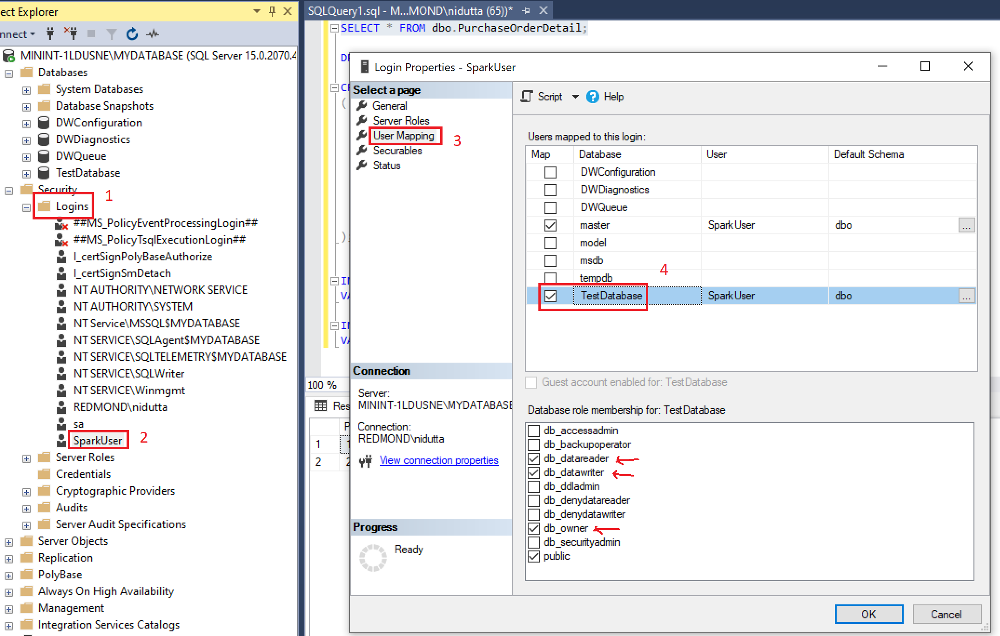
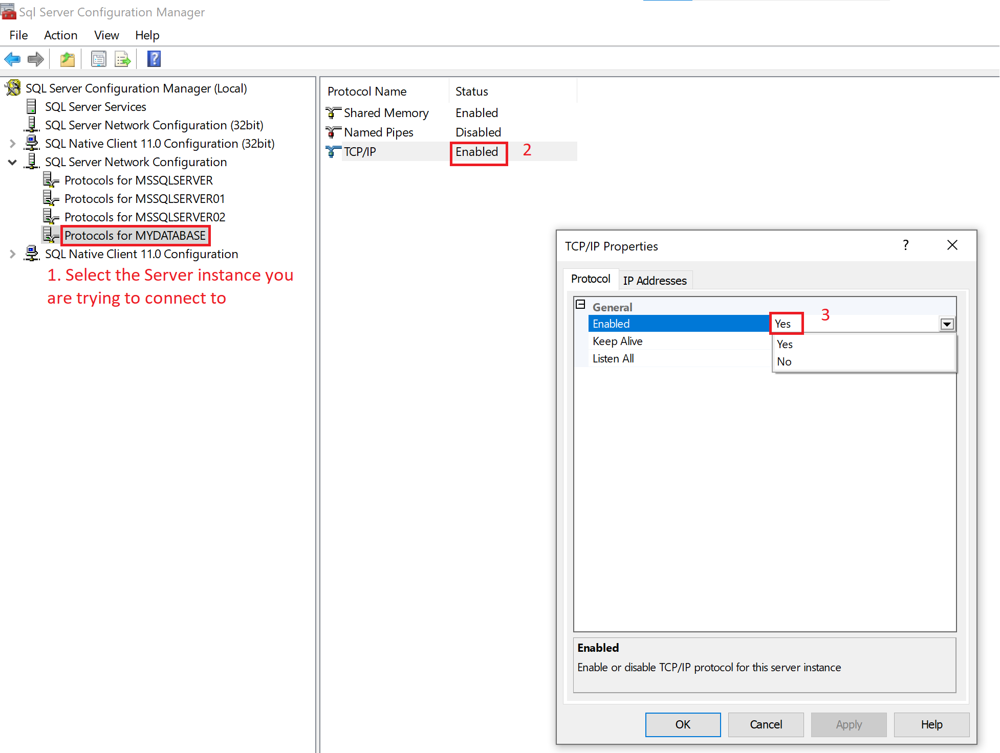
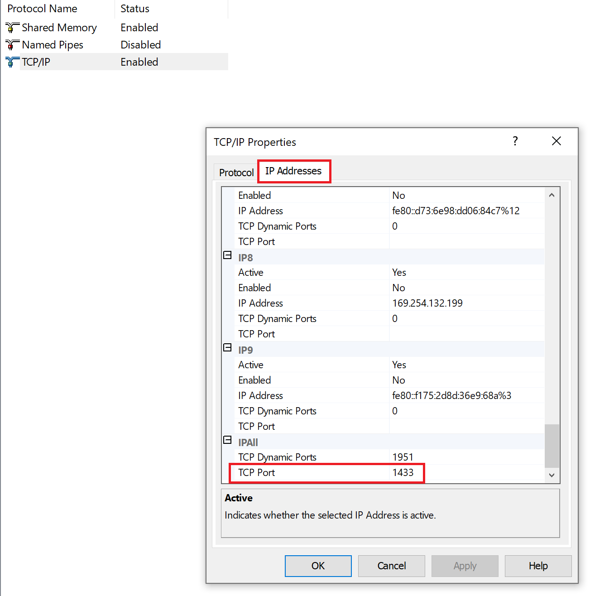

# Connect .NET for Apache Spark to SQL Server

In this article, you learn how to connect to an SQL server instance from your [.NET for Apache Spark](https://github.com/dotnet/spark) application.

## Configure SQL Server to grant your application access

1. Add a login user and password choosing SQL Server authentication to your SQL Server instance.
2. Give that login user necessary permissions at the relevant database level as shown below:

    

3. Make sure the default port for SQL Server `1433` is allowed through the firewall.
4. Open SQL configure manager to enable TCP/IP through the network configuration as shown below:

    

    Also note the value of **Listen All** in above tab under **Protocol**.

5. Configure the TCP/IP port to 1433 for all required IP addresses if the `Listen All` is set to `No`. Otherwise, set the TCP Port in IPAll.

    

## Connect to SQL Server from your application

1. Use the Microsoft JDBC Driver for SQL Server to provide database connectivity through your application (download from [this official website](/sql/connect/jdbc/download-microsoft-jdbc-driver-for-sql-server?view=sql-server-ver15&preserve-view=false)).
2. Set the following configurations to connect to the SQL server instance and database from your application:
    1. **connection_url**: This is the URL used to connect to the SQL server instance/database and has the following format:

        ```
        jdbc:sqlserver://<SQL_server_IP_address>:1433;instanceName=<instance_name>;databaseName=<database_name>;
        ```

    2. **dbtable**: Name of table being accessed.
    3. **user**: Login user set up in Step 1 of configuring the SQL server.
    4. **password**: Password of user set up in Step 1 of configuring the SQL server.
3. Use the above configuration in your application code to read the data from a table as shown below:

    ```csharp
    static void Main()
    {
        SparkSession spark = SparkSession
            .Builder()
            .AppName("Connect to SQL Server")
            .GetOrCreate();

        string connection_url = "<URL to connect to SQL server instance>";
        string dbtable = "<database table to access>";
        string user = "<Login user name>";
        string password = "<Login user password>";

        DataFrame jdbcDF = spark.Read()
            .Format("jdbc")
            .Option("driver", "com.microsoft.sqlserver.jdbc.SQLServerDriver")
            .Option("url", connection_url)
            .Option("dbtable", dbtable)
            .Option("user", user)
            .Option("password", password).Load();
        jdbcDF.Show(); // Displays the content of the SQL table as a DataFrame
    }
    ```
