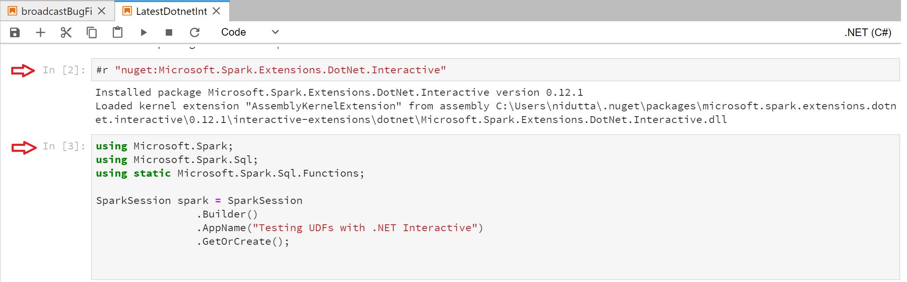
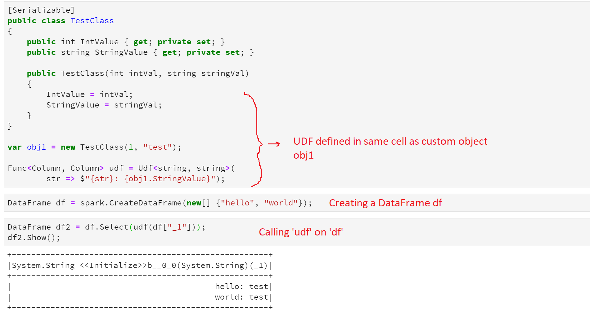
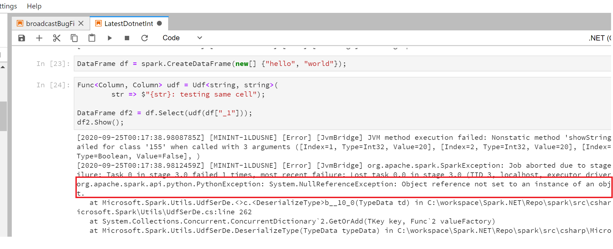
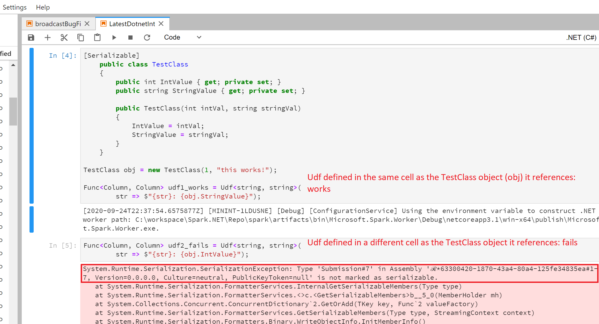
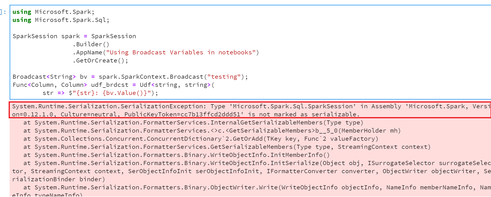
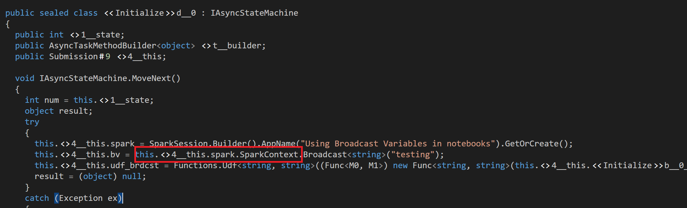

# Write and call UDFs in .NET for Apache Spark interactive environments

In this article, you will learn how to use user-defined functions (UDFs) in a .NET for Apache Spark interactive environment.

## Prerequisites

1. Install [.NET Interactive](https://github.com/dotnet/interactive)
2. Install [Jupyter lab](https://jupyter.org/)

## .NET for Apache Spark Interactive experience

[.NET for Apache Spark](https://github.com/dotnet/spark) uses [.NET Interactive](https://devblogs.microsoft.com/dotnet/net-interactive-is-here-net-notebooks-preview-2/) to provide .NET support for interactive experience inside Spark. To understand how to set up the environment to try .NET Interactive with Jupyter notebooks, see the [.NET Interactive repository](https://github.com/dotnet/interactive).

Also, it is recommended to go through [this article about UDF serialization in .NET for Apache Spark](udf-guide.md) to understand what UDFs are and how they are serialized in .NET for Apache Spark.
This guide uses Jupyter Notebooks to illustrate how to use UDFs in an interactive experience.

## Define a UDF in .NET Interactive

In the interactive experience, a cell can be thought of as the code snippet being submitted as part of one iteration of the [REPL](https://en.wikipedia.org/wiki/Read%E2%80%93eval%E2%80%93print_loop). For example, take a look at the following notebook to understand what that means:

Each of those blocks marked by the red arrow is one cell, or one submission of code to Spark. Now when defining a UDF that references a custom user-defined object, it is required that the UDF be defined in the same cell where the object it references is defined. Let's look at what that looks like as an example:

## Call a UDF on a DataFrame

When calling a previously defined UDF on a `DataFrame` it is important to make sure the UDF is defined in a previously submitted cell, before calling it, as can be seen in the previous example.

Now let's see what happens if we call the UDF in the same cell where it is defined.

The above highlighted error is because the UDF assemblies need to first be compiled and shipped to the workers before it can be called on a DataFrame.

These are a few important things to keep in mind while implementing UDFs in .NET for Apache Spark interactive experience (such as [Azure Synapse Notebooks](/azure/synapse-analytics/spark/apache-spark-development-using-notebooks)).

## FAQs

1. **Why does my UDF referencing a custom user-defined object throw the error `Type Submission#_ is not marked as serializable`?**
    .NET Interactive wraps each of these cells with a wrapper class of the cell submission number, to uniquely identify each cell being submitted. Now as explained in detail in [this guide](udf-guide.md), when a UDF that references a custom object is being serialized its target is also picked up for serialization, which in the case of .NET Interactive gets wrapped by the wrapper class of the cell where the custom object is defined.
    Now let's see how that affects our UDF definition in the notebook:

    

    As can be seen in the case of `udf2_fails`, we see the error message that says Type `Submission#7` is not marked as serializable, this is because .NET Interactive wraps every object defined in a cell with its `Submission#` class, which is generated on the fly and hence is not marked as `Serializable`.

    For this reason, it is **required that a UDF referencing a custom object is defined in the same cell as that object**.

2. **Why don't Broadcast Variables work with .NET Interactive?**
    For the reasons explained previously, broadcast variables don't work with .NET Interactive. It is a good idea to go through [this guide on broadcast variables](broadcast-guide.md) to get a deeper understanding of what broadcast variables are and how to use them. The reason broadcast variables don't work with interactive scenarios is because of .NET interactive's design of appending each object defined in a cell with its cell submission class, which since is not marked serializable, fails with the same exception as shown previously.
    Let's dive a little deeper with the following example:

    

    As recommended in the previous sections, we define both the UDF and the object it is referencing (broadcast variable in this case) in the same cell, but we still see the `SerializationException` error complaining about `Microsoft.Spark.Sql.Session` not being marked as serializable. This is because when the compiler tries to serialize the broadcast variable object `bv`, it finds its name to be appended with [`SparkSession`](https://github.com/dotnet/spark/blob/main/src/csharp/Microsoft.Spark/Sql/SparkSession.cs#L20) object `spark`, which it requires to be marked as serializable. This can be demonstrated with more ease by taking a peek at the decompiled assembly of this cell submission:

    

    If we mark the [`SparkSession`](https://github.com/dotnet/spark/blob/main/src/csharp/Microsoft.Spark/Sql/SparkSession.cs#L20) class as `[Serializable]`, we can get this to work, but this is not an ideal solution as we don't want to give the user the ability to serialize a SparkSession object, as that could lead to some weird, undesirable behavior. This is a [known issue](https://github.com/dotnet/spark/issues/619) and will be resolved in future versions.
