# Install .NET for Apache Spark Interactive Notebooks on Azure HDInsight

This how-to provides the steps to install .NET for Apache Spark interactive notebooks on Azure HDInsight Spark Clusters.

## Background

To provide the ability to use .NET for Apache Spark within your Jupyter Notebooks, an important pre-requisite is a C# REPL that is capable of executing your C# code line-by-line (and preserving execution state, where needed). We have integrated [dotnet-try](https://github.com/dotnet/try) as our official dotnet REPL to provide you with the best experience.

To provide the end-to-end integration, we had to add a Jupyter kernel along with necessary modifications to [Apache Livy](https://github.com/apache/incubator-livy) and [sparkmagic](https://github.com/jupyter-incubator/sparkmagic). Since these code changes have not yet been merged into the respective open source projects, to be able to get the out-of-box .NET for Apache Spark experience, you will have to patch components in your HDInsight Spark Cluster with the binaries we provide.

To enable .NET for Apache Spark through the Jupyter Notebook Experience, you would have to follow a few manual steps through [Ambari](https://docs.microsoft.com/en-us/azure/hdinsight/hdinsight-hadoop-manage-ambari) and submit [script actions](https://docs.microsoft.com/en-us/azure/hdinsight/hdinsight-hadoop-customize-cluster-linux) on HDInsight Spark cluster.

>**Disclaimer:** Please note that this is *experimental* and not supported by the HDInsight Spark team. *Use it at your own risk*. Please do remember that we are working hard to get these changes into the respective projects so you do not need these manual steps.

## Pre-requisites:
Create an [Azure HDInsight Spark](https://docs.microsoft.com/en-us/azure/hdinsight/spark/apache-spark-jupyter-spark-sql-use-portal#create-an-hdinsight-spark-cluster) cluster (by visiting the **[Azure Portal](https;//portal.azure.com)**, selecting **+ Create a Resource**, and creating a new Azure HDInsight cluster resource), select the **Overview** tab on your cluster. Ensure you have created a cluster with **Spark 2.4** and **HDI 4.0**.

## Installation Procedure
Open the [Azure portal](https://ms.portal.azure.com/#home). Select **HDInsight Spark cluster** you created in the previous step.
### Step 1. Stop Livy Server
1.1 From the portal, select **Overview**, and then select **Ambari home**. If prompted, enter the cluster login credentials for the cluster.

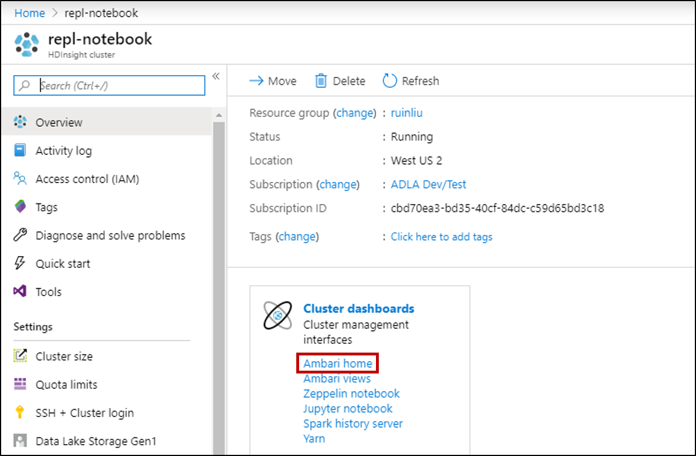

1.2 Select **Spark2**, and then select **LIVY FOR SPARK2 SERVER**.

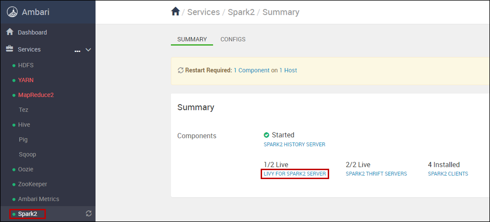

1.3 Select **hn0... host**, stop **Livy for Spark2 Server** if started. When prompted, click **OK** to proceed.

- Select hn0 as shown below.
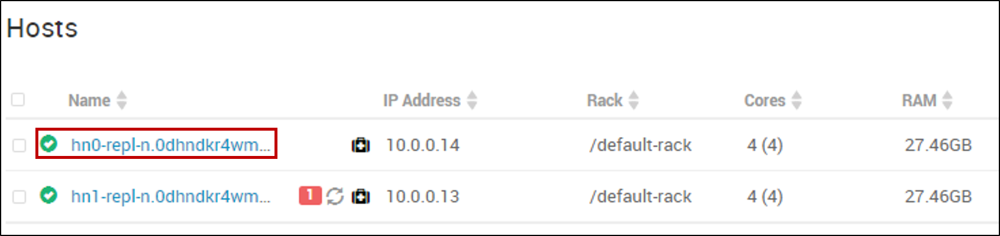

- Stop Livy for Spark2 Server.
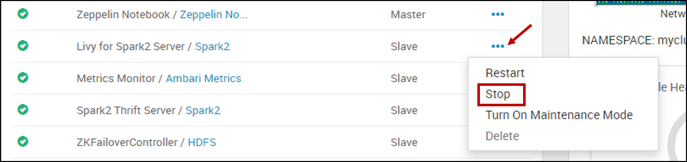

1.4 Please follow the same step for hn1... host.

### Step 2. Submit HDInsight Script Action
Return to your HDI cluster in the Azure Portal, and select **Script actions** from the options on the left. You'll submit one script action to deploy SparkDotnet REPL on HDInsight Spark cluster.

Submit Script Action on both Head node and Worker node.
Run `install-interactive-notebook.sh` on the cluster using [HDInsight Script Actions](https://docs.microsoft.com/en-us/azure/hdinsight/hdinsight-hadoop-customize-cluster-linux):

* Script type: Custom
* Name: Install Sparkdotnet Interactive Notebook Experience (or anything that is descriptive)
* Bash script URI: The URI to which you uploaded `install-interactive-notebook.sh`. You can download [install-interactive-notebook.sh](install-interactive-notebook.sh), and then upload the script to a [URI](https://docs.microsoft.com/en-us/azure/hdinsight/hdinsight-hadoop-customize-cluster-linux#understand-script-actions) that's accessible from the HDInsight cluster. (e.g. `https://<my storage account>.blob.core.windows.net/<my container>/<some dir>/install-interactive-notebook.sh`)
* Node type(s): Head and Worker
* Parameters: Sparkdotnet version. For example, if you want to install Sparkdotnet version 0.6.0 then it would be `0.6.0`.

The following captures the setting for a HDInsight Script Action on Head node and Worker node:

After you see green checkmarks next to the status of both script actions, you can move to the next step.

### Step 3. Start Livy Server
Please follow the above [Step 1](#step-1-stop-livy-server) to **Start** Livy for Spark2 Server.

### Step 4. Set up Spark Default Configs
4.1 From the portal, select **Overview**, and then select **Ambari home**. If prompted, enter the cluster login credentials for the cluster.

4.2 Select **Spark2**, and then Select **CONFIGS**, then click on **Custom spark2-defaults**.

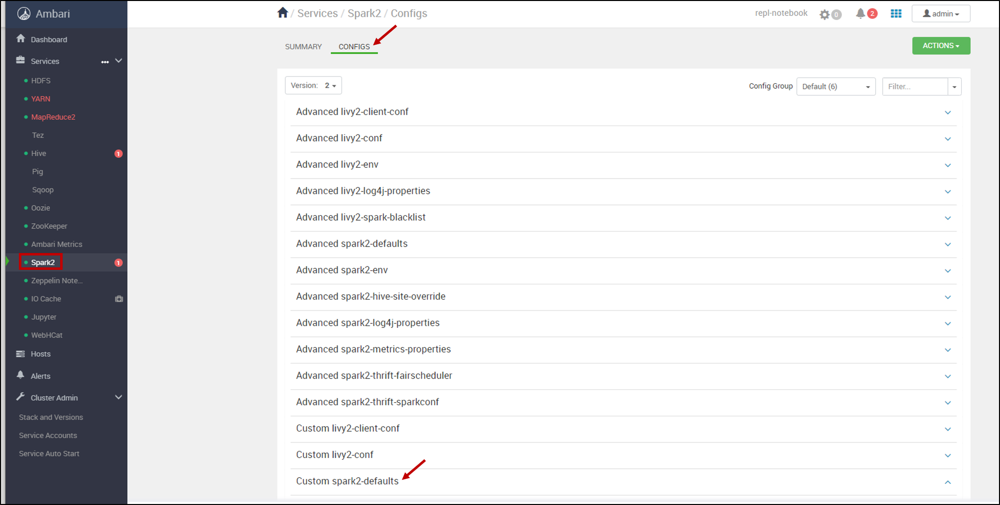

4.3 Click on **Add Property...** to add Spark default settings.
You will add a total of 3 individual properties. Add them 1 one at a time, all using **TEXT** Property Type in Single property add mode. Make sure you don’t have any extra spaces before or after any of the keys/values.
- Property 1:
    - Key:&ensp;&ensp;`spark.dotnet.shell.command`
    - Value: `/usr/share/dotnet-tools/dotnet-try,kernel-server,--default-kernel,csharp`
- Property 2:
    - Key:&ensp;&ensp;`spark.dotnet.packages`
    - Value: `["nuget: Microsoft.Spark, 0.6.0", "nuget: Microsoft.Spark.Extensions.Delta, 0.6.0"]`
- Property 3:
    - Key:&ensp;&ensp;`spark.dotnet.interpreter`
    - Value: `try`

For example, the following captures the setting for adding property 1:

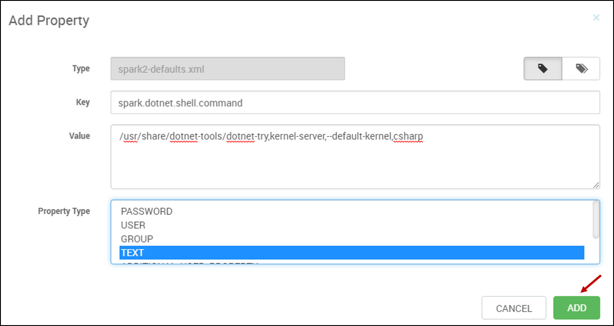

After adding those 3 properties, select **SAVE**. If you see a warning screen of config recommendations, select **PROCEED ANYWAY**.

4.4 Restart affected components.
After adding the new properties, you need to restart components that were affected by the changes. At the top, select **RESTART**, and then **Restart All Affected** from the drop-down.

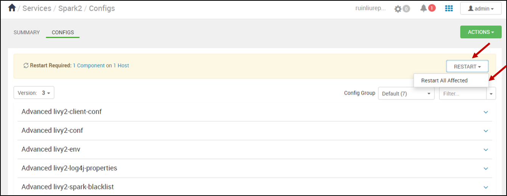

When prompted, select **CONFIRM RESTART ALL** to continue, then click **OK** to finish.

## Submit Jobs through Jupyter Notebook
After finishing previous steps, now you can submit your jobs through Jupyter Notebook!
1. Create a new .NET for Apache Spark notebook

[Launch Jupyter notebook](https://docs.microsoft.com/en-us/azure/hdinsight/spark/apache-spark-jupyter-spark-sql-use-portal#create-a-jupyter-notebook) from your HDI cluster in the Azure Portal, then select **New** > **.NET Spark (C#)** to create a notebook.

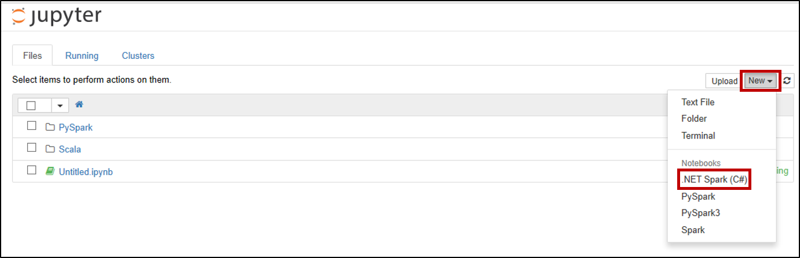

2. Submit Jobs using .NET for Apache Spark

> **Note:** After the kernel is ready, then you can start submitting jobs. The following shows a sample to submit jobs through notebook.
- Start a spark session
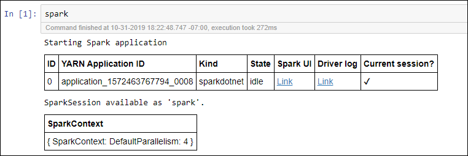

- Create a Dataframe
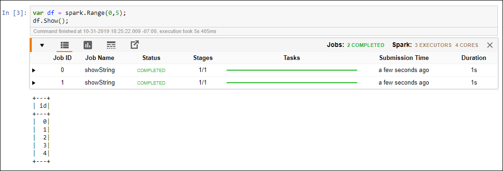

- Register Udf and use Udf via data frames
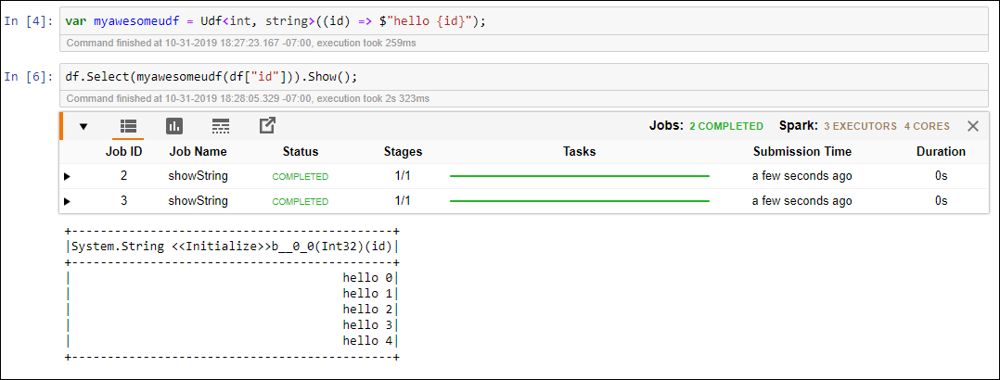

## Next steps

* [Deploy a .NET for Apache Spark application to Azure HDInsight](../tutorials/hdinsight-deployment.md)
* [HDInsight Documentation](https://docs.microsoft.com/azure/hdinsight/)
