# Install .NET for Apache Spark on Jupyter Notebooks on Azure HDInsight Spark clusters

This article teaches you how to install .NET for Apache Spark on Jupyter Notebooks on Azure HDInsight Spark clusters. You can deploy .NET for Apache Spark on Azure HDInsight clusters through a combination of the command line and the Azure portal (for more information, see [how to deploy a .NET for Apache Spark application to Azure HDInsight](../tutorials/hdinsight-deployment.md)), but notebooks provide a more interactive and iterative experience.

Azure HDInsight clusters already come with Jupyter Notebooks, so all you have to do is configure the Jupyter Notebooks to run .NET for Apache Spark. To use .NET for Apache Spark in your Jupyter Notebooks, a C# REPL is needed to execute your C# code line-by-line and to preserve execution state when necessary. [Try .NET](https://github.com/dotnet/try) has been integrated as the official .NET REPL.

To enable .NET for Apache Spark through the Jupyter Notebooks experience, you need to follow a few manual steps through [Ambari](/azure/hdinsight/hdinsight-hadoop-manage-ambari) and submit [script actions](/azure/hdinsight/hdinsight-hadoop-customize-cluster-linux) on the HDInsight Spark cluster.

> [!NOTE]
> This feature is *experimental* and is not supported by the HDInsight Spark team.

## Prerequisites

If you don't already have one, create an [Azure HDInsight Spark](/azure/hdinsight/spark/apache-spark-jupyter-spark-sql-use-portal#create-an-apache-spark-cluster-in-hdinsight) cluster.

1. Visit the [Azure portal](https://portal.azure.com) and select **+ Create a Resource**.

1. Create a new Azure HDInsight cluster resource. Select **Spark 2.4** and **HDI 4.0** during cluster creation.

## Install .NET for Apache Spark

In the Azure portal, select the **HDInsight Spark cluster** you created in the previous step.

### Stop the Livy server

1. From the portal, select **Overview**, and then select **Ambari home**. If prompted, enter the login credentials for the cluster.

   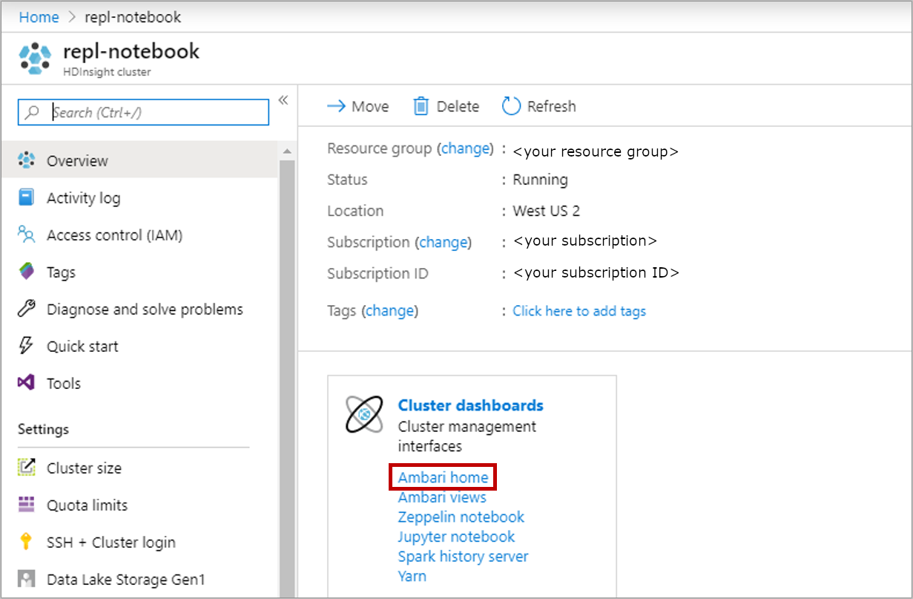

2. Select **Spark2** from the left navigation menu, and select **LIVY FOR SPARK2 SERVER**.

   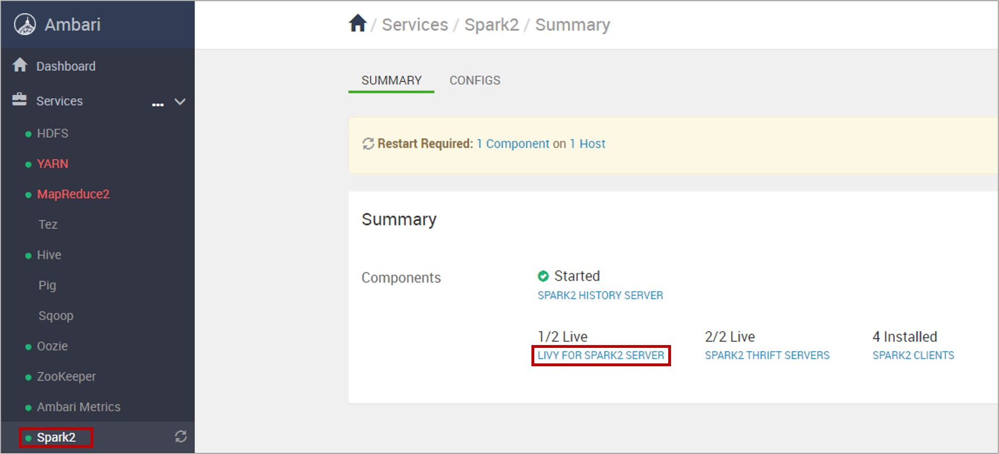

3. Select **hn0... host**.

   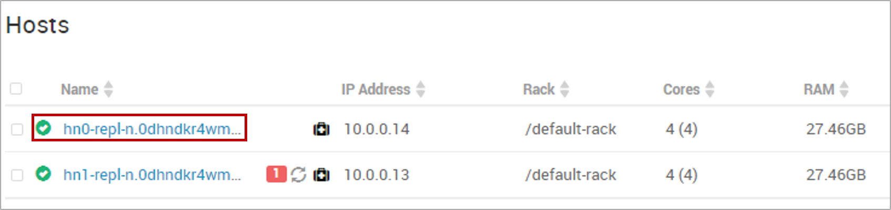

4. Select the ellipsis next to **Livy for Spark2 Server** and select **Stop**. When prompted, select **OK** to proceed.

   Stop Livy for Spark2 Server.
   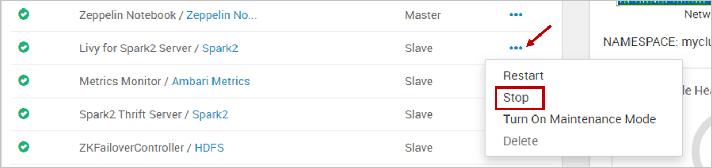

5. Repeat the previous steps for **hn1... host**.

### Submit an HDInsight script action

1. The `install-interactive-notebook.sh` is a script that installs .NET for Apache Spark and makes changes to Apache Livy and sparkmagic. Before you submit a script action to HDInsight, you need to create and upload `install-interactive-notebook.sh`.

   Create a new file named **install-interactive-notebook.sh** in your local computer and paste the contents of [install-interactive-notebook.sh contents](https://raw.githubusercontent.com/dotnet/spark/main/deployment/HDI-Spark/Notebooks/install-interactive-notebook.sh).

   Upload the script to a [URI](/azure/hdinsight/hdinsight-hadoop-customize-cluster-linux#understand-script-actions) that's accessible from the HDInsight cluster. For example, `https://<my storage account>.blob.core.windows.net/<my container>/<some dir>/install-interactive-notebook.sh`.

2. Run `install-interactive-notebook.sh` on the cluster using [HDInsight Script Actions](/azure/hdinsight/hdinsight-hadoop-customize-cluster-linux).

   Return to your HDI cluster in the Azure portal, and select **Script actions** from the options on the left. You submit one script action to deploy the .NET for Apache Spark REPL on your HDInsight Spark cluster. Use the following settings:

   |Property  |Description  |
   |---------|---------|
   | Script type | Custom |
   | Name | *Install .NET for Apache Spark Interactive Notebook Experience* |
   | Bash script URI | The URI to which you uploaded `install-interactive-notebook.sh`. |
   | Node type(s)| Head and Worker |
   | Parameters | .NET for Apache Spark version. You can check [.NET for Apache Spark releases](https://github.com/dotnet/spark/releases). For example, if you want to install Sparkdotnet version 1.0.0 then it would be `1.0.0`.

   Move to the next step when green checkmarks appear next to the status of the script action.

### Start the Livy server

Follow the instructions in the [Stop Livy server](#stop-the-livy-server) section to **Start** (rather than **Stop**) the Livy for Spark2 Server for hosts **hn0** and **hn1**.

### Set up Spark default configurations

1. From the portal, select **Overview**, and then select **Ambari home**. If prompted, enter the cluster login credentials for the cluster.

2. Select **Spark2** and **CONFIGS**. Then, select **Custom spark2-defaults**.

   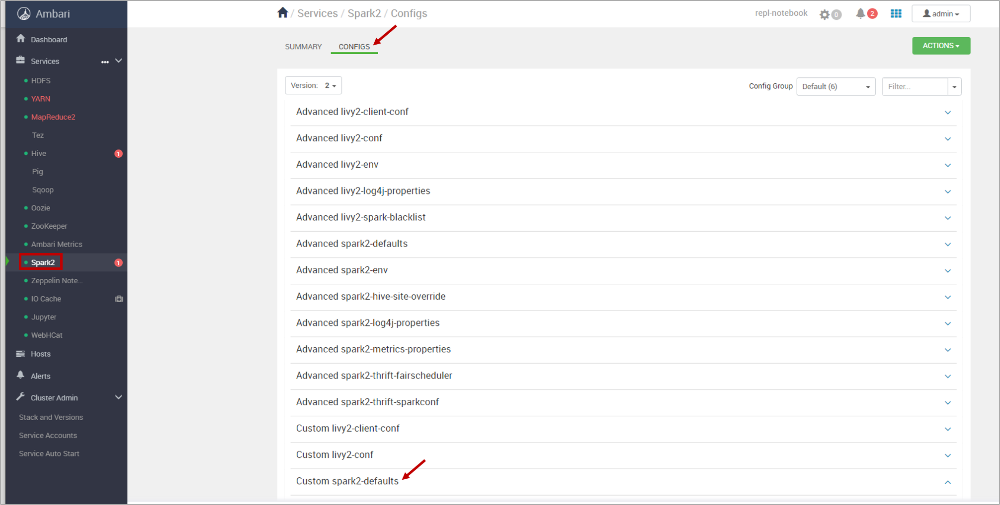

3. Select **Add Property** to add Spark default settings.

   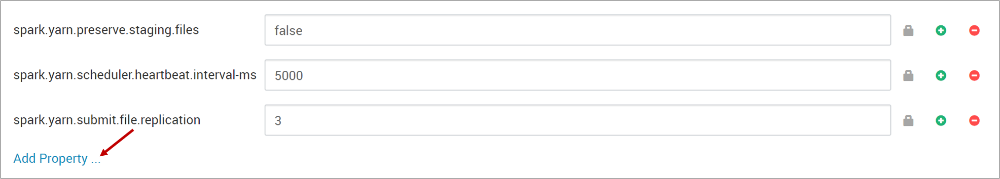

   There are three individual properties. Add them one at a time using the **TEXT** property type in Single property add mode. Check that you don't have any extra spaces before or after any of the keys/values.

   * **Property 1**
       * Key:&ensp;&ensp;`spark.dotnet.shell.command`
       * Value: `/usr/share/dotnet-tools/dotnet-try,kernel-server,--default-kernel,csharp`

   * **Property 2** Use the version of .NET for Apache Spark which you had included in the previous script action.
       * Key:&ensp;&ensp;`spark.dotnet.packages`
       * Value: `["nuget: Microsoft.Spark, 1.0.0", "nuget: Microsoft.Spark.Extensions.Delta, 1.0.0"]`

   * **Property 3**
       * Key:&ensp;&ensp;`spark.dotnet.interpreter`
       * Value: `try`

   For example, the following image captures the setting for adding property 1:

   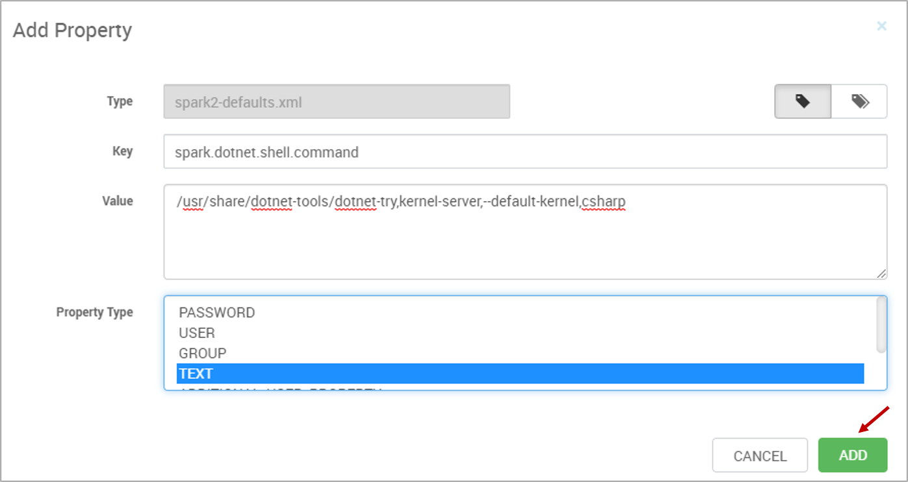

   After adding the three properties, select **SAVE**. If you see a warning screen of config recommendations, select **PROCEED ANYWAY**.

4. Restart affected components.

   After adding the new properties, you need to restart components that were affected by the changes. At the top, select **RESTART**, and then **Restart All Affected** from the drop-down.

   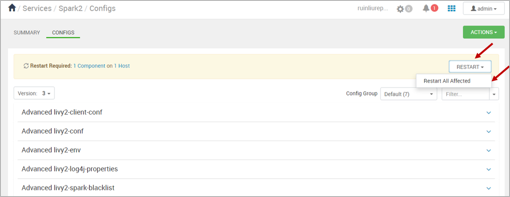

   When prompted, select **CONFIRM RESTART ALL** to continue, then click **OK** to finish.

## Submit jobs through a Jupyter Notebook

After finishing the previous steps, you can now submit your .NET for Apache Spark jobs through Jupyter Notebooks.

1. Create a new .NET for Apache Spark notebook. Launch a Jupyter Notebook from your HDI cluster in the Azure portal.

   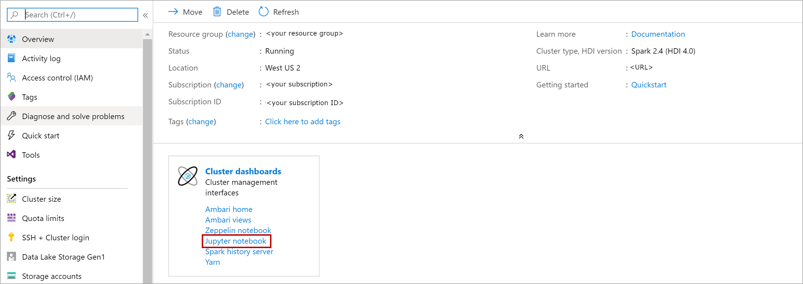

   Then, select **New** > **.NET Spark (C#)** to create a notebook.

   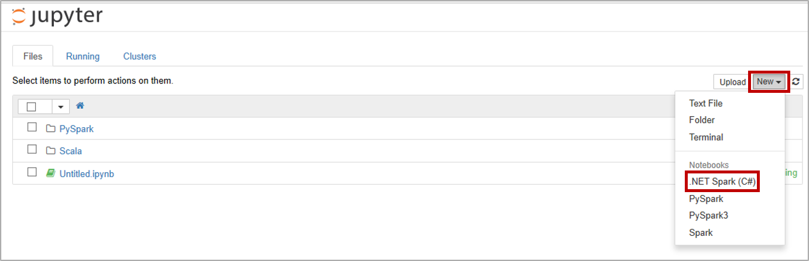

2. Submit jobs using .NET for Apache Spark.

   Use the following code snippet to create a DataFrame:

   ```csharp
   var df = spark.Range(0,5);
   df.Show();
   ```

   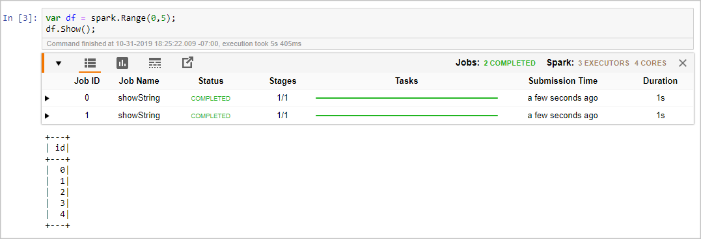

   Use the following code snippet to register a user-defined function (UDF) and use the UDF with DataFrames:

   ```csharp
   var myawesomeudf = Udf<int, string>((id) => $"hello {id}");
   df.Select(myawesomeudf(df["id"])).Show();
   ```

   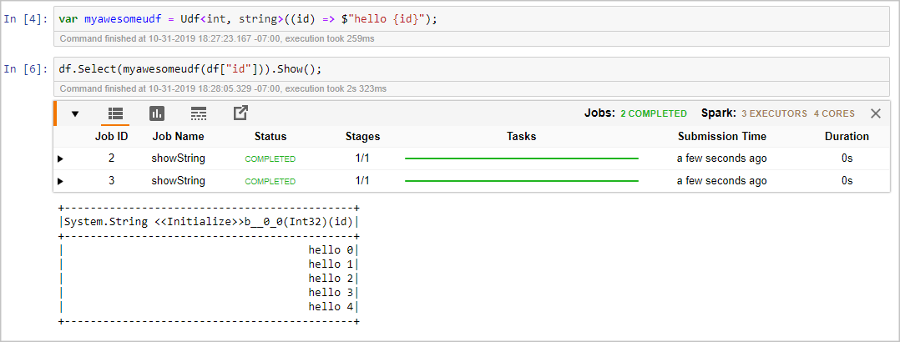

## Next steps

* [Deploy a .NET for Apache Spark application to Azure HDInsight](../tutorials/hdinsight-deployment.md)
* [HDInsight Documentation](/azure/hdinsight/)
