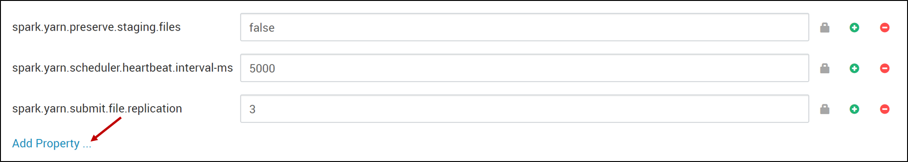
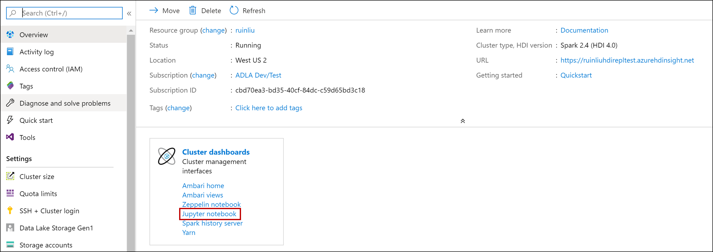

# Installing .NET for Apache Spark on Azure HDInsight's Jupyter Notebooks

This how-to provides the steps to install .NET for Apache Spark on Azure HDInsight's Jupyter Notebooks.

## Background

While we can deploy .NET for Apache Spark on Azure HDInsight (HDI) clusters through a combination of the command line and Azure Portal (you can check out [how to deploy a .NET for Apache Spark application to Azure HDInsight](../tutorials/hdinsight-deployment.md)), notebooks provide a more interactive and iterative experience.

Azure HDI clusters already come with Jupyter notebooks, so let's explore how to configure these Jupyter notebooks to run .NET for Apache Spark. In order to use .NET for Apache Spark within your Jupyter Notebooks, a C# REPL is needed to execute your C# code line-by-line and to preserve execution state when necessary. We have integrated [Try .NET](https://github.com/dotnet/try) as our official .NET REPL.

To provide the end-to-end notebook integration, we added a .NET for Apache Spark kernel to Jupyter kernel. We also added the necessary modifications to [Apache Livy](https://github.com/apache/incubator-livy) and [sparkmagic](https://github.com/jupyter-incubator/sparkmagic) to HDI notebooks. Since these code changes have not yet been merged into the respective open source projects, you'll need to modify some components in your HDInsight Spark cluster to utilize .NET for Apache Spark in Jupyter notebooks.

To enable .NET for Apache Spark through the Jupyter Notebooks experience, you'll need to follow a few manual steps through [Ambari](https://docs.microsoft.com/azure/hdinsight/hdinsight-hadoop-manage-ambari) and submitting [script actions](https://docs.microsoft.com/azure/hdinsight/hdinsight-hadoop-customize-cluster-linux) on the HDInsight Spark cluster.

>**Disclaimer:** Please note that this is *experimental* and not supported by the HDInsight Spark team. We are working hard to get these changes into the respective projects so that in the future you will not have to perform these manual steps.

## Prerequisites

Create an [Azure HDInsight Spark](https://docs.microsoft.com/azure/hdinsight/spark/apache-spark-jupyter-spark-sql-use-portal#create-an-hdinsight-spark-cluster) cluster by visiting the **[Azure Portal](https;//portal.azure.com)**, selecting **+ Create a Resource**, and creating a new Azure HDInsight cluster resource. Ensure you select **Spark 2.4** and **HDI 4.0** during cluster creation.

## Installation Procedure

In the Azure Portal, select the **HDInsight Spark cluster** you created in the previous step.

### Stop Livy Server

1. From the portal, select **Overview**, and then select **Ambari home**. If prompted, enter the cluster login credentials for the cluster.

   

2. Select **Spark2**, and then select **LIVY FOR SPARK2 SERVER**.

   

3. Select **hn0... host**, and stop **Livy for Spark2 Server** if it is running. When prompted, select **OK** to proceed.

   * Select hn0 as shown below.
   

   * Stop Livy for Spark2 Server.
   

4. Repeat the previous steps for **hn1... host**.

### Submit HDInsight Script Action

1. Create and upload `install-interactive-notebook.sh`.

   The `install-interactive-notebook.sh` is a script that installs .NET for Apache Spark and makes changes to Apache Livy and sparkmagic. Before submitting Script Action to HDI, you'll need to create and upload `install-interactive-notebook.sh`.

   * You can create a new file named **install-interactive-notebook.sh** in your local computer, and paste the contents of [install-interactive-notebook.sh contents](https://raw.githubusercontent.com/dotnet/spark/master/deployment/HDI-Spark/Notebooks/install-interactive-notebook.sh). 
   * Then, upload the script to a [URI](https://docs.microsoft.com/en-us/azure/hdinsight/hdinsight-hadoop-customize-cluster-linux#understand-script-actions) that's accessible from the HDInsight cluster. (e.g. `https://<my storage account>.blob.core.windows.net/<my container>/<some dir>/install-interactive-notebook.sh`)

2. Run `install-interactive-notebook.sh` on the cluster using [HDInsight Script Actions](https://docs.microsoft.com/en-us/azure/hdinsight/hdinsight-hadoop-customize-cluster-linux).

   Return to your HDI cluster in the Azure Portal, and select **Script actions** from the options on the left. You'll submit one script action to deploy the .NET for Apache Spark REPL on your HDInsight Spark cluster. Please see the following settings.
   
   |Property  |Description  |
   |---------|---------|
   | Script type | Custom |
   | Name | Install .NET for Apache Spark Interactive Notebook Experience (or anything that is descriptive) |
   | Bash script URI | The URI to which you uploaded `install-interactive-notebook.sh`. |
   | Node type(s)| Head and Worker |
   | Parameters | .NET for Apache Spark version. You can check [.NET for Apache Spark release](https://github.com/dotnet/spark/releases). For example, if you want to install Sparkdotnet version 0.6.0 then it would be `0.6.0`.

   Move to the next step when green checkmarks appear next to the status of the script action.

### Start Livy Server

Please follow the above [Step 1](#step-1-stop-livy-server) to now **Start** (rather than **Stop**) the Livy for Spark2 Server for hosts hn0 and hn1.

### Set up Spark default configurations

1. From the portal, select **Overview**, and then select **Ambari home**. If prompted, enter the cluster login credentials for the cluster.

2. Select **Spark2**, and then **CONFIGS**. Then select **Custom spark2-defaults**.

   

3. Click on **Add Property...** to add Spark default settings.

   

   There are three individual properties. Add them one at a time using the **TEXT** Property Type in Single property add mode. Check that you don't have any extra spaces before or after any of the keys/values.
   * Property 1:
       * Key:&ensp;&ensp;`spark.dotnet.shell.command`
       * Value: `/usr/share/dotnet-tools/dotnet-try,kernel-server,--default-kernel,csharp`
   * Property 2:
       * Key:&ensp;&ensp;`spark.dotnet.packages`
       * Value: `["nuget: Microsoft.Spark, 0.6.0", "nuget: Microsoft.Spark.Extensions.Delta, 0.6.0"]`
    
       Please use the version of .NET for Apache Spark which you had included in the previous script action.
   * Property 3:
       * Key:&ensp;&ensp;`spark.dotnet.interpreter`
       * Value: `try`

   For example, the following captures the setting for adding property 1:

   

   After adding those 3 properties, select **SAVE**. If you see a warning screen of config recommendations, select **PROCEED ANYWAY**.

4. Restart affected components.

   After adding the new properties, you need to restart components that were affected by the changes. At the top, select **RESTART**, and then **Restart All Affected** from the drop-down.

   

   When prompted, select **CONFIRM RESTART ALL** to continue, then click **OK** to finish.

## Submit Jobs through Jupyter Notebook

After finishing the previous steps, you can now submit your .NET for Apache Spark jobs through Jupyter Notebooks!
1. Create a new .NET for Apache Spark notebook

   Launch a Jupyter notebook from your HDI cluster in the Azure Portal.
   
   
   
   Then select **New** > **.NET Spark (C#)** to create a notebook.

   

   > **Note:** After the kernel is ready, then you can start submitting jobs. The following shows a sample to submit jobs through notebook.
2. Submit Jobs using .NET for Apache Spark

   * Create a DataFrame

   You can use the following code snippet to create a DataFrame:

   ```csharp
   var df = spark.Range(0,5);
   df.Show();
   ```

   

   * Register a user-defined function (UDF) and use it via the DataFrame

   You can use the following code snippet to register a UDF and use this UDF with DataFrames:

   ```csharp
   var myawesomeudf = Udf<int, string>((id) => $"hello {id}");
   df.Select(myawesomeudf(df["id"])).Show();
   ```

   

## Next steps

* [Deploy a .NET for Apache Spark application to Azure HDInsight](../tutorials/hdinsight-deployment.md)
* [HDInsight Documentation](https://docs.microsoft.com/azure/hdinsight/)
