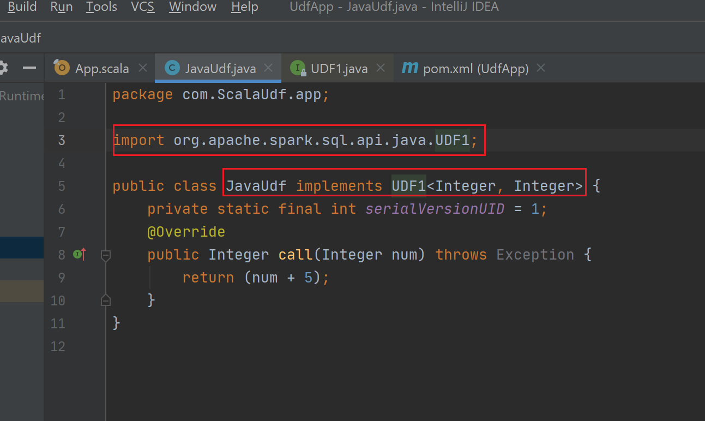
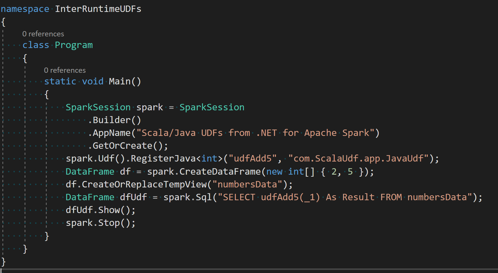

# Calling a Java UDF from your .NET for Apache Spark application

In this article, you learn how to call a Java User-Defined Function (UDF) from your [.NET for Apache Spark](https://github.com/dotnet/spark) application.

1. How to define your Java UDFs and compile them into a jar - this step is not needed if you already have a UDF defined in a jar file. In which case, all you need is the full name of the UDF function including the package.
2. Register and call your Java UDF in your .NET for Apache Spark application.

## Define your Java UDF(s) and compile it into a jar

1. Create a Maven or SBT project and add the following dependencies into the project configuration file:
    1. `org.apache.spark.spark-core_2.11.<version>`
    2. `org.apache.spark.spark-sql_2.11.<version>`
2. Define your Java UDF by implementing the [relevant interface](https://github.com/apache/spark/blob/master/sql/core/src/main/java/org/apache/spark/sql/api/java/UDF1.java) (according to your UDF's signature) and importing the relevant package as shown below in a simple example

    

3. Compile and package your project to create and executable jar say `UdfApp-0.0.1.jar`.

## Register and call your Java UDF in your .NET for Apache Spark application

1. Use the [`RegisterJava`](https://github.com/dotnet/spark/blob/8dcdcdc7c60d5f42cba5a90f1346d854ab5bf7bb/src/csharp/Microsoft.Spark/Sql/UDFRegistration.cs#L424) API to register your Java UDF with Spark SQL.
2. Register the `DataFrame` on which you want to call your UDF as an SQL Table using the [`CreateOrReplaceTempView`](https://github.com/dotnet/spark/blob/master/src/csharp/Microsoft.Spark/Sql/DataFrame.cs#L957) function.
3. Use `SparkSession.Sql` to call the UDF on the table view using Spark SQL.
A basic example to illustrate the above steps:

    

4. Submit this application using `spark-submit` by passing the previously compiled Java UDF jar through the `--jars` option:

    ```bash
    spark-submit --master local --jars UdfApp-0.0.1.jar --class org.apache.spark.deploy.dotnet.DotnetRunner microsoft-spark-3.0.x-0.12.1.jar InterRuntimeUDFs.exe
    ```

The resultant `dfUdf` DataFrame had the number 5 added to each row of the input column as defined by `JavaUdf`:

```text
    +-------+
    | Result|
    +-------+
    |      7|
    |     10|
    +-------+
```

## Calling a .NET UDF from Scala or Python in an Apache Spark applications

You can also register and invoke a C# UDF from an Apache Spark application written in Scala or Python using this [open source tool](https://github.com/imback82/sparkdotnetudf).
