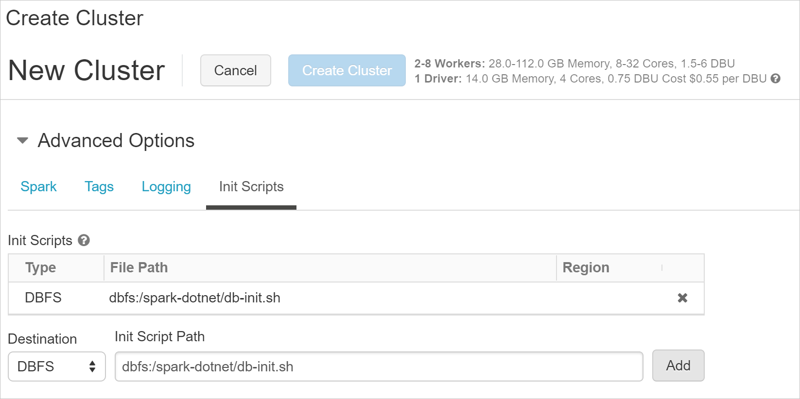

# Deploy a .NET for Apache Spark application to Databricks

This tutorial teaches how to deploy a .NET for Apache Spark application to Databricks.

In this tutorial, you learn how to:

> [!div class="checklist"]
>
> - Prepare Microsoft.Spark.Worker
> - Publish your Spark .NET app
> - Deploy your app to Databricks
> - Run your app

## Prerequisites

Before you start, do the following:

- Download the [Databricks CLI](https://docs.databricks.com/user-guide/dev-tools/databricks-cli.html).
- Download [install-worker.sh](https://github.com/dotnet/spark/blob/master/deployment/install-worker.sh) to your local machine. This is a helper script that you use later to copy .NET for Apache Spark dependent files into your Spark cluster's worker nodes.

## Prepare worker dependencies

**Microsoft.Spark.Worker** is a back-end component that lives on the individual worker nodes of your Spark cluster. When you want to execute a C# UDF (user-defined function), Spark needs to understand how to launch the .NET CLR to execute the UDF. **Microsoft.Spark.Worker** provides a collection of classes to Spark that enable this functionality.

1. Select a [Microsoft.Spark.Worker](https://github.com/dotnet/spark/releases) Linux netcoreapp release to be deployed on your cluster.

   For example, if you want `.NET for Apache Spark v0.1.0` using `netcoreapp2.1`, you'd download [Microsoft.Spark.Worker.netcoreapp2.1.linux-x64-0.1.0.tar.gz](https://github.com/dotnet/spark/releases/download/v0.1.0/Microsoft.Spark.Worker.netcoreapp2.1.linux-x64-0.1.0.tar.gz).

2. Upload `Microsoft.Spark.Worker.<release>.tar.gz` and [install-worker.sh](https://github.com/dotnet/spark/blob/master/deployment/install-worker.sh) to a distributed file system (for example, DBFS) that your cluster has access to.

## Prepare your .NET for Apache Spark app

1. Follow the [Get Started](get-started.md) tutorial to build your app.

2. Publish your Spark .NET app as self-contained.

   You can run the following command on Linux.

   ```bash
   dotnet publish -c Release -f netcoreapp2.1 -r ubuntu.16.04-x64
   ```

3. Produce `<your app>.zip` for the published files.

   You can run the following command on Linux using `zip`.

   ```bash
   zip -r <your app>.zip .
   ```

4. Upload the following to a distributed file system (for example, DBFS) that your cluster has access to:

   - `microsoft-spark-<spark_majorversion.spark_minorversion.x>-<spark_dotnet_version>.jar`: This jar is included as part of the [Microsoft.Spark](https://www.nuget.org/packages/Microsoft.Spark/) NuGet package and is colocated in your app's build output directory.
   - `<your app>.zip`
   - Files (like dependency files or common data accessible to every worker) or assemblies (like DLLs that contain your user-defined functions or libraries that your app depends on) to be placed in the working directory of each executor.

## Deploy to Databricks

[Databricks](https://databricks.com) is a platform that provides cloud-based big data processing using Apache Spark.

> [!Note] 
> [Azure Databricks](https://azure.microsoft.com/services/databricks/) and [AWS Databricks](https://databricks.com/aws) are Linux-based. Therefore, if you are interested in deploying your app to Databricks, make sure your app is .NET Standard compatible and that you use [.NET Core compiler](https://dotnet.microsoft.com/download) to compile your app.

Databricks allows you to submit .NET for Apache Spark apps to an existing active cluster or create a new cluster every time you launch a job. This requires the **Microsoft.Spark.Worker** to be installed before you submit a .NET for Apache Spark app.

### Deploy Microsoft.Spark.Worker

This step is only required once for a cluster.

1. Download [db-init.sh](https://github.com/dotnet/spark/blob/master/deployment/db-init.sh) and [install-worker.sh](https://github.com/dotnet/spark/blob/master/deployment/install-worker.sh
) onto your local machine.

2. Modify **db-init.sh** to point to the **Microsoft.Spark.Worker** release you want to download and install on your cluster.

3. Install the [Databricks CLI](https://docs.databricks.com/user-guide/dev-tools/databricks-cli.html).

4. [Setup authentication](https://docs.databricks.com/user-guide/dev-tools/databricks-cli.html#set-up-authentication) details for the Databricks CLI.

5. Upload the files to your Databricks cluster using the following command:

   ```bash
   cd <path-to-db-init-and-install-worker>
   databricks fs cp db-init.sh dbfs:/spark-dotnet/db-init.sh
   databricks fs cp install-worker.sh dbfs:/spark-dotnet/install-worker.sh
   ```

6. Go to your Databricks workspace. Select **Clusters** from the left-side menu, and then select **Create Cluster**.

7. After configuring the cluster appropriately, set the **Init Script** and create the cluster.

   

## Run your app 

You can use `set JAR` or `spark-submit` to submit your job to Databricks.

### Use Set JAR

[Set JAR](https://docs.databricks.com/user-guide/jobs.html#create-a-job) allows you to submit a job to an existing active cluster.

#### One-time setup

1. Go to your Databricks cluster and select **Jobs** from the left-side menu. Then select **Set JAR**.

2. Upload the appropriate `microsoft-spark-<spark-version>-<spark-dotnet-version>.jar` file.

3. Set the parameters appropriately.

   ```
   Main Class: org.apache.spark.deploy.dotnet.DotnetRunner
   Arguments /dbfs/apps/<your-app-name>.zip <your-app-main-class>
   ```
 
4. Configure the **Cluster** to point to the existing cluster you created the **Init Script** for in the previous section.

#### Publish and run your app

1. Use the [Databricks CLI](https://docs.databricks.com/user-guide/dev-tools/databricks-cli.html) to upload your application to your Databricks cluster.

      ```bash
      cd <path-to-your-app-publish-directory>
      databricks fs cp <your-app-name>.zip dbfs:/apps/<your-app-name>.zip
      ```

2. This step is only required if your app assemblies (for example, DLLs that contain user-defined functions along with their dependencies) need to be placed in the working directory of each **Microsoft.Spark.Worker**.

   - Upload your application assemblies to your Databricks cluster
      
      ```bash
      cd <path-to-your-app-publish-directory>
      databricks fs cp <assembly>.dll dbfs:/apps/dependencies
      ```

   - Uncomment and modify the app dependencies section in [db-init.sh](https://github.com/dotnet/spark/blob/master/deployment/db-init.sh) to point to your app dependencies path and upload to your Databricks cluster.
   
      ```bash
      cd <path-to-db-init-and-install-worker>
      databricks fs cp db-init.sh dbfs:/spark-dotnet/db-init.sh
      ```
   
   - Restart your cluster.

3. Go to your Databricks cluster in your Databricks workspace. Under **Jobs**, select your job and then select **Run Now** to run your job.

### Use spark-submit

The [spark-submit](https://spark.apache.org/docs/latest/submitting-applications.html) command allows you to submit a job to a new cluster.

1. [Create a Job](https://docs.databricks.com/user-guide/jobs.html) and select **Configure spark-submit**.

2. Configure `spark-submit` with the following parameters:

      ```bash
      ["--files","/dbfs/<path-to>/<app assembly/file to deploy to worker>","--class","org.apache.spark.deploy.dotnet.DotnetRunner","/dbfs/<path-to>/microsoft-spark-<spark_majorversion.spark_minorversion.x>-<spark_dotnet_version>.jar","/dbfs/<path-to>/<app name>.zip","<app bin name>","app arg1","app arg2"]
      ```

3. Go to your Databricks cluster in your Databricks workspace. Under **Jobs**, select your job and then select **Run Now** to run your job.

## Next steps

In this tutorial, you deployed your .NET for Apache Spark application to Databricks. To learn more about Databricks, continue to the Azure Databricks Documentation.

> [!div class="nextstepaction"]
> [Azure Databricks Documentation](https://docs.microsoft.com/azure/azure-databricks/)
