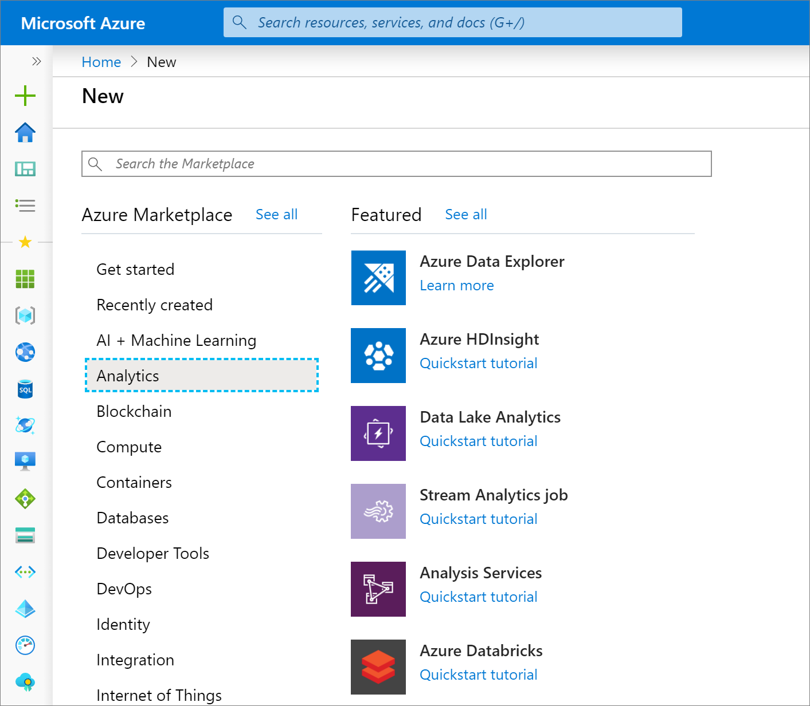
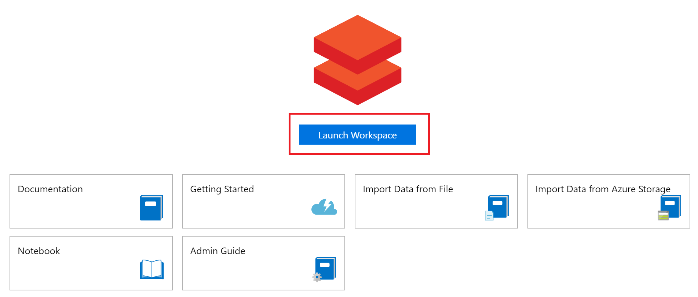
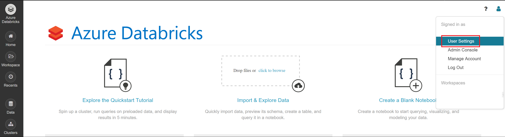
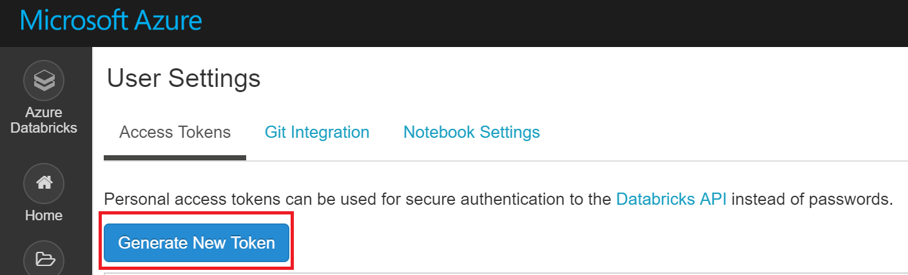
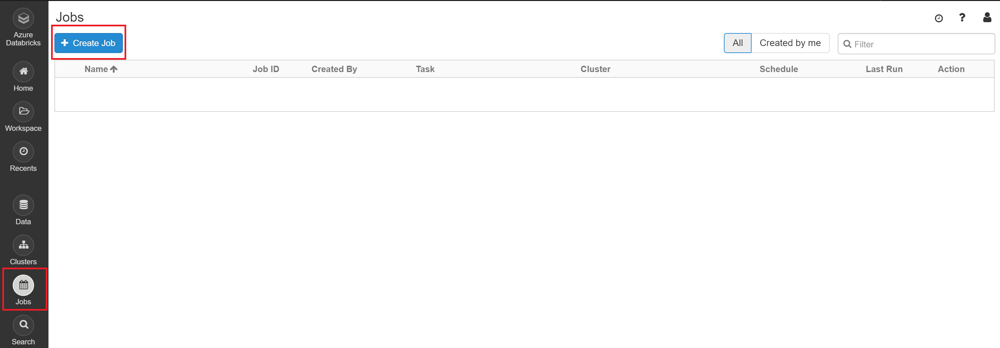
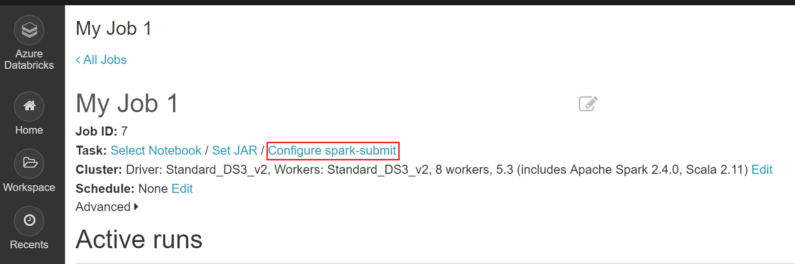
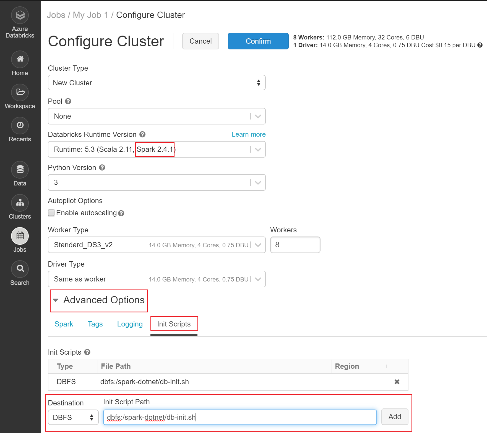
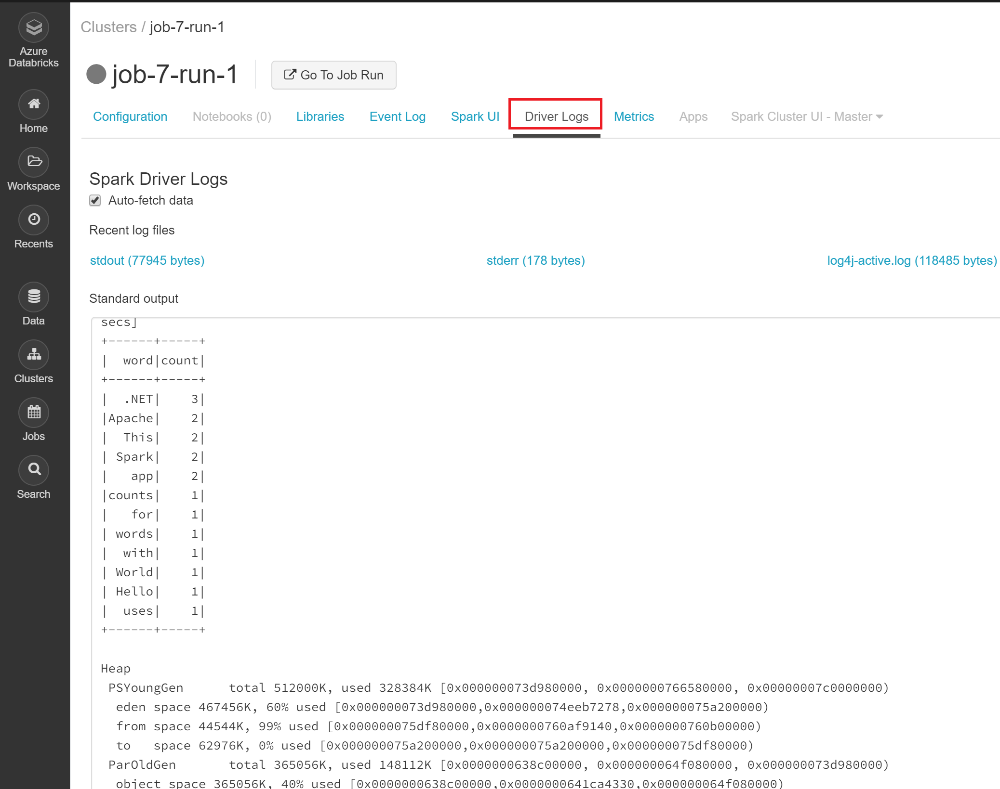

# Tutorial: Deploy a .NET for Apache Spark application to Databricks

This tutorial teaches you how to deploy your app to the cloud through Azure Databricks, an Apache Spark-based analytics platform with one-click setup, streamlined workflows, and interactive workspace that enables collaboration.

In this tutorial, you learn how to:

> [!div class="checklist"]
>
> - Create an Azure Databricks workspace.
> - Publish your .NET for Apache Spark app.
> - Create a Spark job and Spark cluster.
> - Run your app on the Spark cluster.

## Prerequisites

Before you start, do the following tasks:

* If you don't have an Azure account, create a [free account](https://azure.microsoft.com/free/).
* Sign in to the [Azure portal](https://portal.azure.com/).
* Complete the [.NET for Apache Spark - Get Started in 10-Minutes](https://dotnet.microsoft.com/learn/data/spark-tutorial/intro) tutorial.

## Create an Azure Databricks workspace

> [!Note]
> This tutorial cannot be carried out using **Azure Free Trial Subscription**.
> If you have a free account, go to your profile and change your subscription to **pay-as-you-go**. For more information, see [Azure free account](https://azure.microsoft.com/free/). Then, [remove the spending limit](https://docs.microsoft.com/azure/billing/billing-spending-limit#why-you-might-want-to-remove-the-spending-limit), and [request a quota increase](https://docs.microsoft.com/azure/azure-supportability/resource-manager-core-quotas-request) for vCPUs in your region. When you create your Azure Databricks workspace, you can select the **Trial (Premium - 14-Days Free DBUs)** pricing tier to give the workspace access to free Premium Azure Databricks DBUs for 14 days.

In this section, you create an Azure Databricks workspace using the Azure portal.

1. In the Azure portal, select **Create a resource** > **Analytics** > **Azure Databricks**.

   

2. Under **Azure Databricks Service**, provide the values to create a Databricks workspace.

    |Property  |Description  |
    |---------|---------|
    |**Workspace name**     | Provide a name for your Databricks workspace.        |
    |**Subscription**     | From the drop-down, select your Azure subscription.        |
    |**Resource group**     | Specify whether you want to create a new resource group or use an existing one. A resource group is a container that holds related resources for an Azure solution. For more information, see [Azure Resource Group overview](https://docs.microsoft.com/azure/azure-resource-manager/resource-group-overview). |
    |**Location**     | Select your preferred region. For information about available regions, see [Azure services available by region](https://azure.microsoft.com/regions/services/).        |
    |**Pricing Tier**     |  Choose between **Standard**, **Premium**, or **Trial**. For more information on these tiers, see [Databricks pricing page](https://azure.microsoft.com/pricing/details/databricks/).       |
    |**Virtual Network**     |   No       |

3. Select **Create**. The workspace creation takes a few minutes. During workspace creation, you can view the deployment status in **Notifications**.

## Install Azure Databricks tools

You can use the **Databricks CLI** to connect to Azure Databricks clusters and upload files to them from your local machine. Databricks clusters access files through DBFS (Databricks File System).

1. The Databricks CLI requires Python 3.6 or above. If you already have Python installed, you can skip this step.

   **For Windows:**

   [Download Python for Windows](https://www.python.org/ftp/python/3.7.4/python-3.7.4.exe)

   **For Linux:**
   Python comes preinstalled on most Linux distributions. Run the following command to see which version you have installed:

   ```bash
   python3 --version
   ```

2. Use pip to install the Databricks CLI. Python 3.4 and later include pip by default. Use pip3 for Python 3. Run the following command:

   ```bash
   pip3 install databricks-cli
   ```

3. Once you've installed the Databricks CLI, open a new command prompt and run the command `databricks`. If you receive a **'databricks' is not recognized as an internal or external command error**, make sure you opened a new command prompt.

## Set up Azure Databricks

Now that you have the Databricks CLI installed, you need to set up authentication details.

1. Run the Databricks CLI command `databricks configure --token`.

2. After running the configure command, you are prompted to enter a host. Your host URL uses the format: **https://<\Location>.azuredatabricks.net**. For instance, if you selected **eastus2** during Azure Databricks Service creation, the host would be **https://eastus2.azuredatabricks.net**.

3. After entering your host, you are prompted to enter a token. In the Azure portal, select **Launch Workspace** to launch your Azure Databricks workspace.

   

4. On the home page of your workspace, select **User Settings**.

   

5. On the User Settings page, you can generate a new token. Copy the generated token and paste it back into your command prompt.

   

You should now be able to access any Azure Databricks clusters you create and upload files to the DBFS.

## Download worker dependencies

1. Microsoft.Spark.Worker helps Apache Spark execute your app, such as any user-defined functions (UDFs) you may have written. Download [Microsoft.Spark.Worker](https://github.com/dotnet/spark/releases/download/v0.6.0/Microsoft.Spark.Worker.netcoreapp2.1.linux-x64-0.6.0.tar.gz).

2. The *install-worker.sh* is a script that lets you copy .NET for Apache Spark dependent files into the nodes of your cluster.

   Create a new file named **install-worker.sh** on your local computer, and paste the [install-worker.sh contents](https://raw.githubusercontent.com/dotnet/spark/master/deployment/install-worker.sh) located on GitHub.

3. The *db-init.sh* is a script that installs dependencies onto your Databricks Spark cluster.

   Create a new file named **db-init.sh** on your local computer, and paste the [db-init.sh contents](https://github.com/dotnet/spark/blob/master/deployment/db-init.sh) located on GitHub.

   In the file you just created, set the `DOTNET_SPARK_RELEASE` variable to `https://github.com/dotnet/spark/releases/download/v0.6.0/Microsoft.Spark.Worker.netcoreapp2.1.linux-x64-0.6.0.tar.gz`. Leave the rest of the *db-init.sh* file as-is.

> [!Note]
> If you are using Windows, verify that the line-endings in your *install-worker.sh* and *db-init.sh* scripts are Unix-style (LF). You can change line endings through text editors like Notepad++ and Atom.

## Publish your app

Next, you publish the *mySparkApp* created in the [.NET for Apache Spark - Get Started in 10-Minutes](https://dotnet.microsoft.com/learn/data/spark-tutorial/intro) tutorial to ensure your Spark cluster has access to all the files it needs to run your app.

1. Run the following commands to publish the *mySparkApp*:

   **On Windows:**

   ```console
   cd mySparkApp
   dotnet publish -c Release -f netcoreapp3.0 -r ubuntu.16.04-x64
   ```

   **On Linux:**

   ```bash
   cd mySparkApp
   dotnet publish -c Release -f netcoreapp3.0 -r ubuntu.16.04-x64
   ```

2. Do the following tasks to zip your published app files so that you can easily upload them to your Databricks Spark cluster.

   **On Windows:**

   Navigate to mySparkApp/bin/Release/netcoreapp3.0/ubuntu.16.04-x64. Then, right-click on **Publish** folder and select **Send to > Compressed (zipped) folder**. Name the new folder **publish.zip**.

   **On Linux, run the following command:**

   ```bash
   zip -r publish.zip .
   ```

## Upload files

In this section, you upload several files to DBFS so that your cluster has everything it needs to run your app in the cloud. Each time you upload a file to the DBFS, make sure you are in the directory where that file is located on your computer.

1. Run the following commands to upload the *db-init.sh*, *install-worker.sh*, and *Microsoft.Spark.Worker* to DBFS:

   ```console
   databricks fs cp db-init.sh dbfs:/spark-dotnet/db-init.sh
   databricks fs cp install-worker.sh dbfs:/spark-dotnet/install-worker.sh
   databricks fs cp Microsoft.Spark.Worker.netcoreapp2.1.linux-x64-0.6.0.tar.gz dbfs:/spark-dotnet/   Microsoft.Spark.Worker.netcoreapp2.1.linux-x64-0.6.0.tar.gz
   ```

2. Run the following commands to upload the remaining files your cluster will need to run your app: the zipped publish folder, *input.txt*, and *microsoft-spark-2.4.x-0.3.0.jar*.

   ```console
   cd mySparkApp
   databricks fs cp input.txt dbfs:/input.txt

   cd mySparkApp\bin\Release\netcoreapp3.0\ubuntu.16.04-x64 directory
   databricks fs cp mySparkApp.zip dbfs:/spark-dotnet/publish.zip
   databricks fs cp microsoft-spark-2.4.x-0.6.0.jar dbfs:/spark-dotnet/microsoft-spark-2.4.x-0.6.0.jar
   ```

## Create a job

Your app runs on Azure Databricks through a job that runs **spark-submit**, which is the command you use to run .NET for Apache Spark jobs.

1. In your Azure Databricks Workspace, select the **Jobs** icon and then **+ Create Job**.

   

2. Choose a title for your job, and then select **Configure spark-submit**.

   

3. Paste the following parameters in the job configuration. Then, select **Confirm**.

   ```
   ["--class","org.apache.spark.deploy.DotnetRunner","/dbfs/spark-dotnet/microsoft-spark-2.4.x-0.6.0.jar","/dbfs/spark-dotnet/publish.zip","mySparkApp"]
   ```

## Create a cluster

1. Navigate to your job and select **Edit** to configure your job's cluster.

2. Set your cluster to **Spark 2.4.1**. Then, select **Advanced Options** > **Init Scripts**. Set Init Script Path as `dbfs:/spark-dotnet/db-init.sh`.

   

3. Select **Confirm** to confirm your cluster settings.

## Run your app

1. Navigate to your job and select **Run Now** to run your job on your newly configured Spark cluster.

2. It takes a few minutes for the job's cluster to create. Once it is created, your job will be submitted, and you can view the output.

3. Select **Clusters** from the left menu, and then the name and run of your job.

4. Select **Driver Logs** to view the output of your job. When your app finishes executing, you see the same word count table from the getting started local run written to the standard output console.

   

   Congratulations, you've run your first .NET for Apache Spark application in the cloud!

## Clean up resources

If you no longer need the Databricks workspace, you can delete your Azure Databricks resource in the Azure portal. You can also select the resource group name to open the resource group page, and then select **Delete resource group**.

## Next steps

In this tutorial, you deployed your .NET for Apache Spark application to Databricks. To learn more about Databricks, continue to the Azure Databricks Documentation.

> [!div class="nextstepaction"]
> [Azure Databricks Documentation](https://docs.microsoft.com/azure/azure-databricks/)
