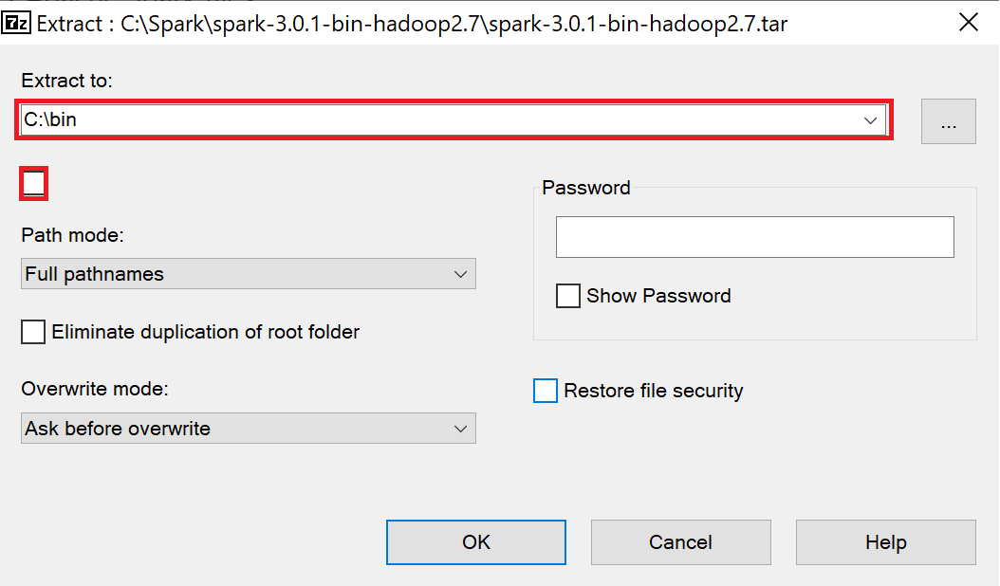

# Tutorial: Get started with .NET for Apache Spark

This tutorial teaches you how to run a .NET for Apache Spark app using .NET Core on Windows, macOS, and Ubuntu.

In this tutorial, you learn how to:

> [!div class="checklist"]
>
> * Prepare your environment for .NET for Apache Spark
> * Write your first .NET for Apache Spark application
> * Build and run your .NET for Apache Spark application

## Prepare your environment

Before you begin writing your app, you need to set up some prerequisite dependencies. If you can run `dotnet`, `java`, `spark-shell` from your command line environment, then your environment is already prepared and you can skip to the next section. If you cannot run any or all of the commands, do the following steps.

### 1. Install .NET

To start building .NET apps, you need to download and install the .NET SDK (Software Development Kit).

Download and install the [.NET Core SDK](https://dotnet.microsoft.com/download/dotnet/3.1). Installing the SDK adds the `dotnet` toolchain to your PATH.

Once you've installed the .NET Core SDK, open a new command prompt or terminal and run `dotnet`.

If the command runs and prints out information about how to use dotnet, can move to the next step. If you receive a `'dotnet' is not recognized as an internal or external command` error, make sure you opened a **new** command prompt or terminal before running the command.

### 2. Install Java

Install [Java 8.1](https://www.oracle.com/technetwork/java/javase/downloads/jdk8-downloads-2133151.html) for Windows and macOS, or [OpenJDK 8](https://openjdk.java.net/install/) for Ubuntu.

Select the appropriate version for your operating system. For example, select **jdk-8u201-windows-x64.exe** for a Windows x64 machine (as shown below) or **jdk-8u231-macosx-x64.dmg** for macOS. Then, use the command `java` to verify the installation.


### 3. Install compression software

Apache Spark is downloaded as a compressed .tgz file. Use an extraction program, like [7-Zip](https://www.7-zip.org/) or [WinZip](https://www.winzip.com/), to extract the file.

### 4. Install Apache Spark

[Download and install Apache Spark](https://spark.apache.org/downloads.html). You'll need to select from version 2.3.* or 2.4.0, 2.4.1, 2.4.3, 2.4.4, 2.4.5, 2.4.6, 2.4.7, 3.0.0, or 3.0.1 (.NET for Apache Spark is not compatible with other versions of Apache Spark).

The commands used in the following steps assume you have [downloaded and installed Apache Spark 3.0.1](https://spark.apache.org/downloads.html). If you wish to use a different version, replace **3.0.1** with the appropriate version number. Then, extract the **.tar** file and the Apache Spark files.

To extract the nested **.tar** file:

* Locate the **spark-3.0.1-bin-hadoop2.7.tgz** file that you downloaded.
* Right click on the file and select **7-Zip -> Extract here**.
* **spark-3.0.1-bin-hadoop2.7.tar** is created alongside the **.tgz** file you downloaded.

To extract the Apache Spark files:

* Right-click on **spark-3.0.1-bin-hadoop2.7.tar** and select **7-Zip -> Extract files...**
* Enter **C:\bin** in the **Extract to** field.
* Uncheck the checkbox below the **Extract to** field.
* Select **OK**.
* The Apache Spark files are extracted to C:\bin\spark-3.0.1-bin-hadoop2.7\



Run the following commands to set the environment variables used to locate Apache Spark. On Windows, make sure to run the command prompt in administrator mode.

#### [Windows](#tab/windows)

```console
setx /M HADOOP_HOME C:\bin\spark-3.0.1-bin-hadoop2.7\
setx /M SPARK_HOME C:\bin\spark-3.0.1-bin-hadoop2.7\
setx /M PATH "%PATH%;%HADOOP_HOME%;%SPARK_HOME%bin" # Warning: Don't run this if your path is already long as it will truncate your path to 1024 characters and potentially remove entries!
```

#### [Mac/Linux](#tab/linux)

```bash
export SPARK_HOME=~/bin/spark-3.0.1-bin-hadoop2.7/
export PATH="$SPARK_HOME/bin:$PATH"
source ~/.bashrc
```

---

Once you've installed everything and set your environment variables, open a **new** command prompt or terminal and run the following command:

```text
spark-submit --version
```

If the command runs and prints version information, you can move to the next step.

If you receive a `'spark-submit' is not recognized as an internal or external command` error, make sure you opened a **new** command prompt.

### 5. Install .NET for Apache Spark

Download the [Microsoft.Spark.Worker](https://github.com/dotnet/spark/releases) release from the .NET for Apache Spark GitHub. For example if you're on a Windows machine and plan to use .NET Core, [download the Windows x64 netcoreapp3.1 release](https://github.com/dotnet/spark/releases).

To extract the Microsoft.Spark.Worker:

* Locate the **Microsoft.Spark.Worker.netcoreapp3.1.win-x64-1.0.0.zip** file that you downloaded.
* Right-click and select **7-Zip -> Extract files...**.
* Enter **C:\bin** in the **Extract to** field.
* Uncheck the checkbox below the **Extract to** field.
* Select **OK**.

### 6. Install WinUtils (Windows only)

.NET for Apache Spark requires WinUtils to be installed alongside Apache Spark. [Download winutils.exe](https://github.com/steveloughran/winutils/blob/master/hadoop-2.7.1/bin/winutils.exe). Then, copy WinUtils into **C:\bin\spark-3.0.1-bin-hadoop2.7\bin**.

> [!NOTE]
> If you are using a different version of Hadoop, which is annotated at the end of your Spark install folder name, [select the version of WinUtils](https://github.com/steveloughran/winutils) that's compatible with your version of Hadoop.

### 7. Set DOTNET_WORKER_DIR and check dependencies

Run one of the following commands to set the `DOTNET_WORKER_DIR` environment variable, which is used by .NET apps to locate .NET for Apache Spark worker binaries. Make sure to replace `<PATH-DOTNET_WORKER_DIR>` with the directory where you downloaded and extracted the `Microsoft.Spark.Worker`. On Windows, make sure to run the command prompt in administrator mode.

#### [Windows](#tab/windows)

```console
setx /M DOTNET_WORKER_DIR <PATH-DOTNET-WORKER-DIR>
```

#### [Mac/Linux](#tab/linux)

```bash
export DOTNET_WORKER_DIR=<PATH-DOTNET-WORKER-DIR>
```

---

Finally, double-check that you can run `dotnet`, `java`, `spark-shell` from your command line before you move to the next section.

## Write a .NET for Apache Spark app

### 1. Create a console app

In your command prompt or terminal, run the following commands to create a new console application:

```dotnetcli
dotnet new console -o MySparkApp
cd MySparkApp
```

The `dotnet` command creates a `new` application of type `console` for you. The `-o` parameter creates a directory named *MySparkApp* where your app is stored and populates it with the required files. The `cd MySparkApp` command changes the directory to the app directory you created.

### 2. Install NuGet package

To use .NET for Apache Spark in an app, install the Microsoft.Spark package. In your command prompt or terminal, run the following command:

```dotnetcli
dotnet add package Microsoft.Spark
```

> [!NOTE]
> This tutorial uses the latest version of the `Microsoft.Spark` NuGet package unless otherwise specified.

### 3. Write your app

Open *Program.cs* in Visual Studio Code, or any text editor, and replace all of the code with the following:

```csharp
using Microsoft.Spark.Sql;
using static Microsoft.Spark.Sql.Functions;

namespace MySparkApp
{
    class Program
    {
        static void Main(string[] args)
        {
            // Create Spark session
            SparkSession spark =
                SparkSession
                    .Builder()
                    .AppName("word_count_sample")
                    .GetOrCreate();

            // Create initial DataFrame
            string filePath = args[0];
            DataFrame dataFrame = spark.Read().Text(filePath);

            //Count words
            DataFrame words =
                dataFrame
                    .Select(Split(Col("value")," ").Alias("words"))
                    .Select(Explode(Col("words")).Alias("word"))
                    .GroupBy("word")
                    .Count()
                    .OrderBy(Col("count").Desc());

            // Display results
            words.Show();

            // Stop Spark session
            spark.Stop();
        }
    }
}
```

[SparkSession](xref:Microsoft.Spark.Sql.SparkSession) is the entrypoint of Apache Spark applications, which manages the context and information of your application. Using the [Text](xref:Microsoft.Spark.Sql.DataFrameReader.Text%2A) method, the text data from the file specified by the `filePath` is read into a [DataFrame](xref:Microsoft.Spark.Sql.DataFrame). A DataFrame is a way of organizing data into a set of named columns. Then, a series of transformations is applied to split the sentences in the file, group each of the words, count them and order them in descending order. The result of these operations is stored in another DataFrame. Note that at this point, no operations have taken place because .NET for Apache Spark lazily evaluates the data. It's not until the [Show](xref:Microsoft.Spark.Sql.DataFrame.Show%2A) method is called to display the contents of the `words` transformed DataFrame to the console that the operations defined in the lines above execute. Once you no longer need the Spark session, use the [Stop](xref:Microsoft.Spark.Sql.SparkSession.Stop%2A) method to stop your session.

### 4. Create data file

Your app processes a file containing lines of text. Create a file called *input.txt* file in your *MySparkApp* directory, containing the following text:

```text
Hello World
This .NET app uses .NET for Apache Spark
This .NET app counts words with Apache Spark
```

Save the changes and close the file.

## Run your .NET for Apache Spark app

Run the following command to build your application:

```dotnetcli
dotnet build
```

Navigate to your build output directory and use the `spark-submit` command to submit your application to run on Apache Spark. Make sure to replace  `<version>` with the version of your .NET worker and `<path-of-input.txt>` with the path of your *input.txt* file is stored.

### [Windows](#tab/windows)

```console
spark-submit ^
--class org.apache.spark.deploy.dotnet.DotnetRunner ^
--master local ^
microsoft-spark-3-0_2.12-<version>.jar ^
dotnet MySparkApp.dll <path-of-input.txt>
```

### [Mac/Linux](#tab/linux)

```bash
spark-submit \
--class org.apache.spark.deploy.dotnet.DotnetRunner \
--master local \
microsoft-spark-3-0_2.12-<version>.jar \
dotnet MySparkApp.dll <path-of-input.txt>
```

---

> [!NOTE]
> This command assumes you have downloaded Apache Spark and added it to your PATH environment variable to be able to use `spark-submit`. Otherwise, you'd have to use the full path (for example, *C:\bin\apache-spark\bin\spark-submit* or *~/spark/bin/spark-submit*).

When your app runs, the word count data of the *input.txt* file is written to the console.

```console
+------+-----+
|  word|count|
+------+-----+
|  .NET|    3|
|Apache|    2|
|   app|    2|
|  This|    2|
| Spark|    2|
| World|    1|
|counts|    1|
|   for|    1|
| words|    1|
|  with|    1|
| Hello|    1|
|  uses|    1|
+------+-----+
```

Congratulations! You successfully authored and ran a .NET for Apache Spark app.

## Next steps

In this tutorial, you learned how to:
> [!div class="checklist"]
>
> * Prepare your environment for .NET for Apache Spark
> * Write your first .NET for Apache Spark application
> * Build and run your .NET for Apache Spark application

To see a video explaining the steps above, check out the [.NET for Apache Spark 101 video series](/shows/NET-for-Apache-Spark-101/Run-Your-First-NET-for-Apache-Spark-App).

Check out the resources page to learn more.
> [!div class="nextstepaction"]
> [.NET for Apache Spark Resources](../resources/index.md)
