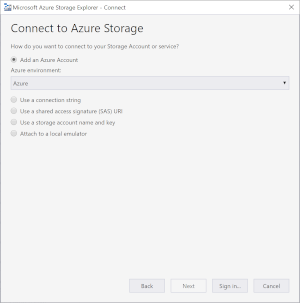
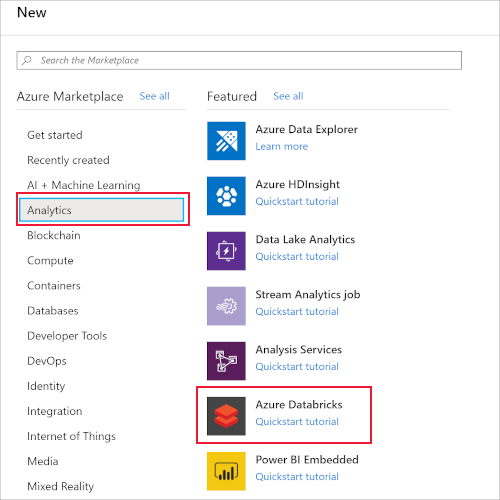
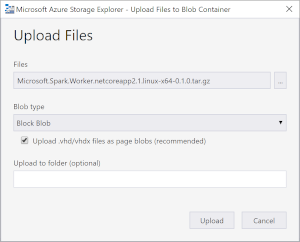

# Tutorial: Deploy a .NET for Apache Spark application to Azure HDInsight

This tutorial teaches you how to deploy your .NET for Apache Spark app to the cloud through an Azure HDInsight cluster. HDInsight makes it easier to create and configure a Spark cluster in Azure since Spark clusters in HDInsight are compatible with Azure Storage and Azure Data Lake Storage.

In this tutorial, you learn how to:

> [!div class="checklist"]
>
> * Access your storage accounts using Azure Storage Explorer.
> * Create an Azure HDInsight cluster.
> * Publish your .NET for Apache Spark app.
> * Create and run an HDInsight script action.
> * Run a .NET for Apache Spark app on an HDInsight cluster.

## Prerequisites

Before you start, do the following tasks:

* If you don't have an Azure subscription, create a [free account](https://azure.microsoft.com/free/dotnet/).
* Sign in to the [Azure portal](https://portal.azure.com/).
* Install Azure Storage Explorer on your [Windows](https://go.microsoft.com/fwlink/?LinkId=708343&clcid=0x409), [Linux](https://go.microsoft.com/fwlink/?LinkId=722418&clcid=0x409), or [MacOS](https://go.microsoft.com/fwlink/?LinkId=708342&clcid=0x409) computer.
* Complete the [.NET for Apache Spark - Get Started in 10-Minutes](https://dotnet.microsoft.com/learn/data/spark-tutorial/intro) tutorial.

## Access your storage accounts

1. Open Azure Storage Explorer.

2. Select **Add Account** on the left menu, and sign in to your Azure account.

    

   After you sign in, you should see all storage accounts you have and any resources you have uploaded to your storage accounts.

## Create an HDInsight cluster

> [!IMPORTANT]
> Billing for HDInsight clusters is prorated per minute, even if you're not using them. Be sure to delete your cluster after you have finished using it. For more information, see the [Clean up resources](#clean-up-resources) section of this tutorial.

1. Visit the [Azure portal](https://portal.azure.com).

2. Select **+ Create a resource**. Then, select **HDInsight** from the **Analytics** category.

    

3. Under **Basics**, provide the following values:

    |Property  |Description  |
    |---------|---------|
    |Subscription  | From the drop-down, choose one of your active Azure subscriptions. |
    |Resource group | Specify whether you want to create a new resource group or use an existing one. A resource group is a container that holds related resources for an Azure solution. |
    |Cluster name | Give a name to your HDInsight Spark cluster.|
    |Location   | Select a location for the resource group. The template uses this location for creating the cluster as well as for the default cluster storage. |
    |Cluster type| Select **Spark** as the cluster type.|
    |Cluster version|This field will autopopulate with the default version once the cluster type has been selected. Select a 2.3 or 2.4 version of Spark.|
    |Cluster login username| Enter the cluster login username.  The default name is *admin*. |
    |Cluster login password| Enter any login password. |
    |Secure Shell (SSH) username| Enter the SSH username. By default, this account shares the same password as the *Cluster Login username* account. |

4. Select **Next: Storage >>** to continue to the **Storage** page. Under **Storage**, provide the following values:

    |Property  |Description  |
    |---------|---------|
    |Primary storage type|Use the default value **Azure Storage**.|
    |Selection method|Use the default value **Select from list**.|
    |Primary storage account|Choose your subscription and one of your active storage accounts within that subscription.|
    |Container|This container is the specific blob container in your storage account where your cluster looks for files to run your app in the cloud. You can give it any available name.|

5. Under **Review + create**, select **Create**. It takes about 20 minutes to create the cluster. The cluster must be created before you can continue to the next step.

## Publish your app

Next, you publish the *mySparkApp* created in the [.NET for Apache Spark - Get Started in 10-Minutes](https://dotnet.microsoft.com/learn/data/spark-tutorial/intro) tutorial, which gives your Spark cluster access to all the files it needs to run your app.

1. Run the following commands to publish the *mySparkApp*:

   **On Windows:**

   ```dotnetcli
   cd mySparkApp
   dotnet publish -c Release -f netcoreapp3.1 -r win-x64
   ```

   **On Linux:**

   ```bash
   cd mySparkApp
   foo@bar:~/path/to/app$ dotnet publish -c Release -f netcoreapp3.1 -r ubuntu.16.04-x64
   ```

2. Do the following tasks to zip your published app files so that you can easily upload them to your HDInsight cluster. Zip the contents of the publish folder, *publish.zip* for example, that was created as a result of Step 1. All the assemblies should be in the first layer of the ZIP file and there should be no intermediate folder layer. This means when you unzip *publish.zip*, all assemblies are extracted into your current working directory.

   **On Windows:**

   Use an extraction program, like 7-Zip or WinZip, to extract the file into the bin directory with all the published binaries.

   **On Linux, run the following command:**

   ```bash
   zip -r publish.zip
   ```

## Upload files to Azure

Next, you use the Azure Storage Explorer to upload the following five files to the blob container you chose for your cluster's storage:

* Microsoft.Spark.Worker
* install-worker.sh
* publish.zip
* microsoft-spark-2-4_2.11-1.0.0.jar
* input.txt

1. Open Azure Storage Explorer and navigate to your storage account from the left menu. Drill down to the blob container for your cluster under **Blob Containers** in your storage account.

2. *Microsoft.Spark.Worker* helps Apache Spark execute your app, such as any user-defined functions (UDFs) you may have written. Download [Microsoft.Spark.Worker](https://github.com/dotnet/spark/releases/download/v1.0.0/Microsoft.Spark.Worker.netcoreapp3.1.linux-x64-1.0.0.tar.gz). Then, select **Upload** in Azure Storage Explorer to upload the worker.

   

3. The *install-worker.sh* is a script that lets you copy .NET for Apache Spark dependent files into the nodes of your cluster.

   Create a new file named **install-worker.sh** in your local computer, and paste the [install-worker.sh contents](https://raw.githubusercontent.com/dotnet/spark/main/deployment/install-worker.sh) located on GitHub. Then, upload *install-worker.sh* to your blob container.

4. Your cluster needs the *publish.zip* file that contains your app's published files. Navigate to your published folder, **mySparkApp/bin/Release/netcoreapp3.1/ubuntu.16.04-x64**, and locate **publish.zip**. Then upload *publish.zip* to your blob container.

5. Your cluster needs the application code that is packaged as a jar, included as part of the [Microsoft.Spark](https://www.nuget.org/packages/Microsoft.Spark/) nuget and colocated in your app's build output directory. Navigate to your published folder, **mySparkApp/bin/Release/netcoreapp3.1/ubuntu.16.04-x64**, and locate **microsoft-spark-2-4_2.11-1.0.0.jar**. Then, upload the jar file to your blob container.

   There may be multiple .jar files (for versions 2.3.x, 2.4.x and 3.0.x of Spark). You need to choose the .jar file that matches the version of Spark you chose during cluster creation. For example, choose *microsoft-spark-2-4_2.11-1.0.0.jar* if you chose Spark 2.4 during cluster creation.

6. Your cluster needs the input to your app. Navigate to your **mySparkApp** directory and locate **input.txt**. Upload your input file to the **user/sshuser** directory in your blob container. You will be connecting to your cluster through ssh, and this folder is where your cluster looks for its input. The *input.txt* file is the only file uploaded to a specific directory.

## Run the HDInsight script action

Once your cluster is running and you've uploaded your files to Azure, you run the **install-worker.sh** script on the cluster.

1. Navigate to your HDInsight Spark cluster in Azure portal, and then select **Script actions**.

2. Select **+ Submit new** and provide the following values:

   |Property  |Description  |
   |---------|---------|
   | Script type |Custom|
   | Name | Install Worker|
   | Bash script URI |`https://mystorageaccount.blob.core.windows.net/mycontainer/install-worker.sh` </br> To confirm this URI, right-click on install-worker.sh in Azure Storage Explorer and select Properties. |
   | Node type(s)| Worker|
   | Parameters | azure </br> wasbs://mycontainer@myStorageAccount.blob.core.windows.net/Microsoft.Spark.Worker.netcoreapp3.1.linux-x64-1.0.0.tar.gz </br> /usr/local/bin

3. Select **Create** to submit your script.

## Run your app

1. Navigate to your HDInsight Spark cluster in Azure portal, and then select **SSH + Cluster login**.

2. Copy the ssh login information and paste the login into a terminal. Sign in to your cluster using the password you set during cluster creation. You should see messages welcoming you to Ubuntu and Spark.

3. Use the **spark-submit** command to run your app on your HDInsight cluster. Remember to replace **mycontainer** and **mystorageaccount** in the example script with the actual names of your blob container and storage account.

   ```bash
   $SPARK_HOME/bin/spark-submit \
   --master yarn \
   --class org.apache.spark.deploy.dotnet.DotnetRunner \
   wasbs://mycontainer@mystorageaccount.blob.core.windows.net/microsoft-spark-2-4_2.11-1.0.0.jar \
   wasbs://mycontainer@mystorageaccount.blob.core.windows.net/publish.zip mySparkApp
   ```

   When your app runs, you see the same word count table from the getting started local run written to the console. Congratulations, you've run your first .NET for Apache Spark application in the cloud!

## Clean up resources

HDInsight saves your data in Azure Storage, so you can safely delete a cluster when it is not in use. You are also charged for an HDInsight cluster, even when it is not in use. Since the charges for the cluster are many times more than the charges for storage, it makes economic sense to delete clusters when they are not in use.

You can also select the resource group name to open the resource group page, and then select **Delete resource group**. By deleting the resource group, you delete both the HDInsight Spark cluster, and the default storage account.

## Next steps

In this tutorial, you deployed your .NET for Apache Spark application to Azure HDInsight. To learn more about HDInsight, continue to the Azure HDInsight Documentation.

> [!div class="nextstepaction"]
> [Submit jobs remotely on Azure HDInsight](../how-to-guides/hdinsight-deploy-methods.md)
> [Azure HDInsight Documentation](/azure/hdinsight/)
