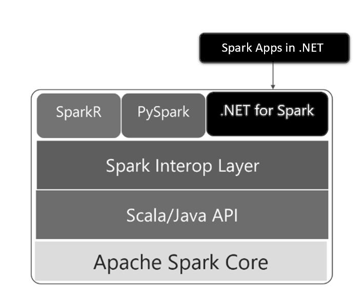

# What is .NET for Apache Spark?

[Apache Spark](what-is-spark.md) is a general-purpose distributed processing engine for analytics over large data sets - typically terabytes or petabytes of data. With .NET for Apache Spark, the free, open-source, and cross-platform .NET Support for the popular open-source big data analytics framework, you can now add the power of Apache Spark to your big data applications using languages you already know.

## Why choose .NET for Apache Spark?

.NET for Apache Spark empowers developers with .NET experience or code bases to participate in the world of big data analytics. .NET for Apache Spark provides high performance APIs for using Spark from C# and F#. With C# and F#, you can access:

* DataFrame and SparkSQL for working with structured data
* Spark Structured Streaming for working with streaming data
* Spark SQL for writing queries with SQL syntax
* Machine learning integration for faster training and prediction (i.e. use .NET for Apache Spark alongside [ML.NET](http://dot.net/ml))

.NET for Apache Spark is compliant with .NET Standard, a formal specification of .NET APIs that are common across .NET implementations. This means you can use .NET for Apache Spark anywhere you write .NET code allowing you to reuse all the knowledge, skills, code, and libraries you already have as a .NET developer.

.NET for Apache Spark runs on Windows, Linux, and macOS using .NET Core. It also runs on Windows using .NET Framework. You can deploy your applications to all major cloud providers including Azure HDInsight Spark, Amazon EMR Spark, Azure Databricks, and Databricks on AWS.

## .NET for Apache Spark architecture

The C#/ F# language binding to Spark is written on a new Spark interop layer which offers easier extensibility. This new layer of Spark interop was written using the best practices for language extension and optimizes for interop and performance. Long term, this extensibility can be used for adding support for other languages in Spark.

> [!div class="mx-imgBorder"]
> 

You can learn about interop support for Spark language extensions from [the proposal](https://issues.apache.org/jira/browse/SPARK-26257).

## .NET for Apache Spark performance

When compared against Python and Scala using the [TPC-H benchmark](http://www.tpc.org/tpch/), .NET for Apache Spark performs well in most cases and is 2x faster than Python when user-defined function performance is critical. There is an ongoing effort to improve and benchmark performance. 

To do your own benchmarking, see the benchmarks available on the [.NET for Apache Spark GitHub](https://github.com/dotnet/spark/tree/master/benchmark).

## .NET for Apache Spark roadmap

Learn about short term and long term plans from the official [.NET for Apache Spark roadmap](https://github.com/dotnet/spark/blob/master/ROADMAP.md).

## .NET Foundation

The .NET for Apache Spark project is part of the [.NET Foundation](https://www.dotnetfoundation.org/).

## Contributions

The .NET for Apache Spark team encourages contributions, both GitHub issues and pull requests. First, look for an [existing issue](https://github.com/dotnet/spark/issues). If you can't find an existing issue, [open a new issue](https://github.com/dotnet/spark/issues?utf8=%E2%9C%93&q=is%3Aissue+is%3Aopen+).

## Next steps

Try .NET for Apache Spark.
> [!div class="nextstepaction"]
> [Tutorial: Get started with .NET for Apache Spark](./tutorials/get-started.md)