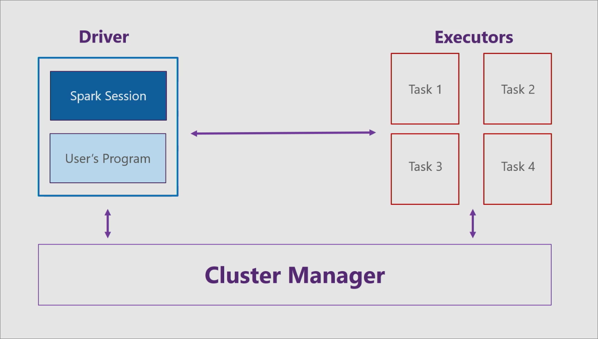

# What is Apache Spark?

[Apache Spark](https://spark.apache.org/) is an open-source parallel processing framework that supports in-memory processing to boost the performance of applications that analyze big data. Big data solutions are designed to handle data that is too large or complex for traditional databases. Spark processes large amounts of data in memory, which is much faster than disk-based alternatives.

## Common big data scenarios

You might consider a big data architecture if you need to store and process large volumes of data, transform unstructured data, or process streaming data. Spark is a general-purpose distributed processing engine that can be used for several big data scenarios.

### Extract, transform, and load (ETL)

[Extract, transform, and load (ETL)](/azure/architecture/data-guide/relational-data/etl) is the process of collecting data from one or multiple sources, modifying the data, and moving the data to a new data store. There are several ways to transform data, including:

* Filtering
* Sorting
* Aggregating
* Joining
* Cleaning
* Deduplicating
* Validating

### Real-time data stream processing

Streaming, or real-time, data is data in motion. Telemetry from IoT devices, weblogs, and clickstreams are all examples of streaming data. Real-time data can be processed to provide useful information, such as geospatial analysis, remote monitoring, and anomaly detection. Just like relational data, you can filter, aggregate, and prepare streaming data before moving the data to an output sink. Apache Spark supports [real-time data stream processing](/azure/architecture/data-guide/big-data/real-time-processing) through [Spark Streaming](https://spark.apache.org/streaming/).

### Batch processing

[Batch processing](/azure/architecture/data-guide/big-data/batch-processing) is the processing of big data at rest. You can filter, aggregate, and prepare very large datasets using long-running jobs in parallel.

### Machine learning through MLlib

Machine learning is used for advanced analytical problems. Your computer can use existing data to forecast or predict future behaviors, outcomes, and trends. Apache Spark's machine learning library, [MLlib](https://spark.apache.org/mllib/), contains several machine learning algorithms and utilities.

### Graph processing through GraphX

A graph is a collection of nodes connected by edges. You might use a graph database if you have hierarchial data or data with interconnected relationships. You can process this data using Apache Spark's [GraphX](https://spark.apache.org/graphx/) API.

### SQL and structured data processing with Spark SQL

If you're working with structured (formatted) data, you can use SQL queries in your Spark application using [Spark SQL](https://spark.apache.org/sql/).

## Apache Spark architecture

Apache Spark has three main components: the driver, executors, and cluster manager. Spark applications run as independent sets of processes on a cluster, coordinated by the driver program.

For more information, see [Cluster mode overview](https://spark.apache.org/docs/latest/cluster-overview.html).

### Driver

The driver consists of your program, like a C# console app, and a Spark session. The Spark session takes your program and divides it into smaller tasks that are handled by the executors.

### Executors

Each executor, or worker node, receives a task from the driver and executes that task. The executors reside on an entity known as a cluster.

### Cluster manager

The cluster manager communicates with both the driver and the executors to:

* Manage resource allocation
* Manage program division
* Manage program execution

## Language support

Apache Spark supports the following programming languages:

* Scala
* Python
* Java
* SQL
* R
* .NET languages (C#/F#)

## Spark APIs

Apache Spark supports the following APIs:

* [Spark Scala API](https://spark.apache.org/docs/2.2.0/api/scala/index.html)
* [Spark Java API](https://spark.apache.org/docs/2.2.0/api/java/index.html)
* [Spark Python API](https://spark.apache.org/docs/2.2.0/api/python/index.html)
* [Spark R API](https://spark.apache.org/docs/2.2.0/api/R/index.html)
* [Spark SQL](https://spark.apache.org/docs/latest/api/sql/index.html), built-in functions

## Next steps

Learn how you can use Apache Spark in your .NET application. With .NET for Apache Spark, developers with .NET experience and business logic can write big data queries in C# and F#.
> [!div class="nextstepaction"]
> [What is .NET for Apache Spark](what-is-apache-spark-dotnet.md)
