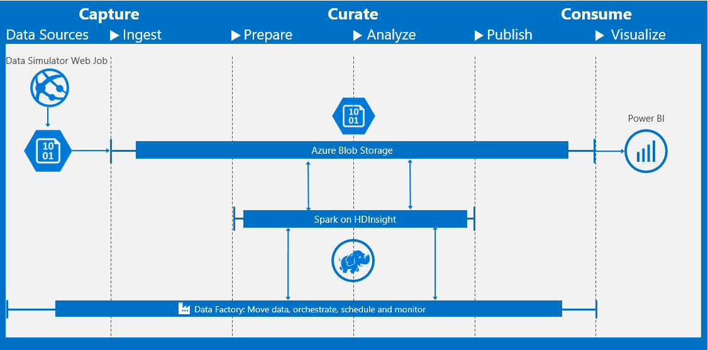

# AI architecture

## The big picture

Figure 2: Example of AI architecture

### Data Sources

Data Source is the origin of the data, where the data is originally located. Different kinds of storage for different kinds of data (relational, non-relational). The data could be static (archive) or live (streaming) data. Another classification is based on data structure level (highly structured, semi-structured or unstructured). This section will describe how can we use Azure Data Sources (SqlServer, Hadoop, CosmosDB, …) to perform former data requirements.

### Ingest

Collect data and/or integration flows from different data sources.

### Prepare

Feature engineering: prepping the data to be ready to be consumed by the model. Explain different kinds of data preprocessing, depending also of the data and the business domain. Text analytics (tokenization, stemming, …). Numerical analysis (normalization, missing values, …). Pictures (size/bits/color reduction, featurization, …).

### Analyze

This is the characteristic building block of an AI Architecture. This block defines the machine learning model that will extract value from the data.

* Spark (MMLib, Microsoft Machine Learning for Spark) / HDInsight

* Microsoft Machine Learning Server (former Microsoft R Server)

* Virtual Machines (Data Science Virtual Machine)

* Embedded machine learning (R/Python for SqlServer)

* Azure Batch

### Publish

Model deployment. The model is exposed to the consumer, usually as a REST API.

### Visualize

The consumer uses the information from the model.

* Classic (desktop, mobile, web)

  * Embedded machine learning (model evaluation in apps)

* Bots (Microsoft Bot Framework)

* Reports (PowerBI) and Applications (Excel – AI powered spreadsheets)

## Summary

Leverage use between on-premise system or cloud enabled solutions.
Leverage machine learning systems beyond the cloud: from relational databases to mobile and embedded devices. 

>[!div class="step-by-step"]
[Previous] (ai-service.md)
[Next] (ai-process-management.md)