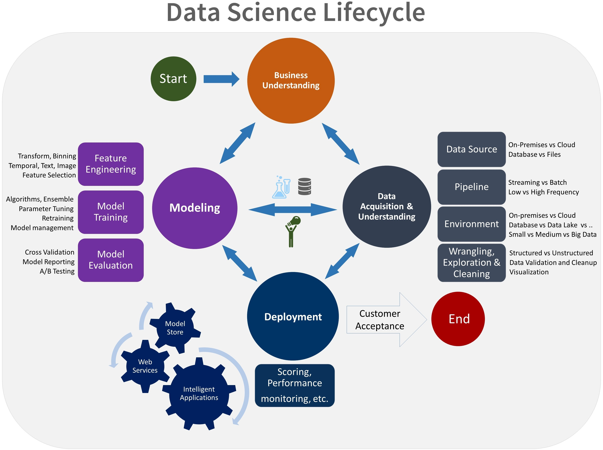

# AI Process Management

## Team Data Science Process (TDSP)

TDSP is an agile, iterative, data science process developed by Microsoft, for executing and delivering advanced analytics solutions. It is designed to improve collaboration and efficiency of data science teams in any kind of organizations.

### Lifecycle

Data Science is a highly iterative process, with a strong accent in the evaluation and validation of the model. The objective of these iterations is to refine previous hypothesis, and in the end, obtain a sound solution. In this section, we will explain key components of the each lifecycle iteration are: business understanding, data acquisition, modeling and deployment.

Figure 3: TDSP Lifecycle

#### Roles and tasks

We have four different roles in our teams: Group Manager, Team Lead, Project Lead and project Individual Contributor. For each role, we also define a set of specific tasks assigned to each one, helping to proper balance working distribution forces along the project.

### Project structure

TDSP defines a project structure as a folder tree, which will include code, documentation, reports. This section will describe main points in creating a repository storing all items created for our solution.

### Project execution

TDSP defines execution activities performed by the process in order to move between phases. These activities include sprint planning and planification using features/stories/tasks/bugs. All these activities produce either code / documentation / reports which are tracked using SCM.

## Summary

Why is important to define a lifecycle process? Why is important in AI projects? Why should I follow this process and guidelines? How to adapt the process to your own case.

>[!div class="step-by-step"]
[Previous] (ai-architecture.md)
[Next] (introduction-eshoponcontainersai.md)