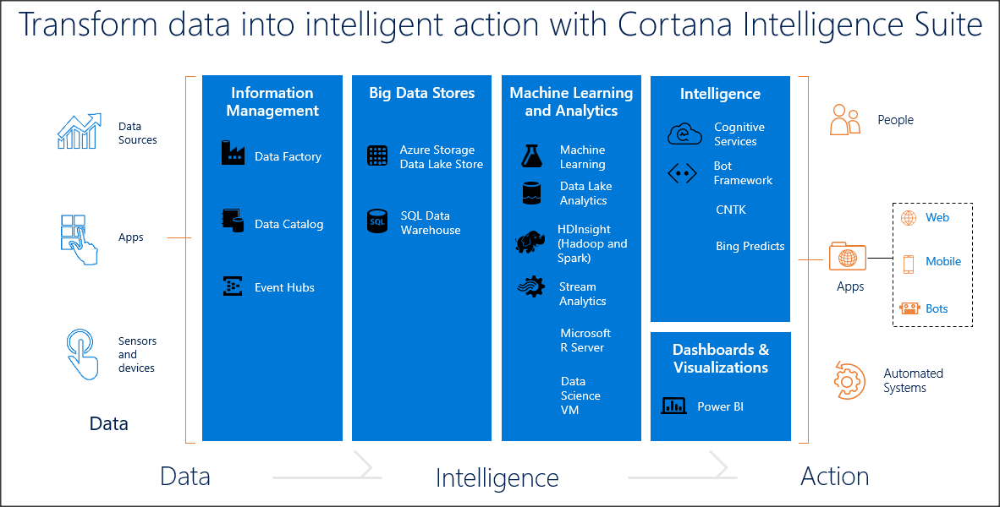

# AI as a Service

## Cortana Intelligence Suite

Figure 1: Cortana Intelligence Suite

Cortana Intelligence is a collection of Azure services for getting insightful value from the data. These solutions can be applied in multiple scenarios and processes, from retail to banking, telecommunications or e-health, from prediction maintenance to sentimental analysis, risk analysis or stock prediction.

## Cognitive Services

Set of APIs, SDK’s and cloud services to build intelligent systems. Designed to make applications more personalized, intelligent and engaging. Integration with U-SQL and partially supported in Azure Machine Learning and Bing Services.

## Summary

Why use an AIaaS? Costs and benefits

>[!div class="step-by-step"]
[Previous] (build-ai.md)
[Next] (ai-architecture.md)