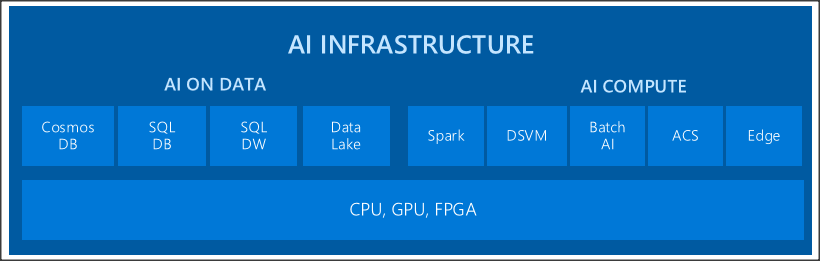

# Building your AI

## Languages

### R

Introduction to R. Brief History. Installation and setup. Language main features. Main packages for Machine Learning (dplyr, caret, ggplot)
ML Server

### Python

Introduction to Python. Brief History. Language main features. Installation and setup. Main packages for Machine Learning (NumPy, scikit-learn, …) 

## Coding & Managing Tools

### Azure Machine Learning Studio

* fully managed cloud solution (no hardware / software to install / maintain)

* integrated single interface (web application using drag & drop visual composition), shareable workspaces

* targeting from Data Scientists to Business Analysts (no programming experience needed)

* using best in class algorithms, and extensible using custom R and Python modules

* deployable and scalable, ready for consumption (REST API)

* Explanation about features

* Azure Gallery: pre-built experiments, allows customization

### Azure Machine Learning Workbench

Workbench is a desktop application, supported on both Windows and macOS, which allows managing machine learning solutions based on Python. Core features: data preparation tool supporting; automatic project snapshots for each run based on integrated GIT support.

#### Experimentation

Manage project dependencies; Manage training jobs on any target (local, scale-up or scale-out); git checkpointing and version control; service side capture of run metrics, output logs and models; use favorite IDE/Framework.

#### Model deployment

Deploy Everywhere (check Multiple targets); Deployment and management of models as HTTP services; container-based hosting of real time and batch processing; management and monitoring (Azure Application Insights); first class support of ML engines/frameworks (SparkML, CNTK, TensorFlow, R, Python)

### Visual Studio Code Tools for AI

Develop machine learning applications and services, using most known deep learning frameworks  (such as TensorFlow, CNTK, Caffe2). Operationalizing your services in Azure, you can scale from a single server to Spark clusters using dedicated GPU hardware. How to install? Multiplatform support (macOS / Windows)

### Deep Learning Frameworks

What is Deep Learning? Deep Learning represents the state-of-art in Machine Learning algorithms, and plays a main role in the success of modern Machine Learning solutions. Differences between traditional ML and Deep Learning (no feature engineering and handles easily unstructured data).
Brief history on deep learning. How industry is using deep learning? Main Python packages (CNTK, TensorFlow, …)

### Other

Jupyter Notebook, Pycharm, …

## Deployment targets

Machine Learning models can be deployed for working side by side with other Data Engines (such as relational databases), or they might be deployed taking full ownership of the host computation. Former deployment targets bring closer the computation to the data avoiding further data flows, while the later brings the data close to the raw power processing. (Add ML Server to the discussion)

## Summary

Which development tool use? Pros/Cons each option. Which target should I use? Factors to consider: volume of data, processing speed, type of data (w/structure), cloud costs. 

>[!div class="step-by-step"]
[Previous] (introduction-ai.md)
[Next] (ai-service.md)