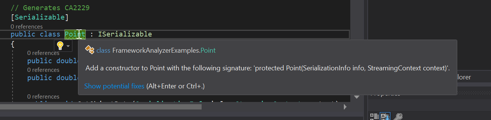

# The .NET Framework Analyzer

You can use the .NET Framework Analyzer to find potential issues in your .NET Framework-based application code. This analyzer finds potential issues and suggests
fixes to them.

The analyzer runs interactively in Visual Studio as you write your code
or as part of a CI build. You should add the analyzer to your project as
early as possible in your development. The sooner you find any potential issues
in your code, the easier they are to fix. However, you can add it at any time
in the development cycle. It finds any issues with the existing code and
warns about new issues as you keep developing.

## Installing and configuring the .NET Framework Analyzer

The .NET Security Analyzers must be installed as a NuGet package on every
project where you want them to run. Only one developer needs to add them
to the project. The analyzer package is a project dependency and will run
on every developer's machine once it has the updated solution.

The .NET Framework Analyzer is delivered in the [Microsoft.NetFramework.Analyzers](https://www.nuget.org/packages/Microsoft.NetFramework.Analyzers/)
NuGet package. This package provides only the analyzers specific to the .NET Framework, which
includes security analyzers. In most cases, you'll want
the [Microsoft.CodeAnalysis.FxCopAnalyzers](https://www.nuget.org/packages/Microsoft.CodeAnalysis.FxCopAnalyzers) NuGet package. 
The FxCopAnalyzers aggregate package contains all the framework analyzers included in the
Framework.Analyzers package as well as the following analyzers:
- [Microsoft.CodeQuality.Analyzers](https://www.nuget.org/packages/Microsoft.CodeQuality.Analyzers): Provides general guidance and guidance for .NET Standard APIs
- [Microsoft.NetCore.Analyzers](https://www.nuget.org/packages/Microsoft.NetCore.Analyzers): Provides analyzers specific to .NET Core APIs.
- [Text.Analyzers](https://www.nuget.org/packages/Text.Analyzers): Provides guidance for text included as code, including comments.

To install it, right-click on the project, and select "Manage Dependencies".
From the NuGet explorer, search for "NetFramework Analyzer", or if you prefer,
"Fx Cop Analyzer". Install the latest stable version in all projects in your
solution.

## Using the .NET Framework Analyzer

Once the NuGet package is installed, build your solution. The analyzer will
report any issues it locates in your codebase. The issues are reported as
warnings in the Visual Studio Error List window, as shown in the following image:


As you write code, you see squiggles underneath any potential issue in your code.
Hover over any issue and you see details about the issue, and suggestions
for any possible fix, as shown in the following image:



The analyzers examine
the code in your solution and provide you with a list of
warnings for any of these issues:

### CA1058: Types should not extend certain base types

There are a small number of types in the .NET Framework that you should not derived from directly. 

**Category:** Design

**Severity:** Warning

Additional information: [CA:1058: Types should not extend certain base types](/visualstudio/code-quality/ca1058-types-should-not-extend-certain-base-types)

### CA2153: Do not catch corrupted state exceptions

Catching corrupted state exceptions could mask errors (such as access violations), resulting in an inconsistent state of execution or making it easier for attackers to compromise a system. Instead, catch and handle a more specific set of exception type(s) or re-throw the exception

**Category:** Security

**Severity:** Warning

Additional information: [## CA2153: Do not catch corrupted state exceptions](/visualstudio/code-quality/ca2153-avoid-handling-corrupted-state-exceptions)

### CA2229: Implement serialization constructors

The analyzer generates this warning when you create a type that implements the <xref:System.Runtime.Serialization.ISerializable> interface but does not define the required serialization constructor. To fix a violation of this rule, implement the serialization constructor. For a sealed class, make the constructor private; otherwise, make it protected. The serialization constructor has the following signature:

```csharp
public class MyItemType
{
    // The special constructor is used to deserialize values.
    public MyItemType(SerializationInfo info, StreamingContext context)
    {
        // implementation removed.
    }
}
```

**Category:** Usage

**Severity:** Warning

Additional information: [CA2229: Implement serialization constructors](/visualstudio/code-quality/ca2229-implement-serialization-constructors)

### CA2235: Mark all non-serializable fields

An instance field of a type that is not serializable is declared in a type that is serializable. You must explicitly mark that field with the <xref:System.NonSerializedAttribute> to fix this warning.

**Category:** Usage

**Severity:** Warning

Additional information: [CA2235: Mark all non-serializable fields](/visualstudio/code-quality/ca2235-mark-all-non-serializable-fields)

### CA2237: Mark ISerializable types with serializable

To be recognized by the common language runtime as serializable, types must be marked by using the <xref:System.SerializableAttribute> attribute even when the type uses a custom serialization routine by implementing the <xref:System.Runtime.Serialization.ISerializable> interface.

**Category:** Usage

**Severity:** Warning

Additional information: [CA2237: Mark ISerializable types with serializable](/visualstudio/code-quality/ca2237-mark-iserializable-types-with-serializableattribute)

### CA3075: Insecure DTD processing in XML

If you use insecure <xref:System.Xml.XmlReaderSettings.DtdProcessing%2A> instances or reference external entity sources, the parser may accept untrusted input and disclose sensitive information to attackers.  

**Category:** Security

**Severity:** Warning

Additional information: [A3075: Insecure DTD processing in XML](/visualstudio/code-quality/ca2237-mark-iserializable-types-with-serializableattribute)


### CA5350: Do not use weak cryptographic algorithms

Cryptographic algorithms degrade over time as attacks become more advanced. Depending on the type and application of this cryptographic algorithm, further degradation of its cryptographic strength may allow attackers to read enciphered messages, tamper with enciphered messages, forge digital signatures, tamper with hashed content, or otherwise compromise any cryptosystem based on this algorithm. For encryption, use an AES algorithm (AES-256, AES-192 and AES-128 are acceptable) with a key length greater than or equal to 128 bits. For hashing, use a hashing function in the SHA-2 family, such as SHA-2 512, SHA-2 384, or SHA-2 256.

**Category:** Security

**Severity:** Warning

Additional information: [CA5350: Do not use weak cryptographic algorithms](/visualstudio/code-quality/ca5350-do-not-use-weak-cryptographic-algorithms)

### CA5351: Do not use broken cryptographic algorithms

An attack making it computationally feasible to break this algorithm exists. This allows attackers to break the cryptographic guarantees it is designed to provide. Depending on the type and application of this cryptographic algorithm, this may allow attackers to read enciphered messages, tamper with enciphered messages, forge digital signatures, tamper with hashed content, or otherwise compromise any cryptosystem based on this algorithm. For encryption, use an AES algorithm (AES-256, AES-192 and AES-128 are acceptable) with a key length greater than or equal to 128 bits. For hashing, use a hashing function in the SHA-2 family, such as SHA512, SHA384, or SHA256. For digital signatures, use RSA with a key length greater than or equal to 2048-bits, or ECDSA with a key length greater than or equal to 256 bits.

**Category:** Security

**Severity:** Warning

Additional Information: [CA5351: Do not use broken cryptographic algorithms](/visualstudio/code-quality/ca5351-do-not-use-broken-cryptographic-algorithms)


