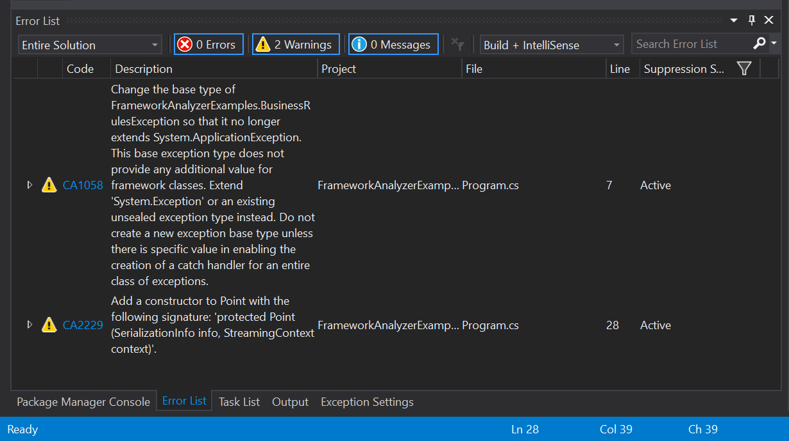

# The Roslyn based Analyzers

Roslyn-based analyzers use the .NET Compiler SDK (Roslyn APIs) to analyze your project's source code to find issues and suggest corrections. Different analyzers look for different classes of issues, ranging from practices that are likely to cause bugs to security concerns to API compatibility.

Roslyn-based analyzers work both interactively and during builds. The analyzer provides different guidance when in Visual Studio or in command-line builds.

While you edit code in Visual Studio, the analyzers run as you make changes, catching possible issues as soon as you create code that trigger concerns. Any issues are highlighted with squiggles under any issue. Visual Studio displays a light bulb, and when you click on it the analyzer will suggest possible fixes for that issue. When you build the project, either in Visual Studio or from the command line, all the source code is analyzed and the analyzer provides a full list of potential issues. The following figure shows one example.

Roslyn-based analyzers report potential issues as errors, warnings, or information based on the severity of the issue.

You install Roslyn-based analyzers as NuGet packages in your project. The configured analyzers and any settings for each analyzer are restored and run on any developer's machine for that project.

> [!NOTE]
> The user experience for Roslyn-based analyzers is different than that of the Code Analysis libraries like the older versions of FxCop and the security analysis tools.  You don't need to explicitly run the Roslyn-based analyzers. There's no need to use the "Run Code Analysis" menu items on the "Analyze" menu in Visual Studio. Roslyn-based analyzers run asychronously as you work. 

## More information on specific analyzers

The following analyzers are covered in this section:

[API Analyzer](api-analyzer.md): This analyzer examines your code for potential compatibility risks or uses of deprecated APIs.    
[Framework Analyzer](framework-analyzer.md): This analyzer examines your code to ensure it follows the guidelines for .NET Framework applications. These rules include several security-based recommendations.
