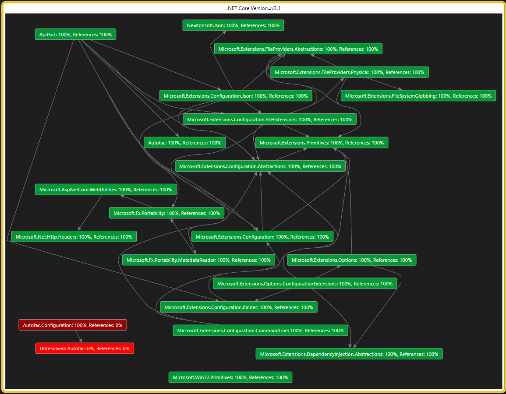
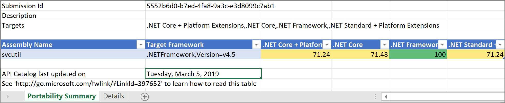
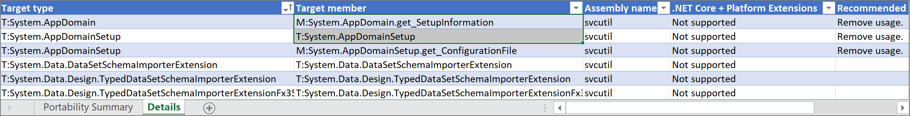
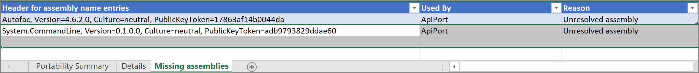

# The .NET Portability Analyzer

Want to make your libraries support multi-platform? Want to see how much work is required to make your .NET Framework application run on .NET Core? The [.NET Portability Analyzer](https://github.com/microsoft/dotnet-apiport) is a tool that analyzes assemblies and provides a detailed report on .NET APIs that are missing for the applications or libraries to be portable on your specified targeted .NET platforms. The Portability Analyzer is offered as a [Visual Studio Extension](https://marketplace.visualstudio.com/items?itemName=ConnieYau.NETPortabilityAnalyzer), which analyzes one assembly per project, and as an [ApiPort console app](https://aka.ms/apiportdownload), which analyzes assemblies by specified files or directory.

Once you've converted your project to target the new platform, like .NET Core, you can use the Roslyn-based [Platform compatibility analyzer](platform-compat-analyzer.md) to identify APIs that throw <xref:System.PlatformNotSupportedException> exceptions and other compatibility issues.

## Common targets

- [.NET Core](../../core/introduction.md): Has a modular design, supports side-by-side installation, and targets cross-platform scenarios. Side-by-side installation allows you to adopt new .NET Core versions without breaking other apps. If your goal is to port your app to .NET Core and support multiple platforms, this is the recommended target.
- .[NET Standard](../net-standard.md): Includes the .NET Standard APIs available on all .NET implementations. If your goal is to make your library run on all .NET supported platforms, this is recommended target.
- [ASP.NET Core](/aspnet/core): A modern web-framework built on .NET Core. If your goal is to port your web app to .NET Core to support multiple platforms, this is the recommended target.
- .NET Core + [Platform Extensions](../../core/porting/windows-compat-pack.md): Includes the .NET Core APIs in addition to the Windows Compatibility Pack, which provides many of the .NET Framework available technologies. This is a recommended target for porting your app from .NET Framework to .NET Core on Windows.
- .NET Standard + [Platform Extensions](../../core/porting/windows-compat-pack.md): Includes the .NET Standard APIs in addition to the Windows Compatibility Pack, which provides many of the .NET Framework available technologies. This is a recommended target for porting your library from .NET Framework to .NET Core on Windows.

## How to use the .NET Portability Analyzer

To begin using the .NET Portability Analyzer in Visual Studio, you first need to download and install the extension from the [Visual Studio Marketplace](https://marketplace.visualstudio.com/items?itemName=ConnieYau.NETPortabilityAnalyzer). It works on Visual Studio 2017 and later versions. Configure it in Visual Studio via **Analyze** > **Portability Analyzer Settings** and select your Target Platforms, which are the .NET platforms/versions that you want to evaluate the portability gaps comparing with the platform/version that your current assembly is built with.


You can also use the ApiPort console application, download it from [ApiPort repository](https://aka.ms/apiportdownload). You can use `listTargets` command option to display the available target list, then pick target platforms by specifying `-t` or `--target` command option.

### Solution wide view

A useful step in analyzing a solution with many projects would be to visualize the dependencies to understand which subset of assemblies depend on what. The general recommendation is to apply the results of the analysis in a bottom-up approach starting with the leaf nodes in a dependency graph.

To retrieve this, you may run the following command:

```console
ApiPort.exe analyze -r DGML -f [directory or file]
```

A result of this would look like the following when opened in Visual Studio:



### Analyze portability

To analyze your entire project in Visual Studio, right-click on your project in **Solution Explorer** and select **Analyze Assembly Portability**. Otherwise, go to the **Analyze** menu and select **Analyze Assembly Portability**. From there, select your project's executable or DLL.


You can also use the [ApiPort console app](https://aka.ms/apiportdownload).

Type the following command to analyze the current directory:

```console
ApiPort.exe analyze -f .
```

To analyze a specific list of .dll files, type the following command:

```console
ApiPort.exe analyze -f first.dll -f second.dll -f third.dll
```

To target a specific version, use the `-t` parameter:

```console
ApiPort.exe analyze -t ".NET, Version=5.0" -f .
```

Run `ApiPort.exe -?` to get more help.

It is recommended that you include all the related exe and dll files that you own and want to port, and exclude the files that your app depends on, but you don't own and can't port. This will give you most relevant portability report.

### View and interpret portability result

Only APIs that are unsupported by a Target Platform appear in the report.
After running the analysis in Visual Studio, you'll see your .NET Portability report file link pops up. If you used the [ApiPort console app](https://aka.ms/apiportdownload), your .NET Portability report is saved as a file in the format you specified. The default is in an Excel file (*.xlsx*) in your current directory.

#### Portability Summary



The Portability Summary section of the report shows the portability percentage for each assembly included in the run. In the previous example, 71.24% of the .NET Framework APIs used in the `svcutil` app are available in .NET Core + Platform Extensions. If you run the .NET Portability Analyzer tool against multiple assemblies, each assembly should have a row in the Portability Summary report.

#### Details



The **Details** section of the report lists the APIs missing from any of the selected **Targeted Platforms**.

- Target type: the type has missing API from a Target Platform
- Target member: the method is missing from a Target Platform
- Assembly name: the .NET Framework assembly that the missing
  API lives in.
- Each of the selected Target Platforms is one column, such as ".NET Core": "Not supported" value means the API is not
  supported on this Target Platform.
- Recommended Changes: the recommended API or technology to change to. Currently, this field is empty or out of date for many APIs. Due to the large number of APIs, we have a significant challenge to keep it up to date. We're looking at alternative solutions to provide helpful information to customers.

#### Missing Assemblies



You may find a Missing Assemblies section in your report. This section contains a list of assemblies that are referenced by your analyzed assemblies and were not analyzed. If it's an assembly that you own, include it in the API portability analyzer run so that you can get a detailed, API-level portability report for it. If it's a third-party library, check if there is a newer version that supports your target platform, and consider moving to the newer version. Eventually, the list should include all the third-party assemblies that your app depends on that have a version supporting your target platform.

For more information on the .NET Portability Analyzer, visit the [GitHub documentation](https://github.com/Microsoft/dotnet-apiport#documentation) and [A Brief Look at the .NET Portability Analyzer](https://channel9.msdn.com/Blogs/Seth-Juarez/A-Brief-Look-at-the-NET-Portability-Analyzer) Channel 9 video.
