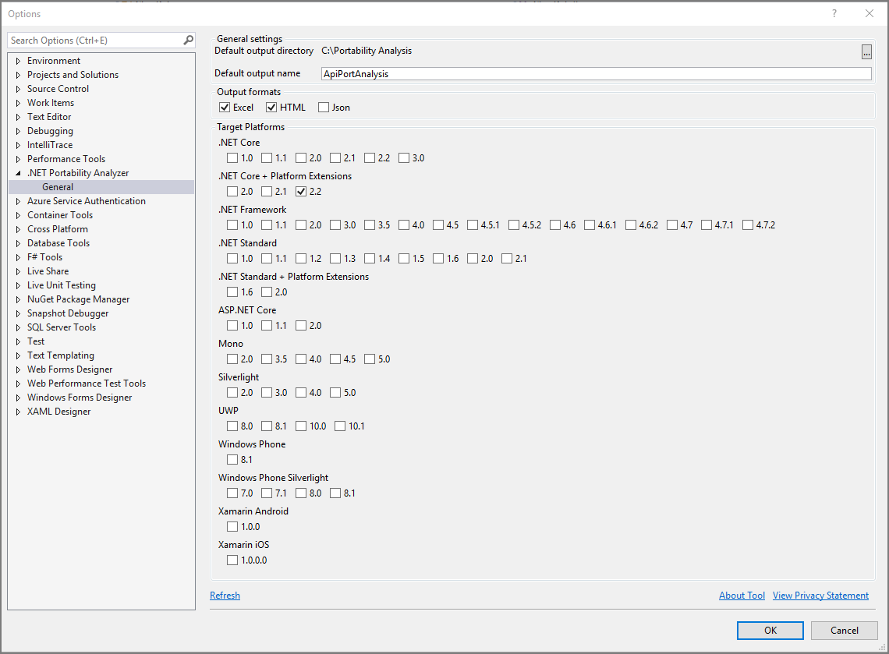
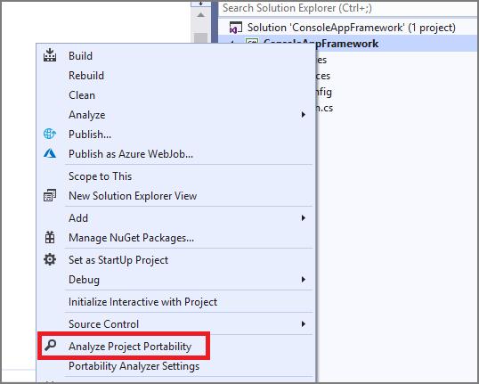
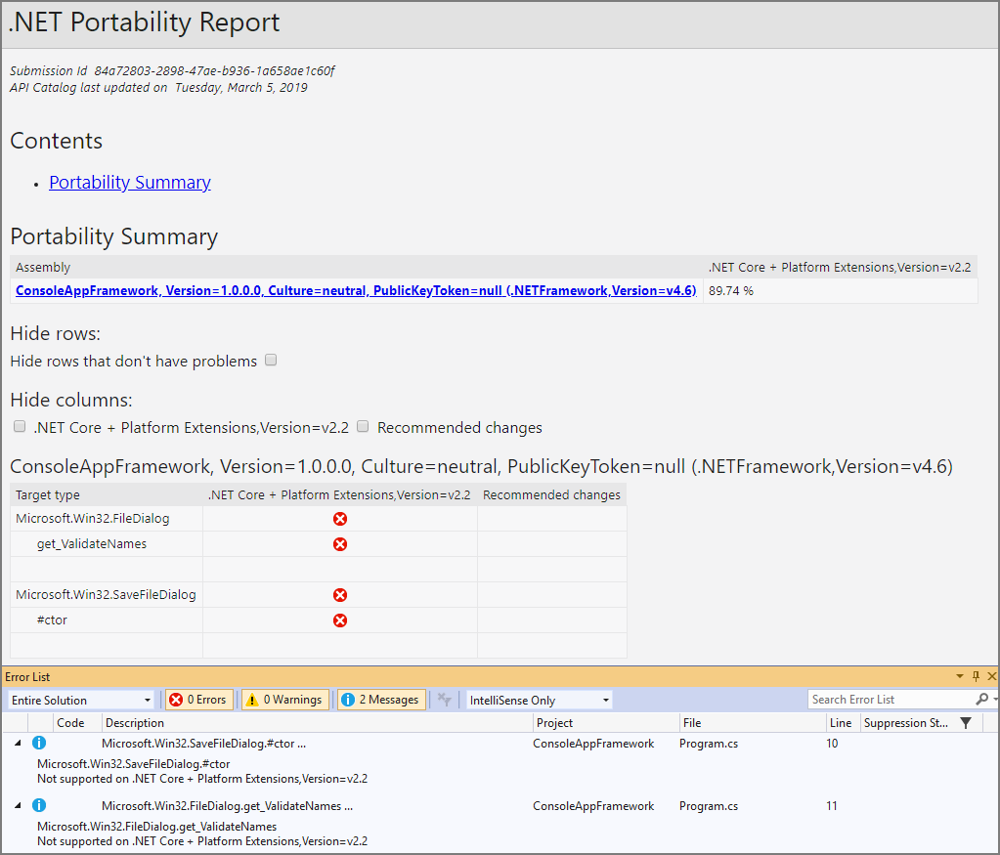

# The .NET Portability Analyzer

Want to make your libraries multi-platform? Want to see how much work is required to make your application compatible with other .NET implementations and profiles, including .NET Core, .NET Standard, UWP, and Xamarin for iOS, Android, and Mac? The [.NET Portability Analyzer](http://go.microsoft.com/fwlink/?LinkID=507467) is a tool that provides you with a detailed report on how flexible your program is across .NET implementations by analyzing assemblies. The Portability Analyzer is offered as a Visual Studio Extension and as a console app.

## New targets

* [.NET Core](../../core/index.md): Has a modular design, employs side-by-side, and targets cross-platform scenarios. Side-by-side allows you to adopt new .NET Core versions without breaking other apps.
* [ASP.NET Core](/aspnet/core): is a modern web-framework built on .NET Core thus giving developers the same benefits.
* [Universal Windows Platform](https://blogs.msdn.microsoft.com/dotnet/2014/04/24/net-native-performance): Improve performance of your Windows Store apps that run on x64 and ARM machines by using .NET Native’s static compilation. 
* .NET Core + Platform Extensions: Includes the .NET Core APIs in addition to other APIs in the .NET ecosystem such as WCF, ASP.NET Core, FSharp, and Azure.
* .NET Standard + Platform Extensions: Includes the .NET Standard APIs in addition to other .NET ecosystem such as WCF, ASP.NET Core, FSharp, and Azure.

## How to use Portability Analyzer

To begin using the .NET Portability Analyzer, you first need to download and install the extension from the [Visual Studio Gallery](http://go.microsoft.com/fwlink/?LinkID=507467). It works on Visual Studio 2015 and Visual Studio 2017. You can configure it in Visual Studio via **Analyze** > **Portability Analyzer Settings** and select your Target Platforms.

To analyze your entire project, right-click on your project in **Solution Explorer** and select **Analyze Assembly Portability**. Otherwise, go to the **Analyze** menu and select **Analyze Assembly Portability**. From there, select your project’s executable or DLL.

After running the analysis, you will see your .NET Portability Report. Only types that are unsupported by a target platform appear in the list and you can review recommendations in the **Messages** tab in the **Error List**. You can also jump to problem areas directly from the **Messages** tab.

Don’t want to use Visual Studio? You can also use the Portability Analyzer from the command prompt. Just download the [API Portability Analyzer](http://www.microsoft.com/download/details.aspx?id=42678).

*   Type the following command to analyze the current directory: `\...\ApiPort.exe analyze -f .`
*   To analyze a specific list of .dll files, type the following command: `\...\ApiPort.exe analyze -f first.dll -f second.dll -f third.dll`

Your .NET Portability Report is saved as an Excel file (*.xlsx*) in your current directory. The **Details** tab in the Excel Workbook contains more information.

For more information on the .NET Portability Analyzer, visit the [GitHub documentation](https://github.com/Microsoft/dotnet-apiport#documentation) and [A Brief Look at the .NET Portability Analyzer](https://channel9.msdn.com/Blogs/Seth-Juarez/A-Brief-Look-at-the-NET-Portability-Analyzer) Channel 9 video.
