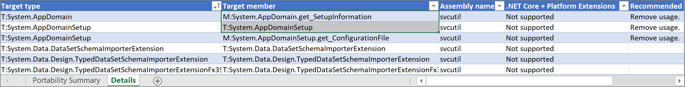
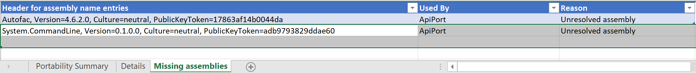

# The .NET Portability Analyzer

Want to make your libraries support multi-platform? Want to see how much work is required to make your .NET Framework application to run on .NET Core?  The [.NET Portability Analyzer](https://github.com/microsoft/dotnet-apiport) is a tool that provides you with a detailed report  on missing .NET APIs for your applications or libraries to be portable on your specified targeted .NET platforms by analyzing the assemblies. The Portability Analyzer is offered as a [Visual Studio Extension](https://marketplace.visualstudio.com/items?itemName=ConnieYau.NETPortabilityAnalyzer), which analyzes assembly per project, and as a [ApiPort console app](https://aka.ms/apiportdownload), which analyzes assemblies by specified files or directory.

Once your converted your project to target your targeted platform, like .NET Core, you may use Roslyn based [API Analyzer tool]([https://docs.microsoft.com/en-us/dotnet/standard/analyzers/api-analyzer](api-analyzer.md) to identify APIs throwing PlatformNotSupportedException and some other compatibility issues.

## Common targets

- [.NET Core](../../core/index.md): Has a modular design, employs side-by-side, and targets cross-platform scenarios. Side-by-side allows you to adopt new .NET Core versions without breaking other apps. If your goal is to port your app to .NET Core supporting cross-platforms, this is the recommended target. 
- .[NET Standard](../../standard/net-standard.md): Includes the .NET Standard APIs available on all .NET implementations. If your goal is to make your library to run on all .NET supported platforms, this is recommended target.  
- [ASP.NET Core](/aspnet/core): A modern web-framework built on .NET Core. If your goal is to port your web app to .NET Core to support multiple platforms, this is the recommended target.
- .NET Core + [Platform Extensions](../../core/porting/windows-compat-pack.md): Includes the .NET Core APIs in addition to the Windows Compatibility Pack, which provides many of the .NET Framework available technologies. This is a recommended target for porting your app from .NET Framework to .NET Core on Windows.
- .NET Standard + [Platform Extensions](../../core/porting/windows-compat-pack.md): Includes the .NET Standard APIs in addition to the Windows Compatibility Pack, which provides many of the .NET Framework available technologies. This is a recommended target for porting your library from .NET Framework to .NET Core on Windows.

## How to use the .NET Portability Analyzer

To begin using the .NET Portability Analyzer in Visual Studio, you first need to download and install the extension from the [Visual Studio Marketplace](https://marketplace.visualstudio.com/items?itemName=ConnieYau.NETPortabilityAnalyzer). It works on Visual Studio 2017 and later versions. You can configure it in Visual Studio via **Analyze** > **Portability Analyzer Settings** and select your Target Platforms, which is the .NET platforms/versions that you want to evaluate the portability gaps comparing with the platform/version that your current assembly is built with.

You can also use the ApiPort console application, download it from [ApiPort repository](https://aka.ms/apiportdownload). You can use `listTargets` command option to display the available target list, then pick target platforms by specifying `-t` or `--target` command option. 

### Analyze portability
To analyze your entire project in Visual Studio, right-click on your project in **Solution Explorer** and select **Analyze Assembly Portability**. Otherwise, go to the **Analyze** menu and select **Analyze Assembly Portability**. From there, select your project’s executable or DLL.

You can also use the [ApiPort console app](https://aka.ms/apiportdownload). 

- Type the following command to analyze the current directory: `ApiPort.exe analyze -f .`
- To analyze a specific list of .dll files, type the following command: `ApiPort.exe analyze -f first.dll -f second.dll -f third.dll`
- Run `ApiPort.exe -?` to get more help

It is recommended that you include all the related exe and dll files that you own and want to port, and exclude the files that your app depends on, but you don't own and can't port. This will give you most relevant portability report.  

### View and interpret portability result

Only APIs that are unsupported by a Target Platform appear in the report. 
After running the analysis in Visual Studio, you'll see your .NET Portability report file link pops up. If you used the [ApiPort console app](https://aka.ms/apiportdownload), your .NET Portability report is saved as a file in the format you specified. The default is in an Excel file (*.xlsx*) in your current directory.

#### Portability Summary 

The Portability Summary section of the report shows the portability percentage for each assembly included in the run. In the previous example, 71.24% of the .NET Framework APIs used in the `svcutil` app are available in .NET Core + Platform Extensions. If you run the .NET Portability Analyzer tool against multiple assemblies, each assembly should have a row in the Portability Summary report.

#### Details

The Details section of the report lists the APIs missing from any of the selected Targeted Platforms. 

- Target type: the type has missing API from a Target Platform 
- Target member: the method is missing from a Target Platform 
- Assembly name: the .NET Framework assembly that the missing
  API lives in. 
- Each of the selected Target Platforms is one column, such as ".NET Core": "Not supported" value means the API is not
  supported on this Target Platform. 
- Recommended Changes: recommended API or technology to change to. Currently, this field is empty or out of date for a lot of APIs. Due to the large number of APIs, we have big challenge to keep it up. We are looking at alternate solutions to provide helpful information to customers.

#### Missing Assemblies

You may find a Missing Assemblies section in your report. It tells you that this list of assemblies are referenced by your analyzed assemblies and were not analyzed. If it's an assembly that you own, include it in the Api portability analyzer run so that you can get API level detailed portability report for it. If it's third party library, looks for if they have newer version supporting your target platform. If so, consider moving to the newer version. Eventually, you would expect this list includes all the third party assemblies that your app depends on and confirmed that they have a version supporting your target platform.  

For more information on the .NET Portability Analyzer, visit the [GitHub documentation](https://github.com/Microsoft/dotnet-apiport#documentation) and [A Brief Look at the .NET Portability Analyzer](https://channel9.msdn.com/Blogs/Seth-Juarez/A-Brief-Look-at-the-NET-Portability-Analyzer) Channel 9 video.
