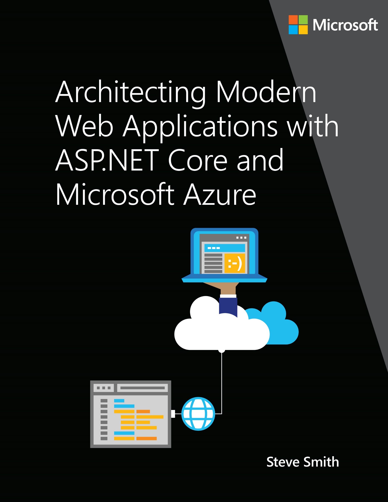

PUBLISHED BY

DevDiv, .NET and Visual Studio product teams

A division of Microsoft Corporation

One Microsoft Way

Redmond, Washington 98052-6399

Copyright © 2017 by Microsoft Corporation

All rights reserved. No part of the contents of this book may be reproduced or transmitted in any form or by any means without the written permission of the publisher.

This book is provided "as-is" and expresses the author's views and opinions. The views, opinions and information expressed in this book, including URL and other Internet website references, may change without notice.

Some examples depicted herein are provided for illustration only and are fictitious. No real association or connection is intended or should be inferred.

Microsoft and the trademarks listed at http://www.microsoft.com on the "Trademarks" webpage are trademarks of the Microsoft group of companies. All other marks are property of their respective owners.

Author:

Steve Smith

Participants and reviewers:

Cesar de la Torre, Sr. Program Manager, .NET product team, Microsoft

>[!div class="step-by-step"]
[Next] (../introduction/index.md)
