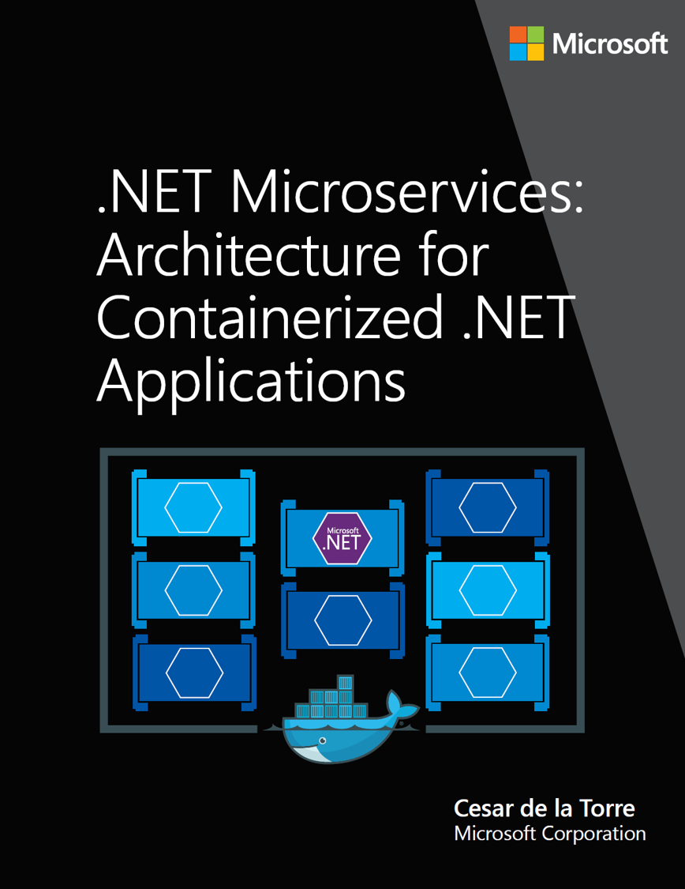

# EDITION v1.0

DOWNLOAD available at: <https://aka.ms/microservicesebook>

PUBLISHED BY

Microsoft Developer Division, .NET and Visual Studio product teams

A division of Microsoft Corporation

One Microsoft Way

Redmond, Washington 98052-6399

Copyright © 2017 by Microsoft Corporation

All rights reserved. No part of the contents of this book may be reproduced or transmitted in any form or by any means without the written permission of the publisher.

This book is provided “as-is” and expresses the author’s views and opinions. The views, opinions and information expressed in this book, including URL and other Internet website references, may change without notice.

Some examples depicted herein are provided for illustration only and are fictitious. No real association or connection is intended or should be inferred.

Microsoft and the trademarks listed at http://www.microsoft.com on the “Trademarks” webpage are trademarks of the Microsoft group of companies.

Mac and macOS are trademarks of Apple Inc.

The Docker whale logo is a registered trademark of Docker, Inc. Used by permission.

All other marks and logos are property of their respective owners.

Co-Authors:

> **Cesar de la Torre**, Sr. PM, .NET product team, Microsoft Corp.
>
> **Bill Wagner**, Sr. Content Developer, C+E, Microsoft Corp.
>
> **Mike Rousos**, Principal Software Engineer, DevDiv CAT team, Microsoft

Editors:

> **Mike Pope**
>
> **Steve Hoag**

Participants and reviewers:

> **Jeffrey Ritcher**, Partner Software Eng, Azure team, Microsoft
>
> **Jimmy Bogard**, Chief Architect at Headspring
>
> **Udi Dahan**, Founder & CEO, Particular Software
>
> **Jimmy Nilsson**, Co-founder and CEO of Factor10
>
> **Glenn Condron**, Sr. Program Manager, ASP.NET team
>
> **Mark Fussell**, Principal PM Lead, Azure Service Fabric team, Microsoft
>
> **Diego Vega**, PM Lead, Entity Framework team, Microsoft
>
> **Barry Dorrans**, Sr. Security Program Manager
>
> **Rowan Miller**, Sr. Program Manager, Microsoft
>
> **Ankit Asthana**, Principal PM Manager, .NET team, Microsoft
>
> **Scott Hunter**, Partner Director PM, .NET team, Microsoft
>
> **Dylan Reisenberger**, Architect and Dev Lead at Polly
>
> **Steve Smith**, Software Craftsman & Trainer at ASPSmith Ltd.
>
> **Ian Cooper**, Coding Architect at Brighter
>
> **Unai Zorrilla**, Architect and Dev Lead at Plain Concepts
>
> **Eduard Tomas**, Dev Lead at Plain Concepts
>
> **Ramon Tomas**, Developer at Plain Concepts
>
> **David Sanz**, Developer at Plain Concepts
>
> **Javier Valero**, Chief Operating Officer at Grupo Solutio
>
> **Pierre Millet**, Sr. Consultant, Microsoft
>
> **Michael Friis**, Product Manager, Docker Inc
>
> **Charles Lowell**, Software Engineer, VS CAT team, Microsoft

>[!div class="step-by-step"]
[Next] (../introduction/index.md)
