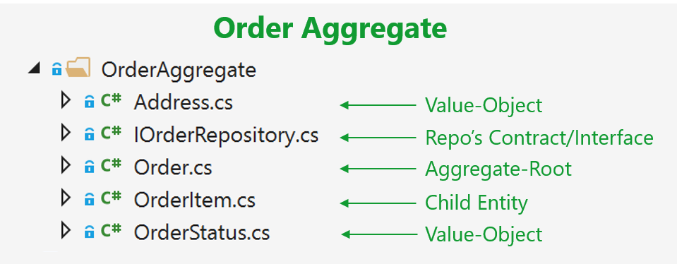

# Implementing a microservice domain model with .NET Core 

In the previous section, the fundamental design principles and patterns for designing a domain model were explained. Now it is time to explore possible ways to implement the domain model by using .NET Core (plain C\# code) and EF Core. Note that your domain model will be composed simply of your code. It will have just the EF Core model requirements, but not real dependencies on EF. You should not have hard dependencies or references to EF Core or any other ORM in your domain model.

## Domain model structure in a custom .NET Standard Library

The folder organization used for the eShopOnContainers reference application demonstrates the DDD model for the application. You might find that a different folder organization more clearly communicates the design choices made for your application. As you can see in Figure 9-10, in the ordering domain model there are two aggregates, the order aggregate and the buyer aggregate. Each aggregate is a group of domain entities and value objects, although you could have an aggregate composed of a single domain entity (the aggregate root or root entity) as well.

**Figure 9-10**. Domain model structure for the ordering microservice in eShopOnContainers

Additionally, the domain model layer includes the repository contracts (interfaces) that are the infrastructure requirements of your domain model. In other words, these interfaces express what repositories the infrastructure layer must implement and how. It is critical that the implementation of the repositories be placed outside of the domain model layer, in the infrastructure layer library, so the domain model layer is not “contaminated” by API or classes from infrastructure technologies, like Entity Framework.

You can also see a [SeedWork](https://martinfowler.com/bliki/Seedwork.html) folder that contains custom base classes that you can use as a base for your domain entities and value objects, so you do not have redundant code in each domain’s object class.

## Structuring aggregates in a custom .NET Standard Library

An aggregate refers to a cluster of domain objects grouped together to match transactional consistency. Those objects could be instances of entities (one of which is the aggregate root or root entity) plus any additional value objects.

Transactional consistency means that an aggregate is guaranteed to be consistent and up to date at the end of a business action. For example, the order aggregate from the eShopOnContainers ordering microservice domain model is composed as shown in Figure 9-11.

**Figure 9-11**. The order aggregate in Visual Studio solution

If you open any of the files in an aggregate folder, you can see how it is marked as either a custom base class or interface, like entity or value object, as implemented in the [Seedwork](https://github.com/dotnet-architecture/eShopOnContainers/tree/master/src/Services/Ordering/Ordering.Domain/SeedWork) folder.

## Implementing domain entities as POCO classes

You implement a domain model in .NET by creating POCO classes that implement your domain entities. In the following example, the Order class is defined as an entity and also as an aggregate root. Because the Order class derives from the Entity base class, it can reuse common code related to entities. Bear in mind that these base classes and interfaces are defined by you in the domain model project, so it is your code, not infrastructure code from an ORM like EF.

  ------------------------------------------------------------------------------
  // COMPATIBLE WITH ENTITY FRAMEWORK CORE 1.0
  
  // Entity is a custom base class with the ID
  
  public class **Order** : **Entity, IAggregateRoot**
  
  {
  
  public int BuyerId { get; **private set**; }
  
  public DateTime OrderDate { get; **private set**; }
  
  public int StatusId { get; **private set**; }
  
  public ICollection&lt;OrderItem&gt; OrderItems { get; **private set**; }
  
  public Address ShippingAddress { get; **private set**; }
  
  public int PaymentId { get; **private set**; }
  
  **protected Order()** { } //Design constraint needed only by EF Core
  
  public **Order(int buyerId, int paymentId)**
  
  {
  
  BuyerId = buyerId;
  
  PaymentId = paymentId;
  
  StatusId = OrderStatus.InProcess.Id;
  
  OrderDate = DateTime.UtcNow;
  
  OrderItems = new List&lt;OrderItem&gt;();
  
  }
  
  public void **AddOrderItem**(productName,
  
  pictureUrl,
  
  unitPrice,
  
  discount,
  
  units)
  
  {
  
  //...
  
  // Domain rules/logic for adding the OrderItem to the order
  
  // ...
  
  OrderItem item = new OrderItem(**this.Id**, ProductId, ProductName,
  
  PictureUrl, UnitPrice, Discount, Units);
  
  OrderItems.Add(item);
  
  }
  
  // ...
  
  // Additional methods with domain rules/logic related to the Order aggregate
  
  // ...
  ------------------------------------------------------------------------------

It is important to note that this is a domain entity implemented as a POCO class. It does not have any direct dependency on Entity Framework Core or any other infrastructure framework. This implementation is as it should be, just C\# code implementing a domain model.

In addition, the class is decorated with an interface named IAggregateRoot. That interface is an empty interface, sometimes called a *marker interface*, that is used just to indicate that this entity class is also an aggregate root.

A marker interface is sometimes considered as an anti-pattern; however, it is also a clean way to mark a class, especially when that interface might be evolving. An attribute could be the other choice for the marker, but it is quicker to see the base class (Entity) next to the IAggregate interface instead of putting an Aggregate attribute marker above the class. It is a metter of preferences, in any case.

Having an aggregate root means that most of the code related to consistency and business rules of the aggregate’s entities should be implemented as methods in the Order aggregate root class (for example, AddOrderItem when adding an OrderItem object to the aggregate). You should not create or update OrderItems objects independently or directly; the AggregateRoot class must keep control and consistency of any update operation against its child entities.

For example, you should *not* do the following from any command handler method or application layer class:

  -------------------------------------------------------------------------------------------------------------
  // WRONG ACCORDING TO DDD PATTERNS – CODE AT THE APPLICATION LAYER OR
  
  // COMMAND HANDLERS
  
  // Code in command handler methods or Web API controllers
  
  //... (WRONG) Some code with business logic out of the domain classes ...
  
  OrderItem myNewOrderItem = new OrderItem(orderId, productId, productName,
  
  pictureUrl, unitPrice, discount, units);
  
  //... (WRONG) Accessing the OrderItems colletion directly from the application layer // or command handlers
  
  myOrder.**OrderItems.Add**(myNewOrderItem);
  
  //...
  -------------------------------------------------------------------------------------------------------------

In this case, the Add method is purely an operation to add data, with direct access to the OrderItems collection. Therefore, most of the domain logic, rules, or validations related to that operation with the child entities will be spread across the application layer (command handlers and Web API controllers).

If you go around the aggregate root, the aggregate root cannot guarantee its invariants, its validity, or its consistency. Eventually you will have spaghetti code or transactional script code.

To follow DDD patterns, entities must not have public setters in any entity property. Changes in an entity should be driven by explicit methods with explicit ubiquitous language about the change they are performing in the entity.

Furthermore, collections within the entity (like the order items) should be read-only properties (the AsReadOnly method explained later). You should be able to update it only from within the aggregate root class methods or the child entity methods.

As you can see in the code for the Order aggregate root, all setters should be private or at least read-only externally, so that any operation against the entity’s data or its child entities has to be performed through methods in the entity class. This maintains consistency in a controlled and object-oriented way instead of implementing transactional script code.

The following code snippet shows the proper way to code the task of adding an OrderItem object to the Order aggregate.

  -----------------------------------------------------------------------------------------------
  // RIGHT ACCORDING TO DDD--CODE AT THE APPLICATION LAYER OR COMMAND HANDLERS
  
  // The code in command handlers or WebAPI controllers, related only to application stuff
  
  // There is NO code here related to OrderItem object’s business logic
  
  **myOrder.AddOrderItem(**productId, productName, pictureUrl, unitPrice, discount, units**);**
  
  // The code related to OrderItem params validations or domain rules should
  
  // be WITHIN the AddOrderItem method.
  
  //...
  -----------------------------------------------------------------------------------------------

In this snippet, most of the validations or logic related to the creation of an OrderItem object will be under the control of the Order aggregate root—in the AddOrderItem method—especially validations and logic related to other elements in the aggregate. For instance, you might get the same product item as the result of multiple calls to AddOrderItem. In that method, you could examine the product items and consolidate the same product items into a single OrderItem object with several units. Additionally, if there are different discount amounts but the product ID is the same, you would likely apply the higher discount. This principle applies to any other domain logic for the OrderItem object.

In addition, the new OrderItem(params) operation will also be controlled and performed by the AddOrderItem method from the Order aggregate root. Therefore, most of the logic or validations related to that operation (especially anything that impacts the consistency between other child entities) will be in a single place within the aggregate root. That is the ultimate purpose of the aggregate root pattern.

When you use Entity Framework 1.1, a DDD entity can be better expressed because one of the new features of Entity Framework Core 1.1 is that it allows [mapping to fields](https://docs.microsoft.com/en-us/ef/core/modeling/backing-field) in addition to properties. This is useful when protecting collections of child entities or value objects. With this enhancement, you can use simple private fields instead of properties and you can implement any update to the field collection in public methods and provide read-only access through the AsReadOnly method.

In DDD you want to update the entity only through methods in the entity (or the constructor) in order to control any invariant and the consistency of the data, so properties are defined only with a get accessor. The properties are backed by private fields. Private members can only be accessed from within the class. However, there one exception: EF Core needs to set these fields as well.

  ---------------------------------------------------------------------------------
  // ENTITY FRAMEWORK CORE 1.1 OR LATER
  
  // Entity is a custom base class with the ID
  
  public class **Order : Entity, IAggregateRoot**
  
  {
  
  // DDD Patterns comment
  
  // Using private fields, allowed since EF Core 1.1, is a much better
  
  // encapsulation aligned with DDD aggregates and domain entities (instead of
  
  // properties and property collections)
  
  private bool **\_someOrderInternalState**;
  
  private DateTime \_orderDate;
  
  public Address Address { get; private set; }
  
  public Buyer Buyer { get; private set; }
  
  private int \_buyerId;
  
  public OrderStatus OrderStatus { get; private set; }
  
  private int \_orderStatusId;
  
  // DDD patterns comment
  
  // Using a private collection field is better for DDD aggregate encapsulation.
  
  // OrderItem objects cannot be added from outside the aggregate root
  
  // directly to the collection, but only through the
  
  // OrderAggrergateRoot.AddOrderItem method, which includes behavior.
  
  private readonly List&lt;OrderItem&gt; \_orderItems;
  
  public IEnumerable&lt;OrderItem&gt; OrderItems =&gt; \_orderItems.AsReadOnly();
  
  // Using List&lt;&gt;.AsReadOnly()
  
  // This will create a read-only wrapper around the private list so it is
  
  // protected against external updates. It's much cheaper than .ToList(),
  
  // because it will not have to copy all items in a new collection.
  
  // (Just one heap alloc for the wrapper instance)
  
  // https://msdn.microsoft.com/en-us/library/e78dcd75(v=vs.110).aspx
  
  public PaymentMethod PaymentMethod { get; private set; }
  
  private int \_paymentMethodId;
  
  protected **Order()** { }
  
  public **Order(int buyerId, int paymentMethodId, Address address)**
  
  {
  
  \_orderItems = new List&lt;OrderItem&gt;();
  
  \_buyerId = buyerId;
  
  \_paymentMethodId = paymentMethodId;
  
  \_orderStatusId = OrderStatus.InProcess.Id;
  
  \_orderDate = DateTime.UtcNow;
  
  Address = address;
  
  }
  
  // DDD patterns comment
  
  // The Order aggregate root method AddOrderitem() should be the only way
  
  // to add items to the Order object, so that any behavior (discounts, etc.)
  
  // and validations are controlled by the aggregate root in order to
  
  // maintain consistency within the whole aggregate.
  
  public void AddOrderItem(int productId, string productName, decimal unitPrice,
  
  decimal discount, string pictureUrl, int units = 1)
  
  {
  
  // ...
  
  // Domain rules/logic here for adding OrderItem objects to the order
  
  // ...
  
  OrderItem item = new OrderItem(this.Id, productId, productName,
  
  pictureUrl, unitPrice, discount, units);
  
  OrderItems.Add(item);
  
  }
  
  // ...
  
  // Additional methods with domain rules/logic related to the Order aggregate
  
  // ...
  
  }
  ---------------------------------------------------------------------------------

#### Mapping properties with only get accessors to the fields in the database table

Mapping properties to the database table columns is not a domain responsibility, but part of the infrastructure and persistence layer. We mention this here just so you are aware of the new capabilities in EF 1.1 related to how you can model entities. Additional details on this topic are explained in the infrastructure and persistence section.

When you use EF 1.0, within the DbContext you need to map the properties that are defined only with getters to the actual fields in the database table. This is done with the HasField method of the PropertyBuilder class.

#### Mapping fields without properties

With the new feature in EF Core 1.1 to map columns to fields, it is also possible to not use properties. Instead, you can just map columns from a table to fields. A common use case for this is private fields for an internal state that does not need to be accessed from outside the entity.

For example, in the preceding code example, the \_someOrderInternalState field has no related property for either a setter or getter. That field will also be calculated within the order’s business logic and used from the order’s methods, but it needs to be persisted in the database as well. So, in EF 1.1 there is a way to map a field without a related property to a column in the database. This is also explained in the [Infrastructure layer](#the-infrastructure-layer) section of this guide.

#### Additional resources

-   **Vaughn Vernon. Modeling Aggregates with DDD and Entity Framework.** Note that this is *not* Entity Framework Core.\
    *<https://vaughnvernon.co/?p=879> *

-   **Julie Lerman. Coding for Domain-Driven Design: Tips for Data-Focused Devs\
    **[*https://msdn.microsoft.com/en-us/magazine/dn342868.aspx*](https://msdn.microsoft.com/en-us/magazine/dn342868.aspx)

-   **Udi Dahan. How to create fully encapsulated Domain Models\
    **[*http://udidahan.com/2008/02/29/how-to-create-fully-encapsulated-domain-models/*](http://udidahan.com/2008/02/29/how-to-create-fully-encapsulated-domain-models/)

## Seedwork (reusable base classes and interfaces for your domain model)

As mentioned, in the solution folder you can also see a SeedWork folder. This folder contains custom base classes that you can use as a base for your domain entities and value objects, so you do not have redundant code in each domain’s object class. The folder for these types of classes is called SeedWork and not something like Framework, because the folder contains just a small subset of reusable classes which cannot really considered a framework. *Seedwork* is a term [introduced](http://www.artima.com/forums/flat.jsp?forum=106&thread=8826) by Michael Feathers and popularized by [Martin Fowler](https://martinfowler.com/bliki/Seedwork.html) but you could also name that folder Common, SharedKernel, or similar.

Figure 9-12 shows the classes that form the seedwork of the domain model in the ordering microservice. It has a few custom base classes like Entity, ValueObject, and Enumeration, plus a few interfaces. These interfaces (IRepository and IUnitOfWork) inform the infrastructure layer about what needs to be implemented. Those interfaces are also used through Dependency Injection from the application layer.

**Figure 9-12**. A sample set of domain model “seedwork" base classes and interfaces

This is the type of copy and paste reuse that many developers share between projects, not a formal framework. You can have seedworks in any layer or library. However, if the set of classes and interfaces gets big enough, you might want to create a single class library.

#### The custom Entity base class

The following code is an example of an Entity base class where you can place code that can be used the same way by any domain entity, such as the entity ID, [equality operators](https://msdn.microsoft.com/en-us/library/c35t2ffz.aspx), etc.

  -----------------------------------------------------------------------
  // ENTITY FRAMEWORK CORE 1.1
  
  public abstract class Entity
  
  {
  
  int? \_requestedHashCode;
  
  int \_Id;
  
  public virtual int Id
  
  {
  
  get
  
  {
  
  return \_Id;
  
  }
  
  protected set
  
  {
  
  \_Id = value;
  
  }
  
  }
  
  public bool IsTransient()
  
  {
  
  return this.Id == default(Int32);
  
  }
  
  public override bool Equals(object obj)
  
  {
  
  if (obj == null || !(obj is Entity))
  
  return false;
  
  if (Object.ReferenceEquals(this, obj))
  
  return true;
  
  if (this.GetType() != obj.GetType())
  
  return false;
  
  Entity item = (Entity)obj;
  
  if (item.IsTransient() || this.IsTransient())
  
  return false;
  
  else
  
  return item.Id == this.Id;
  
  }
  
  public override int GetHashCode()
  
  {
  
  if (!IsTransient())
  
  {
  
  if (!\_requestedHashCode.HasValue)
  
  \_requestedHashCode = this.Id.GetHashCode() \^ 31;
  
  // XOR for random distribution. See:
  
  // http://blogs.msdn.com/b/ericlippert/archive/2011/02/28/guidelines-
  
  // and-rules-for-gethashcode.aspx
  
  return \_requestedHashCode.Value;
  
  }
  
  else
  
  return base.GetHashCode();
  
  }
  
  public static bool operator ==(Entity left, Entity right)
  
  {
  
  if (Object.Equals(left, null))
  
  return (Object.Equals(right, null)) ? true : false;
  
  else
  
  return left.Equals(right);
  
  }
  
  public static bool operator !=(Entity left, Entity right)
  
  {
  
  return !(left == right);
  
  }
  
  }
  
  }
  -----------------------------------------------------------------------

## Repository contracts (interfaces) in the domain model layer

Repository contracts are simply .NET interfaces that express the contract requirements of the repositories to be used for each aggregate. The repositories themselves, with EF Core code or any other infrastructure dependencies and code, must not be implemented within the domain model; the repositories should only implement the interfaces you define.

A pattern related to this practice (placing the repository interfaces in the domain model layer) is the Separated Interface pattern. As [explained](http://www.martinfowler.com/eaaCatalog/separatedInterface.html) by Martin Fowler, “Use Separated Interface to define an interface in one package but implement it in another. This way a client that needs the dependency to the interface can be completely unaware of the implementation.”

Following the Separated Interface pattern enables the application layer (in this case, the Web API project for the microservice) to have a dependency on the requirements defined in the domain model, but not a direct dependency to the infrastructure/persistence layer. In addition, you can use Dependency Injection to isolate the implementation, which is implemented in the infrastructure/ persistence layer using repositories.

For example, the following example with the IOrderRepository interface defines what operations the OrderRepository class will need to implement at the infrastructure layer. In the current implementation of the application, the code just needs to add the order to the database, since queries are split following the CQS approach, and updates to orders are not implemented.

  ----------------------------------------------------------------
  public interface IOrderRepository : IRepository&lt;Order&gt;
  
  {
  
  Order Add(Order order);
  
  }
  
  public interface IRepository&lt;T&gt; where T : IAggregateRoot
  
  {
  
  IUnitOfWork UnitOfWork { get; }
  
  }
  ----------------------------------------------------------------

#### Additional resources

-   **Martin Fowler. Separated Interface.\
    **[*http://www.martinfowler.com/eaaCatalog/separatedInterface.html*](http://www.martinfowler.com/eaaCatalog/separatedInterface.html%20)

## Implementing value objects

As discussed in earlier sections about entities and aggregates, identity is fundamental for entities. However, there are many objects and data items in a system that do not require an identity and identity tracking, such as value objects.

A value object can reference other entities. For example, in an application that generates a route that describes how to get from one point to another, that route would be a value object. It would be a snapshot of points on a specific route, but this suggested route would not have an identity, even though internally it might refer to entities like City, Road, etc.

Figure 9-13 shows the Address value object within the Order aggregate.

**Figure 9-13**. Address value object within the Order aggregate

As shown in Figure 9-13, an entity is usually composed of multiple attributes. For example, Order can be modeled as an entity with an identity and composed internally of a set of attributes such as OrderId, OrderDate, OrderItems, etc. But the address, which is simply a complex value composed of country, street, city, etc. must be modeled and treated as a value object.

### Important characteristics of value objects

There are two main characteristics for value objects:

-   They have no identity.

-   They are immutable.

The first characteristic was already discussed. Immutability is an important requirement. The values of a value object must be immutable once the object is created. Therefore, when the object is constructed, you must provide the required values, but you must not allow them to change during the object’s lifetime.

Value objects allow you to perform certain tricks for performance, thanks to their immutable nature. This is especially true in systems where there may be thousands of value object instances, many of which have the same values. Their immutable nature allows them to be reused; they can be interchangeable objects, since their values are the same and they have no identity. This type of optimization can sometimes make a difference between software that runs slowly and software with good performance. Of course, all these cases depend on the application environment and deployment context.

### Value object implementation in C\#

In terms of implementation, you can have a value object base class that has basic utility methods like equality based on comparison between all the attributes (since a value object must not be based on identity) and other fundamental characteristics. The following example shows a value object base class used in the ordering microservice from eShopOnContainers.

  ----------------------------------------------------------------------------------
  **public abstract class ValueObject**
  
  {
  
  protected static bool EqualOperator(ValueObject left, ValueObject right)
  
  {
  
  if (ReferenceEquals(left, null) \^ ReferenceEquals(right, null))
  
  {
  
  return false;
  
  }
  
  return ReferenceEquals(left, null) || left.Equals(right);
  
  }
  
  protected static bool NotEqualOperator(ValueObject left, ValueObject right)
  
  {
  
  return !(EqualOperator(left, right));
  
  }
  
  protected abstract IEnumerable&lt;object&gt; GetAtomicValues();
  
  public override bool Equals(object obj)
  
  {
  
  if (obj == null || obj.GetType() != GetType())
  
  {
  
  return false;
  
  }
  
  ValueObject other = (ValueObject)obj;
  
  IEnumerator&lt;object&gt; thisValues = GetAtomicValues().GetEnumerator();
  
  IEnumerator&lt;object&gt; otherValues = other.GetAtomicValues().GetEnumerator();
  
  while (thisValues.MoveNext() && otherValues.MoveNext())
  
  {
  
  if (ReferenceEquals(thisValues.Current, null) \^
  
  ReferenceEquals(otherValues.Current, null))
  
  {
  
  return false;
  
  }
  
  if (thisValues.Current != null &&
  
  !thisValues.Current.Equals(otherValues.Current))
  
  {
  
  return false;
  
  }
  
  }
  
  return !thisValues.MoveNext() && !otherValues.MoveNext();
  
  }
  
  // Other utilility methods
  
  }
  ----------------------------------------------------------------------------------

You can use this class when implementing your actual value object, as with the Address value object shown in the following example:

  ----------------------------------------------------------------
  **public class Address : ValueObject**
  
  {
  
  public String Street { get; private set; }
  
  public String City { get; private set; }
  
  public String State { get; private set; }
  
  public String Country { get; private set; }
  
  public String ZipCode { get; private set; }
  
  public Address(string street, string city, string state,
  
  string country, string zipcode)
  
  {
  
  Street = street;
  
  City = city;
  
  State = state;
  
  Country = country;
  
  ZipCode = zipcode;
  
  }
  
  protected override IEnumerable&lt;object&gt; GetAtomicValues()
  
  {
  
  yield return Street;
  
  yield return City;
  
  yield return State;
  
  yield return Country;
  
  yield return ZipCode;
  
  }
  
  }
  ----------------------------------------------------------------

### Hiding the identity characteristic when using EF Core to persist value objects

A limitation when using EF Core is that in its current version (EF Core 1.1) you cannot use [complex types](https://docs.microsoft.com/de-de/dotnet/api/system.componentmodel.dataannotations.schema.complextypeattribute?view=netframework-4.7) as defined in EF 6.x. Therefore, you must store your value object as an EF entity. However, you can hide its ID so you make clear that the identity is not important in the model that the value object is part of. You hide the ID is by using the ID as a shadow property. Since that configuration for hiding the ID in the model is set up in the infrastructure level, it will be transparent for your domain model, and its infrastructure implementation could change in the future.

In eShopOnContainers, the hidden ID needed by EF Core infrastructure is implemented in the following way in the DbContext level, using Fluent API at the infrastructure project.

  ------------------------------------------------------------------------------
  // Fluent API within the OrderingContext:DbContext in the
  
  // Ordering.Infrastructure project
  
  void ConfigureAddress(EntityTypeBuilder&lt;Address&gt; addressConfiguration)
  
  {
  
  addressConfiguration.ToTable("address", DEFAULT\_SCHEMA);
  
  **addressConfiguration.Property&lt;int&gt;("Id")**
  
  **.IsRequired();**
  
  **addressConfiguration.HasKey("Id");**
  
  }
  ------------------------------------------------------------------------------

Therefore, the ID is hidden from the domain model point of view, and in the future, the value object infrastructure could also be implemented as a complex type or another way.

#### Additional resources

-   **Martin Fowler. ValueObject pattern\
    **[*https://martinfowler.com/bliki/ValueObject.html*](https://martinfowler.com/bliki/ValueObject.html)

-   **Eric Evans. Domain-Driven Design: Tackling Complexity in the Heart of Software.** (Book; includes a discussion of value objects)\
    [*https://www.amazon.com/Domain-Driven-Design-Tackling-Complexity-Software/dp/0321125215/*](https://www.amazon.com/Domain-Driven-Design-Tackling-Complexity-Software/dp/0321125215/)

-   **Vaughn Vernon. Implementing Domain-Driven Design.** (Book; includes a discussion of value objects)\
    [*https://www.amazon.com/Implementing-Domain-Driven-Design-Vaughn-Vernon/dp/0321834577/*](https://www.amazon.com/Implementing-Domain-Driven-Design-Vaughn-Vernon/dp/0321834577/)

-   **Shadow Properties\
    ***<https://docs.microsoft.com/en-us/ef/core/modeling/shadow-properties> *

-   **Complex types and/or value objects**. Discussion in the EF Core GitHub repo (Issues tab)**\
    **[*https://github.com/aspnet/EntityFramework/issues/246*](https://github.com/aspnet/EntityFramework/issues/246)

-   **ValueObject.cs.** Base value object class in eShopOnContainers.**\
    **[*https://github.com/dotnet/eShopOnContainers/blob/master/src/Services/Ordering/Ordering.Domain/SeedWork/ValueObject.cs*](https://github.com/dotnet/eShopOnContainers/blob/master/src/Services/Ordering/Ordering.Domain/SeedWork/ValueObject.cs)

-   **Address class.** Sample value object class in eShopOnContainers.**\
    **[*https://github.com/dotnet/eShopOnContainers/blob/master/src/Services/Ordering/Ordering.Domain/AggregatesModel/OrderAggregate/Address.cs*](https://github.com/dotnet/eShopOnContainers/blob/master/src/Services/Ordering/Ordering.Domain/AggregatesModel/OrderAggregate/Address.cs)

## Using Enumeration classes instead of C\# language enum types

[Enumerations](https://msdn.microsoft.com/en-us/library/sbbt4032.aspx) (*enums* for short) are a thin language wrapper around an integral type. You might want to limit their use to when you are storing one value from a closed set of values. Classification based on gender (for example, male, female, unknown), or sizes (S, M, L, XL) are good examples. Using enums for control flow or more robust abstractions can be a [code smell](http://deviq.com/code-smells/). This type of usage will lead to fragile code with many control flow statements checking values of the enum.

Instead, you can create Enumeration classes that enable all the rich features of an object-oriented language. However, this is not a critical issue and in many cases, for simplicity, you can still use regular enums if that is your preference.

### Implementing Enumeration classes

The ordering microservice in eShopOnContainers provides a sample Enumeration base class implementation, as shown in the following example:

  -----------------------------------------------------------------------------------
  **public abstract class Enumeration : IComparable**
  
  {
  
  public string Name { get; private set; }
  
  public int Id { get; private set; }
  
  protected Enumeration()
  
  {
  
  }
  
  protected Enumeration(int id, string name)
  
  {
  
  Id = id;
  
  Name = name;
  
  }
  
  public override string ToString()
  
  {
  
  return Name;
  
  }
  
  public static IEnumerable&lt;T&gt; GetAll&lt;T&gt;() where T : Enumeration, new()
  
  {
  
  var type = typeof(T);
  
  var fields = type.GetTypeInfo().GetFields(BindingFlags.Public |
  
  BindingFlags.Static |
  
  BindingFlags.DeclaredOnly);
  
  foreach (var info in fields)
  
  {
  
  var instance = new T();
  
  var locatedValue = info.GetValue(instance) as T;
  
  if (locatedValue != null)
  
  {
  
  yield return locatedValue;
  
  }
  
  }
  
  }
  
  public override bool Equals(object obj)
  
  {
  
  var otherValue = obj as Enumeration;
  
  if (otherValue == null)
  
  {
  
  return false;
  
  }
  
  var typeMatches = GetType().Equals(obj.GetType());
  
  var valueMatches = Id.Equals(otherValue.Id);
  
  return typeMatches && valueMatches;
  
  }
  
  public int CompareTo(object other)
  
  {
  
  return Id.CompareTo(((Enumeration)other).Id);
  
  }
  
  // Other utility methods ...
  
  }
  -----------------------------------------------------------------------------------

You can use this class as a type in any entity or value object, as for the following CardType Enumeration class.

  --------------------------------------------------------------------
  **public class CardType : Enumeration**
  
  {
  
  public static CardType Amex = new CardType(1, "Amex");
  
  public static CardType Visa = new CardType(2, "Visa");
  
  public static CardType MasterCard = new CardType(3, "MasterCard");
  
  protected CardType() { }
  
  public CardType(int id, string name)
  
  : base(id, name)
  
  {
  
  }
  
  public static IEnumerable&lt;CardType&gt; List()
  
  {
  
  return new\[\] { Amex, Visa, MasterCard };
  
  }
  
  // Other util methods
  
  }
  --------------------------------------------------------------------

#### Additional resources

-   **Enum’s are evil—update**\
    [*http://www.planetgeek.ch/2009/07/01/enums-are-evil/*](http://www.planetgeek.ch/2009/07/01/enums-are-evil/)

-   **Daniel Hardman. How Enums Spread Disease — And How To Cure It**\
    [*https://codecraft.co/2012/10/29/how-enums-spread-disease-and-how-to-cure-it/*](https://codecraft.co/2012/10/29/how-enums-spread-disease-and-how-to-cure-it/)

-   **Jimmy Bogard. Enumeration classes**\
    [*https://lostechies.com/jimmybogard/2008/08/12/enumeration-classes/*](https://lostechies.com/jimmybogard/2008/08/12/enumeration-classes/)

-   **Steve Smith. Enum Alternatives in C\#\
    **[*http://ardalis.com/enum-alternatives-in-c*](http://ardalis.com/enum-alternatives-in-c)

-   **Enumeration.cs.** Base Enumeration class in eShopOnContainers**\
    **[*https://github.com/dotnet/eShopOnContainers/blob/master/src/Services/Ordering/Ordering.Domain/SeedWork/Enumeration.cs*](https://github.com/dotnet/eShopOnContainers/blob/master/src/Services/Ordering/Ordering.Domain/SeedWork/Enumeration.cs)

-   **CardType.cs**. Sample Enumeration class in eShopOnContainers.\
    [*https://github.com/dotnet/eShopOnContainers/blob/master/src/Services/Ordering/Ordering.Domain/AggregatesModel/BuyerAggregate/CardType.cs*](https://github.com/dotnet/eShopOnContainers/blob/master/src/Services/Ordering/Ordering.Domain/AggregatesModel/BuyerAggregate/CardType.cs)

## Designing validations in the domain model layer

In DDD, validation rules can be thought as invariants. The main responsibility of an aggregate is to enforce invariants across state changes for all the entities within that aggregate.

Domain entities should always be valid entities. There are a certain number of invariants for an object that should always be true. For example, an order item object always has to have a quantity that must be must be a positive integer, plus an article name and price. Therefore, invariants enforcement is the responsibility of the domain entities (especially of the aggregate root) and an entity object should not be able to exist without being valid. Invariant rules are simply expressed as contracts, and exceptions or notifications are raised when they are violated.

The reasoning behind this is that many bugs occur because objects are in a state they should never have been in. The following is a good explanation from Greg Young in an [online discussion](http://jeffreypalermo.com/blog/the-fallacy-of-the-always-valid-entity/):

Let's propose we now have a SendUserCreationEmailService that takes a UserProfile ... how can we rationalize in that service that Name is not null? Do we check it again? Or more likely ... you just don't bother to check and "hope for the best"—you hope that someone bothered to validate it before sending it to you. Of course, using TDD one of the first tests we should be writing is that if I send a customer with a null name that it should raise an error. But once we start writing these kinds of tests over and over again we realize ... "wait if we never allowed name to become null we wouldn't have all of these tests"

## Implementing validations in the domain model layer

Validations are usually implemented in domain entity constructors or in methods that can update the entity. There are multiple ways to implement validations, such as verifying data and raising exceptions if the validation fails. There are also more advanced patterns such as using the Specification pattern for validations, and the Notification pattern to return a collection of errors instead of returning an exception for each validation as it occurs.

### Validating conditions and throwing exceptions

The following code example shows the simplest approach to validation in a domain entity by raising an exception. In the references table at the end of this section you can see links to more advanced implementations based on the patterns we have discussed previously.

  ---------------------------------------------------------------------------------
  public void SetAddress(Address address)
  
  {
  
  \_shippingAddress = address?? throw new ArgumentNullException(nameof(address));
  
  }
  ---------------------------------------------------------------------------------

A better example would demonstrate the need to ensure that either the internal state did not change, or that all the mutations for a method occurred. For example, the following implementation would leave the object in an invalid state:

  -------------------------------------------------------------------
  Public void SetAddress(string line1, string line2,
  
  string city, string state, int zip)
  
  {
  
  \_shipingAddress.line1 = line1 ?? throw new ...
  
  \_shippingAddress.line2 = line2;
  
  \_shippingAddress.city = city ?? throw new ...
  
  \_shippingAddress.state = (IsValid(state) ? state : throw new …);
  
  }
  -------------------------------------------------------------------

If the value of the state is invalid, the first address line and the city have already been changed. That might make the address invalid.

A similar approach can be used in the entity’s constructor, raising an exception to make sure that the entity is valid once it is created.

### Using validation attributes in the model based on data annotations

Another approach is to use validation attributes based on data annotations. Validation attributes provide a way to configure model validation, which is similar conceptually to validation on fields in database tables. This includes constraints such as assigning data types or required fields. Other types of validation include applying patterns to data to enforce business rules, such as a credit card number, phone number, or email address. Validation attributes make it easy to enforce requirements.

However, as shown in the following code, this approach might be too intrusive in a DDD model, because it takes a dependency on ModelState.IsValid from Microsoft.AspNetCore.Mvc.ModelState, which you must call from your MVC controllers. The model validation occurs prior to each controller action being invoked, and it is the controller method’s responsibility to inspect the result of calling ModelState.IsValid and react appropriately. The decision to use it depends on how tightly coupled you want the model to be with that infrastructure.

  -----------------------------------------------------------
  using System.ComponentModel.DataAnnotations;
  
  // Other using statements ...
  
  // Entity is a custom base class which has the ID
  
  public class Product : Entity
  
  {
  
  **\[Required\]**
  
  **\[StringLength(100)\]**
  
  public string Title { get; private set; }
  
  \[Required\]
  
  \[Range(0, 999.99)\]
  
  public decimal Price { get; private set; }
  
  \[Required\]
  
  \[VintageProduct(1970)\]
  
  \[DataType(DataType.Date)\]
  
  public DateTime ReleaseDate { get; private set; }
  
  \[Required\]
  
  \[StringLength(1000)\]
  
  public string Description { get; private set; }
  
  // Constructor...
  
  // Additional methods for entity logic and constructor...
  
  }
  -----------------------------------------------------------

However, from a DDD point of view, the domain model is best kept lean with the use of exceptions in your entity’s behavior methods, or by implementing the Specification and Notification patterns to enforce validation rules. Validation frameworks like data annotations in ASP.NET Core or any other validation frameworks like FluentValidation carry a requirement to invoke the application framework. For example, when calling the ModelState.IsValid method in data annotations, you need to invoke ASP.NET controllers.

It can make sense to use data annotations at the application layer in ViewModel classes (instead of domain entities) that will accept input, to allow for model validation within the UI layer. However, this should not be done at the exclusion of validation within the domain model.

### Validating entities by implementing the Specification pattern and the Notification pattern

Finally, a more elaborate approach to implementing validations in the domain model is by implementing the Specification pattern in conjunction with the Notification pattern, as explained in some of the additional resources listed later.

It is worth mentioning that you can also use just one of those patterns—for example, validating manually with control statements, but using the Notification pattern to stack and return a list of validation errors.

### Using deferred validation in the domain

There are various approaches to deal with deferred validations in the domain. In his book [Implementing Domain-Driven Design](https://www.amazon.com/Implementing-Domain-Driven-Design-Vaughn-Vernon/dp/0321834577), Vaughn Vernon discusses these in the section on validation.

### Two-step validation

Also consider two-step validation. Use field-level validation on your command Data Transfer Objects (DTOs) and domain-level validation inside your entities. You can do this by returning a result object instead exceptions in order to make it easier to deal with the validation errors.

Using field validation with data annotations, for example, you do not duplicate the validation definition. The execution, though, can be both server-side and client-side in the case of DTOs (commands and ViewModels, for instance).

#### Additional resources

-   **Rachel Appel. Introduction to model validation in ASP.NET Core MVC\
    **[*https://docs.microsoft.com/en-us/aspnet/core/mvc/models/validation*](https://docs.microsoft.com/en-us/aspnet/core/mvc/models/validation)

-   **Rick Anderson. Adding validation\
    ***<https://docs.microsoft.com/en-us/aspnet/core/tutorials/first-mvc-app/validation> *

-   **Martin Fowler. Replacing Throwing Exceptions with Notification in Validations\
    ***<https://martinfowler.com/articles/replaceThrowWithNotification.html> *

-   **Specification and Notification Patterns\
    **[*https://www.codeproject.com/Tips/790758/Specification-and-Notification-Patterns*](https://www.codeproject.com/Tips/790758/Specification-and-Notification-Patterns)

-   **Lev Gorodinski. Validation in Domain-Driven Design (DDD)\
    **[*http://gorodinski.com/blog/2012/05/19/validation-in-domain-driven-design-ddd/*](http://gorodinski.com/blog/2012/05/19/validation-in-domain-driven-design-ddd/)

-   **Colin Jack. Domain Model Validation\
    **[*http://colinjack.blogspot.com/2008/03/domain-model-validation.html*](http://colinjack.blogspot.com/2008/03/domain-model-validation.html)

-   **Jimmy Bogard. Validation in a DDD world\
    **[*https://lostechies.com/jimmybogard/2009/02/15/validation-in-a-ddd-world/*](https://lostechies.com/jimmybogard/2009/02/15/validation-in-a-ddd-world/)

## Client-side validation (validation in the presentation layers)

Even when the source of truth is the domain model and ultimately you must have validation at the domain model level, validation can still be handled at both the domain model level (server side) and the client side.

Client-side validation is a great convenience for users. It saves time they would otherwise spend waiting for a round trip to the server that might return validation errors. In business terms, even a few fractions of seconds multiplied hundreds of times each day adds up to a lot of time, expense, and frustration. Straightforward and immediate validation enables users to work more efficiently and produce better quality input and output.

Just as the view model and the domain model are different, view model validation and domain model validation might be similar but serve a different purpose. If you are concerned about DRY (the Don’t Repeat Yourself principle), consider that in this case code reuse might also mean coupling, and in enterprise applications it is more important not to couple the server side to the client side than to follow the DRY principle.

Even when using client-side validation, you should always validate your commands or input DTOs in server code, because the server APIs are a possible attack vector. Usually, doing both is your best bet because if you have a client application, from a UX perspective, it is best to be proactive and not allow the user to enter invalid information.

Therefore, in client-side code you typically validate the ViewModels. You could also validate the client output DTOs or commands before you send them to the services.

The implementation of client-side validation depends on what kind of client application you are building. It will be different if you are validating data in a web MVC web application with most of the code in .NET, an SPA web application with that validation being coded in JavaScript or TypeScript, or a mobile app coded with Xamarin and C\#.

#### Additional resources

##### Validation in Xamarin mobile apps

-   **Validate Text Input And Show Errors\
    **[*https://developer.xamarin.com/recipes/ios/standard\_controls/text\_field/validate\_input/*](https://developer.xamarin.com/recipes/ios/standard_controls/text_field/validate_input/)

-   **Validation Callback\
    ***<https://developer.xamarin.com/samples/xamarin-forms/XAML/ValidationCallback/> *

##### Validation in ASP.NET Core apps

-   **Rick Anderson. Adding validation**\
    *<https://docs.microsoft.com/en-us/aspnet/core/tutorials/first-mvc-app/validation> *

##### Validation in SPA Web apps (Angular 2, TypeScript, JavaScript) 

-   **Ado Kukic. Angular 2 Form Validation**\
    [*https://scotch.io/tutorials/angular-2-form-validation*](https://scotch.io/tutorials/angular-2-form-validation)

-   **Form Validation\
    **[*https://angular.io/docs/ts/latest/cookbook/form-validation.html*](https://angular.io/docs/ts/latest/cookbook/form-validation.html)

-   **Validation.** Breeze documentation.\
    [*http://breeze.github.io/doc-js/validation.html*](http://breeze.github.io/doc-js/validation.html)

In summary, these are the most important concepts in regards to validation:

-   Entities and aggregates should enforce their own consistency and be "always valid”. Aggregate roots are responsible for multi-entity consistency within the same aggregate.

-   If you think that an entity needs to enter an invalid state, consider using a different object model—for example, using a temporary DTO until you create the final domain entity.

-   If you need to create several related objects, such as an aggregate, and they are only valid once all of them have been created, consider using the Factory pattern.

-   Validation frameworks are best used in specific layers, such as the presentation layer or the application/service layer, but usually not in the domain model layer, because you would need to take a strong dependency on an infrastructure framework.

-   In most of the cases, having redundant validation in the client side is good, because the application can be proactive.

>[!div class="step-by-step"]
[Previous] (designing-a-microservice-domain-model.md)
[Next] (domain-events-design-and-implementation.md)
