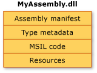
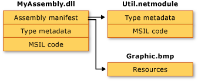

# Assembly Contents
In general, a static assembly can consist of four elements:  
  
- The [assembly manifest](manifest.md), which contains assembly metadata.  
  
- Type metadata.  
  
- Microsoft intermediate language (MSIL) code that implements the types.  
  
- A set of resources.  
  
 Only the assembly manifest is required, but either types or resources are needed to give the assembly any meaningful functionality.  
  
 There are several ways to group these elements in an assembly. You can group all elements in a single physical file, which is shown in the following illustration.  
  
   
  
 Alternatively, the elements of an assembly can be contained in several files. These files can be modules of compiled code (.netmodule), resources (such as .bmp or .jpg files), or other files required by the application. Create a multifile assembly when you want to combine modules written in different languages and to optimize downloading an application by putting seldom used types in a module that is downloaded only when needed.  
  
 In the following illustration, the developer of a hypothetical application has chosen to separate some utility code into a different module and to keep a large resource file (in this case a .bmp image) in its original file. The .NET Framework downloads a file only when it is referenced; keeping infrequently referenced code in a separate file from the application optimizes code download.  
  
  
  
> [!NOTE]
>  The files that make up a multifile assembly are not physically linked by the file system. Rather, they are linked through the assembly manifest and the common language runtime manages them as a unit.  
  
 In this illustration, all three files belong to an assembly, as described in the assembly manifest contained in MyAssembly.dll. To the file system, they are three separate files. Note that the file Util.netmodule was compiled as a module because it contains no assembly information. When the assembly was created, the assembly manifest was added to MyAssembly.dll, indicating its relationship with Util.netmodule and Graphic.bmp.  
  
 As you currently design your source code, you make explicit decisions about how to partition the functionality of your application into one or more files. When designing .NET Framework code, you will make similar decisions about how to partition the functionality into one or more assemblies.  
  
## See also

- [Assemblies in .NET](index.md)
- [Assembly Manifest](manifest.md)
- [Assembly Security Considerations](security-considerations.md)
