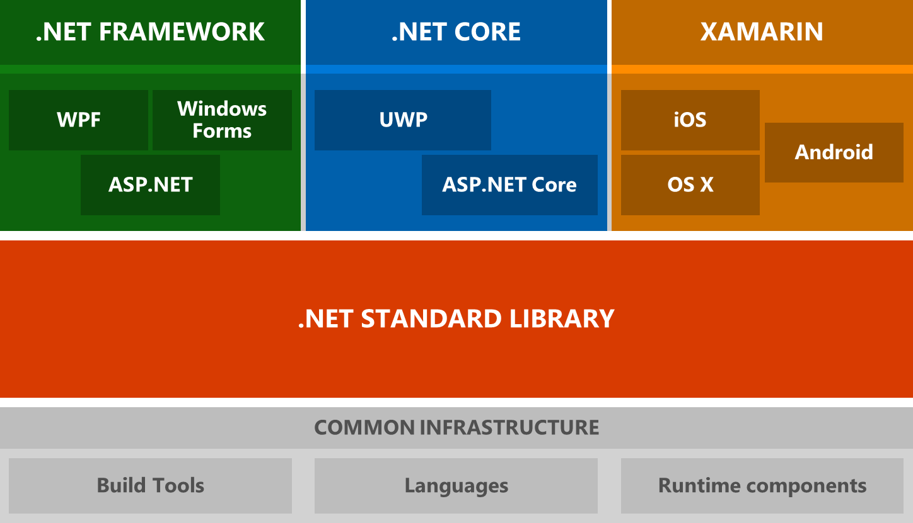

# .NET Architectural Components

.NET is made up of a number of key components.  It has a standard library, called the .NET Standard Library, which is a large set of APIs which runs everywhere.  This standard library is implemented by three .NET runtimes - .NET Framework, .NET Core, and Mono for Xamarin.  The .NET languages also run on any .NET runtime.  Additionally, there are tools on every platform which allow you to build projects.  These tools are the same regardless of your choice of runtime.

Here's a graphical overview of each of the previously mentioned components of .NET and how they fit.

What follows is a brief explanation of each of the key components shown above.  

## .NET Standard Library

The .NET Standard Library is a set of APIs which are implemented by a .NET runtime.

More formally, it is a specification of .NET APIs which make up a uniform set of contracts that you compile your code against.  These contracts have underlying implementations for each .NET runtime.  This enables portability across different .NET runtimes, making it so that your code can effectively "run everywhere".

The .NET Standard Library is also a build target, where it is known as the .NET Standard.  You can currently target .NET Standard 1.0-1.6.  If your code targets a version of the .NET Standard, it is guaranteed to run on any .NET runtime which implements that version.

To learn more about the .NET Standard library and targeting the .NET Standard, see [.NET Standard Library](library.md).

## .NET runtimes

There are 3 primary .NET runtimes which Microsoft actively develops and maintains: .NET Core, .NET Framework, and Mono for Xamarin.

### .NET Core

.NET Core is a cross-platform runtime optimized for server workloads.  It implements the .NET Standard Library, which means that any code that targets the .NET Standard can run on .NET Core.  It is the runtime used by ASP.NET Core and the Universal Windows Platform (UWP).  It is modern, efficient, and designed to handle server and cloud workloads at scale.

To learn more about .NET Core, see the [.NET Core Guide](../core/index.md).

### .NET Framework

.NET Framework is the historical .NET runtime that has existed since 2002.  It is the same .NET Framework existing .NET developers have always used.  It implements the .NET Standard Library, which means that any code that targets the .NET Standard can run on the .NET Framework.  It contains additional Windows-specific APIs, such as APIs for Windows desktop development with Windows Forms and WPF.  .NET Framework is optimized for building Windows desktop applications.

To learn more about the .NET Framework, see the [.NET Framework Guide](../framework/index.md).

### Mono for Xamarin

Mono is the runtime used by Xamarin apps.  It implements the .NET Standard Library, which means that any code that targets the .NET Standard can run on Xamarin apps.  It contains additional APIs for iOS, Android, Xamarin.Forms, and Xamarin.Mac.  It is optimized for building mobile applications on iOS and Android.

To learn more about Mono, see the [Mono documentation](http://www.mono-project.com/docs/).

## .NET tooling and common infrastructure

Tooling for .NET is also common across each implementation of .NET.  These include, but are not limited to:

* The .NET languages and their compilers
* Runtime components, such as the JIT and Garbage Collector
* .NET project system (sometimes known as "csproj", "vbproj", or "fsproj")
* MSBuild, the build engine used to build projects
* NuGet, Microsoft's package manager for .NET
* The .NET CLI, a cross-platform command-line interface for building .NET projects
* Open Source build orchestration tools, such as CAKE and FAKE

The main takeaway here should be that there is a vast amount of tooling and infrastructure which is common for any "flavor" of .NET you choose to build your apps with.

## Next Steps

To learn more, visit the following:

* [.NET Standard Library](library.md)
* [.NET Core Guide](../core/index.md)
* [.NET Framework Guide](../framework/index.md)
* [C# Guide](../csharp/index.md)
* [F# Guide](../fsharp/index.md)
* [VB.NET Guide](../visual-basic/index.md)
