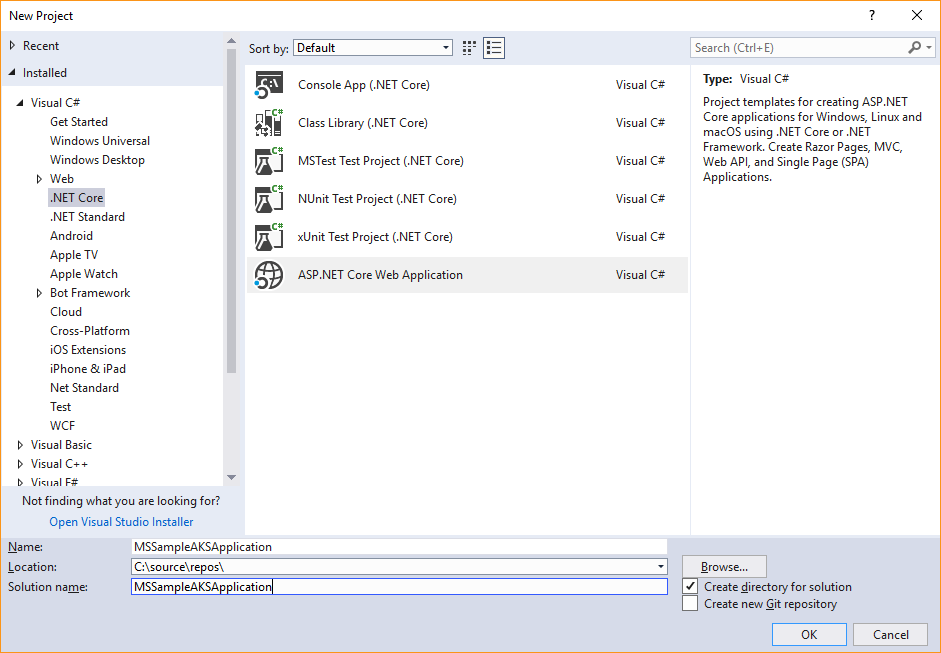
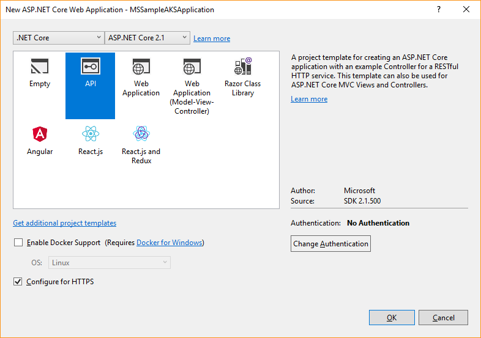
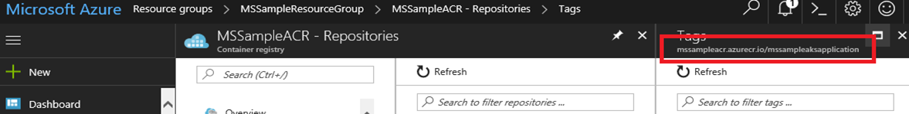
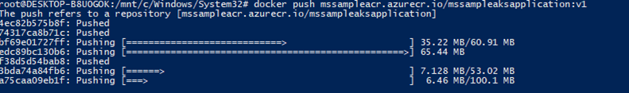
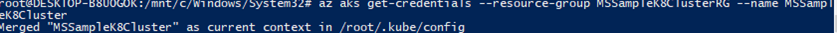

# Build ASP.NET Core 2.1 applications deployed as Linux containers into AKS/Kubernetes orchestrator

Azure Kubernetes Services (AKS) is Azure's managed Kubernetes orchestrations services that simplify container deployment and management.

AKS main features are, an Azure-hosted control plane, automated upgrades, self-healing, user configurable scaling, and a simpler user experience for both developers and cluster operators.

In the following examples we'll explore the creation of an ASP.NET Core 2.1 application, using Visual Studio 2017 that runs on Linux and deploys to an AKS Cluster in Azure.

## Creating the ASP.NET Core 2.1 Project using Visual Studio 2017

ASP.NET Core is a general-purpose development platform maintained by Microsoft and the .NET community on GitHub. It is cross-platform, supporting Windows, macOS and Linux, and can be used in device, cloud, and embedded/IoT scenarios.

For this example, we use a simple project based on a Visual Studio Web API template, so you don't need any additional knowledge to create the sample, you only have to create the project using a standard template that includes all the elements to run a small project with a REST API, using ASP.NET Core 2.1 technology.



**Figure 4-36**. Creating ASP.NET Core Application

To create the sample project, you have to select **New > Project** on Visual Studio and ASP.NET Core Web Application

Visual Studio will show a list with Templates for Web Projects. For our example you must select **Web API,** that means you will create an ASP.NET Web API Application.

Verify that you have selected ASP.NET Core 2.1 as the framework. The .NET Core 2.1 is included in the last version of Visual Studio 2017 and is automatically installed and configured for you when you install Visual Studio 2017.



**Figure 4-37**. Selecting ASP.NET CORE 2.1 and Web API project type

If you have any previous version of .NET Core, you can download and install the 2.1 version from <https://www.microsoft.com/net/download/core#/sdk>

You can add Docker support when creating the project in the previous step, or later, so you can "Dockerize" your project any time. To add the Docker support after the project creation, right-click on the solution file and select **Add > Docker support** on the context menu.


**Figure 4-38**. Adding Docker support to existing project

To complete adding Docker support, you have the choice of Windows or Linux, in this case select **Linux**, because AKS doesn’t support Windows Containers (as of late 2018).


**Figure 4-39**. Selecting Linux Containers.

With these simple steps, you will have your ASP.NET Core 2.1 application running on a Linux Container.

As you can see the, integration between Visual Studio 2017 and Docker is totally oriented to the developer’s productivity.

Now you can run your application with the key **F5** or using the Play Button

After running the project, you can list the images using the `docker images` command, and you should see the `mssampleapplication` image created with the automatic deploy of our project with Visual Studio 2017.

```console
# docker images
```


**Figure 4-40**. View of docker images

## Register the Solution in the Azure Container Registry

Now, we have to upload the image to any Docker registry, like [Azure Container Registry (ACR)](https://azure.microsoft.com/services/container-registry/) or Docker Hub so the images can be deployed to the AKS cluster from that registry. In this case, we’re uploading the image to Azure Container Registry.

### Create the image in Release mode

We'll now create the image in **Release** Mode (ready for production) changing to Release as shown here and running the application as did before.


**Figure 4-41**. Selecting Release Mode

If you execute the `docker image` command, you'll see both images created one for `debug` and the other for `release` mode.

### Create a new Tag for the Image

Each container image needs to be tagged with the `loginServer` name of the registry. This tag is used for routing when pushing container images to an image registry.

You can view the `loginServer` name from the Azure portal, taking the information from the Azure Container Registry



**Figure 4-42**. View of the name of the Registry

Or by running the command

```console
az acr list --resource-group MSSampleResourceGroup --query "[].{acrLoginServer:loginServer}" --output table
```


**Figure 4-43**. Get the name of the registry using PowerShell

In both cases, you'll obtain the name, in our example `mssampleacr.azurecr.io`

Now you can Tag the image, taking the latest image (Release image), with the command:

```console
docker tag mssampleaksapplication:latest mssampleacr.azurecr.io/mssampleaksapplication:v1
```

After running the `docker tag` command, list the images with the `docker images` command, you should see the image with the new tag.


**Figure 4-44**. View of tagged images

### Push the image into the Azure ACR

Now you can push the image into the Azure ACR, using the command:

```console
docker push mssampleacr.azurecr.io/mssampleaksapplication:v1
```

This command takes a while uploading the images but gives you feedback in the process.



**Figure 4-45**. Uploading the image to the ACR

You can see below the result you should get when the process completes:


**Figure 4-46**. View of nodes

The next step is to deploy your container into your AKS Kubernetes cluster, for that you need a file (**.yml deploy file**) that, in this case, contains:


> [!INFORMATION]
> For more information on this topic, see: <https://kubernetes.io/docs/user-guide/kubectl-cheatsheet/>

Now you're almost ready to deploy using **Kubectl**, but first you must get the credentials to the AKS Cluster with this command:

```console
az aks get-credentials --resource-group MSSampleResourceGroupAKS --name mssampleclusterk801
```



**Figure 4-47**. getting credentials

Then, use the `kubectl create` command to launch the deployment.

```console
kubectl create -f mssample-deploy.yml
```


**Figure 4-48**. Deploy to Kubernetes

When the deployment completes, you can access the Kubernetes console with a local proxy that you can temporally access with this command:

```console
az aks browse --resource-group MSSampleResourceGroupAKS --name mssampleclusterk801
```

And accessing the url `http://127.0.0.1:8001`.


**Figure 4-49**. View Kubernetes cluster information

Now you have your application deployed on Azure, using a Linux Container, and an AKS Kubernetes Cluster that you can access browsing to the public IP of your service that you can get from the Azure portal.

> [!NOTE]
> You can see how to create the AKS Cluster for this sample in section **Azure Kubernetes Managed Service** later on this guide.

>[!div class="step-by-step"]
>[Previous](set-up-windows-containers-with-powershell.md)
>[Next](../docker-devops-workflow/index.md)
