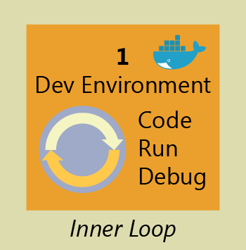
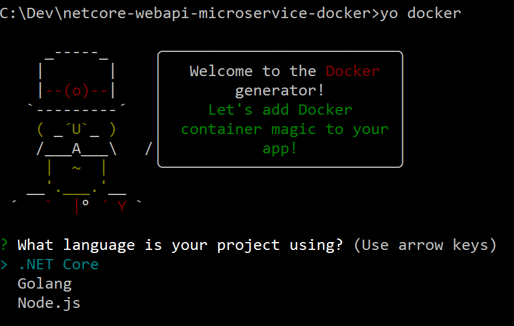
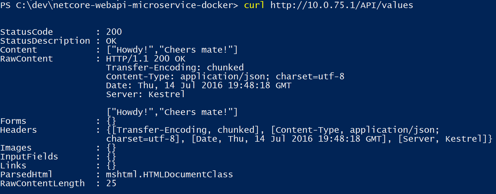

# Inner-loop development workflow for Docker apps

Before triggering the outer-loop workflow spanning the entire DevOps cycle, it all begins on each developer's machine, coding the app itself, using their preferred languages or platforms, and testing it locally (Figure 4-14). But in every case, you will have a very important point in common, no matter what language, framework, or platforms you choose. In this specific workflow, you are always developing and testing Docker containers, but locally.



Figure 4-14: Inner-loop development context

The container or instance of a Docker image will contain these components:

-   An operating system selection (for example, a Linux distribution or Windows)

-   Files added by the developer (for example, app binaries)

-   Configuration (for example, environment settings and dependencies)

-   Instructions for what processes to run by Docker

You can set up the inner-loop development workflow that utilizes Docker as the process (described in the next section). Take into account that the initial steps to set up the environment is not included, because you need to do that just once.

## Building a single app within a Docker container using Visual Studio Code and Docker CLI

Apps are made up from your own services plus additional libraries (dependencies).

Figure 4-15 shows the basic steps that you usually need to carry out when building a Docker app, followed by detailed descriptions of each step.


Figure 4-15: High-level workflow for the life cycle for Docker containerized applications using Docker CLI

### Step 1: Start coding in Visual Studio Code and create your initial app/service baseline

The way you develop your application is pretty similar to the way you do it without Docker. The difference is that while developing, you are deploying and testing your application or services running within Docker containers placed in your local environment (like a Linux VM or Windows).

**Setting up your local environment**

With the latest versions of Docker for Mac and Windows, it's easier than ever to develop Docker applications, and the setup is straightforward.

**More info** For instructions on setting up Docker for Windows, go to [https://docs.docker.com/docker-for-windows/](https://docs.docker.com/docker-for-windows/).

For instructions on setting up Docker for Mac, go to <https://docs.docker.com/docker-for-mac/>.

In addition, you'll need a code editor so that you can actually develop your application while using Docker CLI.

Microsoft provides Visual Studio Code, which is a lightweight code editor that is supported on Mac, Windows, and Linux, and provides IntelliSense with [support for many languages](https://code.visualstudio.com/docs/languages/overview) (JavaScript, .NET, Go, Java, Ruby, Python, and most modern languages), [debugging](https://code.visualstudio.com/Docs/editor/debugging), [integration with Git](https://code.visualstudio.com/Docs/editor/versioncontrol) and [extensions support](https://code.visualstudio.com/docs/extensions/overview). This editor is a great fit for Mac and Linux developers. In Windows, you also can use the full Visual Studio application.

**More info** For instructions on installing Visual Studio for Windows, Mac, or Linux, go to [http://code.visualstudio.com/docs/setup/setup-overview/https://docs.docker.com/docker-for-mac/](http://code.visualstudio.com/docs/setup/setup-overview/https:/docs.docker.com/docker-for-mac/).

You can work with Docker CLI and write your code using any code editor, but if you use Visual Studio Code, it makes it easy to author Dockerfile and docker-compose.yml files in your workspace. Plus, you can run Visual Studio Code tasks from the IDE that will prompt scripts that can be running elaborated operations using Docker CLI underneath.

Visual Studio Code is provided by an extension, which you'll need to install. To do so, Press Ctrl+Shift+P, type **ext install**, and then run the Extensions: Install Extension command to bring up the Marketplace extension list. Next, type **docker** to filter the results, and then select the Dockerfile And Docker Compose File (yml) Support extension, as depicted in Figure 4-16.


Figure 4-16: Installing the Docker Extension in Visual Studio Code

### Step 2: Create a DockerFile related to an existing image (plain OS or dev environments like .NET Core, Node.js, and Ruby)

You will need a DockerFile per custom image to be built and per container to be deployed, therefore, if your app is made up of a single custom service, you will need a single DockerFile. But, if your app is composed of multiple services (as in a microservices architecture), you'll need one Dockerfile per service.

The DockerFile is usually placed within the root folder of your app or service and contains the required commands so that Docker knows how to set up and run that app or service. You can create your DockerFile and add it to your project along with your code (node.js, .NET Core, etc.), or, if you are new to the environment, take a look at the following Tip.

> [!TIP]
> You can use a command-line tool called [yo docker](https://github.com/Microsoft/generator-docker), which scaffolds files from your project in the language you choose and adds the required Docker configuration files. Basically, to assist developers getting started, it creates the appropriate DockerFile, docker-compose.yml, and other associated scripts to build and run your Docker containers. This yeoman generator will prompt you with a few questions, asking your selected development language and destination container host.


For instance, Figure 4-17 shows two screenshots from the terminals in Windows and on a Mac, in both cases, running yo docker, which will generate the sample code projects (currently .NET Core, Golang, and Node.js as supported languages) already configured to work on top of Docker.

  

Figure 4-17: yo docker command tool in Windows (left) and on a Mac

Figure 4-18 presents an example using yo docker after you have an existing .NET Core project in place to be scaffolded.


Figure 4-18: yo docker with an existing .NET Core project in place

From the DockerFile, you specify what base Docker image you'll be using (like using "FROM microsoft/dotnet:1.0.0-core"). You usually will build your custom image on top of a base image that you can get from any official repository at the [Docker Hub registry](https://hub.docker.com/) (like an [image for .NET Core](https://hub.docker.com/r/microsoft/dotnet/) or one [for Node.js](https://hub.docker.com/_/node/)).

***Option A: Use an existing official Docker image***

Using an official repository of a language stack with a version number ensures that the same language features are available on all machines (including development, testing, and production).

Following is a sample DockerFile for a .NET Core container:

```
# Base Docker image to use
FROM microsoft/aspnetcore:1.0.1\

# Set the Working Directory and files to be copied to the image
ARG source
WORKDIR /app
COPY ${source:-bin/Release/PublishOutput} .

# Configure the listening port to 80 (Internal/Secured port within Docker host)
EXPOSE 80

# Application entry point
ENTRYPOINT ["dotnet", "MyCustomMicroservice.dll"]
```

In this case, it is using the version 1.0.1 of the official ASP.NET Core Docker image for Linux named microsoft/aspnetcore:1.0.1. For further details, consult the [ASP.NET Core Docker Image page](https://hub.docker.com/r/microsoft/aspnetcore/) and the [.NET Core Docker Image page](https://hub.docker.com/r/microsoft/dotnet/). You also could be using another comparable image like node:4-onbuild for Node.js, or many other preconfigured images for development languages, which are available at [Docker Hub](https://hub.docker.com/explore/).

In the DockerFile, you also need to instruct Docker to listen to the TCP port that you will use at runtime (such as port 80).

There are other lines of configuration that you can add in the DockerFile depending on the language/framework you are using, so Docker knows how to run the app. For instance, you need the ENTRYPOINT line with \["dotnet", "MyCustomMicroservice.dll"\] to run a .NET Core app, although you can have multiple variants depending on the approach to build and run your service. If you're using the SDK and dotnet CLI to build and run the .NET app, it would be slightly different. The bottom line is that the ENTRYPOINT line plus additional lines will be different depending on the language/platform you choose for your application.

**More info** For information about building Docker images for .NET Core applications, go to <https://docs.microsoft.com/dotnet/core/docker/building-net-docker-images>.

To learn more about building your own images, go to [https://docs.docker.com/engine/\
tutorials/dockerimages/](https://docs.docker.com/engine/tutorials/dockerimages/).

**Multiplatform image repositories**

As Windows containers become more prevalent, a single repository can contain platform variants, such as a Linux and Windows image. This is a new feature coming in Docker that makes it possible for vendors to use a single repository to cover multiple platforms, such as [microsoft/aspdotnetcore](https://hub.docker.com/r/microsoft/aspnetcore/) repository, which is available at DockerHub registry. As the feature comes alive, pulling this image from a Windows host will pull the Windows variant, whereas pulling the same image name from a Linux host will pull the Linux variant.

***Option B: Create your base image from scratch***

You can create your own Docker base image from scratch as explained in this [article](https://docs.docker.com/engine/userguide/eng-image/baseimages/) from Docker. This is a scenario that is probably not best for you if you are just starting with Docker, but if you want to set the specific bits of your own base image, you can do it.

### Step 3: Create your custom Docker images embedding your service in it

For each custom service that comprises your app, you'll need to create a related image. If your app is made up of a single service or web app, you'll need just a single image.

> [!NOTE]
> When taking into account the "outer-loop DevOps workflow," the images will be created by an automated build process whenever you push your source code to a Git repository (Continuous Integration) so the images will be created in that global environment from your source code.

But, before we consider going to that outer-loop route, we need to ensure that the Docker application is actually working properly so that they don't push code that might not work properly to the source control system (Git, etc.).

Therefore, each developer first needs to do the entire inner-loop process to test locally and continue developing until they want to push a complete feature or change to the source control system.

To create an image in your local environment and using the DockerFile, you can use the docker build command, as demonstrated in Figure 4-19 (you also can run docker-compose up --build for applications composed by several containers/services).


Figure 4-19: Running docker build

Optionally, instead of directly running docker build from the project's folder, you first can generate a deployable folder with the .NET libraries needed by using the run dotnet publish command, and then run docker build.

In this example, this creates a Docker image with the name cesardl/netcore-webapi-microservice-docker:first (:first is a tag, like a specific version). You can take this step for each custom image you need to create for your composed Docker application with several containers.

You can find the existing images in your local repository (your development machine) by using the docker images command, as illustrated in Figure 4-20.


Figure 4-20: Viewing existing images using docker images

### Step 4: (Optional) Define your services in docker-compose.yml when building a composed Docker app with multiple services

With the docker-compose.yml file you can define a set of related services to be deployed as a composed application with the deployment commands explained in the next step section.

You need to create that file in your main or root solution folder; it should have a similar content to the following docker-compose.yml file:

```yml
version: '2'
services:
  web:
    build: .
    ports:
     - "81:80"
    volumes:
     - .:/code
    depends_on:
     - redis
  redis:
    image: redis
```

In this particular case, this file defines two services: the web service (your custom service) and the redis service (a popular cache service). Each service will be deployed as a container, so we need to use a concrete Docker image for each. For this particular web service, the image will need to do the following:

-   Build from the DockerFile in the current directory

-   Forward the exposed port 80 on the container to port 81 on the host machine

-   Mount the project directory on the host to /code within the container, making it possible for you to modify the code without having to rebuild the image

-   Link the web service to the redis service

The redis service uses the [latest public redis image](https://hub.docker.com/_/redis/) pulled from the Docker Hub registry. [redis](https://redis.io/) is a very popular cache system for server-side applications.

### Step 5: Build and run your Docker app

If your app has only a single container, you just need to run it by deploying it to your Docker Host (VM or physical server). However, if your app is made up of multiple services, you need to *compose it*, too. Let's see the different options.

***Option A: Run a single container or service***

You can run the Docker image by using the docker run command, as shown here:

```
docker run -t -d -p 80:5000
cesardl/netcore-webapi-microservice-docker:first
```

Note that for this particular deployment, we'll be redirecting requests sent to port 80 to the internal port 5000. Now, the application is listening on the external port 80 at the host level.

***Option B: Compose and run a multiple-container application***

In most enterprise scenarios, a Docker application will be composed of multiple services. For these cases, you can run the command docker-compose up (Figure 4-21), which will use the docker-compose.yml file that you might have created previously. Running this command deploys a composed application with all of its related containers.


Figure 4-21: Results of running the "docker-compose up" command

After you run docker-compose up, you deploy your application and its related container(s) into your Docker Host, as illustrated in Figure 4-22, in the VM representation.


Figure 4-22: VM with Docker containers deployed

Note docker-compose up and docker run might be enough for testing your containers in your development environment, but you might not use them at all if you are expecting to work with Docker clusters and orchestrators like Docker Swarm, Mesosphere DC/OS, or Kubernetes in order to be able to scale up. If you're using a cluster like [Docker Swarm mode](https://docs.docker.com/engine/swarm/) (available in Docker for Windows and Mac since version 1.12), you need to deploy and test with additional commands such as docker service create for single services, or when you're deploying an app composed of several containers, using docker compose bundle and docker deploy myBundleFile, by deploying the composed app as a stack, as explained in the article [Distributed Application Bundles](https://blog.docker.com/2016/06/docker-app-bundle/) from Docker.

For [DC/OS](https://mesosphere.com/blog/2015/09/02/dcos-cli-command-line-tool-datacenter/) and [Kubernetes](http://kubernetes.io/docs/user-guide/deployments/#creating-a-deployment) you would use different deployment commands and scripts, as well.

### Step 6: Test your Docker application (locally, in your local CD VM)

This step will vary depending on what your app is doing.

In a very simple .NET Core Web API "Hello World" deployed as a single container or service, you'd just need to access the service by providing the TCP port specified in the DockerFile.

If localhost is not turned on, to navigate to your service, find the IP address for the machine by using this command:

docker-machine ip *your-container-name*

On the Docker host, open a browser and navigate to that site; you should see your app/service running, as demonstrated in Figure 4-23.


Figure 4-23: Testing your Docker application locally using localhost

Note that it is using port 80, but internally it was being redirected to port 5000, because that's how it was deployed with docker run, as explained earlier.

You can test this by using CURL from the terminal. In a Docker installation on Windows, the default IP is 10.0.75.1, as depicted in Figure 4-24.



Figure 4-24: Testing a Docker application locally by using CURL

**Debugging a container running on Docker**

Visual Studio Code supports debugging Docker if you're using Node.js and other platforms like .NET Core containers.

You also can debug .NET Core containers in Docker when using Visual Studio, as described in the next section.

**More info:** To learn more about debugging Node.js Docker containers, go to <https://blog.docker.com/2016/07/live-debugging-docker/> and [https://blogs.msdn.microsoft.com/\
user\_ed/2016/02/27/visual-studio-code-new-features-13-big-debugging-updates-rich-object-hover-conditional-breakpoints-node-js-mono-more/](https://blogs.msdn.microsoft.com/user_ed/2016/02/27/visual-studio-code-new-features-13-big-debugging-updates-rich-object-hover-conditional-breakpoints-node-js-mono-more/).


>[!div class="step-by-step"]
[Previous] (docker-apps-development-environment.md)
[Next] (visual-studio-tools-for-docker.md)
