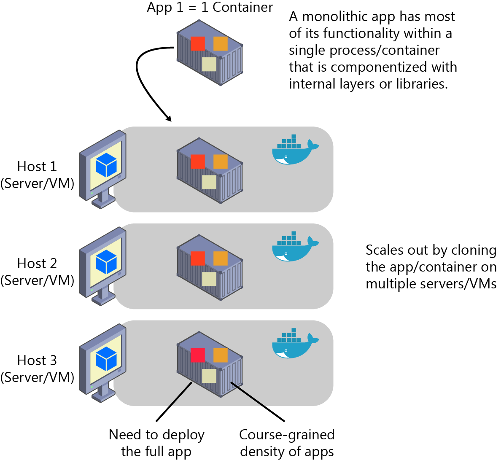

# Monolithic applications

In this scenario, you are building a single and monolithic web application or service and deploying it as a container. Within the application, the structure might not be monolithic; it might comprise several libraries, components, or even layers (application layer, domain layer, data access layer, etc.). Externally, it is a single container, like a single process, single web application, or single service.

To manage this model, you deploy a single container to represent the application. To scale it, just add a few more copies with a load balancer in front. The simplicity comes from managing a single deployment in a single container or virtual machine (VM).

Following the principal that a container does one thing only, and does it in one process, the monolithic pattern is in conflict. You can include multiple components/libraries or internal layers within each container, as illustrated in Figure 4-1.

Figure 4-1: An example of monolithic application architecture

The downside to this approach comes if or when the application grows, requiring it to scale. If the entire application scaled, it's not really a problem. However, in most cases, a few parts of the application are the choke points that require scaling, whereas other components are used less.

Using the typical e-commerce example, what you likely need is to scale the product information component. Many more customers browse products than purchase them. More customers use their basket than use the payment pipeline. Fewer customers add comments or view their purchase history. And you likely have only a handful of employees, in a single region, that need to manage the content and marketing campaigns. By scaling the monolithic design, all of the code is deployed multiple times.

In addition to the "scale-everything" problem, changes to a single component require complete retesting of the entire application as well as a complete redeployment of all the instances.

The monolithic approach is common, and many organizations are developing with this architectural method. Many enjoy good enough results, whereas others encounter limits. Many designed their applications in this model because the tools and infrastructure were too difficult to build SOAs, and they didn't see the need—until the app grew.

From an infrastructure perspective, each server can run many applications within the same host and have an acceptable ratio of efficiency in your resources usage, as shown in Figure 4-2.

Figure 4-2: A host running multiple apps/containers

You can deploy monolithic applications in Azure by using dedicated VMs for each instance. Using [Azure VM Scale Sets](https://docs.microsoft.com/azure/virtual-machine-scale-sets/), you can scale the VMs easily. [Azure App Services](https://azure.microsoft.com/en-us/services/app-service/) can run monolithic applications and easily scale instances without having to manage the VMs. Since 2016, Azure App Services can run single instances of Docker containers, as well, simplifying the deployment. And, using Docker, you can deploy a single VM as a Docker host and run multiple instances. Using the Azure balancer, as illustrated in the Figure 4-3, you can manage scaling.

Figure 4-3: Multiple hosts scaling-out a single Docker application apps/containers

You can manage the deployment to the various hosts via traditional deployment techniques. You can manage Docker hosts by using commands like `docker run` manually, through automation such as Continuous Delivery (CD) pipelines, which we explain later in this e-book.

## Monolithic application deployed as a container

There are benefits to using containers to manage monolithic deployments. Scaling the instances of containers is far faster and easier than deploying additional VMs. Although VM Scale Sets are a great feature to scale VMs, which are required to host your Docker containers, they take time to set up. When deployed as app instances, the configuration of the app is managed as part of the VM.

Deploying updates as Docker images is far faster and network efficient. The Vn instances can be set up on the same hosts as your Vn-1 instances, eliminating added costs resulting from additional VMs. Docker images typically start in seconds, speeding rollouts. Tearing down a Docker instance is as easy as invoking the `docker stop` command, typically completing in less than a second.

Because containers are inherently immutable, by design, you never need to worry about corrupted VMs because an update script forgot to account for some specific configuration or file left on disk.

Although monolithic apps can benefit from Docker, we're touching on only the tips of the benefits. The larger benefits of managing containers comes from deploying with container orchestrators that manage the various instances and life cycle of each container instance. Breaking up the monolithic application into subsystems that can be scaled, developed, and deployed individually is your entry point into the realm of microservices.

## Publishing a single Docker container app to Azure App Service

Either because you want to get a quick validation of a container deployed to Azure or because the app is simply a single-container app, Azure App Services provides a great way to provide scalable single-container services.

Using Azure App Service is intuitive and you can get up and running quickly because it provides great Git integration to take your code, build it in Microsoft Visual Studio, and directly deploy it to Azure. But, traditionally (with no Docker), if you needed other capabilities, frameworks, or dependencies that aren't supported in App Services, you needed to wait for it until the Azure team updates those dependencies in App Service or switched to other services like Service Fabric, Cloud Services, or even plain VMs, for which you have further control and can install a required component or framework for your application.

Now, however, (announced at Microsoft Connect 2016 in November 2016) and as shown in Figure 4‑4, when using Visual Studio 2017, container support in Azure App Service gives you the ability to include whatever you want in your app environment. If you added a dependency to your app, because you are running it in a container, you get the capability of including those dependencies in your Dockerfile or Docker image.

Figure 4-4: Publishing a container to Azure App Service from Visual Studio apps/containers

Figure 4-4 also shows that the publish flow pushes an image through a Container Registry, which can be the Azure Container Registry (a registry near to your deployments in Azure and secured by Azure Active Directory groups and accounts) or any other Docker Registry like Docker Hub or on-premises registries.

>[!div class="step-by-step"]
[Previous] (common-container-design-principles.md)
[Next] (state-and-data-in-docker-applications.md)
