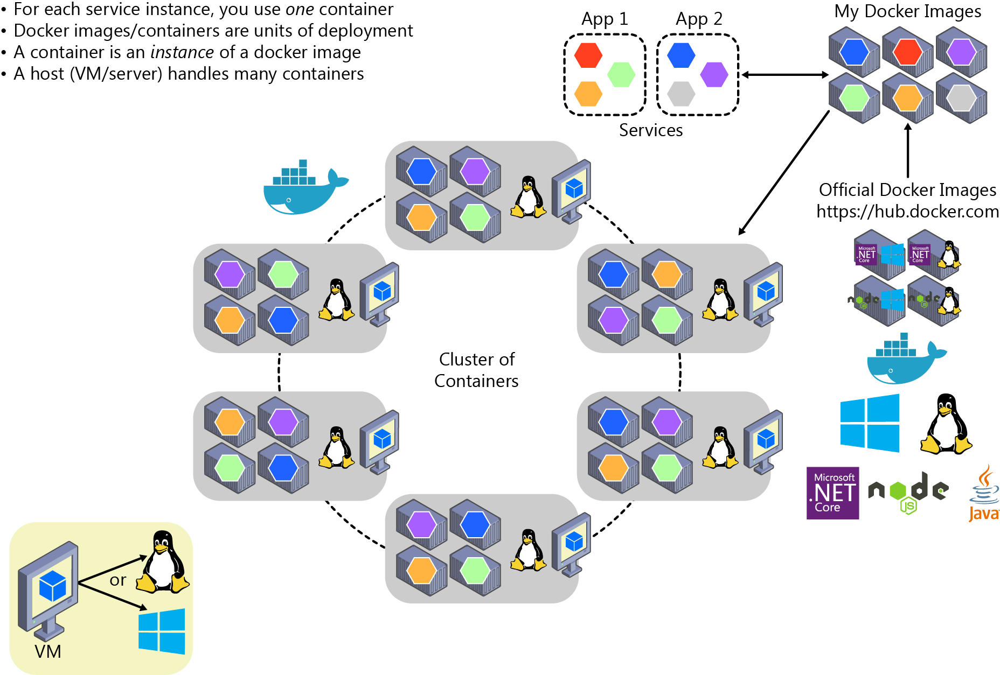
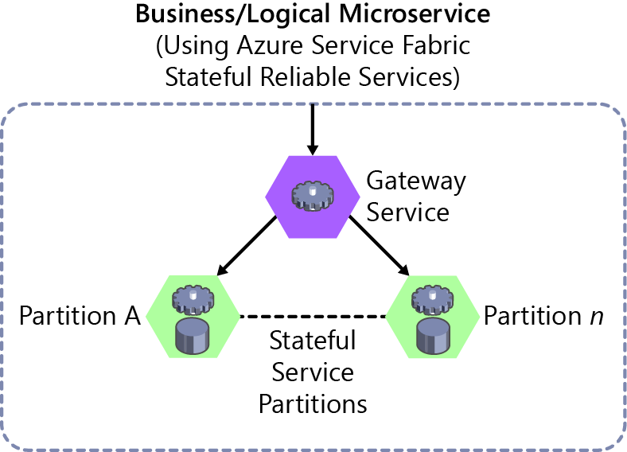
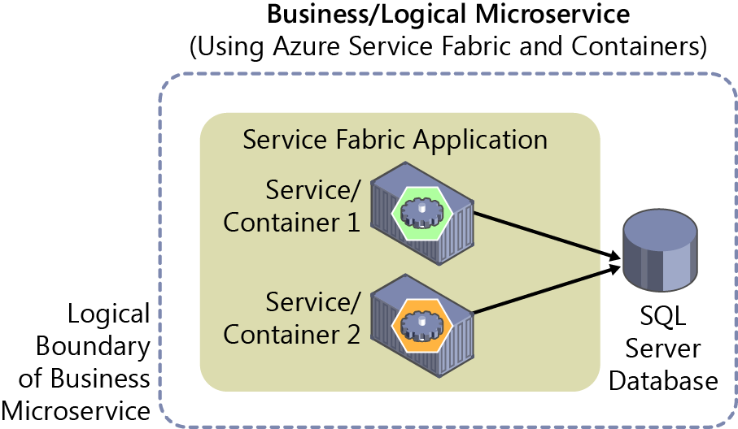
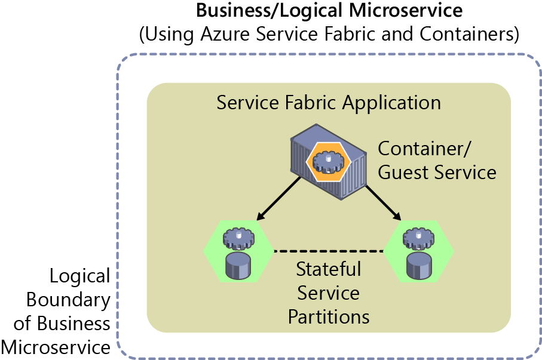
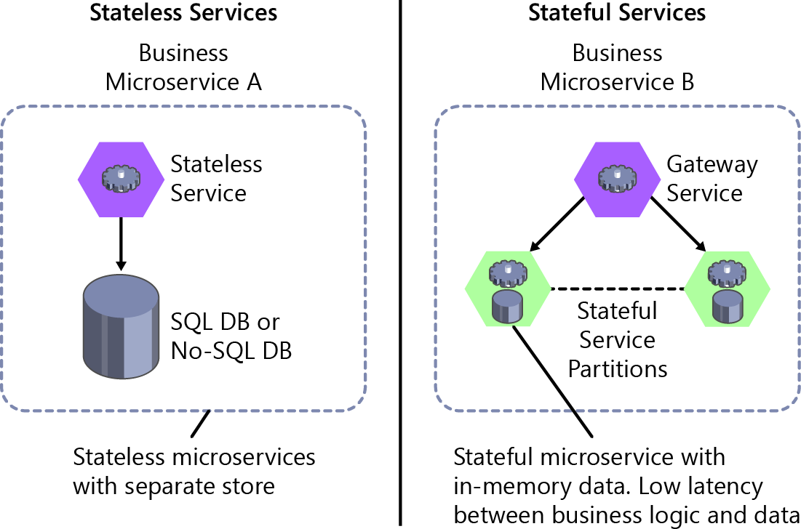

# Orchestrating microservices and multicontainer applications for high scalability and availability

Using orchestrators for production-ready applications is essential if your application is based on microservices or simply split across multiple containers. As introduced previously, in a microservice-based approach, each microservice owns its model and data so that it will be autonomous from a development and deployment point of view. But even if you have a more traditional application that is composed of multiple services (like SOA), you also will have multiple containers or services comprising a single business application that need to be deployed as a distributed system. These kinds of systems are complex to scale out and manage; therefore, you absolutely need an orchestrator if you want to have a production-ready and scalable multicontainer application.

Figure 4-6 illustrates deployment into a cluster of an application composed of multiple microservices (containers).

Figure 4-6: A cluster of containers

It looks like a logical approach. But how are you handling load balancing, routing, and orchestrating these composed applications?

The Docker command-line interface (CLI) meets the needs of managing one container on one host, but it falls short when it comes to managing multiple containers deployed on multiple hosts for more complex distributed applications. In most cases, you need a management platform that will automatically start containers, suspend them, or shut them down when needed, and ideally also control how they access resources like the network and data storage.

To go beyond the management of individual containers or very simple composed apps and move toward larger enterprise applications with microservices, you must turn to orchestration and clustering platforms.

From an architecture and development point of view, if you are building large, enterprise, microservices-based, applications, it is important to understand the following platforms and products that support advanced scenarios:

-   **Clusters and orchestrators** When you need to scale-out applications across many Docker hosts, such as with a large microservices-based application, it is critical to be able to manage all of those hosts as a single cluster by abstracting the complexity of the underlying platform. That is what the container clusters and orchestrators provide. Examples of orchestrators are Docker Swarm, Mesosphere DC/OS, Kubernetes (the first three available through Azure Container Service), and Azure Service Fabric.

-   **Schedulers** *Scheduling* means to have the capability for an administrator to launch containers in a cluster so that they also provide a user interface. A cluster scheduler has several responsibilities: to use the cluster's resources efficiently, to set the constraints provided by the user, to efficiently load-balance containers across nodes or hosts, and to be robust against errors while providing high availability.

The concepts of a cluster and a scheduler are closely related, so the products provided by different vendors often provide both sets of capabilities. Table 4-1 lists the most important platform and software choices you have for clusters and schedulers. These clusters are generally offered in public clouds like Azure.

Table 4-1: Software platforms for container clustering, orchestration, and scheduling

| Platform | Description |
|---|---|
| Docker Swarm   | Docker Swarm gives you the ability to cluster and schedule Docker containers. By using Swarm, you can turn a pool of Docker hosts into a single, virtual Docker host. Clients can make API requests to Swarm in the same way that they do to hosts, meaning that Swarm makes it easy for applications to scale to multiple hosts.    Docker Swarm is a product from Docker, the company.    Docker v1.12 or later can run native and built-in Swarm Mode. |
| Mesosphere DC/OS  |  Mesosphere Enterprise DC/OS (based on Apache Mesos) is a production-ready platform for running containers and distributed applications.    DC/OS works by abstracting a collection of the resources available in the cluster and making those resources available to components built on top of it. Marathon is usually used as a scheduler integrated with DC/OS. |
| Google Kubernetes  | Kubernetes is an open-source product that provides functionality that ranges from cluster infrastructure and container scheduling to orchestrating capabilities. With it, you can automate deployment, scaling, and operations of application containers across clusters of hosts.    Kubernetes provides a container-centric infrastructure that groups application containers into logical units for easy management and discovery. |
| Azure Service Fabric  | [Service Fabric](https://docs.microsoft.com/azure/service-fabric/service-fabric-overview) is a Microsoft microservices platform for building applications. It is an [orchestrator](https://docs.microsoft.com/azure/service-fabric/service-fabric-cluster-resource-manager-introduction) of services and creates clusters of machines. By default, Service Fabric deploys and activates services as processes, but Service Fabric can deploy services in Docker container images. More important, you can mix services in processes with services in containers in the same application.    As of May 2017, the feature of Service Fabric that supports deploying services as Docker containers is in preview state.    You can develop Service Fabric services in many ways, from using the [Service Fabric programming models](https://docs.microsoft.com/azure/service-fabric/service-fabric-choose-framework) to deploying [guest executables](https://docs.microsoft.com/azure/service-fabric/service-fabric-deploy-existing-app) as well as containers. Service Fabric supports prescriptive application models like [stateful services](https://docs.microsoft.com/azure/service-fabric/service-fabric-reliable-services-introduction) and [Reliable Actors](https://docs.microsoft.com/azure/service-fabric/service-fabric-reliable-actors-introduction).

## Using container-based orchestrators in Azure

Several cloud vendors offer Docker containers support plus Docker clusters and orchestration support, including Azure, Amazon EC2 Container Service, and Google Container Engine. Azure provides Docker cluster and orchestrator support through Azure Container Service, as explained in the next section.

Another choice is to use Azure Service Fabric, which also supports Docker based on Linux and Windows Containers. Service Fabric runs on Azure or any other cloud as well as [on-premises](https://docs.microsoft.com/azure/service-fabric/service-fabric-deploy-anywhere).

## Using Azure Container Service

A Docker cluster pools multiple Docker hosts and exposes them as a single virtual Docker host, so you can deploy multiple containers into the cluster. The cluster will handle all the complex management plumbing such as scalability and health. Figure 4-7 represents how a Docker cluster for composed applications maps to Container Service.

Container Service provides a way to simplify the creation, configuration, and management of a cluster of VMs that are preconfigured to run containerized applications. Using an optimized configuration of popular open-source scheduling and orchestration tools, Container Service gives you the ability to use your existing skills or draw on a large and growing body of community expertise to deploy and manage container-based applications in Azure.

Container Service optimizes the configuration of popular Docker clustering open-source tools and technologies specifically for Azure. You get an open solution that offers portability for both your containers and your application configuration. You select the size, the number of hosts, and the orchestrator tools, and Container Service handles everything else.

Container Service uses Docker images to ensure that your application containers are fully portable. It supports your choice of open-source orchestration platforms like DC/OS, Kubernetes, and Docker Swarm to ensure that these applications can scale to thousands or even tens of thousands of containers.

With Azure Container Service, you can take advantage of the enterprise-grade features of Azure while still maintaining application portability, including at the orchestration layers.

Figure 4-7: Clustering choices in Azure Container Service

As shown in Figure 4-8, Container Service is simply the infrastructure provided by Azure in order to deploy DC/OS, Kubernetes, or Docker Swarm, but it does not implement any additional orchestrator. Therefore, Container Service is not an orchestrator, as such; it is only an infrastructure that takes advantage of existing open-source orchestrators for containers.

Figure 4-8: Orchestrators in Container Service

From a usage perspective, the goal of Container Service is to provide a container hosting environment by using popular open-source tools and technologies. To this end, it exposes the standard API endpoints for your chosen orchestrator. By using these endpoints, you can use any software that can communicate to those endpoints. For example, in the case of the Docker Swarm endpoint, you might choose to use the Docker CLI. For DC/OS, you might choose to use the DC/OS CLI.

### Getting started with Container Service

To begin using Container Service, you deploy a Container Service cluster from the Azure portal by using an Azure Resource Manager template or the [CLI](https://docs.microsoft.com/cli/azure/install-azure-cli). Available templates include [Docker Swarm](https://github.com/Azure/azure-quickstart-templates/tree/master/101-acs-swarm), [Kubernetes](https://github.com/Azure/azure-quickstart-templates/tree/master/101-acs-kubernetes), and [DC/OS](https://github.com/Azure/azure-quickstart-templates/tree/master/101-acs-dcos). You can modify the quickstart templates to include additional or advanced Azure configuration.

**More info** To learn more about deploying a Container Service cluster, on the Azure website, read [Deploy an Azure Container Service cluster](https://docs.microsoft.com/azure/container-service/dcos-swarm/container-service-deployment).

There are no fees for any of the software installed by default as part of ACS. All default options are implemented with open-source software.

Container Service is currently available for Standard A, D, DS, G, and GS series Linux VMs in Azure. You are charged only for the compute instances you choose as well as the other underlying infrastructure resources consumed, such as storage and networking. There are no incremental charges for Container Service itself.

### Additional resources

Following are locations where you can find additional information:

-   Introduction to Docker container hosting solutions with Container Service:  
    https://docs.microsoft.com/azure/container-service/kubernetes/container-service-intro-kubernetes>

-   Docker Swarm overview:  
    <https://docs.docker.com/swarm/overview/>

-   Swarm mode overview:  
    <https://docs.docker.com/engine/swarm/>

-   Mesosphere DC/OS Overview:    
    <https://docs.mesosphere.com/1.7/overview/>

-   Kubernetes (the official site):  
    <https://kubernetes.io/>

## Using Service Fabric

Service Fabric arose from Microsoft's transition from delivering "box" products, which were typically monolithic in style, to delivering services. The experience of building and operating large services at scale, such as Azure SQL Database, Azure Document DB, Azure Service Bus, or Cortana's Backend, shaped Service Fabric. The platform evolved over time as more and more services adopted it. Importantly, Service Fabric had to run not only in Azure but also in standalone Windows Server deployments.

The aim of Service Fabric is to solve the difficult problems of building and running a service and utilizing infrastructure resources efficiently so that teams can solve business problems using a microservices approach.

Service Fabric provides two broad areas to help you build applications that use a microservices approach:

-   A platform that provides system services to deploy, scale, upgrade, detect, and restart failed services, discover service location, manage state, and monitor health. These system services in effect provide many of the characteristics of microservices described previously.

-   Programming APIs, or frameworks, to help you build applications as microservices: [reliable actors and reliable services](https://docs.microsoft.com/azure/service-fabric/service-fabric-choose-framework). Of course, you can choose any code to build your microservice, but these APIs make the job more straightforward, and they integrate with the platform at a deeper level. This way you can get health and diagnostics information, or you can take advantage of reliable state management.

Service Fabric is agnostic with respect to how you build your service, and you can use any technology. However, it provides built-in programming APIs that make it easier to build microservices.

Figure 4-9 demonstrates how you can create and run microservices in Service Fabric either as simple processes or as Docker containers. It is also possible to mix container-based microservices with process-based microservices within the same Service Fabric cluster.

Figure 4-9: Deploying microservices as processes or as containers in Azure Service Fabric

Service Fabric clusters based on Linux and Windows hosts can run Docker Linux containers and Windows Containers.

**More info** For up-to-date information about containers support in Service Fabric, on the Azure website, read [Service Fabric and containers](https://docs.microsoft.com/azure/service-fabric/service-fabric-containers-overview).

Service Fabric is a good example of a platform with which you can define a different logical architecture (business microservices or Bounded Contexts) than the physical implementation. For example, if you implement [Stateful Reliable Services](https://docs.microsoft.com/azure/service-fabric/service-fabric-reliable-services-introduction) in [Azure Service Fabric](https://docs.microsoft.com/azure/service-fabric/service-fabric-overview), which are introduced in the next section, "[Stateless versus stateful microservices](#stateless-versus-stateful-microservices)," you have a business microservice concept with multiple physical services.

As shown in Figure 4-10, and thinking from a logical/business microservice perspective, when implementing a Service Fabric Stateful Reliable Service, you usually will need to implement two tiers of services. The first is the back-end stateful reliable service, which handles multiple partitions. The second is the front-end service, or Gateway service, in charge of routing and data aggregation across multiple partitions or stateful service instances. That Gateway service also handles client-side communication with retry loops accessing the back-end service used in conjunction with the Service Fabric [reverse proxy](https://docs.microsoft.com/azure/service-fabric/service-fabric-reverseproxy).

Figure 4-10: Business microservice with several stateful and stateless services in Service Fabric

In any case, when you use Service Fabric Stateful Reliable Services, you also have a logical or business microservice (Bounded Context) that is usually composed of multiple physical services. Each of them, the Gateway service, and Partition service could be implemented as ASP.NET Web API services, as shown in Figure 4-10.

In Service Fabric, you can group and deploy groups of services as a [Service Fabric Application](https://docs.microsoft.com/azure/service-fabric/service-fabric-application-model), which is the unit of packaging and deployment for the orchestrator or cluster. Therefore, the Service Fabric Application could be mapped to this autonomous business and logical microservice boundary or Bounded Context, as well.

### Service Fabric and containers

With regard to containers in Service Fabric, you also can deploy services in container images within a Service Fabric cluster. Figure 4-11 illustrates that most of the time there will be only one container per service.

Figure 4-11: Business microservice with several services (containers) in Service Fabric

However, so-called "sidecar" containers (two containers that must be deployed together as part of a logical service) are also possible in Service Fabric. The important thing is that a business microservice is the logical boundary around several cohesive elements. In many cases, it might be a single service with a single data model, but in some other cases you might have physical several services, as well.

As of this writing (April 2017), in Service Fabric you cannot deploy SF Reliable Stateful Services on containers—you can deploy only guest containers, stateless services, or actor services in containers. But note that you can mix services in processes and services in containers in the same Service Fabric application, as shown in Figure 4-12.

Figure 4-12: Business microservice mapped to a Service Fabric application with containers and stateful services

Support is also different depending on whether you are using Docker containers on Linux or Windows Containers. Support for containers in Service Fabric will be expanding in upcoming releases. For up-to-date news about container support in Service Fabric, on the Azure website, read [Service Fabric and containers](https://docs.microsoft.com/azure/service-fabric/service-fabric-containers-overview).

## Stateless versus stateful microservices

As mentioned earlier, each microservice (logical Bounded Context) must own its domain model (data and logic). In the case of stateless microservices, the databases will be external, employing relational options like SQL Server, or NoSQL options like MongoDB or Azure DocumentDB.

But the services themselves also can be stateful, which means that the data resides within the microservice. This data might exist not just on the same server, but within the microservice process, in memory, and persisted on drives and replicated to other nodes. Figure 4-13 shows the different approaches.

Figure 4-13: Stateless versus stateful microservices

A stateless approach is perfectly valid and is easier to implement than stateful microservices because the approach is similar to traditional and well-known patterns. But stateless microservices impose latency between the process and data sources. They also involve more moving pieces when you are trying to improve performance with additional cache and queues. The result is that you can end up with complex architectures that have too many tiers.

In contrast, [stateful microservices](https://docs.microsoft.com/azure/service-fabric/service-fabric-reliable-services-introduction#when-to-use-reliable-services-apis) can excel in advanced scenarios because there is no latency between the domain logic and data. Heavy data processing, gaming back-ends, databases as a service, and other low-latency scenarios all benefit from stateful services, which provide local state for faster access.

Stateless and stateful services are complementary. For instance, a stateful service could be split into multiple partitions. To access those partitions, you might need a stateless service acting as a gateway service that knows how to address each partition based on partition keys.

Stateful services do have drawbacks. They impose a level of complexity that allows them to scale out. Functionality that would usually be implemented by external database systems must be addressed for tasks such as data replication across stateful microservices and data partitioning. However, this is one of the areas where an orchestrator like [Service Fabric](https://docs.microsoft.com/azure/service-fabric/service-fabric-reliable-services-platform-architecture) with its [stateful reliable services](https://docs.microsoft.com/azure/service-fabric/service-fabric-reliable-services-introduction#when-to-use-reliable-services-apis) can help the most—by simplifying the development and lifecycle of stateful microservices using the [Reliable Services API](https://docs.microsoft.com/azure/service-fabric/service-fabric-work-with-reliable-collections) and [Reliable Actors](https://docs.microsoft.com/azure/service-fabric/service-fabric-reliable-actors-introduction).

Other microservice frameworks that allow stateful services, that support the Actor pattern, and that improve fault tolerance and latency between business logic and data are Microsoft [Orleans](https://github.com/dotnet/orleans), from Microsoft Research, and [Akka.NET](https://getakka.net/). Both frameworks are currently improving their support for Docker.

Note that Docker containers are themselves stateless. If you want to implement a stateful service, you need one of the additional prescriptive and higher-level frameworks noted earlier. However, as of this writing, stateful services in Service Fabric are not supported as containers, only as plain microservices. Reliable services support in containers will be available in upcoming versions of Service Fabric.

>[!div class="step-by-step"]
[Previous] (soa-applications.md)
[Next] (docker-apps-development-environment.md)
