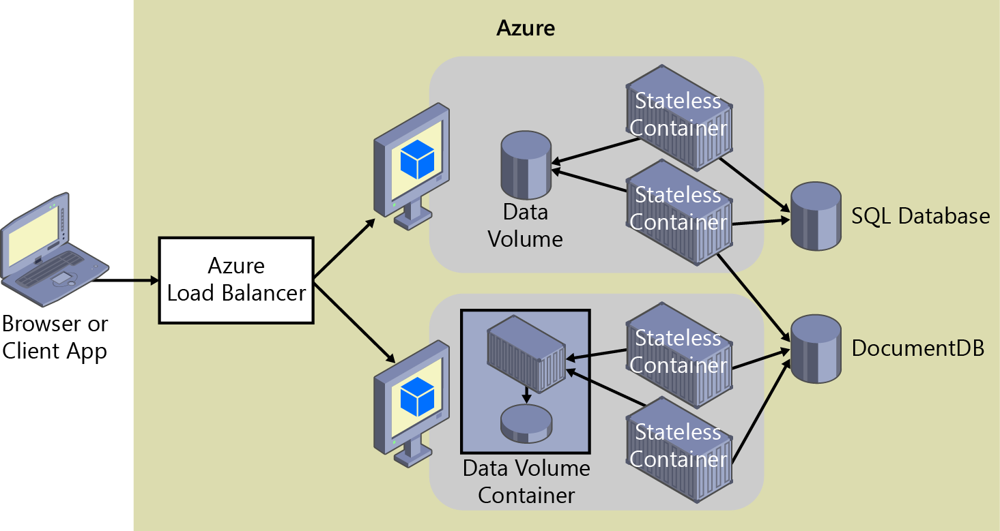

# State and data in Docker applications

A primitive of containers is immutability. When compared to a VM, containers don't disappear as a common occurrence. A VM might fail in various forms from dead processes, overloaded CPU, or a full or failed disk. Yet, we expect the VM to be available and RAID drives are commonplace to assure drive failures maintain data.

However, containers are thought to be instances of processes. A process doesn't maintain durable state. Even though a container can write to its local storage, assuming that that instance will be around indefinitely would be equivalent to assuming a single-copy memory will be durable. You should assume that containers, like processes, are duplicated, killed, or, when managed with a container orchestrator, they might be moved.

Docker uses a feature known as an *overlay file system* to implement a copy-on-write process that stores any updated information to the root file system of a container, compared to the original image on which it is based. These changes are lost if the container is subsequently deleted from the system. A container, therefore, does not have persistent storage by default. Although it's possible to save the state of a container, designing a system around this would be in conflict with the principle of container architecture.

To manage persistent data in Docker applications, there are common solutions:

-   [**Data volumes**](https://docs.docker.com/engine/tutorials/dockervolumes/) These mount to the host, as just noted.

-   [**Data volume containers**](https://docs.docker.com/engine/tutorials/dockervolumes/#/creating-and-mounting-a-data-volume-container) These provide shared storage across containers, using an external container that can cycle.

-   [**Volume Plugins**](https://docs.docker.com/engine/tutorials/dockervolumes/#/mount-a-shared-storage-volume-as-a-data-volume) These mount volumes to remote locations, providing long-term persistence.

-   **Remote data sources** Examples include SQL and NO-SQL databases or cache services like Redis.

-   [**Azure Storage**](https://docs.microsoft.com/azure/storage/) This provides geo distributable platform as a service (PaaS) storage, providing the best of containers as long-term persistence.

Data volumes are specially designated directories within one or more containers that bypass the [Union File System](https://docs.docker.com/v1.8/reference/glossary#union-file-system). Data volumes are designed to maintain data, independent of the container's life cycle. Docker therefore never automatically deletes volumes when you remove a container, nor will it "garbage collect" volumes that are no longer referenced by a container. The host operating system can browse and edit the data in any volume freely, which is just another reason to use data volumes sparingly.

A [data volume container](https://docs.docker.com/v1.8/userguide/dockervolumes/) is an improvement over regular data volumes. It is essentially a dormant container that has one or more data volumes created within it (as described earlier). The data volume container provides access to containers from a central mount point. The benefit of this method of access is that it abstracts the location of the original data, making the data container a logical mount point. It also allows "application" containers accessing the data container volumes to be created and destroyed while keeping the data persistent in a dedicated container.

Figure 4-5 shows that regular Docker volumes can be placed on storage out of the containers themselves but within the host server/VM physical boundaries. *Docker volumes don't have the ability to use a volume from one host server/VM to another*.

Figure 4-5: Data volumes and external data sources for containers apps/containers

Due to the inability to manage data shared between containers that run on separate physical hosts, it is recommended that you not use volumes for business data unless the Docker host is a fixed host/VM, because when using Docker containers in an orchestrator, containers are expected to be moved from one to another host, depending on the optimizations to be performed by the cluster.

Therefore, regular data volumes are a good mechanism to work with trace files, temporal files, or any similar concept that won't affect the business data consistency if or when your containers are moved across multiple hosts.

Volume plug-ins like [Flocker](https://clusterhq.com/flocker/) provide data across all hosts in a cluster. Although not all volume plug-ins are created equally, volume plug-ins typically provide externalized persistent reliable storage from the immutable containers.

Remote data sources and caches like SQL Database, DocumentDB, or a remote cache like Redis would be the same as developing without containers. This is one of the preferred, and proven, ways to store business application data.

>[!div class="step-by-step"]
[Previous] (monolithic-applications.md)
[Next] (soa-applications.md)
