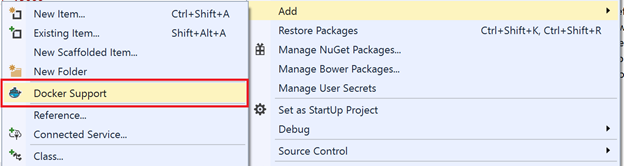
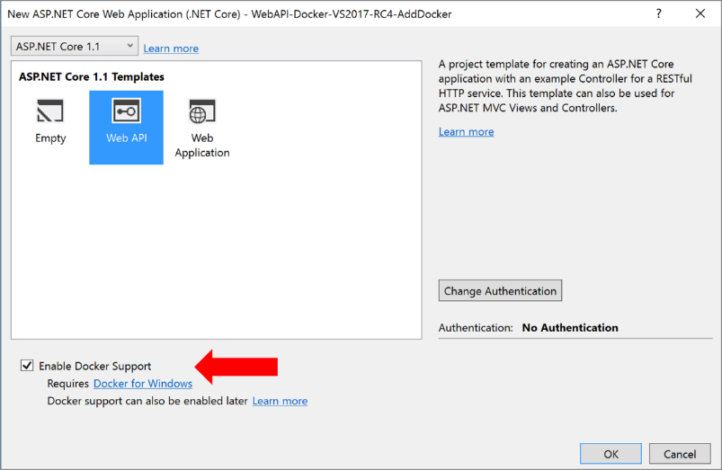

# Using Visual Studio Tools for Docker (Visual Studio on Windows)

The developer workflow when using Visual Studio Tools for Docker is similar to the workflow when using Visual Studio Code and Docker CLI (in fact, it is based on the same Docker CLI), but it is easier to get started, simplifies the process, and provides greater productivity for the build, run, and compose tasks. It's also able to execute and debug your containers via simple actions like F5 and Ctrl+F5 from Visual Studio. Even more, with Visual Studio 2017, in addition to being able to run and debug a single container, you also can run and debug a group of containers (a whole solution) at the same time if they are defined in the same docker-compose.yml file at the solution level.

## Configuring your local environment

With the latest versions of Docker for Windows, it is easier than ever to develop Docker applications because the setup is straightforward, as explained in the following references.

**More info:** To learn more about installing Docker for Windows, go to <https://docs.docker.com/docker-for-windows/>.

If you're using Visual Studio 2015, you must have Update 3 or a later version plus the Visual Studio Tools for Docker.

**More info:** For instructions on installing Visual Studio, go to [https://www.visualstudio.com/\
products/vs-2015-product-editions](https://www.visualstudio.com/products/vs-2015-product-editions).

To see more about installing Visual Studio Tools for Docker, go to <http://aka.ms/vstoolsfordocker> and <https://docs.microsoft.com/aspnet/core/host-and-deploy/docker/visual-studio-tools-for-docker>.

If you're using Visual Studio 2017, Docker support is already included.

## Using Docker Tools in Visual Studio 2015

The Visual Studio Tools for Docker provides a consistent way to develop and validate locally your Docker containers for Linux in a Linux Docker host or VM, or your Windows Containers directly on Windows.

If you're using a single container, the first thing you need to begin is to turn on Docker support into your .NET Core project. To do this, right-click your project file, as shown in Figure 4-25.

Figure 4-25: Turning on Docker support for your Visual Studio project

## Using Docker Tools in Visual Studio 2017

When you add Docker support to a service project in your solution (see Figure 4-26), Visual Studio is not just adding a DockerFile file to your project, it also is adding a service section in your solution's docker-compose.yml files (or creating the files if they didn't exist). It's an easy way to begin composing your multicontainer solution; you then can open the docker-compose.yml files and update them with additional features.

Figure 4-26: Turning on Docker Solution support in a Visual Studio 2017 project

This action not only adds the DockerFile to your project, it also adds the required configuration lines of code to a global docker-compose.yml set at the solution level.

You also can turn on Docker support when creating an ASP.NET Core project in Visual Studio 2017, as shown in Figure 4-27.

Figure 4-27: Turning on Docker support when creating a project

After you add Docker support to your solution in Visual Studio, you also will see a new node tree in Solution Explorer with the added docker-compose.yml files, as depicted in Figure 4-28.

Figure 4-28: docker-compose.yml files now display in Solution Explorer

You could deploy a multicontainer application by using a single docker-compose.yml file when you run docker-compose up; however, Visual Studio adds a group of them, so you can override values depending on the environment (development versus production) and the execution type (release versus debug). This capability will be better explained in later chapters.

**More info:** For further details on the services implementation and use of Visual Studio Tools for Docker, read the following articles:

Build, debug, update, and refresh apps in a local Docker container: [https://docs.microsoft.com/azure/vs-azure-tools-docker-edit-and-refresh/](https://docs.microsoft.com/azure/vs-azure-tools-docker-edit-and-refresh)

Deploy an ASP.NET container to a remote Docker host: [https://docs.microsoft.com/azure/vs-azure-tools-docker-hosting-web-apps-in-docker/](https://docs.microsoft.com/azure/vs-azure-tools-docker-hosting-web-apps-in-docker)

>[!div class="step-by-step"]
[Previous] (docker-apps-inner-loop-workflow.md)
[Next] (set-up-windows-containers-with-powershell.md)
