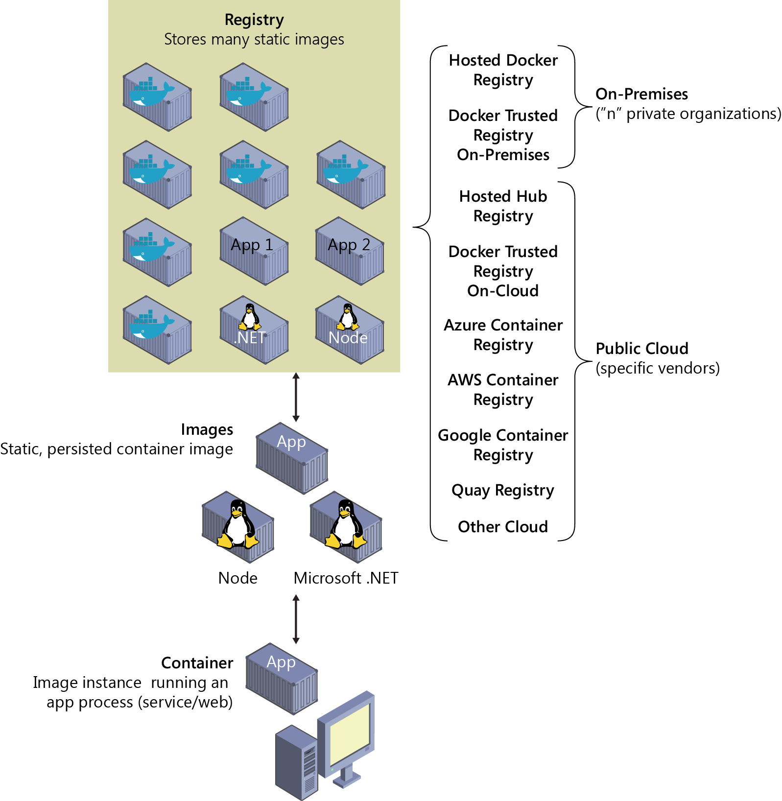

# Docker containers, images, and registries

When using Docker, you create an app or service and package it and its dependencies into a container image. An image is a static representation of the app or service and its configuration and dependencies.

To run the app or service, the app's image is instantiated to create a container, which will be running on the Docker host. Containers are initially tested in a development environment or PC.

You store images in a registry, which acts as a library of images. You need a registry when deploying to production orchestrators. Docker maintains a public registry via [Docker Hub](https://hub.docker.com/); other vendors provide registries for different collections of images. Alternatively, enterprises can have a private registry on-premises for their own Docker images.

Figure 1-4 shows how images and registries in Docker relate to other components. It also shows the multiple registry offerings from vendors.

Figure 1-4: Taxonomy of Docker terms and concepts

By putting images in a registry, you can store static and immutable application bits, including all of their dependencies, at a framework level. You then can version and deploy images in multiple environments and thus provide a consistent deployment unit.

Private image registries, either hosted on-premises or in the cloud, are recommended for the following situations:

-   Your images must not be shared publicly due to confidentiality.

-   You want to have minimum network latency between your images and your chosen deployment environment. For example, if your production environment is Azure, you probably want to store your images in Azure Container Registry so that network latency will be minimal. In a similar way, if your production environment is on-premises, you might want to have an on-premises Docker Trusted Registry available within the same local network.

>[!div class="step-by-step"]
[Previous] (docker-terminology.md)
[Next] (Docker-application-lifecycle/index.md)
