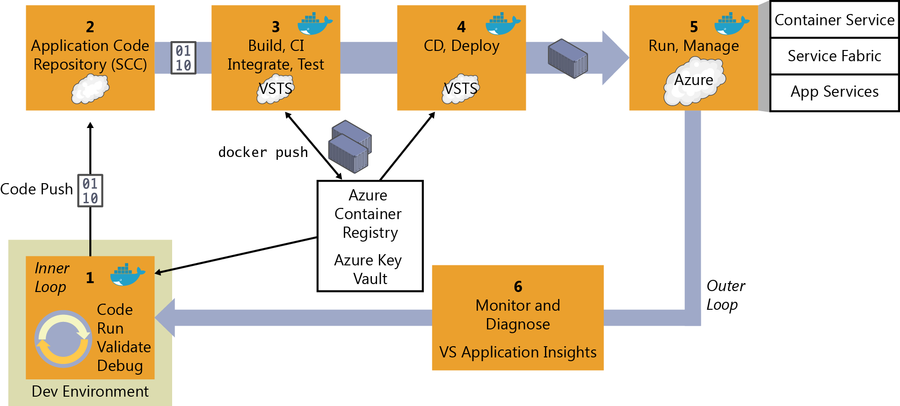
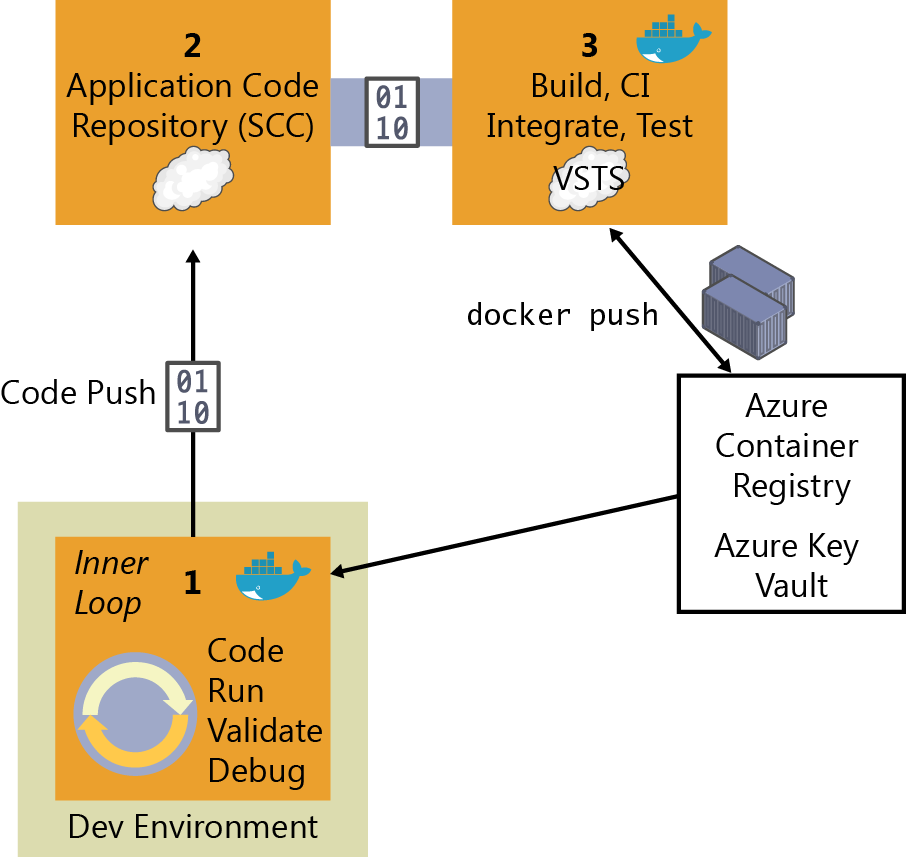
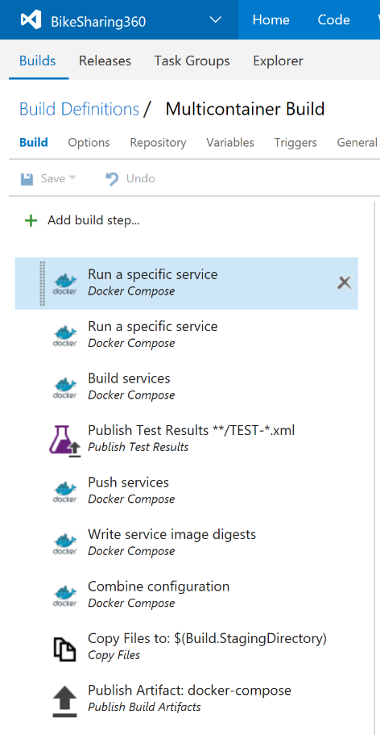
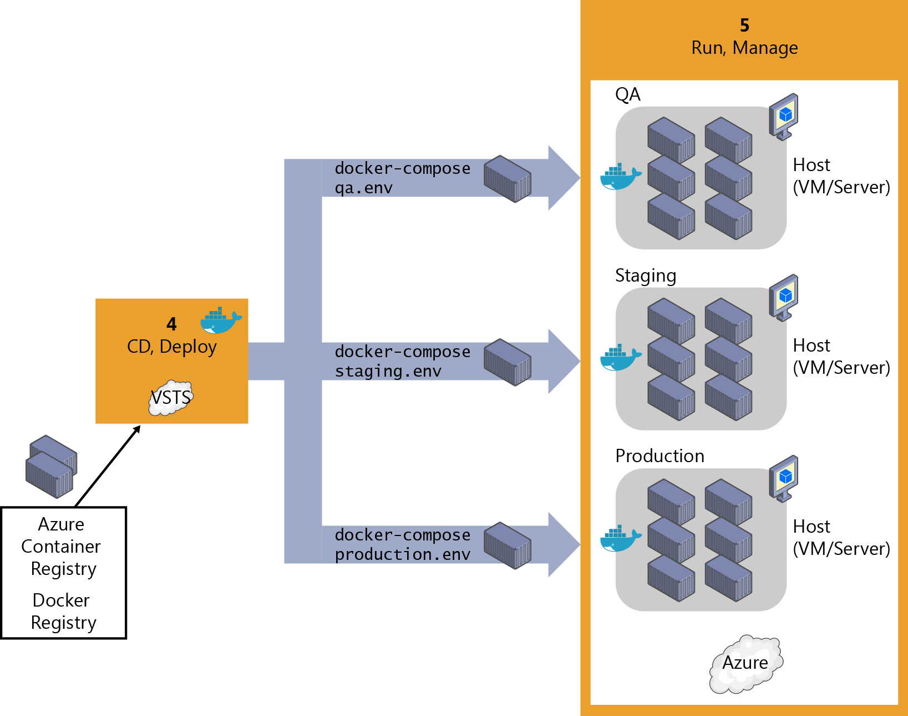
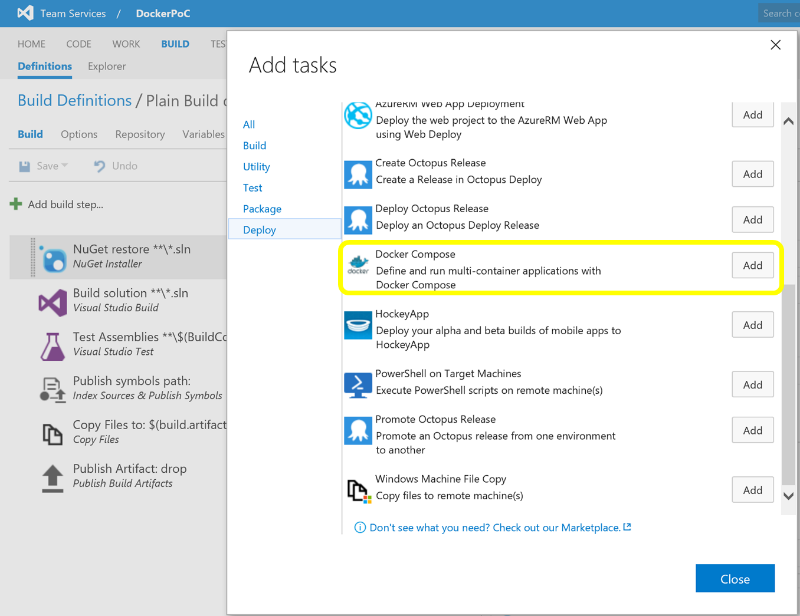
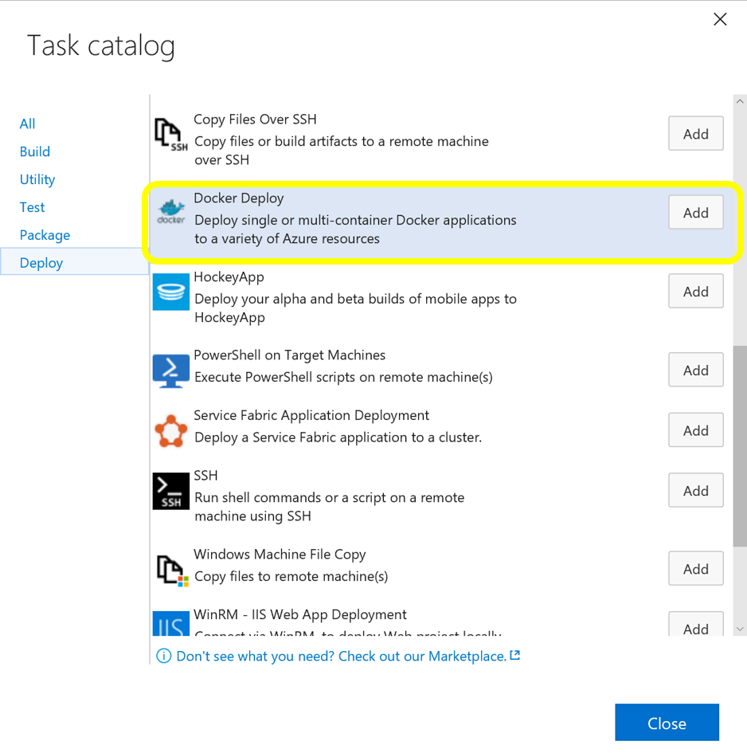
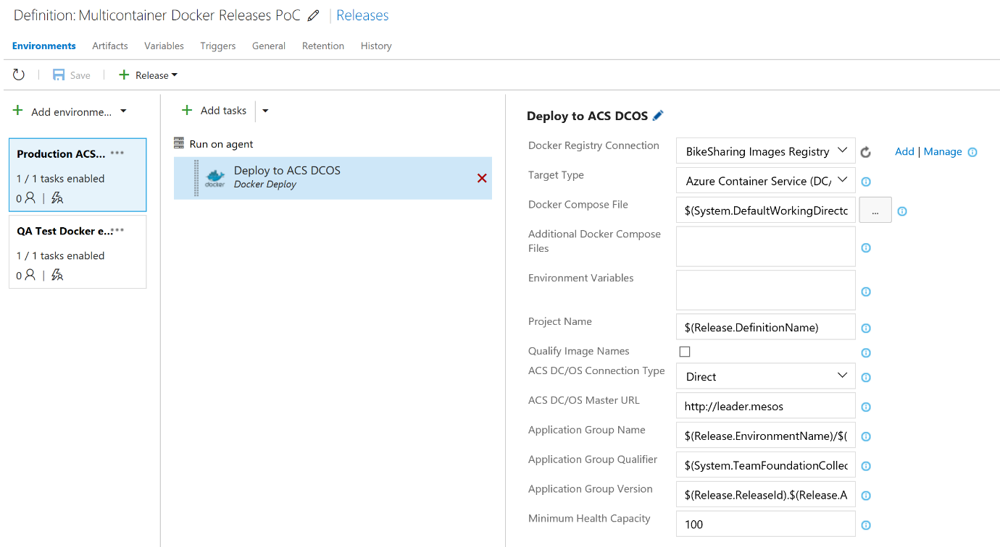

# Steps in the outer-loop DevOps workflow for a Docker application

Figure 5-1 presents an end-to-end depiction of the steps comprising the DevOps outer-loop workflow.

Figure 5-1: DevOps outer-loop workflow for Docker applications with Microsoft tools

Now, let's examine each of these steps in greater detail.

## Step 1: Inner-loop development workflow

This step is explained in detail in Chapter 4, but, to recap, here is where the outer-loop begins, the moment at which a developer pushes code to the source control management system (like Git) initiating CI pipeline actions.

## Step 2: Source-Code Control integration and management with Visual Studio Team Services and Git

At this step, you need to have a version-control system to gather a consolidated version of all the code coming from the different developers in the team.

Even though source-code control (SCC) and source-code management might seem second-nature to most developers, when creating Docker applications in a DevOps life cycle, it is critical to emphasize that you must not submit the Docker images with the application directly to the global Docker Registry (like Azure Container Registry or Docker Hub) from the developer's machine. On the contrary, the Docker images to be released and deployed to production environments must be created solely on the source code that is being integrated in your global build or CI pipeline based on your source-code repository (like Git).

The local images generated by the developers themselves should be used just by the developers when testing within their own machines. This is why it is critical to have the DevOps pipeline activated from the SCC code.

Visual Studio Team Services and Team Foundation Server support Git and Team Foundation Version Control. You can choose between them and use it for an end-to-end Microsoft experience. However, you also can manage your code in external repositories (like GitHub, on-premises Git repositories, or Subversion) and still be able to connect to it and get the code as the starting point for your DevOps CI pipeline.

## Step 3: Build, CI, Integrate, and Test with Visual Studio Team Services and Docker

CI has emerged as a standard for modern software testing and delivery. The Docker solution maintains a clear separation of concerns between the development and operations teams. The immutability of Docker images ensures a repeatable deployment between what's developed, tested through CI, and run in production. Docker Engine deployed across the developer laptops and test infrastructure makes the containers portable across environments.

At this point, after you have a version-control system with the correct code submitted, you need a *build service* to pick up the code and run the global build and tests.

The internal workflow for this step (CI, build, test) is about the construction of a CI pipeline consisting of your code repository (Git, etc.), your build server (Visual Studio Team Services), Docker Engine, and a Docker Registry.

You can use Visual Studio Team Services as the foundation for building your applications and setting your CI pipeline, and for publishing the built "artifacts" to an "artifacts repository," which is explained in the next step.

When using Docker for the deployment, the "final artifacts" to be deployed are Docker images with your application or services embedded within them. Those images are pushed or published to a *Docker Registry* (a private repository like the ones you can have in Azure Container Registry, or a public one like Docker Hub Registry, which is commonly used for official base images).

Here is the basic concept: The CI pipeline will be kicked-off by a commit to an SCC repository like Git. The commit will cause Visual Studio Team Services to run a build job within a Docker container and, upon successful completion of that job, push a Docker image to the Docker Registry, as illustrated in Figure 5-2.

Figure 5-2: The steps involved in CI

Here are the basic CI workflow steps with Docker and Visual Studio Team Services:

1.  The developer pushes a commit to an SCC repository (Git/Visual Studio Team Services, GitHub, etc.).

2.  If you're using Visual Studio Team Services or Git, CI is built in, which means that it is as simple as selecting a check box in Visual Studio Team Services. If you're using an external SCC (like GitHub), a *webhook* will notify Visual Studio Team Services of the update or push to Git/GitHub.

3.  Visual Studio Team Services pulls the SCC repository, including the DockerFile describing the image as well as the application and test code.

4.  Visual Studio Team Services builds a Docker image and labels it with a build number.

5.  Visual Studio Team Services instantiates the Docker container within the provisioned Docker Host, and runs the appropriate tests.

6.  If the tests are successful, the image is first relabeled to a meaningful name so that you know it is a "blessed build" (like "/1.0.0" or any other label), and then pushed up to your Docker Registry (Docker Hub, Azure Container Registry, DTR, etc.)

### Implementing the CI pipeline with Visual Studio Team Services and the Docker extension for Visual Studio Team Services

The [Visual Studio Team Services Docker extension](https://aka.ms/vstsdockerextension) adds a task to your CI pipeline with which you can build Docker images, push Docker images to an authenticated Docker registry, run Docker images, or run other operations offered by the Docker CLI. It also adds a Docker Compose task that you can use to build, push, and run multicontainer Docker applications, or run other operations offered by the Docker Compose CLI, as shown in Figure 5-3.

Figure 5-3: The Docker CI pipeline in Visual Studio Team Services

The Docker extension can use service endpoints for Docker hosts and for container or image registries. The tasks default to using a local Docker host if available (this currently requires a custom Visual Studio Team Services agent); otherwise, they require that you provide a Docker host connection. Actions that depend on being authenticated with a Docker registry, such as pushing an image, require that you provide a Docker registry connection.

The Visual Studio Team Services Docker extension installs the following components in your Visual Studio Team Services account:

-   A service endpoint for connecting to a Docker registry

-   A service endpoint for connecting to a Docker Container Host

-   A Docker task to do the following:

-   Build an image

-   Push an image or a repository to a registry

-   Run an image in a container

-   Run a Docker command

-   A Docker Compose task to run a Docker Compose command

With these Visual Studio Team Services tasks, a build Linux-Docker Host/VM provisioned in Azure and your preferred Docker registry (Azure Container Registry, Docker Hub, private Docker DTR, or any other Docker registry) you can assemble your Docker CI pipeline in a very consistent way.

***Requirements:***

-   Visual Studio Team Services, or for on-premises installations, Team Foundation Server 2015 Update 3 or later.

-   A Visual Studio Team Services agent that has the Docker binaries.

An easy way to create one of these is to use Docker to run a container based on the Visual Studio Team Services agent Docker image.

**More info** To read more about assembling a Visual Studio Team Services Docker CI pipeline and to view walkthroughs, visit the following sites:

Running a Visual Studio Team Services agent as a Docker container: [https://hub.docker.com/r/\
microsoft/vsts-agent/](https://hub.docker.com/r/microsoft/vsts-agent/)

VSTS Docker extension: <https://aka.ms/vstsdockerextension>

Building .NET Core Linux Docker images with Visual Studio Team Services: <https://blogs.msdn.microsoft.com/stevelasker/2016/06/13/building-net-core-linux-docker-images-with-visual-studio-team-services/>

Building a Linux-based Visual Studio Team Service build machine with Docker support: <http://donovanbrown.com/post/2016/06/03/Building-a-Linux-Based-Visual-Studio-Team-Service-Build-Machine-with-Docker-Support>

### Integrate, test, and validate multicontainer Docker applications

Typically, most Docker applications are composed of multiple containers rather than a single container. A good example is a microservices-oriented application for which you would have one container per microservice. But, even without strictly following the microservices approach patterns, it is very probable that your Docker application would be composed of multiple containers or services.

Therefore, after building the application containers in the CI pipeline, you also need to deploy, integrate, and test the application as a whole with all of its containers within an integration Docker host or even into a test cluster to which your containers are distributed.

If you're using a single host, you can use Docker commands such as docker-compose to build and deploy related containers to test and validate the Docker environment in a single VM. But, if you are working with an orchestrator cluster like DC/OS, Kubernetes, or Docker Swarm, you need to deploy your containers through a different mechanism or orchestrator, depending on your selected cluster/scheduler.

Following are several types of tests that you can run against Docker containers:

-   Unit tests for Docker containers

-   Testing groups of interrelated applications or microservices

-   Test in production and "canary" releases

The important point is that when running integration and functional tests, you must run those tests from outside of the containers. Tests must not be defined and run within the containers that you are deploying, because the containers are based on static images that should be exactly like those that you will be deploying into production.

A very feasible option when testing more advanced scenarios like testing several clusters (test cluster, staging cluster, and production cluster) is to publish the images to a registry to test in various clusters.

### Push the custom application Docker image into your global Docker Registry

After the Docker images have been tested and validated, you'll want to tag and publish them to your Docker registry. The Docker registry is a critical piece in the Docker application life cycle because it is the central place where you store your custom test (aka "blessed images") to be deployed into QA and production environments.

Similar to how the application code stored in your SCC repository (Git, etc.) is your "source of truth," the Docker registry is your "source of truth" for your binary application or bits to be deployed to the QA or production environments.

Typically, you might want to have your private repositories for your custom images either in a private repository in Azure Container Registry or in an on-premises registry like Docker Trusted Registry, or in a public-cloud registry with restricted access (like Docker Hub), although in this last case if your code is not open source, you must trust the vendor's security. Either way, the method by which you do this is pretty similar and ultimately based on the docker push command, as depicted in Figure 5-4.

Figure 5-4: Publishing custom images to Docker Registry

There are multiple offerings of Docker registries from cloud vendors like Azure Container Registry, Amazon Web Services Container Registry, Google Container Registry, Quay Registry, and so on.

Using the Visual Studio Team Services Docker extension, you can push a set of service images defined by a docker-compose.yml file, with multiple tags, to an authenticated Docker registry (like Azure Container Registry), as shown in Figure 5-5.

Figure 5-5: Using Visual Studio Team Services to publishing custom images to a Docker Registry

**More info** To read more about the Docker extension for Visual Studio Team Services, go to <https://aka.ms/vstsdockerextension>. To learn more about Azure Container Registry, go to <https://aka.ms/azurecontainerregistry>.

## Step 4: CD, Deploy

The immutability of Docker images ensures a repeatable deployment with what's developed, tested through CI, and run in production. After you have the application Docker images published in your Docker registry (either private or public), you can deploy them to the several environments that you might have (production, QA, staging, etc.) from your CD pipeline by using Visual Studio Team Services pipeline tasks or Visual Studio Team Services Release Management.

However, at this point it depends on what kind of Docker application you are deploying. Deploying a simple application (from a composition and deployment point of view) like a monolithic application comprising a few containers or services and deployed to a few servers or VMs is very different from deploying a more complex application like a microservices-oriented application with hyperscale capabilities. These two scenarios are explained in the following sections.

### Deploying composed Docker applications to multiple Docker environments

Let's look first at the less-complex scenario: deploying to simple Docker hosts (VMs or servers) in a single environment or multiple environments (QA, staging, and production). In this scenario, internally your CD pipeline can use docker-compose (from your Visual Studio Team Services deployment tasks) to deploy the Docker applications with its related set of containers or services, as illustrated in Figure 5-6.

Figure 5-6: Deploying application containers to simple Docker host environments registry

Figure 5-7 highlights how you can connect your build CI to QA/test environments via Visual Studio Team Services by clicking Docker Compose in the Add Task dialog box. However, when deploying to staging or production environments, you would usually use Release Management features handling multiple environments (like QA, staging, and production). If you're deploying to single Docker hosts, it is using the Visual Studio Team Services "Docker Compose" task (which is invoking the docker-compose up command under the hood). If you're deploying to Azure Container Service, it uses the Docker Deployment task, as explained in the section that follows.

Figure 5-7: Adding a Docker Compose task in a Visual Studio Team Services pipeline

When you create a release in Visual Studio Team Services, it takes a set of input artifacts. These are intended to be immutable throughout the lifetime of the release across multiple environments. When you introduce containers, the input artifacts identify images in a registry to deploy. Depending on how these are identified, they are not guaranteed to remain the same throughout the duration of the release, the most obvious case being when you reference "myimage:latest" from a docker-compose file.

The Docker extension for Visual Studio Team Services gives you the ability to generate build artifacts that contain specific registry image digests that are guaranteed to uniquely identify the same image binary. These are what you really want to use as input to a release.

### Managing releases to Docker environments by using Visual Studio Team Services Release Management

Through the Visual Studio Team Services extensions, you can build a new image, publish it to a Docker registry, run it on Linux or Windows hosts, and use commands such as docker-compose to deploy multiple containers as an entire application, all through the Visual Studio Team Services Release Management capabilities intended for multiple environments, as shown in Figure 5-8.

Figure 5-8: Configuring Visual Studio Team Services Docker Compose tasks from Visual Studio Team Services Release Management

However, keep in mind that the scenario shown in Figure 5-6 and implemented in Figure 5-8 is pretty basic (it is deploying to simple Docker hosts and VMs, and there will be a single container or instance per image) and probably should be used only for development or test scenarios. In most enterprise production scenarios, you would want to have High Availability (HA) and easy-to-manage scalability by load balancing across multiple nodes, servers, and VMs, plus "intelligent failovers" so that if a server or node fails, its services and containers will be moved to another host server or VM. In that case, you need more advanced technologies like container clusters, orchestrators, and schedulers. Thus, the way to deploy to those clusters is precisely through the advanced scenarios explained in the next section.

### Deploying complex Docker applications to Docker clusters (DC/OS, Kubernetes, and Docker Swarm)

The nature of distributed applications requires compute resources that are also distributed. To have production-scale capabilities, you need to have clustering capabilities that provide high scalability and HA based on pooled resources.

You could deploy containers manually to those clusters from a CLI tool such as Docker Swarm (like using [docker service create](https://docs.docker.com/engine/swarm/swarm-tutorial/deploy-service/)) or a web UI such as [Mesosphere Marathon](https://mesosphere.github.io/marathon/docs/marathon-ui.html) for DC/OS clusters, but you should reserve that only for punctual deployment testing or for management purposes like scaling-out or monitoring purposes.

From a CD point of view, and Visual Studio Team Services specifically, you can run specially made deployment tasks from your Visual Studio Team Services Release Management environments which will deploy your containerized applications to distributed clusters in Container Service, as illustrated in Figure 5-9.

Figure 5-9: Deploying distributed applications to Container Service

Initially, when deploying to certain clusters or orchestrators, you would traditionally use specific deployment scripts and mechanisms per each orchestrator (that is, Mesosphere DC/OS or Kubernetes have different deployment mechanisms than Docker and Docker Swarm) instead of the simpler and easy-to-use docker-compose tool based on the docker-compose.yml definition file. However, thanks to the Microsoft Visual Studio Team Services Docker Deploy task, shown in Figure 5-10, you now also can deploy to DC/OS by just using your familiar docker-compose.yml file because Microsoft performs that "translation" for you (from your docker-compose.yml file to other formats needed by DC/OS).

Figure 5-10: Adding the Docker Deploy task to your Environment RM

Figure 5-11 demonstrates how you can edit the Docker Deploy task and specify the Target Type (Azure Container Service DC/OS, in this case), your Docker Compose File, and the Docker Registry connection (like Azure Container Registry or Docker Hub). This is where the task will retrieve your ready-to-use custom Docker images to be deployed as containers in the DC/OS cluster.

Figure 5-11: Docker Deploy task definition deploying to Azure Container Service DC/OS

**More info** To read more about the CD pipeline with Visual Studio Team Services and Docker, visit the following sites:

Visual Studio Team Services extension for Docker and Azure Container Service: [https://aka.ms/\
vstsdockerextension](https://aka.ms/vstsdockerextension)

Azure Container Service: <https://aka.ms/azurecontainerservice>

Mesosphere DC/OS: <https://mesosphere.com/product/>

## Step 5: Run and manage

Because running and managing applications at enterprise-production level is a major subject in and of itself, and due to the type of operations and people working at that level (IT operations) as well as the large scope of this area, we have devoted the entire next chapter to explaining it.

## Step 6: Monitor and diagnose

This topic also is covered in the next chapter as part of the tasks that IT operations performs in production systems; however, is important to highlight that the insights obtained in this step must feed back to the development team so that the application is constantly improved. From that point of view, it is also part of DevOps, although the tasks and operations are usually performed by IT.

Only when monitoring and diagnostics are 100 percent within the realm of DevOps are the monitoring processes and analytics performed by the development team against testing or beta environments. This is done either by performing load testing or simply by monitoring beta or QA environments, where beta testers are trying the new versions.

>[!div class="step-by-step"]
[Previous] (index.md)
[Next] (../run-manage-monitor-docker-environments/index.md)
