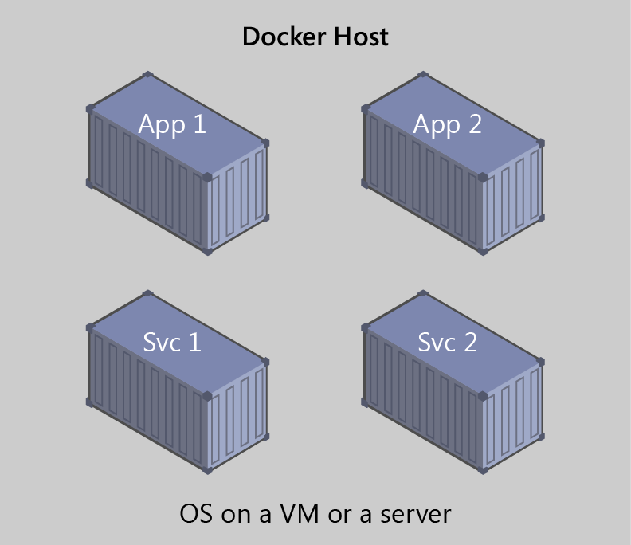

# Introduction to containers and Docker

Containerization is an approach to software development in which an application or service, its dependencies, and its configuration (abstracted as deployment manifest files) are packaged together as a container image. You then can test the containerized application as a unit and deploy it as a container image instance to the host operating system.

Just as the shipping industry uses standardized containers to move goods by ship, train, or truck, regardless of the cargo within them, software containers act as a standard unit of software that can contain different code and dependencies. Placing software into containers makes it possible for developers and IT professionals to deploy those containers across environments with little or no modification.

Containers also isolate applications from one another on a shared operating system (OS). Containerized applications run on top of a container host, which in turn runs on the OS (Linux or Windows). Thus, containers have a significantly smaller footprint than virtual machine (VM) images.

Each container can run an entire web application or a service, as shown in Figure 1-1.

Figure 1-1: Multiple containers running on a container host

In this example, Docker Host is a container host, and App 1, App 2, Svc 1, and Svc 2 are containerized applications or services.

Another benefit you can derive from containerization is scalability. You can scale-out quickly by creating new containers for short-term tasks. From an application point of view, *instantiating an image* (creating a container) is similar to instantiating a process like a service or web app. For reliability, however, when you run multiple instances of the same image across multiple host servers, you typically want each container (image instance) to run in a different host server or VM in different fault domains.

In short, containers offer the benefits of isolation, portability, agility, scalability, and control across the entire application life cycle workflow. The most important benefit is the isolation provided between Dev and Ops.

>[!div class="step-by-step"]
[Next] (what-is-docker.md)
