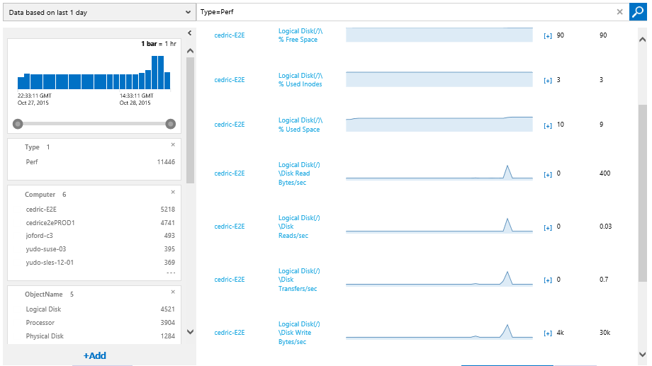

# Monitor containerized application services

It is critical for applications split into multiple containers and microservices to have a way to monitor and analyze the behavior of the application.

## Microsoft Application Insights

[Application Insights](https://docs.microsoft.com/azure/application-insights/app-insights-overview) is an extensible analytics service that monitors your live application. It helps you to detect and diagnose performance issues and to understand what users actually do with your app. It's designed for developers, with the intent of helping you to continuously improve the performance and usability of your services or applications. Application Insights works with both web/services and standalone apps on a wide variety of platforms like .NET, Java, Node.js and many other platforms, hosted on-premises or in the cloud.

### Analyzing Docker apps in QA environments using Application Insights

As it pertains to Docker, you can chart life-cycle events and performance counters from Docker containers on Application Insights. You just need to run the [Application Insights Docker image](https://hub.docker.com/r/microsoft/applicationinsights/) as a container in your host, and it will display performance counters for the host as well as for the other Docker images. This Application Insights Docker image (Figure 6-1) helps you to monitor your containerized applications by collecting telemetry about the performance and activity of your Docker host (that is, your Linux VMs), Docker containers and the applications running within them.

Figure 6-1: Application Insights monitoring Docker hosts and containers

When you run the [Application Insights Docker image](https://hub.docker.com/r/microsoft/applicationinsights/) on your Docker host, you benefit from the following:

-   Life-cycle telemetry about all the containers running on the host—start, stop, and so on.

-   Performance counters for all the containers: CPU, memory, network usage, and more.

-   If you also installed [Application Insights SDK](https://docs.microsoft.com/azure/application-insights/app-insights-asp-net) in the apps running in the containers, all the telemetry of those apps will have additional properties identifying the container and host machine. So, for example, if you have instances of an app running in more than one host, you'll easily be able to filter your app telemetry by host.

### Setting up Application Insights to monitor Docker applications and Docker hosts

To create an Application Insights resource, follow the instructions in the articles presented in the list that follows. Azure Portal will create the necessary script for you.

-   **Monitor Docker applications in Application Insights:**  [https://docs.microsoft.com/azure/application-insights/app-insights-docker](https://docs.microsoft.com/azure/application-insights/app-insights-docker)

-   **Application Insights Docker image at Docker Hub and Github:**  
[https://hub.docker.com/r/microsoft/applicationinsights/](https://hub.docker.com/r/microsoft/applicationinsights/) and <https://github.com/Microsoft/ApplicationInsights-Docker>

-   **Set up Application Insights for ASP.NET:**  
[https://docs.microsoft.com/azure/application-insights/app-insights-asp-net](https://docs.microsoft.com/azure/application-insights/app-insights-asp-net)

-   **Application Insights for web pages:**  
<https://docs.microsoft.com/azure/application-insights/app-insights-javascript>

## Microsoft Operations Management Suite

[Operations Management Suite](http://microsoft.com/oms) is a simplified IT management solution that provides log analytics, automation, backup, and site recovery. Based on [queries](https://blogs.technet.microsoft.com/msoms/2016/01/21/easy-microsoft-operations-management-suite-search-queries/) in Operations Management Suite, you can raise [alerts](https://docs.microsoft.com/azure/operations-management-suite/operations-management-suite-monitoring-alerts) and set remediation via [Azure Automation](https://docs.microsoft.com/azure/automation/). It also seamlessly integrates with your existing management solutions to provide a single pane-of-glass view. Operations Management Suite helps you to manage and protect your on-premises and cloud infrastructure.

### [Operations Management Suite](http://microsoft.com/oms) Container Solution for Docker

In addition to providing valuable services on its own, the Operations Management Suite Container Solution can manage and monitor Docker hosts and containers by showing information about where your containers and container hosts are, which containers are running or failed, and Docker daemon and container logs sent to *stdout* and *stderr*. It also shows performance metrics such as CPU, memory, network, and storage for the container and hosts to help you troubleshoot and find noisy neighbor containers.

Figure 6-2: Information about Docker containers shown by Operations Management Suite

Application Insights and Operations Management Suite both focus on monitoring activities; however, Application Insights focuses more on monitoring the apps themselves thanks to its SDK running within the app. However, Operations Management Suite focuses much more on the infrastructure around the hosts, plus it offers deep analysis on logs at scale while providing a very flexible data-driven search/query system.

Because Operations Management Suite is implemented as a cloud-based service, you can have it up and running quickly with minimal investment in infrastructure services. New features are delivered automatically, saving you from ongoing maintenance and upgrade costs.

Using Operations Management Suite Container Solution, you can do the following:

-   Centralize and correlate millions of logs from Docker containers at scale

-   See information about all container hosts in a single location

-   Know which containers are running, what image they're running, and where they're running

-   Quickly diagnose "noisy neighbor" containers that can cause problems on container hosts

-   See an audit trail for actions on containers

-   Troubleshoot by viewing and searching centralized logs without remoting to the Docker hosts

-   Find containers that might be "noisy neighbors" and consuming excess resources on a host

-   View centralized CPU, memory, storage, and network usage and performance information for containers

-   Generate test Docker containers with Azure Automation

You can see performance information by running queries like Type=Perf, as shown in Figure 6-3.

{width="5.78625in" height="3.25in"}

Figure 6-3: Performance metrics of Docker hosts shown by Operations Management Suite

Saving queries is also a standard feature in Operations Management Suite and can help you keep queries you've found useful and discover trends in your system.

**More info** To find information on installing and configuring the Docker container solution in [Operations Management Suite](http://microsoft.com/oms), go to <https://docs.microsoft.com/azure/log-analytics/log-analytics-containers>.

>[!div class="step-by-step"]
[Previous] (manage-production-docker-environments.md)
[Next] (../key-takeaways/index.md)
