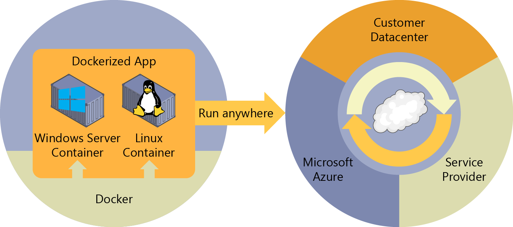

# What is Docker?

[Docker](https://www.docker.com/) is an [open-source project](https://github.com/docker/docker) for automating the deployment of applications as portable, self-sufficient containers that can run in the cloud or on-premises (see Figure 1-2). Docker is also a [company](https://www.docker.com/) that promotes and develops this technology, working in collaboration with cloud, Linux, and Windows vendors, including Microsoft.

Figure 1-2: Docker deploys containers at all layers of the hybrid cloud

Docker image containers can run natively on Linux and Windows. However, Windows images can run only on Windows hosts and Linux images can run only on Linux hosts, meaning a host server or a VM.

Developers can use development environments on Windows, Linux, or macOS. On the development computer, the developer runs a Docker host to which Docker images are deployed, including the app and its dependencies. Developers who work on Linux or on the Mac use a Docker host that is Linux based, and they can create images only for Linux containers. (Developers working on the Mac can edit code or run the Docker command-line interface \[CLI\] from macOS, but, as of this writing, containers do not run directly on macOS.) Developers who work on Windows can create images for either Linux or Windows Containers.

To host containers in development environments and provide additional developer tools, Docker ships [Docker Community Edition (CE)](https://www.docker.com/community-edition) for Windows or for macOS. These products install the necessary VM (the Docker host) to host the containers. Docker also makes available [Docker Enterprise Edition (EE)](https://www.docker.com/enterprise-edition), which is designed for enterprise development and is used by IT teams who build, ship, and run large business-critical applications in production.

To run [Windows Containers](https://msdn.microsoft.com/virtualization/windowscontainers/about/about_overview), there are two types of runtimes:

-   **Windows Server Container** This runtime provides application isolation through process and namespace isolation technology. A Windows Server Container shares a kernel with the container host and with all containers running on the host.

-   **Hyper-V Container** This expands on the isolation provided by Windows Server Containers by running each container in a highly optimized VM. In this configuration, the kernel of the container host is not shared with the Hyper-V Containers, providing better isolation.

The images for these containers are created in the same way and function the same. The difference is in how the container is created from the image—running a Hyper-V Container requires an extra parameter. For details, see [Hyper-V Containers](https://msdn.microsoft.com/virtualization/windowscontainers/about/about_overview).

## Comparing Docker containers with VMs

Figure 1-3 shows a comparison between VMs and Docker containers.

Because containers require far fewer resources (for example, they do not need a full OS), they are easy to deploy and they start fast. This makes it possible for you to have higher density, meaning that you can run more services on the same hardware unit, thereby reducing costs.

As a side effect of running on the same kernel, you achieve less isolation than VMs.

The main goal of an image is that it makes the environment (dependencies) the same across different deployments. This means that you can debug it on your machine and then deploy it to another machine with the same environment guaranteed.

A container image is a way to package an app or service and deploy it in a reliable and reproducible manner. In this respect, Docker is not only a technology, it's also a philosophy and a process.

When using Docker, you will not hear developers say, "It works on my machine, why not in production?" They can simply say, "It runs on Docker," because the packaged Docker application can be run on any supported Docker environment, and it will run the way it was intended to on all deployment destinations (Dev, QA, staging, production, etc.).

Figure 1-3: Comparison of traditional VMs to Docker containers

>[!div class="step-by-step"]
[Previous] (index.md)
[Next] (docker-terminology.md)
