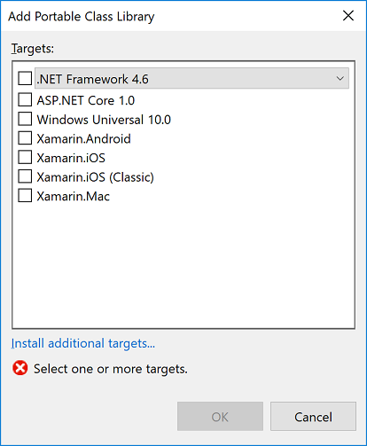
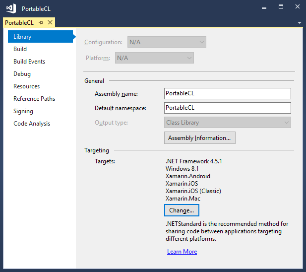

# Cross-platform development with the Portable Class Library

The Portable Class Library project type in Visual Studio helps you build cross-platform apps and libraries for Microsoft platforms quickly and easily.

[!INCLUDE[standard](../../../includes/pcl-to-standard.md)]

Portable class libraries can help you reduce the time and costs of developing and testing code. Use this project type to write and build portable .NET Framework assemblies, and then reference those assemblies from apps that target multiple platforms such as the .NET Framework, iOS, or Mac.

Even after you create a Portable Class Library project in Visual Studio and start developing it, you can change the target platforms. Visual Studio compiles your library with the new assemblies, which helps you identify the changes you need to make in your code.

## Create a Portable Class Library project

To create a Portable Class Library, use the template provided in Visual Studio. Create a new project (**File** > **New Project**), and in the **New Project** dialog box, select your programming language (Visual C# or Visual Basic). Then, select the **Class Library (Legacy Portable)** template. Enter a name for your project and choose **OK**.

The **Add Portable Class Library** dialog box appears. Choose two or more targets, and then choose **OK**.

## Change targets

You can change the target platforms of a portable class library project when you create it or after you’ve started development. If you want to change the targets after you’ve created your project, in **Solution Explorer**, open the shortcut menu for your Portable Class Library project (not the solution), and then choose **Properties**. On the project properties page, the **Library** tab shows the platforms that your project currently targets.

To add or remove targets, choose the **Change** button, and then select and clear the appropriate check boxes.

When you change the targets, the APIs that are available to you for developing your project will change to match your selection. Visual Studio reports the errors and warnings that may occur as a result of the targets changing.

If you want to evaluate the portability of your assemblies before you make changes in Visual Studio, you can use the [.NET Portability Analyzer](https://visualstudiogallery.msdn.microsoft.com/1177943e-cfb7-4822-a8a6-e56c7905292b).

## Supported types and members

The types and members that are available in Portable Class Library projects are constrained by several compatibility factors:

- They must be shared across the targets you selected.

- The must behave similarly across those targets.

- They must not be candidates for deprecation.

- They must make sense in a portable environment, especially when supporting members are not portable.

If a member is supported in the Portable Class Library and for your selected targets, it will appear in your project in IntelliSense. However, remember that an API may be supported in the Portable Class Library, but whether you can use the API depends on the targets you select.

## API differences in the Portable Class Library

To make Portable Class Library assemblies compatible across all supported platforms, some members have been slightly changed in the Portable Class Library.

## Use the Portable Class Library

After you build your Portable Class Library project, you just reference it from other projects. You can reference either the project or specific assemblies that contain the classes you want to access.

To run an app that references a Portable Class Library assembly, the required version (or later) of the targeted platforms must be installed on your computer. Visual Studio contains all the required frameworks, so you can run the app without further modification on the computer that you used to develop the app.

### Deploy a Universal Windows app

When you create a Universal Windows app that references a Portable Class Library assembly, everything you need to deploy the app is included in the app package, and no further steps are required.

### Deploy a .NET Framework app

When you deploy a .NET Framework app that references a Portable Class Library assembly, you must specify a dependency on the correct version of the .NET Framework. By specifying this dependency, you ensure that the required version is installed with your app.

- To create a dependency with ClickOnce deployment: In **Solution Explorer**, choose the project node for the project you want to publish. (This is the project that references the Portable Class Library project.) On the menu bar, choose **Project** > **Properties**, and then choose the **Publish** tab. On the **Publish** page, choose **Prerequisites**. Select the required .NET Framework version as a prerequisite.

- To create a dependency with a setup project: In **Solution Explorer**, choose the setup project. On the menu bar, choose **Project** > **Properties** > **Prerequisites**. Select the required .NET Framework version as a prerequisite.

For more information about deploying .NET Framework apps, see [Deployment Guide for Developers](../../../docs/framework/deployment/deployment-guide-for-developers.md).

## See also

- [Using Portable Class Library with MVVM](../../../docs/standard/cross-platform/using-portable-class-library-with-model-view-view-model.md)
- [App Resources for Libraries That Target Multiple Platforms](../../../docs/standard/cross-platform/app-resources-for-libraries-that-target-multiple-platforms.md)
- [.NET Portability Analyzer](https://marketplace.visualstudio.com/items?itemName=ConnieYau.NETPortabilityAnalyzer)
- [.NET Framework Support for Windows Store Apps and Windows Runtime](../../../docs/standard/cross-platform/support-for-windows-store-apps-and-windows-runtime.md)
- [Deployment](../../../docs/framework/deployment/net-framework-applications.md)
