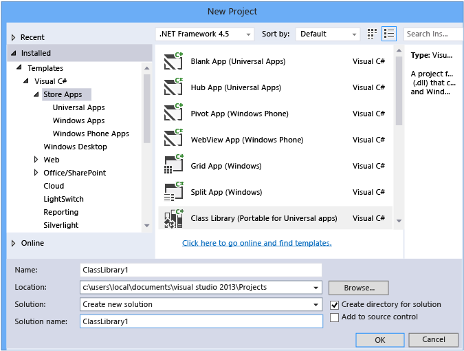
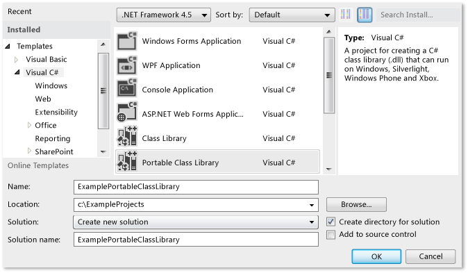
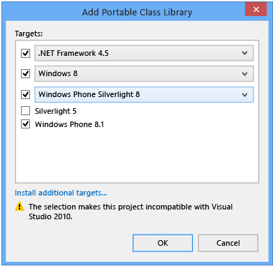
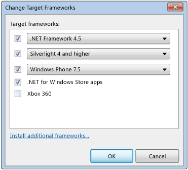
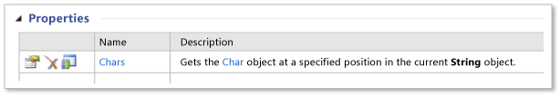
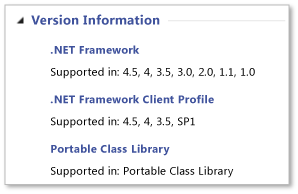

# Cross-Platform Development with the Portable Class Library
The .NET Framework Portable Class Library project type in Visual Studio helps you build cross-platform apps and libraries for Microsoft platforms quickly and easily.  
  
 Portable class libraries can help you reduce the time and costs of developing and testing code. Use this project type to write and build portable .NET Framework assemblies, and then reference those assemblies from apps that target multiple platforms such as Windows and Windows Phone.  
  
 Even after you create a Portable Class Library project in Visual Studio and start developing it, you can change the target platforms. Visual Studio will compile your library with the new assemblies, which helps you identify the changes you need to make in your code.  
  
 This article discusses app development in Visual Studio, but Microsoft also provides Portable Class Library reference assemblies that you can use to develop apps and libraries with other tools such as Xamarin. You can use these apps and libraries on any .NET Framework-based runtime on non-Microsoft platforms. For more information about the reference assemblies, see the blog entry [Portable Class Library (PCL) now available on all platforms](http://blogs.msdn.com/b/dotnet/archive/2013/10/14/portable-class-library-pcl-now-available-on-all-platforms.aspx). To download the assemblies, see [Microsoft .NET Portable Library Reference Assemblies](http://www.microsoft.com/download/details.aspx?id=40727) in the Microsoft Download Center. For more information about how to use the assemblies with Xamarin, see the blog entry [PCL and .NET NuGet Libraries now enabled for Xamarin](http://blogs.msdn.com/b/dotnet/archive/2013/11/13/pcl-and-net-nuget-libraries-are-now-enabled-for-xamarin.aspx).  
  
 Visual Studio provides templates to help you develop with the Portable Class Library. Depending on which version of Visual Studio you're using, available templates and menus may vary from those described in this article.  
  
> [!WARNING]
>  [Visual Studio 2013 Update 2](http://go.microsoft.com/fwlink/p/?LinkId=393658) includes updates to the Portable Class Library templates. If you have an earlier version of Visual Studio and Visual Studio 2013 installed on the same computer, and you then install Update 2, the changes to the **Target Framework** choices will be applied to both versions of Visual Studio.  
  
 In this topic:  
  
 [Visual Studio support](#vs_support)  
 [Creating a Portable Class Library project](#create_pcl)  
 [Target options](#platforms)  
 [Changing targets](#change_targets)  
 [Supported features](#features)  
 [Supported types and members](#members)  
 [API differences in the Portable Class Library](#API_diff)  
 [Using the Portable Class Library](#using)  
  
<a name="vs_support"></a>   
## Visual Studio support  
 Visual Studio support for the Portable Class Library depends on the version of Visual Studio you're using. In some cases, you'll have everything you need, and in other cases, you'll need to install additional items, as shown in the following table.  
  
|Visual Studio SKU|Support for creating a Portable Class Library|  
|-----------------------|---------------------------------------------------|  
|Visual Studio 2010, Professional, Premium, or Ultimate|Yes, when you install the [Portable Library Tools](https://marketplace.visualstudio.com/items?itemName=BCLTeam.PortableLibraryTools2).|  
|Visual Studio Express 2010 versions|No.|  
|Visual Studio 2012 Professional, Premium, or Ultimate|Yes. For phone support, install the [Windows Phone SDK 8.0](http://go.microsoft.com/fwlink/?LinkId=265772).|  
|Visual Studio Express 2012 versions|No.|  
|Visual Studio 2013 Professional, Premium, or Ultimate|Yes. For Windows Phone 8.1 support, install [Visual Studio 2013 Update 2](http://go.microsoft.com/fwlink/p/?LinkId=393658).|  
|Visual Studio Express 2013 for Windows|Yes, when you install the [latest version of Visual Studio Express](http://go.microsoft.com/fwlink/p/?LinkId=394629), which includes Update 2, or add [Visual Studio 2013 Update 2](http://go.microsoft.com/fwlink/p/?LinkId=393658).|  
  
<a name="create_pcl"></a>   
## Creating a Portable Class Library project  
 To create a Portable Class Library, you should use one of the templates provided in Visual Studio. Create a new project, and in the **New Project** dialog box, under **Templates**, select your target language (C# or Visual Basic), and then select one of the platforms you want to target. You can select additional platforms in the next step.  
  
 In Visual Studio 2013 Update 2, you can choose the **Class Library (Portable)** template for your chosen language and platform to create a Portable Class Library. You'll see this template for the following platforms:  
  
-   Store Apps  
  
-   Windows Desktop  
  
-   Silverlight  
  
 If you want to create a library to target Windows Phone 8.1 and Windows 8.1 in C#, you can choose **Store apps**, and then choose **Class Library (Portable for Universal Apps)**.  
  
   
  
 This template automatically selects Windows 8.1 and Windows Phone 8.1 as targets. If you create a library that targets only Windows Phone 8.1 or Windows 8.1, you can change the target platforms and add platforms later.  
  
 If you're using Visual Studio 2012 or Visual Studio 2013 without Update 2, you create a new project and choose the **Portable Class Library** template under Visual C# or Visual Basic.  
  
   
  
 The **Add Portable Class Library** dialog box appears, and you can select additional platforms. The dialog box will give you compatibility warnings based on the targets you select.  
  
   
Add Portable Class Library dialog box for Visual Studio 2013 Update 2  
  
 Regardless of whether you're using Visual Studio 2012 or Visual Studio 2013, you can select the platforms when you create a Portable Class Library project, or you can use the project properties to modify the target platforms after you create the project.  
  
<a name="platforms"></a>   
## Target options  
 When you create a Portable Class Library project, you can choose the operating system and the .NET Framework version you want to target. If you're using Visual Studio 2013 and you've installed Update 2 or later, you can choose the **Class Library (Portable for Universal Apps)** template to create a Portable Class Library that targets Windows 8.1 and Windows Phone 8.1. The following table shows the available targets depending on the version of Visual Studio you're using.  
  
|Target option|Visual Studio 2012|Visual Studio 2013|Visual Studio 2013 Update 2 or later|  
|-|-|-|-|  
|.NET Framework|- .NET Framework 4 and higher<br /><br /> - .NET Framework 4.0.3 and higher<br /><br /> - .NET Framework 4.5|- .NET Framework 4 and higher<br /><br /> - .NET Framework 4.0.3 and higher<br /><br /> - .NET Framework 4.5 and higher<br /><br /> - .NET Framework 4.5.1|- .NET Framework 4<br /><br /> - .NET Framework 4.0.3<br /><br /> - .NET Framework 4.5<br /><br /> - .NET Framework 4.5.1|  
|Windows Phone|- Windows Phone 7 and higher<br /><br /> - Windows Phone 7.5 and higher<br /><br /> - Windows Phone 8|- Windows Phone 8|- Windows Phone Silverlight 8<br /><br /> - Windows Phone Silverlight 8.1<br /><br /> For Windows Runtime and XAML support, choose:<br /><br /> - Windows Phone 8.1|  
|Windows Store|- .NET For Windows Store Apps|- Windows Store Apps (Windows 8) and higher<br /><br /> - Windows Store Apps (Windows 8.1)|- Windows 8<br /><br /> - Windows 8.1|  
|- Silverlight|- Silverlight 4 and higher<br /><br /> - Silverlight 5|- Silverlight 5|- Silverlight 5|  
|Xbox|- Xbox 360|N/A|N/A|  
  
<a name="change_targets"></a>   
## Changing targets  
 When you choose a Portable Class Library template, default platforms are selected for you, but these defaults will vary depending on which version of Visual Studio you have installed, and which targets you have selected previously. You can change the platforms when you create the Portable Class Library or after you’ve started development of a Portable Class Library.  
  
 If you want to change the targets after you’ve created your project, in **Solution Explorer**, open the shortcut menu for your Portable Class Library project (not the solution), and then choose **Properties**. On the project properties page, the **Library** tab shows the platforms that your project currently targets.  
  
   
Portable Class Library property page for Visual Studio 2013 Update 2  
  
 To add or remove targets, choose the **Change** button, and then select and clear the appropriate check boxes.  
  
 When you change the targets, the APIs that are available to you for developing your project will change to match your selection. Visual Studio reports the errors and warnings that may occur as a result of the targets changing.  
  
 If you want to evaluate the portability of your assemblies before you make changes in Visual Studio, you can use the [.NET Portability Analyzer](http://visualstudiogallery.msdn.microsoft.com/1177943e-cfb7-4822-a8a6-e56c7905292b).  
  
 The menu options will vary depending on the version of Visual Studio you're using.  
  
   
Change Targets dialog box in Visual Studio 2012  
  
<a name="features"></a>   
## Supported features  
 The following table shows which features are supported on the available platforms and versions. In some cases, Microsoft has added support with the release of a NuGet package, and this has been noted. For more information about NuGet packages for the .NET Framework, see [The .NET Framework and Out-of-Band Releases](../../../docs/framework/get-started/the-net-framework-and-out-of-band-releases.md).  
  
|Feature|.NET Framework|.NET Framework|.NET Framework|Windows Store|Windows Store|Windows Phone Store|Windows Phone Silverlight|Windows Phone Silverlight|Windows Phone Silverlight|Silverlight|Silverlight|Xbox 360|  
|-------------|--------------------|--------------------|--------------------|-------------------|-------------------|-------------------------|-------------------------------|-------------------------------|-------------------------------|-----------------|-----------------|--------------|  
||**4**|**4.0.3**|**4.5**|**8**|**8.1**|**8.1**|**7.5**|**8**|**8.1**|**4**|**5**||  
|Core libraries|✓|✓|✓|✓|✓|✓|✓|✓|✓|✓|✓|✓|  
|Async support|➊|➊|✓|✓|✓|✓|➊|➊|✓|➊|➊||  
|Compression|||✓|✓|✓|✓||➋|➋||||  
|Data annotations||✓|✓|✓|✓|||||✓|✓||  
|Dynamic keyword|✓|✓|✓|✓|✓|||||✓|✓||  
|HTTPClient|➌|➌|✓|✓|✓|✓|➌|➌|➌|➌|➌||  
|IQueryable|✓|✓|✓|✓|✓|✓|✓|✓|✓|✓|✓||  
|Language-Integrated Query (LINQ)|✓|✓|✓|✓|✓|✓|✓|✓|✓|✓|✓||  
|Managed Extensibility Network (MEF)|✓|✓|✓|✓|✓|||||✓|✓||  
|Network Class Library (NCL)|✓|✓|✓|✓|✓|✓|✓|✓|✓|✓|✓||  
|Serialization (data contract, XML, and JSON)|✓|✓|✓|✓|✓|✓|✓|✓|✓|✓|✓||  
|System.Numerics|✓|✓|✓|✓|✓|||||✓|✓||  
|View models (MVVM)|||✓|✓|✓|✓|✓|✓|✓|✓|✓||  
|Windows Communication Foundation (WCF)|✓|✓|✓|✓|✓||✓|✓|✓|✓|✓||  
|Windows Runtime APIs|||||✓|✓|||||||  
|Windows.UI.XAML|||||✓|✓|||||||  
|XLINQ||✓|✓|✓|✓|✓|✓|✓|✓|✓|✓|✓|  
  
 ➊ Requires [Microsoft Async](https://www.nuget.org/packages/Microsoft.Bcl.Async/) package  
 ➋ Requires [Microsoft Compression](https://www.nuget.org/packages/Microsoft.Bcl.Compression) package  
 ➌ Requires [Microsoft HTTP Client Libraries](https://www.nuget.org/packages/Microsoft.Net.Http) package  
  
> [!WARNING]
>  You may encounter errors when you reference the [Microsoft Compression](https://www.nuget.org/packages/Microsoft.Bcl.Compression) and [Microsoft HTTP Client Libraries](https://www.nuget.org/packages/Microsoft.Net.Http) packages from a portable library used by a Windows Phone Silverlight 8.1 app. For more information, see [Platform compatibility and breaking changes for Windows Phone Silverlight 8.1 apps](http://go.microsoft.com/fwlink/p/?LinkId=394744).  
  
<a name="members"></a>   
## Supported types and members  
 The types and members that are available in Portable Class Library projects are constrained by several compatibility factors:  
  
-   They must be shared across the targets you selected.  
  
-   The must behave similarly across those targets.  
  
-   They must not be candidates for deprecation.  
  
-   They must make sense in a portable environment, especially when supporting members are not portable.  
  
 For example, the Portable Class Library contains UI-related types only when you target Windows 8.1 and Windows Phone 8.1. Also, you may encounter limitations if you target platforms (such as Xbox, the .NET Framework 4, and Windows Phone 7) that were released before the introduction of the Portable Class Library. The .NET Framework releases packages through NuGet that improves the Portable Class Library support for some of these older platforms. For more information and a list of NuGet packages, see [The .NET Framework and Out-of-Band Releases](../../../docs/framework/get-started/the-net-framework-and-out-of-band-releases.md).  
  
 If a member is supported in the Portable Class Library and for your selected targets, it will appear in your project in IntelliSense. In addition, the Portable Class Library icon  appears in the members tables, in the [.NET Framework Class Library](https://msdn.microsoft.com/library/mt472912.aspx) next to supported members. For example, the following members table shows that the <xref:System.String.Chars%2A> property in the <xref:System.String> class is supported in the Portable Class Library:  
  
   
Portable class library icon  
  
 You can also look in the **Version Information** section of a reference topic for a note indicating that a type or member is supported in the Portable Class Library project:  
  
   
Version Information example  
  
 However, remember that an API may be supported in the Portable Class Library, but whether you can use the API depends on the targets you select.  
  
<a name="API_diff"></a>   
## API differences in the Portable Class Library  
 To make Portable Class Library assemblies compatible across all supported platforms, some members have been slightly changed in the Portable Class Library.  
  
<a name="using"></a>   
## Using the Portable Class Library  
 After you build your Portable Class Library project, you just reference it from other projects. You can reference either the project or specific assemblies that contain the classes you want to access.  
  
 To run an app that references a Portable Class Library assembly, the required version (or later) of the targeted platforms must be installed on your computer. Visual Studio contains all the required frameworks, so you can run the app without further modification on the computer that you used to develop the app.  
  
### Deploying a Windows Store or Windows Phone app  
 When you create a Windows store or Windows Phone app that references a Portable Class Library assembly, everything you need to deploy the app is included in the app package, and no further steps are required.  
  
### Deploying a .NET Framework app  
 When you deploy a .NET Framework app that references a Portable Class Library assembly, you must specify a dependency on the correct version of the .NET Framework. By specifying this dependency, you ensure that the required version is installed with your app. If you target the .NET Framework 4 or later, the computer must have the .NET Framework 4 with an [update](http://go.microsoft.com/fwlink/?LinkId=210824), Update 4.0.3 for the .NET Framework 4, or the .NET Framework 4.5 installed.  
  
-   To create a dependency with ClickOnce deployment: In **Solution Explorer**, choose the project node for the project you want to publish. (This is the project that references the Portable Class Library project.) On the menu bar, choose **Project**, **Properties**, and then choose the **Publish** tab. On the **Publish** page, choose **Prerequisites**. Select the required .NET Framework version (or .NET Framework 4 update) as a prerequisite.  
  
-   To create a dependency with a setup project: In **Solution Explorer**, choose the setup project. On the menu bar, choose **Project**, **Properties**, **Prerequisites**. Select the required .NET Framework version as a prerequisite.  
  
 For more information about deploying .NET Framework apps, see [Deployment Guide for Developers](../../../docs/framework/deployment/deployment-guide-for-developers.md).  
  
### Deploying a Silverlight-based app  
 When you deploy a Silverlight-based app that references a Portable Class Library assembly, you must ensure that the minimum runtime version required for the app matches its targeted version. If you target Silverlight 4, the version must be 4.0.60129.0 or later. You set the version by including `<param name="minRuntimeVersion" value="4.0.60129.0" />` in the webpage that hosts the Silverlight-based app, as follows:  
  
```xaml  
<div id="silverlightControlHost">  
    <object data="data:application/x-silverlight-2,"   
           type="application/x-silverlight-2" width="100%" height="100%">  
    <param name="source" value="ClientBin/SilverlightApplication.xap"/>  
    <param name="onError" value="onSilverlightError" />  
    <param name="background" value="white" />  
    <param name="minRuntimeVersion" value="4.0.60129.0" />  
    <param name="autoUpgrade" value="true" />  
    <a href="http://go.microsoft.com/fwlink/?LinkID=149156&v=4.0.50826.0"   
             style="text-decoration:none">  
        
    </a>  
  </object>  
   <iframe id="_sl_historyFrame"   
              style="visibility:hidden;height:0px;width:0px;border:0px">  
   </iframe>  
</div>  
```  
  
## See Also  
 [Using Portable Class Library with MVVM](../../../docs/standard/cross-platform/using-portable-class-library-with-model-view-view-model.md)  
 [App Resources for Libraries That Target Multiple Platforms](../../../docs/standard/cross-platform/app-resources-for-libraries-that-target-multiple-platforms.md)  
 [.NET Portability Analyzer](http://visualstudiogallery.msdn.microsoft.com/1177943e-cfb7-4822-a8a6-e56c7905292b)  
 [.NET Framework Support for Windows Store Apps and Windows Runtime](../../../docs/standard/cross-platform/support-for-windows-store-apps-and-windows-runtime.md)  
 [Deployment](../../../docs/framework/deployment/net-framework-applications.md)
