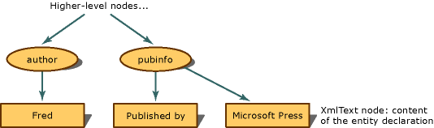

# Entity References are Expanded and Not Preserved
When the entity reference is expanded and replaced by the text it represents, the **XmlEntityReference** node is not created. Instead, the entity declaration is parsed, and nodes created from the content in the declaration are copied in the place of the **XmlEntityReference**. Therefore, in the `&publisher;` example, the `&publisher;` is not saved, but instead, an **XmlText** node is created.  
  
   
Tree structure for entity references that are expanded  
  
 Character entities such as `B` or `<` are not preserved. Instead, they are always expanded and represented as text nodes.  
  
 To preserve **XmlEntityReference** nodes and child nodes of the entity reference attached to it, set the **EntityHandling** flag to **ExpandCharEntities**. Otherwise, leave the **EntityHandling** flag at the default, which is to **ExpandEntities**. In this case, you will not see entity reference nodes in the DOM. The nodes are replaced by the nodes that are copies of the child nodes of the entity declaration.  
  
 One side effect of not preserving entity references is that when the document is saved and passed on to another application, the receiving application does not know that the nodes were generated by an entity reference. However, when entity references are preserved, a receiving application sees an entity reference and reads the child nodes. It is apparent that the child nodes represent the information that was in the entity declaration. For example, the DOM theoretically has the following structure if entity references are preserved.  
  
 XmlElement: publisher  
  
 XmlEntityReference: `&publisher;`  
  
 XmlText: Microsoft Press  
  
 If entity references are expanded in the DOM, which is the default method, the structure has this type of tree:  
  
 XmlElement: publisher  
  
 XmlText: Microsoft Press  
  
 Notice that the entity reference node is gone, and the receiving application cannot tell that the **XmlText** node containing "Microsoft Press" was created from an entity declaration.  
  
 If you use a reader that cannot resolve entities, the **Load** method throws an exception when it encounters an entity reference.  
  
## See Also  
 [XML Document Object Model (DOM)](../../../../docs/standard/data/xml/xml-document-object-model-dom.md)
