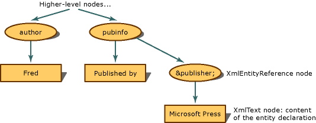

# Entity References are Preserved
When the entity reference is not expanded, but preserved, the XML Document Object Model (DOM) builds an **XmlEntityReference** node when it encounters an entity reference.  
  
 Using the following XML,  
  
```xml  
<author>Fred</author>  
<pubinfo>Published by &publisher;</pubinfo>  
```  
  
 the DOM builds an **XmlEntityReference** node when it encounters the `&publisher;` reference. The **XmlEntityReference** contains child nodes copied from the content in the entity declaration. The preceding code example contains text in the entity declaration, so an **XmlText** node is created as the child node of the entity reference node.  
  
   
Tree structure for entity references that are preserved  
  
 The child nodes of the **XmlEntityReference** are copies of all the child nodes created from the **XmlEntity** node when the entity declaration was encountered.  
  
> [!NOTE]
>  The nodes copied from the **XmlEntity** are not always exact copies once placed under the entity reference node. There can be namespaces that are in scope at the entity reference node, and that affects the final configuration of the child nodes.  
  
 By default, general entities like `&abc;` are preserved and **XmlEntityReference** nodes always created.  
  
## See Also  
 [XML Document Object Model (DOM)](../../../../docs/standard/data/xml/xml-document-object-model-dom.md)
