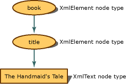

# Mapping the Object Hierarchy to XML Data
When an XML document is in memory, the conceptual representation is a tree. For programming, you have an object hierarchy to access the nodes of the tree. The following example shows you how the XML content becomes nodes.  
  
 As the XML is read into the XML Document Object Model (DOM), the pieces are translated into nodes, and these nodes retain additional metadata about themselves, such as their node type and values. The node type is its object and is what determines what actions can be performed and what properties can be set or retrieved.  
  
 If you have the following simple XML:  
  
 **Input**  
  
```xml  
<book>  
    <title>The Handmaid's Tale</title>  
</book>  
```  
  
 The input is represented in memory as the following node tree with the assigned node type property:  
  
   
Book and title node tree representation  
  
 The `book` element becomes an **XmlElement** object, the next element, `title`, also becomes an **XmlElement**, while the element content becomes an **XmlText** object. In looking at the **XmlElement** methods and properties, the methods and properties are different than the methods and properties available on an **XmlText** object. So knowing what node type the XML markup becomes is vital, as its node type determines the actions that can be performed.  
  
 The following example reads in XML data and writes out different text, depending on the node type. Using the following XML data file as input, **items.xml**:  
  
 **Input**  
  
```xml  
<?xml version="1.0"?>  
<!-- This is a sample XML document -->  
<!DOCTYPE Items [<!ENTITY number "123">]>  
<Items>  
  <Item>Test with an entity: &number;</Item>  
  <Item>test with a child element <more/> stuff</Item>  
  <Item>test with a CDATA section <![CDATA[<456>]]> def</Item>  
  <Item>Test with a char entity: A</Item>  
  <!-- Fourteen chars in this element.-->  
  <Item>1234567890ABCD</Item>  
</Items>  
```  
  
 The following code example reads the **items.xml** file and displays information for each node type.  
  
```vb  
Imports System  
Imports System.IO  
Imports System.Xml  
  
Public Class Sample  
    Private Const filename As String = "items.xml"  
  
    Public Shared Sub Main()  
  
        Dim reader As XmlTextReader = Nothing  
  
        Try  
            ' Load the reader with the data file and   
            'ignore all white space nodes.   
            reader = New XmlTextReader(filename)  
            reader.WhitespaceHandling = WhitespaceHandling.None  
  
            ' Parse the file and display each of the nodes.  
            While reader.Read()  
                Select Case reader.NodeType  
                    Case XmlNodeType.Element  
                        Console.Write("<{0}>", reader.Name)  
                    Case XmlNodeType.Text  
                        Console.Write(reader.Value)  
                    Case XmlNodeType.CDATA  
                        Console.Write("<![CDATA[{0}]]>", reader.Value)  
                    Case XmlNodeType.ProcessingInstruction  
                        Console.Write("<?{0} {1}?>", reader.Name, reader.Value)  
                    Case XmlNodeType.Comment  
                        Console.Write("<!--{0}-->", reader.Value)  
                    Case XmlNodeType.XmlDeclaration  
                        Console.Write("<?xml version='1.0'?>")  
                    Case XmlNodeType.Document  
                    Case XmlNodeType.DocumentType  
                        Console.Write("<!DOCTYPE {0} [{1}]", reader.Name, reader.Value)  
                    Case XmlNodeType.EntityReference  
                        Console.Write(reader.Name)  
                    Case XmlNodeType.EndElement  
                        Console.Write("</{0}>", reader.Name)  
                End Select  
            End While  
  
        Finally  
            If Not (reader Is Nothing) Then  
                reader.Close()  
            End If  
        End Try  
    End Sub 'Main ' End class  
End Class 'Sample  
```  
  
```csharp  
using System;  
using System.IO;  
using System.Xml;  
  
public class Sample  
{  
    private const String filename = "items.xml";  
  
    public static void Main()  
    {  
        XmlTextReader reader = null;  
  
        try  
        {  
            // Load the reader with the data file and ignore   
            // all white space nodes.  
            reader = new XmlTextReader(filename);  
            reader.WhitespaceHandling = WhitespaceHandling.None;  
  
            // Parse the file and display each of the nodes.  
            while (reader.Read())  
            {  
                switch (reader.NodeType)  
                {  
                    case XmlNodeType.Element:  
                        Console.Write("<{0}>", reader.Name);  
                        break;  
                    case XmlNodeType.Text:  
                        Console.Write(reader.Value);  
                        break;  
                    case XmlNodeType.CDATA:  
                        Console.Write("<![CDATA[{0}]]>", reader.Value);  
                        break;  
                    case XmlNodeType.ProcessingInstruction:  
                        Console.Write("<?{0} {1}?>", reader.Name, reader.Value);  
                        break;  
                    case XmlNodeType.Comment:  
                        Console.Write("<!--{0}-->", reader.Value);  
                        break;  
                    case XmlNodeType.XmlDeclaration:  
                        Console.Write("<?xml version='1.0'?>");  
                        break;  
                    case XmlNodeType.Document:  
                        break;  
                    case XmlNodeType.DocumentType:  
                        Console.Write("<!DOCTYPE {0} [{1}]", reader.Name, reader.Value);  
                        break;  
                    case XmlNodeType.EntityReference:  
                        Console.Write(reader.Name);  
                        break;  
                    case XmlNodeType.EndElement:  
                        Console.Write("</{0}>", reader.Name);  
                        break;  
                }  
            }  
        }  
  
        finally  
        {  
            if (reader != null)  
                reader.Close();  
        }  
    }  
} // End class  
```  
  
 The output from the example reveals the mapping of the data to the node types.  
  
 **Output**  
  
```xml  
<?xml version='1.0'?><!--This is a sample XML document --><!DOCTYPE Items [<!ENTITY number "123">]<Items><Item>Test with an entity: 123</Item><Item>test with a child element <more> stuff</Item><Item>test with a CDATA section <![CDATA[<456>]]> def</Item><Item>Test with a char entity: A</Item><--Fourteen chars in this element.--><Item>1234567890ABCD</Item></Items>  
```  
  
 Taking the input one line at a time and using the output generated from the code, you can use the following table to analyze what node test generated which lines of output, thereby understanding what XML data became what kind of node type.  
  
|Input|Output|Node Type Test|  
|-----------|------------|--------------------|  
|\<?xml version="1.0"?>|\<?xml version='1.0'?>|XmlNodeType.XmlDeclaration|  
|\<!-- This is a sample XML document -->|\<!--This is a sample XML document -->|XmlNodeType.Comment|  
|\<!DOCTYPE Items [\<!ENTITY number "123">]>|\<!DOCTYPE Items [\<!ENTITY number "123">]|XmlNodeType.DocumentType|  
|\<Items>|\<Items>|XmlNodeType.Element|  
|\<Item>|\<Item>|XmlNodeType.Element|  
|Test with an entity: &number;|Test with an entity: 123|XmlNodeType.Text|  
|\</Item>|\</Item>|XmlNodeType.EndElement|  
|\<Item>|\<Item>|XmNodeType.Element|  
|test with a child element|test with a child element|XmlNodeType.Text|  
|\<more>|\<more>|XmlNodeType.Element|  
|stuff|stuff|XmlNodeType.Text|  
|\</Item>|\</Item>|XmlNodeType.EndElement|  
|\<Item>|\<Item>|XmlNodeType.Element|  
|test with a CDATA section|test with a CDATA section|XmlTest.Text|  
|<![CDATA[\<456>]]\>|<![CDATA[\<456>]]\>|XmlTest.CDATA|  
|def|def|XmlNodeType.Text|  
|\</Item>|\</Item>|XmlNodeType.EndElement|  
|\<Item>|\<Item>|XmlNodeType.Element|  
|Test with a char entity: &\#65;|Test with a char entity: A|XmlNodeType.Text|  
|\</Item>|\</Item>|XmlNodeType.EndElement|  
|\<!-- Fourteen chars in this element.-->|\<--Fourteen chars in this element.-->|XmlNodeType.Comment|  
|\<Item>|\<Item>|XmlNodeType.Element|  
|1234567890ABCD|1234567890ABCD|XmlNodeType.Text|  
|\</Item>|\</Item>|XmlNodeType.EndElement|  
|\</Items>|\</Items>|XmlNodeType.EndElement|  
  
 You must know what node type is assigned, as the node type controls what kinds of actions are valid and what kind of properties you can set and retrieve.  
  
 Node creation for white space is controlled when the data is loaded into the DOM by the **PreserveWhitespace** flag. For more information, see [White Space and Significant White Space Handling when Loading the DOM](../../../../docs/standard/data/xml/white-space-and-significant-white-space-handling-when-loading-the-dom.md).  
  
 To add new nodes to the DOM, see [Inserting Nodes into an XML Document](../../../../docs/standard/data/xml/inserting-nodes-into-an-xml-document.md). To remove nodes from the DOM, see [Removing Nodes, Content, and Values from an XML Document](../../../../docs/standard/data/xml/removing-nodes-content-and-values-from-an-xml-document.md). To modify the content of nodes in the DOM, see [Modifying Nodes, Content, and Values in an XML Document](../../../../docs/standard/data/xml/modifying-nodes-content-and-values-in-an-xml-document.md).  
  
## See Also  
 [XML Document Object Model (DOM)](../../../../docs/standard/data/xml/xml-document-object-model-dom.md)
