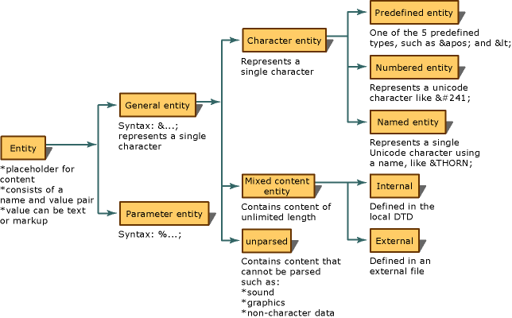
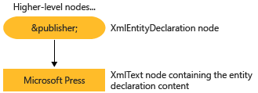

# Reading Entity Declarations and Entity References into the DOM
An entity is a declaration that states a name to be used in the XML in place of content or markup. There are two parts to entities. First, you must tie a name to the replacement content using an entity declaration. An entity declaration is created by using the `<!ENTITY name "value">` syntax in a document type definition (DTD) or XML schema. Secondly, the name defined in the entity declaration is subsequently used in the XML. When used in the XML, it is called an entity reference. For example, the following entity declaration declares an entity of the name `publisher` being associated with the content of "Microsoft Press".  
  
```xml  
<!ENTITY publisher "Microsoft Press">  
```  
  
 The following example shows the use of this entity declaration in XML as an entity reference.  
  
```xml  
<author>Fred</author>  
<pubinfo>Published by &publisher;</pubinfo>  
```  
  
 Some parsers automatically expand entities when a document is loaded into memory. Therefore, when the XML is being read into memory, entity declarations are remembered and saved. When the parser subsequently encounters `&;` characters, which identify a general entity reference, the parser looks up that name in an entity declaration table. The reference, `&publisher;` is replaced by the content that it represents. Using the following XML,  
  
```xml  
<author>Fred</author>  
<pubinfo>Published by &publisher;</pubinfo>  
```  
  
 expanding the entity reference and replacing the `&publisher;` with the Microsoft Press content gives the following expanded XML.  
  
 **Output**  
  
```xml  
<author>Fred</author>  
<pubinfo>Published by Microsoft Press</pubinfo>  
```  
  
 There are many kinds of entities. The following diagram shows the breakdown of entity types and terminology.  
  
   
  
 The default for the Microsoft .NET Framework implementation of the XML Document Object Model (DOM) is to preserve the entities references and not expand the entities when the XML is loaded. The implication of this is that as a document is loaded in the DOM, an **XmlEntityReference** node containing the reference variable `&publisher;` is created, with child nodes representing the content in the entity declared in the DTD.  
  
 Using the `<!ENTITY publisher "Microsoft Press">` entity declaration, the following diagram shows the **XmlEntity** and **XmlText** nodes created from this declaration.  
  
   
  
 The differences when entity references are expanded and when they are not makes a difference in what nodes are generated in the DOM tree, in memory. The difference in the nodes that are generated is explained in the topics [Entity References are Preserved](../../../../docs/standard/data/xml/entity-references-are-preserved.md) and [Entity References are Expanded and Not Preserved](../../../../docs/standard/data/xml/entity-references-are-expanded-and-not-preserved.md).  
  
## See Also  
 [XML Document Object Model (DOM)](../../../../docs/standard/data/xml/xml-document-object-model-dom.md)
