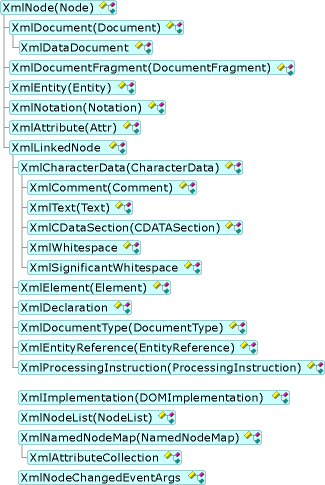

# XML Document Object Model (DOM) Hierarchy
The following illustration shows the class hierarchy for the XML Document Object Model (DOM), with the World Wide Web Consortium (W3C) name in parenthesis along with the class name where it is relevant.  
  
   
XML Document Object Model (DOM) hierarchy  
  
 The following classes do not inherit from the **XmlNode**:  
  
-   **XmlImplementation**  
  
-   **XmlNamedNodeMap**  
  
-   **XmlNodeList**  
  
-   **XmlNodeChangedEventArgs**  
  
 The **XmlImplementation** class is used to create an XML document. For more information, see [XML Document Creation](../../../../docs/standard/data/xml/xml-document-creation.md).  
  
 The **XmlNamedNodeMap** class handles an unordered set of nodes. For more information, see [Unordered Node Retrieval by Name or Index](../../../../docs/standard/data/xml/unordered-node-retrieval-by-name-or-index.md).  
  
 The **XmlNodeList** class handles an ordered list of nodes. For more information, see [Ordered Node Retrieval by Index](../../../../docs/standard/data/xml/ordered-node-retrieval-by-index.md).  
  
 The **XmlNodeChangedEventArgs** class handles event handlers registered on the **XmlDocument**. For more information, see [Event Handling in an XML Document using the XmlNodeChangedEventArgs](../../../../docs/standard/data/xml/event-handling-in-an-xml-document-using-the-xmlnodechangedeventargs.md).  
  
 The **XmlLinkedNode** class inherits from **XmlNode**. Its purpose is to override two methods from **XmlNode**: the **PreviousSibling** and **NextSibling** methods. These overridden methods are then inherited and used by **XmlCharacterData**, **XmlDeclaration**, **XmlDocumentType**, **XmlElement**, **XmlEntityReference**, and **XmlProcessingInstruction**, which are classes that have previous and next siblings.  
  
## See Also  
 [XML Document Object Model (DOM)](../../../../docs/standard/data/xml/xml-document-object-model-dom.md)
