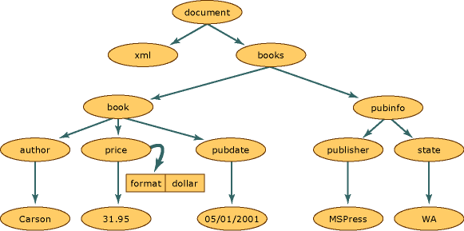

# XML Document Object Model (DOM)
The XML Document Object Model (DOM) class is an in-memory representation of an XML document. The DOM allows you to programmatically read, manipulate, and modify an XML document. The **XmlReader** class also reads XML; however, it provides non-cached, forward-only, read-only access. This means that there are no capabilities to edit the values of an attribute or content of an element, or the ability to insert and remove nodes with the **XmlReader**. Editing is the primary function of the DOM. It is the common and structured way that XML data is represented in memory, although the actual XML data is stored in a linear fashion when in a file or coming in from another object. The following is XML data.  
  
## Input  
  
```xml  
<?xml version="1.0"?>  
  <books>  
    <book>  
        <author>Carson</author>  
        <price format="dollar">31.95</price>  
        <pubdate>05/01/2001</pubdate>  
    </book>  
    <pubinfo>  
        <publisher>MSPress</publisher>  
        <state>WA</state>  
    </pubinfo>  
  </books>   
```  
  
 The following illustration shows how memory is structured when this XML data is read into the DOM structure.  
  
   
XML document structure  
  
 Within the XML document structure, each circle in this illustration represents a node, which is called an **XmlNode** object. The **XmlNode** object is the basic object in the DOM tree. The **XmlDocument** class, which extends **XmlNode**, supports methods for performing operations on the document as a whole (for example, loading it into memory or saving the XML to a file. In addition, **XmlDocument** provides a means to view and manipulate the nodes in the entire XML document. Both **XmlNode** and **XmlDocument** have performance and usability enhancements and have methods and properties to:  
  
-   Access and modify nodes specific to the DOM, such as element nodes, entity reference nodes, and so on.  
  
-   Retrieve entire nodes, in addition to the information the node contains, such as the text in an element node.  
  
    > [!NOTE]
    >  If an application does not require the structure or editing capabilities provided by the DOM, the **XmlReader** and **XmlWriter** classes provide non-cached, forward-only stream access to XML. For more information, see <xref:System.Xml.XmlReader> and <xref:System.Xml.XmlWriter>.  
  
 **Node** objects have a set of methods and properties, as well as basic and well-defined characteristics. Some of these characteristics are:  
  
-   Nodes have a single parent node, a parent node being a node directly above them. The only nodes that do not have a parent is the Document root, as it is the top-level node and contains the document itself and document fragments.  
  
-   Most nodes can have multiple child nodes, which are nodes directly below them. The following is a list of node types that can have child nodes.  
  
    -   **Document**  
  
    -   **DocumentFragment**  
  
    -   **EntityReference**  
  
    -   **Element**  
  
    -   **Attribute**  
  
     The **XmlDeclaration**, **Notation**, **Entity**, **CDATASection**, **Text**, **Comment**, **ProcessingInstruction**, and **DocumentType** nodes do not have child nodes.  
  
-   Nodes that are at the same level, represented in the diagram by the **book** and **pubinfo** nodes, are siblings.  
  
 One characteristic of the DOM is how it handles attributes. Attributes are not nodes that are part of the parent, child, and sibling relationships. Attributes are considered a property of the element node and are made up of a name and a value pair. For example, if you have XML data consisting of `format="dollar`" associated with the element `price`, the word `format` is the name, and the value of the `format` attribute is `dollar`. To retrieve the `format="dollar"` attribute of the **price** node, you call the **GetAttribute** method when the cursor is located at the `price` element node. For more information, see [Accessing Attributes in the DOM](../../../../docs/standard/data/xml/accessing-attributes-in-the-dom.md).  
  
 As XML is read into memory, nodes are created. However, not all nodes are the same type. An element in XML has different rules and syntax than a processing instruction. Therefore, as various data is read, a node type is assigned to each node. This node type determines the characteristics and functionality of the node.  
  
 For more information on the types of nodes generated in memory, see [Types of XML Nodes](../../../../docs/standard/data/xml/types-of-xml-nodes.md). For more information on the objects created in the node tree, see [Mapping the Object Hierarchy to XML Data](../../../../docs/standard/data/xml/mapping-the-object-hierarchy-to-xml-data.md).  
  
 Microsoft has extended the APIs that are available in the World Wide Web Consortium (W3C) DOM Level 1 and Level 2 to make it easier to work with an XML document. While fully supporting the W3C standards, the additional classes, methods, and properties add functionality beyond what can be done using the W3C XML DOM. New classes enable you to access relational data, giving you methods for synchronizing with ADO.NET data, simultaneously exposing data as XML. For more information, see [Synchronizing a DataSet with an XmlDataDocument](../../../../docs/framework/data/adonet/dataset-datatable-dataview/dataset-and-xmldatadocument-synchronization.md).  
  
 The DOM is most useful for reading XML data into memory to change its structure, to add or remove nodes, or to modify the data held by a node as in the text contained by an element. However, other classes are available that are faster than the DOM in other scenarios. For fast, non-cached, forward-only stream access to XML, use the **XmlReader** and **XmlWriter**. If you need random access with a cursor model and **XPath**, use the **XPathNavigator** class.  
  
## See Also  
 [Types of XML Nodes](../../../../docs/standard/data/xml/types-of-xml-nodes.md)  
 [Mapping the Object Hierarchy to XML Data](../../../../docs/standard/data/xml/mapping-the-object-hierarchy-to-xml-data.md)
