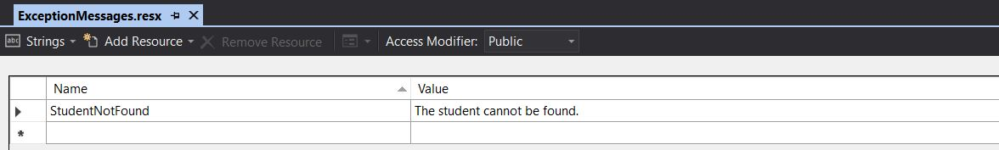
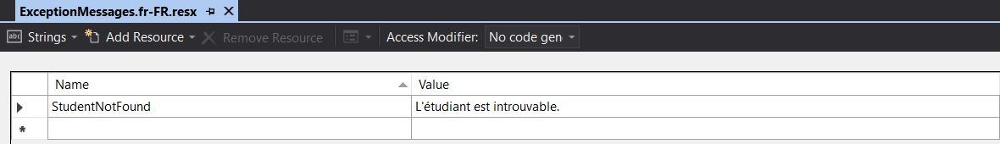

# How to: create user-defined exceptions with localized exception messages

In this article, you will learn how to create user-defined exceptions that are inherited from the base <xref:System.Exception> class with localized exception messages using satellite assemblies.

## Create custom exceptions

.NET contains many different exceptions that you can use. However, in some cases when none of them meets your needs, you can create your own custom exceptions.

Let's assume you want to create a `StudentNotFoundException` that contains a `StudentName` property.
To create a custom exception, follow these steps:

1. Create a serializable class that inherits from <xref:System.Exception>. The class name should end in "Exception":

    ```csharp
    [Serializable]
    public class StudentNotFoundException : Exception { }
    ```

1. Add the default constructors:

    ```csharp
    [Serializable]
    public class StudentNotFoundException : Exception
    {
        public StudentNotFoundException() { }

        public StudentNotFoundException(string message)
            : base(message) { }

        public StudentNotFoundException(string message, Exception inner)
            : base(message, inner) { }
    }
    ```

1. Define any additional properties and constructors:

    ```csharp
    [Serializable]
    public class StudentNotFoundException : Exception
    {
        public string StudentName { get; }

        public StudentNotFoundException() { }

        public StudentNotFoundException(string message)
            : base(message) { }

        public StudentNotFoundException(string message, Exception inner)
            : base(message, inner) { }

        public StudentNotFoundException(string message, string studentName)
            : this(message)
        {
            StudentName = studentName;
        }
    }
    ```

## Create localized exception messages

You have created a custom exception, and you can throw it anywhere with code like the following:

```csharp
throw new StudentNotFoundException("The student cannot be found.", "John");
```

The problem with the previous line is that `"The student cannot be found."` is just a constant string. In a localized application, you want to have different messages depending on user culture.
[Satellite Assemblies](../../framework/resources/creating-satellite-assemblies-for-desktop-apps.md) are a good way to do that. A satellite assembly is a .dll that contains resources for a specific language. When you ask for a specific resources at run time, the CLR finds that resource depending on user culture. If no satellite assembly is found for that culture, the resources of the default culture are used.

To create the localized exception messages:

1. Create a new folder named *Resources* to hold the resource files.
1. Add a new resource file to it. To do that in Visual Studio, right-click the folder in **Solution Explorer**, and select **Add** > **New Item** > **Resources File**. Name the file *ExceptionMessages.resx*. This is the default resources file.
1. Add a name/value pair for your exception message, like the following image shows:

   

1. Add a new resource file for French. Name it *ExceptionMessages.fr-FR.resx*.
1. Add a name/value pair for the exception message again, but with a French value:

   

1. After you build the project, the build output folder should contain the *fr-FR* folder with a *.dll* file, which is the satellite assembly.
1. You throw the exception with code like the following:

    ```csharp
    var resourceManager = new ResourceManager("FULLY_QIALIFIED_NAME_OF_RESOURCE_FILE", Assembly.GetExecutingAssembly());
    throw new StudentNotFoundException(resourceManager.GetString("StudentNotFound"), "John");
    ```

  > [!NOTE]
  > If the project name is `TestProject` and the resource file *ExceptionMessages.resx* resides in the *Resources* folder of the project, the fully qualified name of the resource file is `TestProject.Resources.ExceptionMessages`.

## See also

- [How to create user-defined exceptions](how-to-create-user-defined-exceptions.md)
- [Creating Satellite Assemblies for Desktop Apps](../../framework/resources/creating-satellite-assemblies-for-desktop-apps.md)
- [base (C# Reference)](../../csharp/language-reference/keywords/base.md)
- [this (C# Reference)](../../csharp/language-reference/keywords/this.md)
