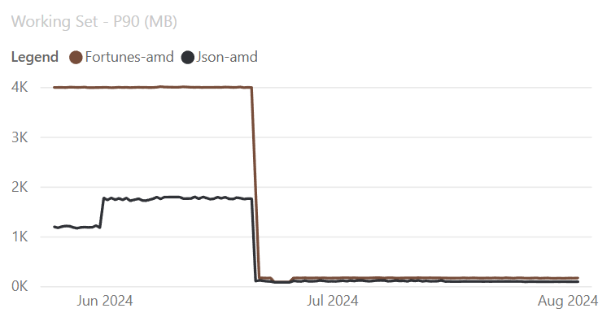
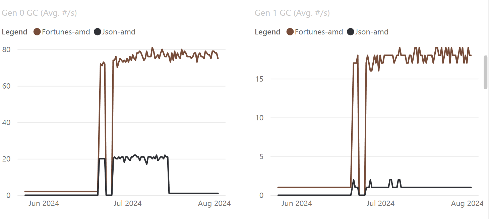

# Dynamic adaptation to application sizes (DATAS)

Dynamic adaptation to application sizes (DATAS) GC aims to adapt to application memory requirements. That means the application heap size should be roughly proportional to the long-lived data size. If your app is doing the same work when it runs on machines with different specs, the heap size is the same or similar. And if your workload becomes lighter or heavier, the heap size is adjusted accordingly.

In contrast, [Server GC](workstation-server-gc.md#server-gc) mode aims to improve throughput and treats the process as the dominant one on the machine. The amount of allocations it allows before triggering the next GC is based on throughput, not application size. It can grow the heap aggressively if it needs to and there's memory available. This growth can result in very different heap sizes when you run the process on machines with different hardware specs. The heap can grow much bigger when you move your process to a machine with many more cores and more memory. Server GC also doesn't necessarily adjust the heap down aggressively if the workload becomes much lighter.

DATAS helps most with "bursty" workloads where the heap size should be adjusted according to how demanding the workload is, particularly as demand decreases. This is especially important in memory-constrained environments where it's important to fit more processes when some processes' workloads lighten. It also helps with capacity planning. DATAS was introduced as an opt-in feature in .NET 8 and is enabled by default in .NET 9.

## Feature description

To achieve app size adaptation and still maintain reasonable performance, DATAS does the following:

- It sets the maximum amount of allocations allowed before the next GC is triggered based on the long-lived data size. This helps with constraining the heap size.
- It sets the actual amount of allocations allowed based on throughput.
- It adjusts the number of heaps when needed. It starts with one heap, which means if there are many threads allocating, some will need to wait. That negatively affects throughput. DATAS grows and reduces the number of heaps as needed. In this way, it's a hybrid between the existing GC modes, capable of using as few as one heap (like workstation GC) and as many as matches the machine core count (like server GC).
- When needed, it does full-compacting GCs to prevent fragmentation from getting too high, which also helps with constraining the heap size.

## Benchmark results

The following images show some benchmark results for TechEmpower JSON and Fortunes Benchmarks. Notice the significant reduction in working set when running the benchmarks on a 48-core machine with Linux. Maximum throughput (measured in RPS) shows a 2-3% reduction, but with a working set improvement of over 80%.

With DATAS enabled, the number of Gen0 and Gen1 GCs is significantly higher.

## How to disable DATAS

If you notice a reduction in throughput, you can disable DATAS using various settings. For more information, see [Dynamic adaptation to application sizes (DATAS)](../../core/runtime-config/garbage-collector.md#dynamic-adaptation-to-application-sizes-datas).
