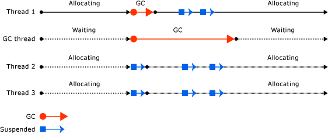

# Fundamentals of Garbage Collection
 In the common language runtime (CLR), the garbage collector serves as an automatic memory manager. It provides the following benefits:  
  
-   Enables you to develop your application without having to free memory.  
  
-   Allocates objects on the managed heap efficiently.  
  
-   Reclaims objects that are no longer being used, clears their memory, and keeps the memory available for future allocations. Managed objects automatically get clean content to start with, so their constructors do not have to initialize every data field.  
  
-   Provides memory safety by making sure that an object cannot use the content of another object.  
  
 This topic describes the core concepts of garbage collection. It contains the following sections:  
  
-   [Fundamentals of memory](#fundamentals_of_memory)  
  
-   [Conditions for a garbage collection](#conditions_for_a_garbage_collection)  
  
-   [The managed heap](#the_managed_heap)  
  
-   [Generations](#generations)  
  
-   [What happens during a garbage collection](#what_happens_during_a_garbage_collection)  
  
-   [Manipulating unmanaged resources](#manipulating_unmanaged_resources)  
  
-   [Workstation and server garbage collection](#workstation_and_server_garbage_collection)  
  
-   [Concurrent garbage collection](#concurrent_garbage_collection)  
  
-   [Background workstation garbage collection](#background_garbage_collection)  
  
-   [Background server garbage collection](#background_server_garbage_collection)  
  
   
## Fundamentals of memory  
 The following list summarizes important CLR memory concepts.  
  
-   Each process has its own, separate virtual address space. All processes on the same computer share the same physical memory, and share the page file if there is one.  
  
-   By default, on 32-bit computers, each process has a 2-GB user-mode virtual address space.  
  
-   As an application developer, you work only with virtual address space and never manipulate physical memory directly. The garbage collector allocates and frees virtual memory for you on the managed heap.  
  
     If you are writing native code, you use Win32 functions to work with the virtual address space. These functions allocate and free virtual memory for you on native heaps.  
  
-   Virtual memory can be in three states:  
  
    -   Free. The block of memory has no references to it and is available for allocation.  
  
    -   Reserved. The block of memory is available for your use and cannot be used for any other allocation request. However, you cannot store data to this memory block until it is committed.  
  
    -   Committed. The block of memory is assigned to physical storage.  
  
-   Virtual address space can get fragmented. This means that there are free blocks, also known as holes, in the address space. When a virtual memory allocation is requested, the virtual memory manager has to find a single free block that is large enough to satisfy that allocation request. Even if you have 2 GB of free space, the allocation that requires 2 GB will be unsuccessful unless all of that free space is in a single address block.  
  
-   You can run out of memory if you run out of virtual address space to reserve or physical space to commit.  
  
 Your page file is used even if physical memory pressure (that is, demand for physical memory) is low. The first time your physical memory pressure is high, the operating system must make room in physical memory to store data, and it backs up some of the data that is in physical memory to the page file. That data is not paged until it is needed, so it is possible to encounter paging in situations where the physical memory pressure is very low. 
 
 [Back to top](#top)  
  
   
## Conditions for a garbage collection  
 Garbage collection occurs when one of the following conditions is true:  
  
-   The system has low physical memory. This is detected by either the low memory notification from the OS or low memory indicated by the host.
  
-   The memory that is used by allocated objects on the managed heap surpasses an acceptable threshold. This threshold is continuously adjusted as the process runs.  
  
-   The <xref:System.GC.Collect%2A?displayProperty=nameWithType> method is called. In almost all cases, you do not have to call this method, because the garbage collector runs continuously. This method is primarily used for unique situations and testing.  
  
 [Back to top](#top)  
  
   
## The managed heap  
 After the garbage collector is initialized by the CLR, it allocates a segment of memory to store and manage objects. This memory is called the managed heap, as opposed to a native heap in the operating system.  
  
 There is a managed heap for each managed process. All threads in the process allocate memory for objects on the same heap.  
  
 To reserve memory, the garbage collector calls the Win32 [VirtualAlloc](https://msdn.microsoft.com/library/aa366887.aspx) function, and reserves one segment of memory at a time for managed applications. The garbage collector also reserves segments as needed, and releases segments back to the operating system (after clearing them of any objects) by calling the Win32 [VirtualFree](https://msdn.microsoft.com/library/aa366892.aspx) function.  
  
> [!IMPORTANT]
>  The size of segments allocated by the garbage collector is implementation-specific and is subject to change at any time, including in periodic updates. Your app should never make assumptions about or depend on a particular segment size, nor should it attempt to configure the amount of memory available for segment allocations.  
  
 The fewer objects allocated on the heap, the less work the garbage collector has to do. When you allocate objects, do not use rounded-up values that exceed your needs, such as allocating an array of 32 bytes when you need only 15 bytes.  
  
 When a garbage collection is triggered, the garbage collector reclaims the memory that is occupied by dead objects. The reclaiming process compacts live objects so that they are moved together, and the dead space is removed, thereby making the heap smaller. This ensures that objects that are allocated together stay together on the managed heap, to preserve their locality.  
  
 The intrusiveness (frequency and duration) of garbage collections is the result of the volume of allocations and the amount of survived memory on the managed heap.  
  
 The heap can be considered as the accumulation of two heaps: the large object heap and the small object heap.  
  
 The large object heap contains very large objects that are 85,000 bytes and larger. The objects on the large object heap are usually arrays. It is rare for an instance object to be extremely large.  
  
 [Back to top](#top)  
  
   
## Generations  
 The heap is organized into generations so it can handle long-lived and short-lived objects. Garbage collection primarily occurs with the reclamation of short-lived objects that typically occupy only a small part of the heap. There are three generations of objects on the heap:  
  
-   **Generation 0**. This is the youngest generation and contains short-lived objects. An example of a short-lived object is a temporary variable. Garbage collection occurs most frequently in this generation.  
  
     Newly allocated objects form a new generation of objects and are implicitly generation 0 collections, unless they are large objects, in which case they go on the large object heap in a generation 2 collection.  
  
     Most objects are reclaimed for garbage collection in generation 0 and do not survive to the next generation.  
  
-   **Generation 1**. This generation contains short-lived objects and serves as a buffer between short-lived objects and long-lived objects.  
  
-   **Generation 2**. This generation contains long-lived objects. An example of a long-lived object is an object in a server application that contains static data that is live for the duration of the process.  
  
 Garbage collections occur on specific generations as conditions warrant. Collecting a generation means collecting objects in that generation and all its younger generations. A generation 2 garbage collection is also known as a full garbage collection, because it reclaims all objects in all generations (that is, all objects in the managed heap).  
  
### Survival and promotions  
 Objects that are not reclaimed in a garbage collection are known as survivors, and are promoted to the next generation. Objects that survive a generation 0 garbage collection are promoted to generation 1; objects that survive a generation 1 garbage collection are promoted to generation 2; and objects that survive a generation 2 garbage collection remain in generation 2.  
  
 When the garbage collector detects that the survival rate is high in a generation, it increases the threshold of allocations for that generation, so the next collection gets a substantial size of reclaimed memory. The CLR continually balances two priorities: not letting an application's working set get too big and not letting the garbage collection take too much time.  
  
### Ephemeral generations and segments  
 Because objects in generations 0 and 1 are short-lived, these generations are known as the ephemeral generations.  
  
 Ephemeral generations must be allocated in the memory segment that is known as the ephemeral segment. Each new segment acquired by the garbage collector becomes the new ephemeral segment and contains the objects that survived a generation 0 garbage collection. The old ephemeral segment becomes the new generation 2 segment.  
  
 The size of the ephemeral segment varies depending on whether a system is 32- or 64-bit, and on the type of garbage collector it is running. Default values are shown in the following table.  
  
||32-bit|64-bit|  
|-|-------------|-------------|  
|Workstation GC|16 MB|256 MB|  
|Server GC|64 MB|4 GB|  
|Server GC with > 4 logical CPUs|32 MB|2 GB|  
|Server GC with > 8 logical CPUs|16 MB|1 GB|  
  
 The ephemeral segment can include generation 2 objects. Generation 2 objects can use multiple segments (as many as your process requires and memory allows for).  
  
 The amount of freed memory from an ephemeral garbage collection is limited to the size of the ephemeral segment. The amount of memory that is freed is proportional to the space that was occupied by the dead objects.  
  
 [Back to top](#top)  
  
   
## What happens during a garbage collection  
 A garbage collection has the following phases:  
  
-   A marking phase that finds and creates a list of all live objects.  
  
-   A relocating phase that updates the references to the objects that will be compacted.  
  
-   A compacting phase that reclaims the space occupied by the dead objects and compacts the surviving objects. The compacting phase moves objects that have survived a garbage collection toward the older end of the segment.  
  
     Because generation 2 collections can occupy multiple segments, objects that are promoted into generation 2 can be moved into an older segment. Both generation 1 and generation 2 survivors can be moved to a different segment, because they are promoted to generation 2.  
  
     Ordinarily, the large object heap is not compacted, because copying large objects imposes a performance penalty. However, starting with the [!INCLUDE[net_v451](../../../includes/net-v451-md.md)], you can use the <xref:System.Runtime.GCSettings.LargeObjectHeapCompactionMode%2A?displayProperty=nameWithType> property to compact the large object heap on demand.  
  
 The garbage collector uses the following information to determine whether objects are live:  
  
-   **Stack roots**. Stack variables provided by the just-in-time (JIT) compiler and stack walker.  
  
-   **Garbage collection handles**. Handles that point to managed objects and that can be allocated by user code or by the common language runtime.  
  
-   **Static data**. Static objects in application domains that could be referencing other objects. Each application domain keeps track of its static objects.  
  
 Before a garbage collection starts, all managed threads are suspended except for the thread that triggered the garbage collection.  
  
 The following illustration shows a thread that triggers a garbage collection and causes the other threads to be suspended.  
  
   
Thread that triggers a garbage collection  
  
 [Back to top](#top)  
  
   
## Manipulating unmanaged resources  
 If your managed objects reference unmanaged objects by using their native file handles, you have to explicitly free the unmanaged objects, because the garbage collector tracks memory only on the managed heap.  
  
 Users of your managed object may not dispose the native resources used by the object. To perform the cleanup, you can make your managed object finalizable. Finalization consists of cleanup actions that you execute when the object is no longer in use. When your managed object dies, it performs cleanup actions that are specified in its finalizer method.  
  
 When a finalizable object is discovered to be dead, its finalizer is put in a queue so that its cleanup actions are executed, but the object itself is promoted to the next generation. Therefore, you have to wait until the next garbage collection that occurs on that generation (which is not necessarily the next garbage collection) to determine whether the object has been reclaimed.  
  
 [Back to top](#top)  
  
   
## Workstation and server garbage collection  
 The garbage collector is self-tuning and can work in a wide variety of scenarios. You can use a configuration file setting to set the type of garbage collection based on the characteristics of the workload. The CLR provides the following types of garbage collection:  
  
-   Workstation garbage collection, which is for all client workstations and stand-alone PCs. This is the default setting for the [\<gcServer> element](../../../docs/framework/configure-apps/file-schema/runtime/gcserver-element.md) in the runtime configuration schema.  
  
     Workstation garbage collection can be concurrent or non-concurrent. Concurrent garbage collection enables managed threads to continue operations during a garbage collection.  
  
     Starting with the [!INCLUDE[net_v40_long](../../../includes/net-v40-long-md.md)], background garbage collection replaces concurrent garbage collection.  
  
-   Server garbage collection, which is intended for server applications that need high throughput and scalability. Server garbage collection can be non-concurrent or background.  
  
 The following illustration shows the dedicated threads that perform the garbage collection on a server.  
  
   
Server garbage collection  
  
### Configuring garbage collection  
 You can use the [\<gcServer> element](../../../docs/framework/configure-apps/file-schema/runtime/gcserver-element.md) of the runtime configuration schema to specify the type of garbage collection you want the CLR to perform. When this element's `enabled` attribute is set to `false` (the default), the CLR performs workstation garbage collection. When you set the `enabled` attribute to `true`, the CLR performs server garbage collection.  
  
 Concurrent garbage collection is specified with the [\<gcConcurrent> element](../../../docs/framework/configure-apps/file-schema/runtime/gcconcurrent-element.md) of the runtime configuration schema. The default setting is `enabled`. This setting controls both concurrent and background garbage collection.  
  
 You can also specify server garbage collection with unmanaged hosting interfaces. Note that ASP.NET and SQL Server enable server garbage collection automatically if your application is hosted inside one of these environments.  
  
### Comparing workstation and server garbage collection  
 The following are threading and performance considerations for workstation garbage collection:  
  
-   The collection occurs on the user thread that triggered the garbage collection and remains at the same priority. Because user threads typically run at normal priority, the garbage collector (which runs on a normal priority thread) must compete with other threads for CPU time.  
  
     Threads that are running native code are not suspended.  
  
-   Workstation garbage collection is always used on a computer that has only one processor, regardless of the [\<gcServer>](../../../docs/framework/configure-apps/file-schema/runtime/gcserver-element.md) setting. If you specify server garbage collection, the CLR uses workstation garbage collection with concurrency disabled.  
  
 The following are threading and performance considerations for server garbage collection:  
  
-   The collection occurs on multiple dedicated threads that are running at `THREAD_PRIORITY_HIGHEST` priority level.  
  
-   A heap and a dedicated thread to perform garbage collection are provided for each CPU, and the heaps are collected at the same time. Each heap contains a small object heap and a large object heap, and all heaps can be accessed by user code. Objects on different heaps can refer to each other.  
  
-   Because multiple garbage collection threads work together, server garbage collection is faster than workstation garbage collection on the same size heap.  
  
-   Server garbage collection often has larger size segments. Note, however, that this is only a generalization: segment size is implementation-specific and is subject to change. You should make no assumptions about the size of segments allocated by the garbage collector when tuning your app.  
  
-   Server garbage collection can be resource-intensive. For example, if you have 12 processes running on a computer that has 4 processors, there will be 48 dedicated garbage collection threads if they are all using server garbage collection. In a high memory load situation, if all the processes start doing garbage collection, the garbage collector will have 48 threads to schedule.  
  
 If you are running hundreds of instances of an application, consider using workstation garbage collection with concurrent garbage collection disabled. This will result in less context switching, which can improve performance.  
  
 [Back to top](#top)  
  
   
## Concurrent garbage collection  
 In workstation or server garbage collection, you can enable concurrent garbage collection, which enables threads to run concurrently with a dedicated thread that performs the garbage collection for most of the duration of the collection. This option affects only garbage collections in generation 2; generations 0 and 1 are always non-concurrent because they finish very fast.  
  
 Concurrent garbage collection enables interactive applications to be more responsive by minimizing pauses for a collection. Managed threads can continue to run most of the time while the concurrent garbage collection thread is running. This results in shorter pauses while a garbage collection is occurring.  
  
 To improve performance when several processes are running, disable concurrent garbage collection. You can do this by adding a [\<gcConcurrent> element](../../../docs/framework/configure-apps/file-schema/runtime/gcconcurrent-element.md) to the app's configuration file and setting the value of its `enabled` attribute to `"false"`.  
  
 Concurrent garbage collection is performed on a dedicated thread. By default, the CLR runs workstation garbage collection with concurrent garbage collection enabled. This is true for single-processor and multi-processor computers.  
  
 Your ability to allocate small objects on the heap during a concurrent garbage collection is limited by the objects left on the ephemeral segment when a concurrent garbage collection starts. As soon as you reach the end of the segment, you will have to wait for the concurrent garbage collection to finish while managed threads that have to make small object allocations are suspended.  
  
 Concurrent garbage collection has a slightly bigger working set (compared with non-concurrent garbage collection), because you can allocate objects during concurrent collection. However, this can affect performance, because the objects that you allocate become part of your working set. Essentially, concurrent garbage collection trades some CPU and memory for shorter pauses.  
  
 The following illustration shows concurrent garbage collection performed on a separate dedicated thread.  
  
   
Concurrent garbage collection  
  
 [Back to top](#top)  
  
   
## Background workstation garbage collection  
 In background garbage collection, ephemeral generations (0 and 1) are collected as needed while the collection of generation 2 is in progress. There is no setting for background garbage collection; it is automatically enabled with concurrent garbage collection. Background garbage collection is a replacement for concurrent garbage collection. As with concurrent garbage collection, background garbage collection is performed on a dedicated thread and is applicable only to generation 2 collections.  
  
> [!NOTE]
>  Background garbage collection is available only in the [!INCLUDE[net_v40_short](../../../includes/net-v40-short-md.md)] and later versions. In the [!INCLUDE[net_v40_short](../../../includes/net-v40-short-md.md)], it is supported only for workstation garbage collection. Starting with the .NET Framework 4.5, background garbage collection is available for both workstation and server garbage collection.  
  
 A collection on ephemeral generations during background garbage collection is known as foreground garbage collection. When foreground garbage collections occur, all managed threads are suspended.  
  
 When background garbage collection is in progress and you have allocated enough objects in generation 0, the CLR performs a generation 0 or generation 1 foreground garbage collection. The dedicated background garbage collection thread checks at frequent safe points to determine whether there is a request for foreground garbage collection. If there is, the background collection suspends itself so that foreground garbage collection can occur. After the foreground garbage collection is completed, the dedicated background garbage collection thread and user threads resume.  
  
 Background garbage collection removes allocation restrictions imposed by concurrent garbage collection, because ephemeral garbage collections can occur during background garbage collection. This means that background garbage collection can remove dead objects in ephemeral generations and can also expand the heap if needed during a generation 1 garbage collection.  
  
 The following illustration shows background garbage collection performed on a separate dedicated thread on a workstation.  
  
   
Background workstation garbage collection  
  
 [Back to top](#top)  
  
   
## Background server garbage collection  
 Starting with the .NET Framework 4.5, background server garbage collection is the default mode for server garbage collection. To choose this mode, set the `enabled` attribute of the [\<gcServer> element](../../../docs/framework/configure-apps/file-schema/runtime/gcserver-element.md) to `true` in the runtime configuration schema. This mode functions similarly to background workstation garbage collection, described in the previous section, but there are a few differences. Background workstation garbage collection uses one dedicated background garbage collection thread, whereas background server garbage collection uses multiple threads, typically a dedicated thread for each logical processor. Unlike the workstation background garbage collection thread, these threads do not time out.  
  
 The following illustration shows background garbage collection performed on a separate dedicated thread on a server.  
  
   
Background server garbage collection  
  
## See Also  
 [Garbage Collection](../../../docs/standard/garbage-collection/index.md)
