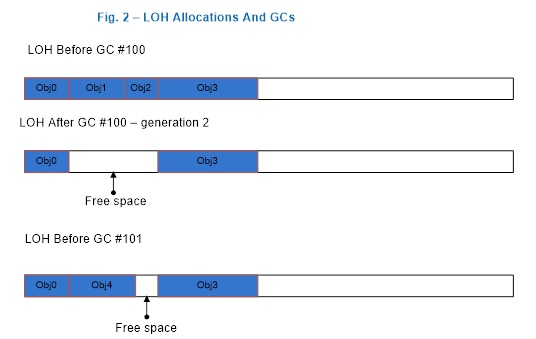

# The large object heap

The .NET Garbage Collector (GC) divides objects up into small and large objects. When an object is large, some of its attributes become more significant than if the object is small. For instance, compacting it -- that is, copying it in memory elsewhere on the heap -- can be expensive. Because of this, the .NET Garbage Collector places large objects on the large object heap (LOH). In this topic, we'll look at the large object heap in depth. We'll discuss what qualifies an object as a large object, how these large objects are collected, and what kind of performance implications large objects impose.

## How an object ends up on the large object heap and how GC handles them.

If an object greater than or equal to 85,000 bytes, it’s considered a large object. This number was determined by performance tuning. When an object allocation request is 85,000 or more bytes, the runtime allocates it on the large object heap.

To understand what this means, it's useful to examine some fundamentals about the .NET GC.

The .NET Garbage Collector is a generational collector. It has three generations: generation 0, generation 1, and generation 2. The reason for for having 3 generations is, in a well-tuned app, most objects die in Gen0. For example, in a server app, the allocations associated with each request should die after the request is finished. The in-flight allocation requests will make it into Gen1 and die there. Essentially, Gen1 acts as a buffer between young object areas and long-lived object areas.

Large objects belong to generation 2 because they are collected only during a generation 2 collection. When a generation is collected, all its younger generation(s) are also collected. For example, when a generation 1 GC happens, both generation 1 and 0 are collected. And when a generation 2 GC happens, the whole heap is collected. For this reason, a generation 2 GC is also called a *full GC*. This article refers to generation 2 GC instead of full GC, but the terms are interchangeable.

Generations provide a logical view of the GC heap. Physically, objects live in managed heap segments. A *managed heap segment* is a chunk of memory that the GC reserves from the OS by calling the [VirtualAlloc function](https://msdn.microsoft.com/library/windows/desktop/aa366887(v=vs.85).aspx) on behalf of managed code. When the CLR is loaded, the GC allocates two initial heap segments: one for small objects (the Small Object Heap, or SOH), and one for large objects (the Large Object Heap).

The allocation requests are then satisfied by putting managed objects on these managed heap segments. If the object is less than 85,000 bytes, it is put on the segment for the SOH; otherwise, it is put on an LOH segment. Segments are committed (in smaller chunks) as more and more objects are allocated onto them.
For the SOH, objects that survive a GC are promoted to the next generation. Objects that survive a generation 0 collection are now considered generation 1 objects, and so on. However, objects that survive the oldest generation are still considered to be in the oldest generation. In other words, survivors from generation 2 are generation 2 objects; and survivors from the LOH are LOH objects (which are collected with gen2). 

User code can only allocate in generation 0 (small objects) or the LOH (large objects). Only the GC can “allocate” objects in generation 1 (by promoting survivors from generation 0) and generation 2 (by promoting survivors from generations 1 and 2).

When a garbage collection is triggered, the GC traces through the live objects and compacts them. But because compaction is expensive, the GC *sweeps* the LOH; it makes a free list out of dead objects that can be reused later to satisfy large object allocation requests. Adjacent dead objects are made into one free object.

The .NET Framework 4.5.1 added an option for users to specify that the LOH should be compacted during the next full blocking GC. And in the future, .NET may decide to compact the LOH automatically. This means that, if you allocate large objects and want to make sure that they don’t move, you should still pin them.

Figure 1 illustrates a scenario where the GC forms generation 1 after the first generation 0 GC where `Obj1` and `Obj3` are dead, and it forms generation 2 after the first generation 1 GC where `Obj2` and `Obj5` are dead. Note that this and the following figures are only for illustration purposes; they contain very few objects to better show what happens on the heap. In reality, many more objects are typically involved in a GC.

   
Figure 1: A generation 0 and a generation 1 GC.

Figure 2 shows that after a generation 2 GC which saw that `Obj1` and `Obj2` are dead, the GC forms contiguous free space out of memory that used to be occupied by `Obj1` and `Obj2`, which then was used to satisfy an allocation request for `Obj4`. The space after the last object, `Obj3`, to end of the segment can also be used to satisfy allocation requests.
 
  
Figure 2: After a generation 2 GC

If there isn't enough free space to accommodate the large object allocation requests, the GC first attempts to acquire more segments from the OS. If that fails, it triggers a generation 2 GC in the hope of freeing up some space.

During a generation 1 or generation 2 GC, the garbage collector releases segments that have no live objects on them back to the OS by calling the [VirtualFree function](https://msdn.microsoft.com/library/windows/desktop/aa366892(v=vs.85).aspx). Space after the last live object to the end of the segment is decommitted. And the free spaces remain committed though they are reset, meaning that the OS doesn’t need to write data in them back to disk. 

Since the LOH is only collected during generation 2 GCs, the LOH segment can only be freed during such a GC. Figure 3 illustrates a scenario where the garbage collector releases one segment (segment 2) back to the OS and decommits more space on the remaining segments. If it needs to use the decommitted space at the end of the segment to satisfy large object allocation requests, it commits the memory again. (For an explanation of commit/decommit, see the documentation for [VirtualAlloc](https://msdn.microsoft.com/library/windows/desktop/aa366887(v=vs.85).aspx).
 
  
Figure 32: The LOH after a generation 2 GC

## When is a large object collected?

In general, a GC occurs when one of the following following 3 conditions happens:

- Allocation exceeds the generation 0 or large object threshold.

   The threshold is a property of a generation. A threshold for a generation is set when the garbage collector allocates objects into it. When the threshold is exceeded, a GC is triggered on that generation. When you allocate small or large objects, you consume generation 0 and the LOH’s thresholds, respectively. When the garbage collector allocates into generation 1 and 2, it consumes their thresholds. These thresholds are dynamically tuned as the program runs.

   This is the typical case; most GCs happen because of allocations on the managed heap.

- The <xref:System.GC.Collect%2A?displayProperty=nameWithType> method is called.

   If the parameterless <xref:System.GC.Collect?displayProperty=nameWithType> method is called or another overload is passed <xref:System.GC.MaxGeneration?displayProperty=nameWithType> as an argument, the LOH is collected along with the rest of the managed heap.

- The system is in low memory situation.

   This occurs when the garbage collector receives a high memory notification from the OS. If the garbage collector thinks that doing a generation 2 GC will be productive, it triggers one.

## LOH Performance Implications

Allocations on the large object heap impact performance in the following ways.

- Allocation cost.

   The CLR guarantees that the memory for every new object it allocates will be cleared. This means the allocation cost of a large object is completely dominated by memory clearing (unless it triggers a GC). If it takes 2 cycles to clear one byte, it takes 170,000 cycles to clear the smallest large object. Clearing the memmory of a 16MB object on a 2GHz machine takes approximately 16ms. That's a rather large cost.

- Collection cost.

   Because the LOH and generation 2 are collected together, if either one's threshold is exceeded, a generation 2 collection is triggered. If a generation 2 collection is triggered because of the LOH, generation 2 won't necessarily be much smaller after the GC. If there's not much data on generation 2, this has minimal impact. But if generation 2 is large, it can cause performance problems if many generation 2 GCs are triggered. If many large objects are allocated on a very temporary basis and you have a large SOH, you could be spending too much time doing GCs. In addition, the allocation cost can really add up if you keep allocating and letting go of really large objects.

- Array elements with reference types.

   Very large objects on the LOH are usually arrays (it's very rare to have an instance object that's really large). If the elements of an array are reference-rich, it incurs a cost that is not present if the elements are not reference-rich. If the element doesn’t contain any references, the garbage collector doesn’t need to go through the array at all. For example, if you use an array to store nodes in a binary tree, one way to implement it is to refer to a node’s right and left node by the actual nodes:

   ```csharp
   class Node
   {
      Data d;
      Node left;
      Node right;
   };

   Node[] binary_tr = new Node [num_nodes];
   ```

   If `num_nodes` is large, the garbage collector needs to go through at least two references per element. An alternative approach is to store the index of the right and the left nodes:

   ```csharp
   class Node
   {
      Data d;
      uint left_index;
      uint right_index;
   } ;
   ```

   Instead of referring the left node’s data as `left.d`, you refer to it as `binary_tr[left_index].d`. And the garbage collector doesn’t need to look at any references for the left and right node.

Out of the three factors, the first two are usually more significant than the third. Because of this, we recommend that you allocate a pool of large objects that you reuse instead of allocating temporary ones. 

## Collecting performance data for the LOH

T

here are a few ways to collect performance data that’s relevant for the LOH. But before I explain them, let's talk about why you would want to collect performance data for LOH.
Before you start collecting performance data for a specific area hopefully you have already done the following:
1) found evidence that you should be looking at this area or
2) exhausted other areas that you know of and didn't find any problems that could explain the performance problem you saw.
I would recommend reading this blog entry for more explanation. It talks about the fundamentals about memory and CPU.
1) .NET CLR Memory Performance counters
These performance counters are usually a good first step in investigating performance issues. The ones that are relevant for LOH are:
# Gen 2 Collections:
Displays the number of times the generation 2 GCs have occurred since the process started. The counter is incremented at the end of a generation 2 garbage collection (also called a full garbage collection). This counter displays the last observed value.
Large Object Heap size
Displays the current size, in bytes, including the free space, of the Large Object Heap. This counter is updated at the end of a garbage collection, not at each allocation.
A common way to look at performance counters is via Performance Monitor (perfmon.exe). Use “Add Counters” to add the interesting counter for processes that you care about.
 
You can save the performance counter data to a log file in perfmon.
Performance counters can also be queried programmatically. Many people collect them this way as part of their routine testing process. When they spot counters with values that are out of ordinary they will use other means to get more detailed to help with the investigation.
Note that the runtime team strongly advises you to move to ETW events instead of using performance counters as ETW provides much richer information.
2) Using ETW
GC provides a rich set of ETW events to help you understand what the heap is doing and why. There are a set of blog articles to get you started on collecting and understanding GC events:
GC ETW Events - 1 
GC ETW Events - 2 
GC ETW Events - 3 
GC ETW Events - 4
Specifically to identify excessive generation 2 GCs caused by temporary LOH allocations, look at the Trigger Reason column for GCs. If we look at a simple test that only allocates temporary large objects and collected ETW events with this perfview commandline:
perfview /GCCollectOnly /AcceptEULA /nogui collect
we see something like this:
 

As you can see all GCs are generation 2 GCs and they are all triggered by AllocLarge which means allocating a large object triggered this GC. And we know these allocations are temporary because the LOH Survival Rate % column says 1%. You can collect additional ETW events that tell you who allocated these large objects, this commandline:
perfview /GCOnly /AcceptEULA /nogui collect
will collect an AllocationTick event which is fired every ~100k worth of allocations so for LOH allocation that means you get an event each time a large object is allocated. You can then look at one of the GC Heap Alloc views which show you the callstacks that allocated large objects:
 
As you can see, this is a very simple test that just allocates large objects from its Main method.
3) Using a debugger
The debugging commands mentioned in this section are applicable to the Windows Debuggers.
If all you have is a memory dump and you need to look at what objects are actually on the LOH you can use the SoS debugger extension provided by .NET An example output of analyzing the LOH is below:

0:003> .loadby sos mscorwks
0:003> !eeheap -gc
Number of GC Heaps: 1
generation 0 starts at 0x013e35ec
generation 1 starts at 0x013e1b6c
generation 2 starts at 0x013e1000
ephemeral segment allocation context: none
segment   begin allocated     size
0018f2d0 790d5588 790f4b38 0x0001f5b0(128432)
013e0000 013e1000 013e35f8 0x000025f8(9720)
Large object heap starts at 0x023e1000
segment   begin allocated     size
023e0000 023e1000 033db630 0x00ffa630(16754224)
033e0000 033e1000 043cdf98 0x00fecf98(16699288)
043e0000 043e1000 05368b58 0x00f87b58(16284504)
Total Size 0x2f90cc8(49876168)
------------------------------
GC Heap Size 0x2f90cc8(49876168)
0:003> !dumpheap -stat 023e1000 033db630
total 133 objects
Statistics:
MT   Count   TotalSize Class Name
001521d0       66     2081792     Free
7912273c       63     6663696 System.Byte[]
7912254c       4     8008736 System.Object[]
Total 133 objects
This says that the LOH heap size is (16,754,224 + 16,699,288 + 16,284,504 =) 49,738,016 bytes. And between address 023e1000 and 033db630, 8,008,736 bytes are occupied by System.Object[] objects; 6,663,696 are occupied by System.Byte[] objects and 2,081,792 bytes are occupied by free space.
Sometimes you'll see the total size of the LOH being less than 85,000 bytes, why is this? Because the runtime itself actually uses LOH to allocate some objects that are smaller than a large object.
Since LOH are not compacted, sometimes people suspect that LOH is the source of fragmentation. When we talk about “fragmentation” we need to first clarify what fragmentation means. There’s fragmentation of the managed heap which is indicated by the amount of free space between managed objects (ie, what you see when you do !dumpheap –type Free in SoS); there’s also fragmentation of the virtual memory address space which is the memory marked as MEM_FREE type which you can get by various debugger commands in windbg. Below is an example that shows the fragmentation in the VM space:

0:000> !address
00000000 : 00000000 - 00010000
Type     00000000
Protect 00000001 PAGE_NOACCESS
State   00010000 MEM_FREE
Usage   RegionUsageFree
00010000 : 00010000 - 00002000
Type     00020000 MEM_PRIVATE
Protect 00000004 PAGE_READWRITE
State   00001000 MEM_COMMIT
Usage   RegionUsageEnvironmentBlock
00012000 : 00012000 - 0000e000
Type     00000000
Protect 00000001 PAGE_NOACCESS
State   00010000 MEM_FREE
Usage   RegionUsageFree
… [omitted]
-------------------- Usage SUMMARY --------------------------
TotSize (     KB)   Pct(Tots) Pct(Busy)   Usage
701000 (   7172) : 00.34%   20.69%   : RegionUsageIsVAD
7de15000 ( 2062420) : 98.35%   00.00%   : RegionUsageFree
1452000 (   20808) : 00.99%   60.02%   : RegionUsageImage
300000 (   3072) : 00.15%   08.86%   : RegionUsageStack
3000 (     12) : 00.00%   00.03%   : RegionUsageTeb
381000 (   3588) : 00.17%   10.35%   : RegionUsageHeap
0 (       0) : 00.00%   00.00%   : RegionUsagePageHeap
1000 (       4) : 00.00%   00.01%   : RegionUsagePeb
1000 (       4) : 00.00%   00.01%   : RegionUsageProcessParametrs
2000 (       8) : 00.00%   00.02%   : RegionUsageEnvironmentBlock
Tot: 7fff0000 (2097088 KB) Busy: 021db000 (34668 KB)
 
-------------------- Type SUMMARY --------------------------
TotSize (     KB)   Pct(Tots) Usage
7de15000 ( 2062420) : 98.35%   : <free>
1452000 (   20808) : 00.99%   : MEM_IMAGE
69f000 (   6780) : 00.32%   : MEM_MAPPED
6ea000 (   7080) : 00.34%   : MEM_PRIVATE
 
-------------------- State SUMMARY --------------------------
TotSize (     KB)   Pct(Tots) Usage
1a58000 (   26976) : 01.29%   : MEM_COMMIT
7de15000 ( 2062420) : 98.35%   : MEM_FREE
783000 (   7692) : 00.37%   : MEM_RESERVE
 
Largest free region: Base 01432000 - Size 707ee000 (1843128 KB)
As we mentioned above fragmentation on the managed heap is used for allocation requests it’s more common to see VM fragmentation caused by temporary large objects which require GC to frequently acquire new managed heap segments from the OS and release empty ones back to the OS.
To verify if LOH is causing VM fragmentation you can set a breakpoint on VirtualAlloc and VirtualFree and see who call them. For example, if I want to see who tried to allocate virtual memory chunks from the OS that are larger than 8MB, I can set a breakpoint like this:
bp kernel32!virtualalloc "j (dwo(@esp+8)>800000) 'kb';'g'"
This says to break into the debugger and show me the callstack if VirtualAlloc is called with the allocation size greater than 8MB (0x800000) and don’t break into the bugger otherwise.
In CLR 2.0 we added a feature called VM Hoarding that may be applicable if you are in a situation where segments (including on the large and small object heap) are frequently acquired and released. To specify VM Hoarding, you specify a startup flag called STARTUP_HOARD_GC_VM via hosting API. When you specify this, instead of releasing empty segments back to the OS we decommit the memory on these segments and put them on a standby list. Note that we don’t do this for the segments that are too large. We will use these segments later to satisfy new segment requests. So next time we need a new segment we will use one from this standby list if we can find one that’s big enough. This feature is also useful for applications that want to hold onto the segments that they already acquired, like some server apps that don’t want to get OOM because they avoid fragmentation of the VM space as much as they can, and since they are usually the dominating apps on the machine they can do this. I strongly recommend you to carefully test your application when you use this feature and make sure your application has a fairly stable memory usage.
Conclusion
Large objects are expensive in 2 ways:
•	The allocation cost is high because we need to clear the memory for a newly allocated large object because CLR guarantees that memory for all newly allocated objects is cleared.
•	LOH is collected with the rest of the heap so carefully analyze how that impacts performance for your scenario.
Reuse large objects if possible to avoid frequent generation 2 GCs and fragmentation on the managed heap and the VM space.
Currently LOH is not compact but that is an implementation detail that should not be relied on. So to make sure something is not moved by the GC, always pin it.

