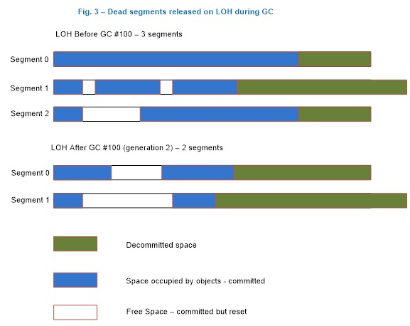
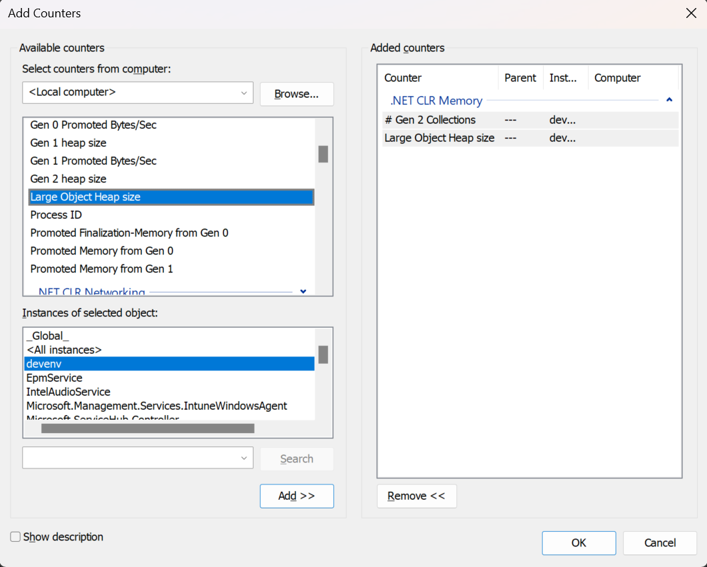

# The large object heap on Windows systems

The .NET garbage collector (GC) divides objects up into small and large objects. When an object is large, some of its attributes become more significant than if the object is small. For instance, compacting it&mdash;that is, copying it in memory elsewhere on the heap&mdash;can be expensive. Because of this, the garbage collector places large objects on the large object heap (LOH). This article discusses what qualifies an object as a large object, how large objects are collected, and what kind of performance implications large objects impose.

> [!IMPORTANT]
> This article discusses the large object heap in .NET Framework and .NET Core running on Windows systems only. It does not cover the LOH running on .NET implementations on other platforms.

## How an object ends up on the LOH

If an object is greater than or equal to 85,000 bytes in size, it's considered a large object. This number was determined by performance tuning. When an object allocation request is for 85,000 or more bytes, the runtime allocates it on the large object heap.

To understand what this means, it's useful to examine some fundamentals about the garbage collector.

The garbage collector is a generational collector. It has three generations: generation 0, generation 1, and generation 2. The reason for having three generations is that, in a well-tuned app, most objects die in gen0. For example, in a server app, the allocations associated with each request should die after the request is finished. The in-flight allocation requests will make it into gen1 and die there. Essentially, gen1 acts as a buffer between young object areas and long-lived object areas.

Newly allocated objects form a new generation of objects and are implicitly generation 0 collections. However, if they are large objects, they go on the large object heap (LOH), which is sometimes referred to as generation 3. Generation 3 is a physical generation that's logically collected as part of generation 2.

Large objects belong to generation 2 because they are collected only during a generation 2 collection. When a generation is collected, all its younger generation(s) are also collected. For example, when a generation 1 GC happens, both generation 1 and 0 are collected. And when a generation 2 GC happens, the whole heap is collected. For this reason, a generation 2 GC is also called a *full GC*. This article refers to generation 2 GC instead of full GC, but the terms are interchangeable.

Generations provide a logical view of the GC heap. Physically, objects live in managed heap segments. A *managed heap segment* is a chunk of memory that the GC reserves from the OS by calling the [VirtualAlloc function](/windows/desktop/api/memoryapi/nf-memoryapi-virtualalloc) on behalf of managed code. When the CLR is loaded, the GC allocates two initial heap segments: one for small objects (the small object heap, or SOH), and one for large objects (the large object heap).

The allocation requests are then satisfied by putting managed objects on these managed heap segments. If the object is less than 85,000 bytes, it is put on the segment for the SOH; otherwise, it is put on an LOH segment. Segments are committed (in smaller chunks) as more and more objects are allocated onto them.
For the SOH, objects that survive a GC are promoted to the next generation. Objects that survive a generation 0 collection are now considered generation 1 objects, and so on. However, objects that survive the oldest generation are still considered to be in the oldest generation. In other words, survivors from generation 2 are generation 2 objects; and survivors from the LOH are LOH objects (which are collected with gen2).

User code can only allocate in generation 0 (small objects) or the LOH (large objects). Only the GC can "allocate" objects in generation 1 (by promoting survivors from generation 0) and generation 2 (by promoting survivors from generation 1).

When a garbage collection is triggered, the GC traces through the live objects and compacts them. But because compaction is expensive, the GC *sweeps* the LOH; it makes a free list out of dead objects that can be reused later to satisfy large object allocation requests. Adjacent dead objects are made into one free object.

.NET Core and .NET Framework (starting with .NET Framework 4.5.1) include the <xref:System.Runtime.GCSettings.LargeObjectHeapCompactionMode?displayProperty=nameWithType> property that allows users to specify that the LOH should be compacted during the next full blocking GC. And in the future, .NET may decide to compact the LOH automatically. This means that, if you allocate large objects and want to make sure that they don't move, you should still pin them.

Figure 1 illustrates a scenario where the GC forms generation 1 after the first generation 0 GC where `Obj1` and `Obj3` are dead, and it forms generation 2 after the first generation 1 GC where `Obj2` and `Obj5` are dead. Note that this and the following figures are only for illustration purposes; they contain very few objects to better show what happens on the heap. In reality, many more objects are typically involved in a GC.

\
Figure 1: A generation 0 and a generation 1 GC.

Figure 2 shows that after a generation 2 GC that saw that `Obj1` and `Obj2` are dead, the GC forms contiguous free space out of memory that used to be occupied by `Obj1` and `Obj2`, which then was used to satisfy an allocation request for `Obj4`. The space after the last object, `Obj3`, to end of the segment can also be used to satisfy allocation requests.

\
Figure 2: After a generation 2 GC

If there isn't enough free space to accommodate the large object allocation requests, the GC first attempts to acquire more segments from the OS. If that fails, it triggers a generation 2 GC in the hope of freeing up some space.

During a generation 1 or generation 2 GC, the garbage collector releases segments that have no live objects on them back to the OS by calling the [VirtualFree function](/windows/desktop/api/memoryapi/nf-memoryapi-virtualfree). Space after the last live object to the end of the segment is decommitted (except on the ephemeral segment where gen0/gen1 live, where the garbage collector does keep some committed because your application will be allocating in it right away). And the free spaces remain committed though they are reset, meaning that the OS doesn't need to write data in them back to disk.

Since the LOH is only collected during generation 2 GCs, the LOH segment can only be freed during such a GC. Figure 3 illustrates a scenario where the garbage collector releases one segment (segment 2) back to the OS and decommits more space on the remaining segments. If it needs to use the decommitted space at the end of the segment to satisfy large object allocation requests, it commits the memory again. (For an explanation of commit/decommit, see the documentation for [VirtualAlloc](/windows/desktop/api/memoryapi/nf-memoryapi-virtualalloc).

\
Figure 3: The LOH after a generation 2 GC

## When is a large object collected?

In general, a GC occurs under one of the following three conditions:

- Allocation exceeds the generation 0 or large object threshold.

  The threshold is a property of a generation. A threshold for a generation is set when the garbage collector allocates objects into it. When the threshold is exceeded, a GC is triggered on that generation. When you allocate small or large objects, you consume generation 0 and the LOH's thresholds, respectively. When the garbage collector allocates into generation 1 and 2, it consumes their thresholds. These thresholds are dynamically tuned as the program runs.

  This is the typical case; most GCs happen because of allocations on the managed heap.

- The <xref:System.GC.Collect%2A?displayProperty=nameWithType> method is called.

  If the parameterless <xref:System.GC.Collect?displayProperty=nameWithType> method is called or another overload is passed <xref:System.GC.MaxGeneration?displayProperty=nameWithType> as an argument, the LOH is collected along with the rest of the managed heap.

- The system is in low memory situation.

  This occurs when the garbage collector receives a high memory notification from the OS. If the garbage collector thinks that doing a generation 2 GC will be productive, it triggers one.

## LOH performance implications

Allocations on the large object heap impact performance in the following ways.

- Allocation cost.

  The CLR makes the guarantee that the memory for every new object it gives out is cleared. This means the allocation cost of a large object is dominated by memory clearing (unless it triggers a GC). If it takes two cycles to clear one byte, it takes 170,000 cycles to clear the smallest large object. Clearing the memory of a 16-MB object on a 2-GHz machine takes approximately 16 ms. That's a rather large cost.

- Collection cost.

  Because the LOH and generation 2 are collected together, if either one's threshold is exceeded, a generation 2 collection is triggered. If a generation 2 collection is triggered because of the LOH, generation 2 won't necessarily be much smaller after the GC. If there's not much data on generation 2, this has minimal impact. But if generation 2 is large, it can cause performance problems if many generation 2 GCs are triggered. If many large objects are allocated on a temporary basis and you have a large SOH, you could be spending too much time doing GCs. In addition, the allocation cost can really add up if you keep allocating and letting go of really large objects.

- Array elements with reference types.

  Very large objects on the LOH are usually arrays (it's very rare to have an instance object that's really large). If the elements of an array are reference-rich, it incurs a cost that is not present if the elements are not reference-rich. If the element doesn't contain any references, the garbage collector doesn't need to go through the array at all. For example, if you use an array to store nodes in a binary tree, one way to implement it is to refer to a node's right and left node by the actual nodes:

  ```csharp
  class Node
  {
     Data d;
     Node left;
     Node right;
  };

  Node[] binary_tr = new Node [num_nodes];
  ```

  If `num_nodes` is large, the garbage collector needs to go through at least two references per element. An alternative approach is to store the index of the right and the left nodes:

  ```csharp
  class Node
  {
     Data d;
     uint left_index;
     uint right_index;
  } ;
  ```

  Instead of referring the left node's data as `left.d`, you refer to it as `binary_tr[left_index].d`. And the garbage collector doesn't need to look at any references for the left and right node.

Out of the three factors, the first two are usually more significant than the third. Because of this, we recommend that you allocate a pool of large objects that you reuse instead of allocating temporary ones.

## Collect performance data for the LOH

Before you collect performance data for a specific area, you should already have done the following:

1. Found evidence that you should be looking at this area.

2. Exhausted other areas that you know of without finding anything that could explain the performance problem you saw.

For more information on the fundamentals of memory and the CPU, see the blog [Understand the problem before you try to find a solution](https://devblogs.microsoft.com/dotnet/understand-the-problem-before-you-try-to-find-a-solution/).

You can use the following tools to collect data on LOH performance:

- [.NET CLR memory performance counters](#net-clr-memory-performance-counters)

- [ETW events](#etw-events)

- [A debugger](#a-debugger)

### .NET CLR Memory Performance counters

These performance counters are usually a good first step in investigating performance issues (although we recommend that you use [ETW events](#etw-events)). You configure Performance Monitor by adding the counters that you want, as Figure 4 shows. The ones that are relevant for the LOH are:

- **Gen 2 Collections**

   Displays the number of times generation 2 GCs have occurred since the process started. The counter is incremented at the end of a generation 2 collection (also called a full garbage collection). This counter displays the last observed value.

- **Large Object Heap size**

   Displays the current size, in bytes, including free space, of the LOH. This counter is updated at the end of a garbage collection, not at each allocation.

A common way to look at performance counters is with Performance Monitor (perfmon.exe). Use "Add Counters" to add the interesting counter for processes that you care about. You can save the performance counter data to a log file, as Figure 4 shows:


Figure 4: The LOH after a generation 2 GC

Performance counters can also be queried programmatically. Many people collect them this way as part of their routine testing process. When they spot counters with values that are out of the ordinary, they use other means to get more detailed data to help with the investigation.

> [!NOTE]
> We recommend that you to use ETW events instead of performance counters, because ETW provides much richer information.

### ETW events

The garbage collector provides a rich set of ETW events to help you understand what the heap is doing and why. The following blog posts show how to collect and understand GC events with ETW:

- [GC ETW Events - 1](https://devblogs.microsoft.com/dotnet/gc-etw-events-1/)

- [GC ETW Events - 2](https://devblogs.microsoft.com/dotnet/gc-etw-events-2/)

- [GC ETW Events - 3](https://devblogs.microsoft.com/dotnet/gc-etw-events-3/)

- [GC ETW Events - 4](https://devblogs.microsoft.com/dotnet/gc-etw-events-4/)

To identify excessive generation 2 GCs caused by temporary LOH allocations, look at the Trigger Reason column for GCs. For a simple test that only allocates temporary large objects, you can collect information on ETW events with the following [PerfView](https://www.microsoft.com/download/details.aspx?id=28567) command line:

```console
perfview /GCCollectOnly /AcceptEULA /nogui collect
```

The result is something like this:


Figure 5: ETW events shown using PerfView

As you can see, all GCs are generation 2 GCs, and they are all triggered by AllocLarge, which means that allocating a large object triggered this GC. We know that these allocations are temporary because the **LOH Survival Rate %** column says 1%.

You can collect additional ETW events that tell you who allocated these large objects. The following command line:

```console
perfview /GCOnly /AcceptEULA /nogui collect
```

collects an AllocationTick event, which is fired approximately every 100k worth of allocations. In other words, an event is fired each time a large object is allocated. You can then look at one of the GC Heap Alloc views, which show you the callstacks that allocated large objects:


Figure 6: A GC Heap Alloc view

As you can see, this is a very simple test that just allocates large objects from its `Main` method.

### A debugger

If all you have is a memory dump and you need to look at what objects are actually on the LOH, you can use the [SoS debugger extension](../../framework/tools/sos-dll-sos-debugging-extension.md) provided by .NET.

> [!NOTE]
> The debugging commands mentioned in this section are applicable to the [Windows Debuggers](https://www.microsoft.com/whdc/devtools/debugging/default.mspx).

The following shows sample output from analyzing the LOH:

```console
0:003> .loadby sos mscorwks
0:003> !eeheap -gc
Number of GC Heaps: 1
generation 0 starts at 0x013e35ec
sdgeneration 1 starts at 0x013e1b6c
generation 2 starts at 0x013e1000
ephemeral segment allocation context: none
segment   begin allocated     size
0018f2d0 790d5588 790f4b38 0x0001f5b0(128432)
013e0000 013e1000 013e35f8 0x000025f8(9720)
Large object heap starts at 0x023e1000
segment   begin allocated     size
023e0000 023e1000 033db630 0x00ffa630(16754224)
033e0000 033e1000 043cdf98 0x00fecf98(16699288)
043e0000 043e1000 05368b58 0x00f87b58(16284504)
Total Size 0x2f90cc8(49876168)
------------------------------
GC Heap Size 0x2f90cc8(49876168)
0:003> !dumpheap -stat 023e1000 033db630
total 133 objects
Statistics:
MT   Count   TotalSize Class Name
001521d0       66     2081792     Free
7912273c       63     6663696 System.Byte[]
7912254c       4     8008736 System.Object[]
Total 133 objects
```

The LOH heap size is (16,754,224 + 16,699,288 + 16,284,504) = 49,738,016 bytes. Between addresses 023e1000 and 033db630, 8,008,736 bytes are occupied by an array of <xref:System.Object?displayProperty=nameWithType> objects, 6,663,696 bytes are occupied by an array of <xref:System.Byte?displayProperty=nameWithType>  objects, and 2,081,792 bytes are occupied by free space.

Sometimes, the debugger shows that the total size of the LOH is less than 85,000 bytes. This happens because the runtime itself uses the LOH to allocate some objects that are smaller than a large object.

Because the LOH is not compacted, sometimes the LOH is thought to be the source of fragmentation. Fragmentation means:

- Fragmentation of the managed heap, which is indicated by the amount of free space between managed objects. In SoS, the `!dumpheap –type Free` command displays the amount of free space between managed objects.

- Fragmentation of the virtual memory (VM) address space, which is the memory marked as `MEM_FREE`. You can get it by using various debugger commands in windbg.

   The following example shows fragmentation in the VM space:

   ```console
   0:000> !address
   00000000 : 00000000 - 00010000
   Type     00000000
   Protect 00000001 PAGE_NOACCESS
   State   00010000 MEM_FREE
   Usage   RegionUsageFree
   00010000 : 00010000 - 00002000
   Type     00020000 MEM_PRIVATE
   Protect 00000004 PAGE_READWRITE
   State   00001000 MEM_COMMIT
   Usage   RegionUsageEnvironmentBlock
   00012000 : 00012000 - 0000e000
   Type     00000000
   Protect 00000001 PAGE_NOACCESS
   State   00010000 MEM_FREE
   Usage   RegionUsageFree
   … [omitted]
   -------------------- Usage SUMMARY --------------------------
   TotSize (     KB)   Pct(Tots) Pct(Busy)   Usage
   701000 (   7172) : 00.34%   20.69%   : RegionUsageIsVAD
   7de15000 ( 2062420) : 98.35%   00.00%   : RegionUsageFree
   1452000 (   20808) : 00.99%   60.02%   : RegionUsageImage
   300000 (   3072) : 00.15%   08.86%   : RegionUsageStack
   3000 (     12) : 00.00%   00.03%   : RegionUsageTeb
   381000 (   3588) : 00.17%   10.35%   : RegionUsageHeap
   0 (       0) : 00.00%   00.00%   : RegionUsagePageHeap
   1000 (       4) : 00.00%   00.01%   : RegionUsagePeb
   1000 (       4) : 00.00%   00.01%   : RegionUsageProcessParametrs
   2000 (       8) : 00.00%   00.02%   : RegionUsageEnvironmentBlock
   Tot: 7fff0000 (2097088 KB) Busy: 021db000 (34668 KB)

   -------------------- Type SUMMARY --------------------------
   TotSize (     KB)   Pct(Tots) Usage
   7de15000 ( 2062420) : 98.35%   : <free>
   1452000 (   20808) : 00.99%   : MEM_IMAGE
   69f000 (   6780) : 00.32%   : MEM_MAPPED
   6ea000 (   7080) : 00.34%   : MEM_PRIVATE

   -------------------- State SUMMARY --------------------------
   TotSize (     KB)   Pct(Tots) Usage
   1a58000 (   26976) : 01.29%   : MEM_COMMIT
   7de15000 ( 2062420) : 98.35%   : MEM_FREE
   783000 (   7692) : 00.37%   : MEM_RESERVE

   Largest free region: Base 01432000 - Size 707ee000 (1843128 KB)
   ```

It's more common to see VM fragmentation caused by temporary large objects that require the garbage collector to frequently acquire new managed heap segments from the OS and to release empty ones back to the OS.

To verify whether the LOH is causing VM fragmentation, you can set a breakpoint on [VirtualAlloc](/windows/desktop/api/memoryapi/nf-memoryapi-virtualalloc) and [VirtualFree](/windows/desktop/api/memoryapi/nf-memoryapi-virtualfree) to see who called them. For example, to see who tried to allocate virtual memory chunks larger than 8 MB from the OS, you can set a breakpoint like this:

```console
bp kernel32!virtualalloc "j (dwo(@esp+8)>800000) 'kb';'g'"
```

This command breaks into the debugger and shows the call stack only if [VirtualAlloc](/windows/desktop/api/memoryapi/nf-memoryapi-virtualalloc) is called with an allocation size greater than 8 MB (0x800000).

CLR 2.0 added a feature called *VM Hoarding* that can be useful for scenarios where segments (including on the large and small object heaps) are frequently acquired and released. To specify VM Hoarding, you specify a startup flag called `STARTUP_HOARD_GC_VM` via the hosting API. Instead of releasing empty segments back to the OS, the CLR decommits the memory on these segments and puts them on a standby list. (Note that the CLR doesn't do this for segments that are too large.) The CLR later uses those segments to satisfy new segment requests. The next time that your app needs a new segment, the CLR uses one from this standby list if it can find one that's large enough.

VM hoarding is also useful for applications that want to hold onto the segments that they already acquired, such as some server apps that are the dominant apps running on the system, to avoid out-of-memory exceptions.

We strongly recommend that you carefully test your application when you use this feature to ensure your application has fairly stable memory usage.
